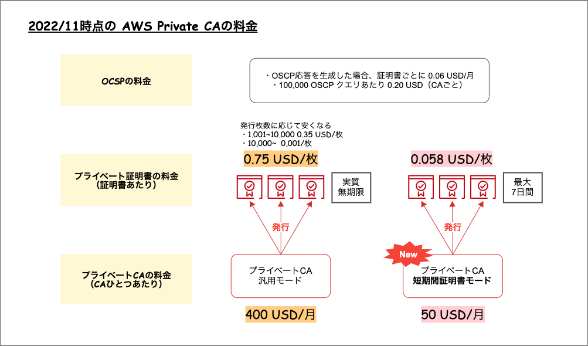

### ACM (AWS Certificate Manager) とは

AWS で提供される サーバー証明書の発行や管理が簡単にできるサービス

- ACMでサーバー証明書の発行依頼ができる
- ACM で発行した証明書は自動更新される (一般的なサーバー証明書の有効期間は1年間で、自力での入れ替えが必要)
- 外部のサーバー証明書の管理もできる (自動更新はないため、自力での更新作業が必要)
- AWS 上のリソースにサーバー証明書を簡単に配置できる

 

参考サイト

- ACMとは -> [AWS Certificate Managerを利用してSSL/TLS認証書をリクエストしてCloudFrontに統合してみた。](https://dev.classmethod.jp/articles/lim-aws-certificate-manager/)

- 外部のサーバー証明書をACMで管理する -> [ACMで外部の証明書を使用する場合の更新手順について](https://dev.classmethod.jp/articles/manual-for-updating-external-certificate/)

---

### ACM で発行できるサーバー証明書

パブリック証明書
- 証明書の種類は「ドメイン認証 (DV)」のみ
- 利用料金は無料
- 実在認証 (OV) や 拡張認証 (EV) を取得したい場合は、他の提供サービスから自力で発行依頼
&取得する必要がある

 

プライベート証明書

- 有料で利用できる。具体的は以下こ事柄に料金が発生する
    - プライベート認証局の利用料金
    - プライベート証明書にかかる料金
    - OCSP (証明書の失効)証明書の失効状態を取得するプロトコルでのリクエストにかかる料金

    

    引用: [[アップデート] AWS Private CA のプライベート CA に短期間の証明書のみを発行できるお求めやすい価格のモードが登場しました](https://dev.classmethod.jp/articles/aws-private-certificate-authority-introduces-mode-short-lived-certificates/)

- ACM で発行したプライベート証明書は自動更新されない

 

注意点

- パブリック証明書について、EC2やS3インスタンスに配置することはできない
    - パブリック証明書は ELB (ロードバランサー)や Cloud 
    Front (CDN)に配置することが可能
    - どうしても EC2 などに証明書を直接配置したい場合は、他のサービスから自力で証明書を取得する必要がある

 

- プライベート証明書は料金が結構かかるので、社内システムであっても無料の ACM パブリック証明書で代用が可能
    - ルート証明書はクライアントにインストールされているので、アクセス者は限定できないという点は考慮すべき

 
 

参考サイト

- ACM について -> [AWSで無料のSSL証明書を設定するには？AWS Certificate Manager(ACM)での使い方](https://cloudnavi.nhn-techorus.com/archives/928)

- ACM プライベート証明書の料金および発行方法 -> [[アップデート] AWS Private CA のプライベート CA に短期間の証明書のみを発行できるお求めやすい価格のモードが登場しました](https://dev.classmethod.jp/articles/aws-private-certificate-authority-introduces-mode-short-lived-certificates/)

- 社内システムに ACM のプライベート証明書を利用するべきかについて -> [社内システムも、転送データを暗号化した方が良い？と聞かれたときの回答](https://cloud.bigtreetc.com/column/public-certificates-versus-private-certificates-for-internal-elb/#chapter-11)

---

### ACM からパブリック証明書の取得方法
