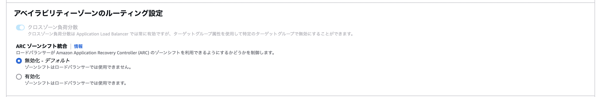

### ALB の属性

#### トラフィックの設定

- `TLS バージョンと番号ヘッダー`

    - ALB からターゲットへのリクエスト転送の際に `x-amzn-tls-version` ヘッダーと `x-amzn-tls-cipher-suite` ヘッダーを追加するかどうか

 

- `WAF のフェイルオープン`

    -　WAF のフェイルオープンとは: WAF に障害が発生した際に、WAF によるリクエストのチェックを行わずにターゲットへリクエストを流すこと

 

- `HTTP/2`

    - クライアントと ALB 間で HTTP2 通信を有効にするかどうか

    - ★[ターゲットグループで設定する HTTP2](./AWS_ELB_TargetGroup.md#ターゲットグループの作成) は ALB とターゲット間のプロトコルに関する設定項目

 

- `接続アイドルタイムアウト`

    - クライアント ~ ALB、また ALB ~ ターゲット 間の接続において接続がアイドル状態であると判断されてから何秒で接続を自動的に切断するのかを設定する

 

- `HTTP クライアントのキープアライブタイム`

    - クライアント ~ ALB 間の[キープアライブタイム](#キープアライブタイムとは)の設定

 

- `パケット処理`

    - ALB が行う HTTP リクエストの検査のレベルを指定する

 

- `無効なヘッダーフィールドを削除`

    - リクエストに含まれているヘッダーのフィールド名で、**英数字またはハイフン以外**の文字を含んだものを ALB 側で自動で削除するかどうか

 
 

#### X-Forwarded-For ヘッダー

- `X-Forwarded-For ヘッダー`

    - ALB → ターゲット にリクエストを転送する際に X-Forward-For ヘッダー を追加、保持、削除するかどうかについての設定項目

 

- `クライアントサポートの保持`

    - X-Forwarded-For ヘッダーに送信元のポート番号も含めるかどうかについての設定項目

 

- `ホストヘッダーを保持`

    - HTTP リクエストのホストヘッダーフィールドを保持し、変更を加えずにそのままターゲットに転送するかどうかについての設定項目

        - ホストヘッダーはクライアントがアクセスしたい URI とポートの情報を格納する

        - ALB のホストベースルーティング機能を利用したい場合有効にする必要がある
 
 

#### アベイラビリティゾーンのルーティング設定する

- `クロスゾーン負荷分散`

    - [クロスゾーン負荷分散](./AWS_ELB_TargetGroup_Attributes.md#クロスゾーン負荷分散)を有効にするかどうかについての設定項目

 

- `ARC ゾーンシフト統合`

    - [ゾーンシフト](./AWS_ELB_Zone_Shift.md)機能を有効にするかどうかについての設定項目

 
 

#### 保護 & モニタリング

- `保護`

    - マネージドコンソールから間違って当 ALB を削除しないようにする機能

 

- `アクセスログ`

    - クライアント → ALB へのアクセスログを圧縮して S3 に保存する機能

        - アクセスログとは ALB へ送信されるリクエストの詳細情報が記されているログのこと (リクエストのたびに記録される)

            - リクエストを受け取った時刻
            - クライアントの IP アドレス
            - サーバーレスポンス
            
            などの情報が格納される

    <be>

    - ★ALB からのログは S3 にしか出力できない

        - ALB → S3 へのデータ転送料金は発生しない

        - S3 のストレージ使用料は発生する

 

- `接続ログ`

    - クライアント → ALB への接続ログを圧縮して S3 に保存する機能
        - 接続ログとはALB へ送信される**接続時の**リクエストの詳細情報が記されているログのこと (**接続時のみ記録される**)

            - 接続リクエストのタイムスタンプ
            - クライアントの IP アドレス
            - (HTTPS リスナーの場合) TLS ハンドシェイク中に使用される SSL/TLS プロトコルや暗号化など

            などの情報が格納される

      
    
    - ★ALB からのログは S3 にしか出力できない

        - ALB → S3 へのデータ転送料金は発生しない

        - S3 のストレージ使用料は発生する

 
 

参考サイト

ALB の属性全般について
- [Application Load Balancer (ALB) の属性を整理してみた](https://dev.classmethod.jp/articles/alb-attribute-and-value/)

- [【初心者向け】Application Load Balancer（ALB）とターゲットグループの属性についてまとめてみた](https://blog.serverworks.co.jp/2023/04/13/115851)

WAF のフェイルオープンについて
- [ALBのWAF fail open属性](https://note.com/ama2/n/n3a4805dfb1cb)

- [自社WebサーバにAWS WAFを適用しました(4)～AWS WAFとALBの初期設定～](https://www.secuavail.com/kb/practical-post/aws-waf-initialization/#④_WAFのフェイルオープン)

ALB のキープアライブタイムについて
- [Application Load Balancer で HTTP クライアントのキープアライブ期間を設定可能](https://aws.amazon.com/jp/about-aws/whats-new/2024/03/application-load-balancer-http-keepalive-duration/)

パケット処理について
- [ALBとCLBに追加されたDesync Mitigation Mode の動作を確認](https://blog.serverworks.co.jp/desync-mitigation-mode)

X-Forwarded-For オプションについて
- [ALBのX-Forwarded-Forオプションの挙動を見てみる](https://blog.serverworks.co.jp/2023/05/09/200133)

ホストヘッダーフィールドについて
- [HTTP リクエストの Host ヘッダフィールドを知ろう](https://qiita.com/aximov/items/229ce3ec04412f30b333)

アクセスログと接続ログについて
- [ALB アクセスログと接続ログをS3に出力するように設定する](https://qiita.com/miriwo/items/0188cb4d714362af9800)

- [Application Load Balancer のアクセスログ](https://docs.aws.amazon.com/ja_jp/elasticloadbalancing/latest/application/load-balancer-access-logs.html)

- [Application Load Balancer の接続ログ](https://docs.aws.amazon.com/ja_jp/elasticloadbalancing/latest/application/load-balancer-connection-logs.html)

---

### キープアライブタイムとは

#### キープアライブとは

- TCP キープアライブ

    

    引用: [【図解】TCP Keep-Alive/http Keep-Aliveの仕組みと違い ～Client/Serverの挙動とメリット,設定～](https://milestone-of-se.nesuke.com/nw-basic/as-nw-engineer/keepalive-tcp-http/)

     

    - 接続された機器同士がお互いに一定時間ごとに接続を維持するためだけの無内容なパケットなどを送信し続ける仕組みのこと

 

- HTTP キープアライブ

    

    引用: [【図解】TCP Keep-Alive/http Keep-Aliveの仕組みと違い ～Client/Serverの挙動とメリット,設定～](https://milestone-of-se.nesuke.com/nw-basic/as-nw-engineer/keepalive-tcp-http/)

     

    - http 1.1 から採用された仕組み

    - 1回1回のリクエスト・レスポンスで TCP コネクションを切らずに、再利用する仕組みのこと

    - クライアント側 (ブラウザ) で設定されているキープアライブタイムかサーバー側で設定されているキープアライブタイムのどちらかに達すると TCP コネクションが切断される

 

#### ALB のキープアライブとは

- ALB に設定する HTTP キープアライブタイムのこと

 
 

参考サイト

[連載「入門 HTTP」(1) HTTP/1.xとKeep Alive](https://www.honai.me/blog/post/how-http-works-1-http1-keep-alive/#keep-aliveによる高速化)

[【図解】TCP Keep-Alive/http Keep-Aliveの仕組みと違い ～Client/Serverの挙動とメリット,設定～](https://milestone-of-se.nesuke.com/nw-basic/as-nw-engineer/keepalive-tcp-http/)

[apacheのKeepAliveをそれなりに考えてみた](https://kuniiskywalker.github.io/2014/04/12/2014-04-12-apache-keepalive/)

[TCP KeepAlive と HTTP KeepAlive は全然違うぞ](https://zenn.dev/thr/articles/645e36ef65d620)

[HTTP/2の特徴 HTTP/1.1との違いについて](https://blog.redbox.ne.jp/http2-cdn.html)

[F5 GLOSSARY: KeepAlive](https://www.f5.com/ja_jp/glossary/keepalive)

[IT用語辞典 e-Words: キープアライブ 【keep alive】 キープアライブパケット / keep alive packet](https://e-words.jp/w/キープアライブ.html)

[ELB使ってる人はすぐにKeepAlive Timeoutの値を確認しよう](https://qiita.com/hareku/items/7880eeac1e96c2f897e1)

[HTTP/1.0とHTTP/1.1のパケットを比較してみる](https://y0d3n.hatenablog.com/entry/2021/07/01/205451)