### ALB を作成する

#### ポイント

- インターネットからの HTTP/HTTPS リクエストは ALB が受け付ける
    - 外部からの HTTP/HTTPS リクエストを受け付けるセキュリティグループを付与する

- VPC 内部での ALB からのリクエストをプライベートサブネットにあるインスタンスが受け付ける
    - (プライベートサブネットなので)インスタンスには外部からのアクセスは受けないセキュリグループを付与しておく (VPC内部からのアクセスは受ける)

 

#### 作成手順

1\. EC2 ダッシュボードのロードバランサーより、「ロードバランサーの作成」をクリックする

 
 

2\. ALB に関しての項目を設定してゆく

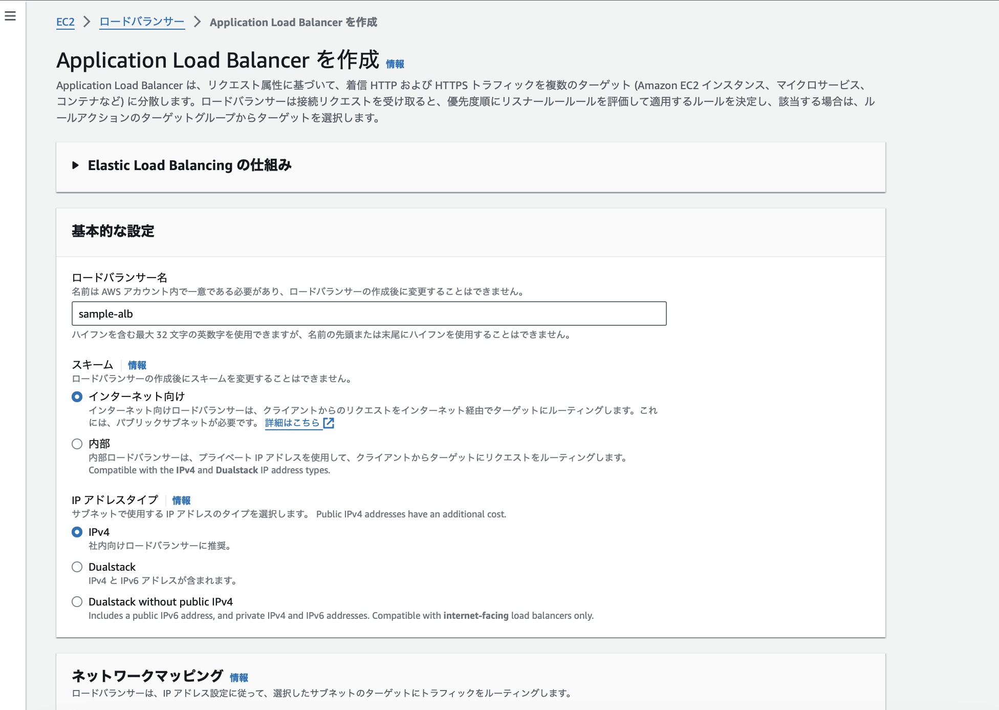

- `ロードバランサー名`

 

- `スキーム`
    - インターネット向け
        - ALB が外部からのアクセスを捌く場合に選択

    - 内部
        - ALB が VPC 内からのアクセスを捌く場合に選択

 

- `IP アドレスタイプ`
    - IPv4
        - クライアントが IPv4 アドレスを使用してロードバランサーと通信する場合は、IPv4 を選択する

    - Dualstack
        - クライアントが IPv4 および IPv6 アドレスの両方を使用してロードバランサーと通信する場合、デュアルスタックを選択する

    - Dualstack without public IPv4
        - ライアントが IPv6 アドレスのみを使用してロードバランサーと通信する場合、こちらを選択する

 
 

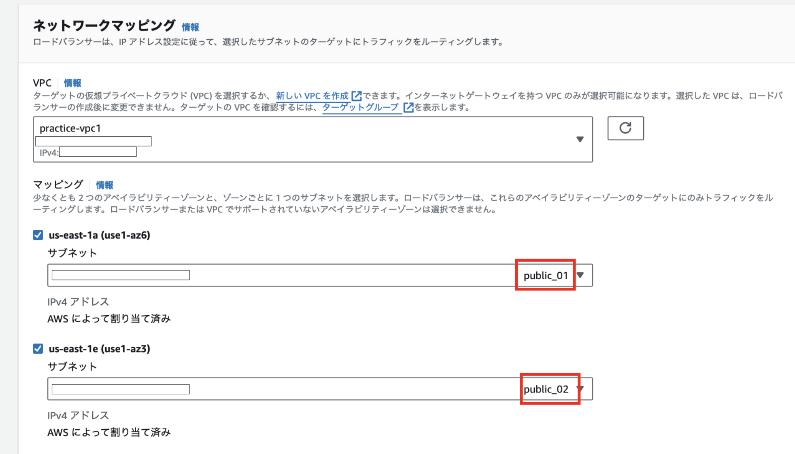

- `VPC`
    - ALB を配置したい VPC を選択

  

- `マッピング`
    - ALB が使うサブネットを指定する

    - 今回は、インターネット経由でのアクセスのやり取りをするので **パブリックサブネットを指定**する必要がある

    - ALB では、2つ以上のアベイラビリティーゾーンからのサブネットを選択する必要がある

 
 

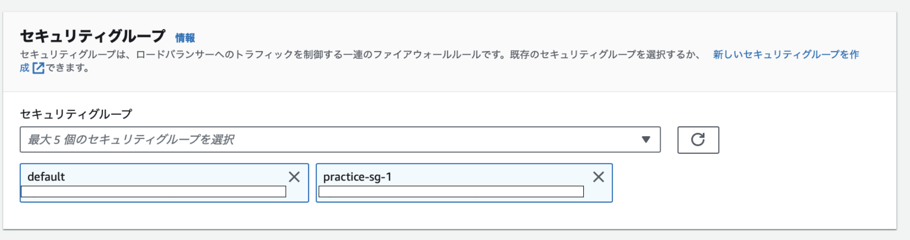

- `セキュリティグループ`
    - ALB に適用するセキュリティグループを選択する

    - 以下の理由から、default と practice-sg-1 が選択されている

        - default: プライベートサブネットが ALB からのリクエストを受け入れてくれるようにするため

        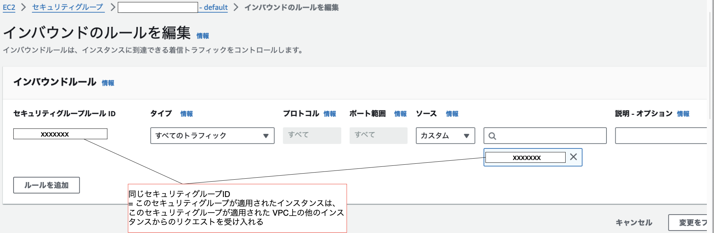

        - pratice-sg-1: ALB が外部からの HTTP/HTTPS リクエストを受け入れるようにするため

        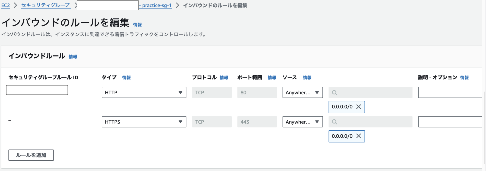

 
 

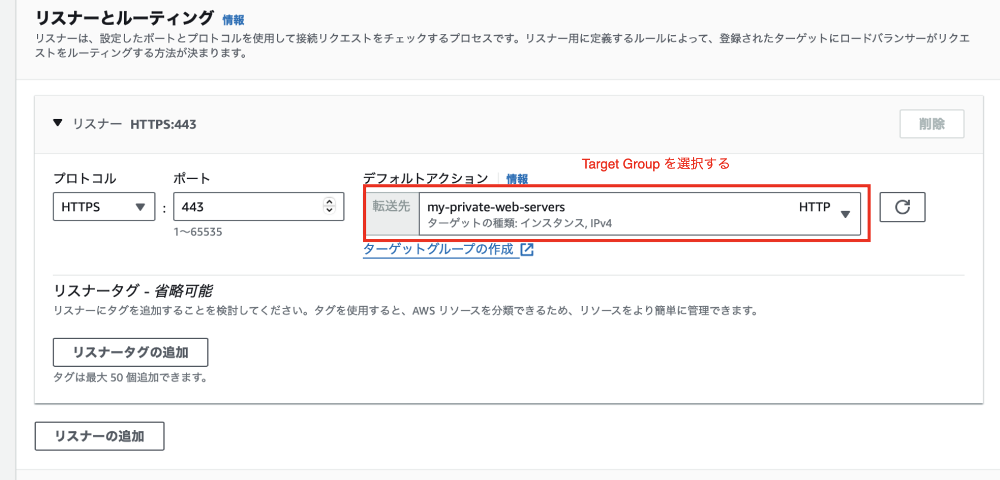

- `プロトコル`
    - ALB がどの通信プロトコルのリクエストを受け入れるか

- `ポート`
    - ALB が何番ポートでリクエストを受け入れるか

- `デフォルトアクション`
    - ALB が外部からのリクエストを受けた場合、そのリクエストの振り分け先 ([ターゲットグループ](./TargetGroup.md))

 
 

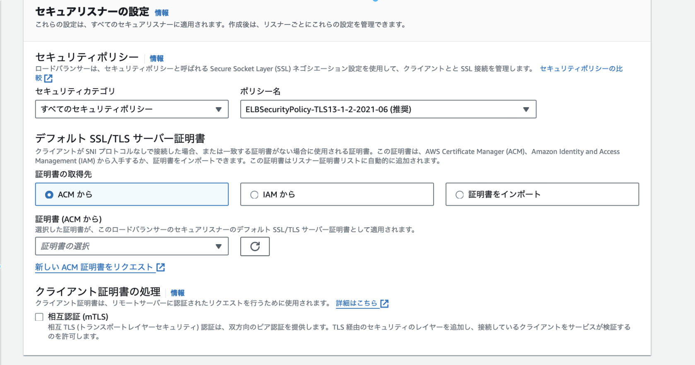

**(HTTPS リスナーを追加した場合)**

★セキュアリスナーの設定 → ALB に SSL / TSL 処理を行わせるための設定項目

- `セキュリティポリシー`
    - クライアントと ALB 間での通信プロトコルおよび暗号スイートの設定項目

    - 通信プロトコル: TSL1.0 / TSL 1.1 / TSL 1.2 など

    - 暗号スイート: 鍵交換方式、デジタル署名アルゴリズム、共通鍵アルゴリズム、ハッシュ化アルゴリズムの組み合わせ (詳しくは[CSリポジトリのCipherSuite.md](https://github.com/MasaGt/CS/blob/1613eb010b87df4b65d1d2f1eb0b2ff07ea96549/CipherSuite.md)を参照)

- `デフォルト SSL/TSL サーバー証明書`
    - SSL/TSL サーバー証明書のアップロード

- `クライアント証明書の処理`
    - クライアントの認証を利用した HTTPS 通信を行いたい場合に選択する
    - 特別に許可を与えた顧客のみアクセス許可したいWebサービスが当てはまる

 
 

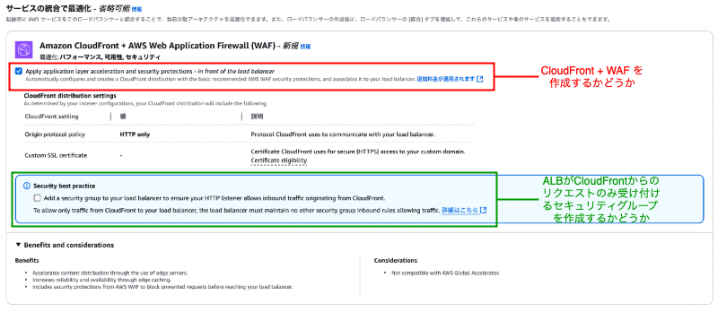

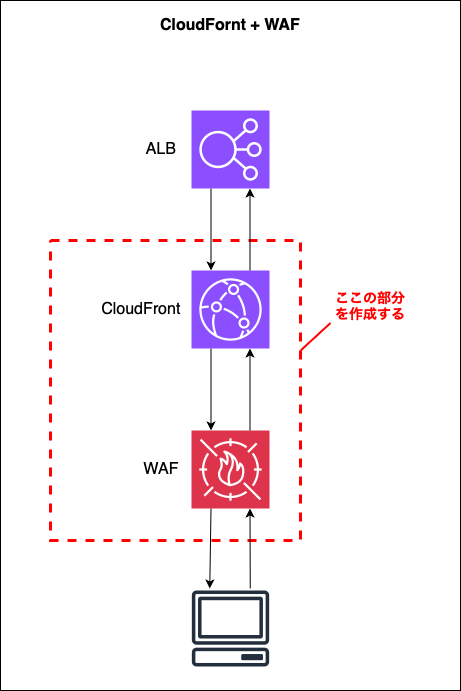

- `CloudFront + WAF`

    - `Apply application layer acceleration and security protections - in front of the load balancer`

        - ALB の前に CloudFront とその CloudFront へのリクエストをチェックする WAF を作成するかどうか

     

    - `Security best practice`

        - ALB へのアクセスを CloudFront からのみにするためのセキュリティグループを ALB に付与するかどうか

 
 

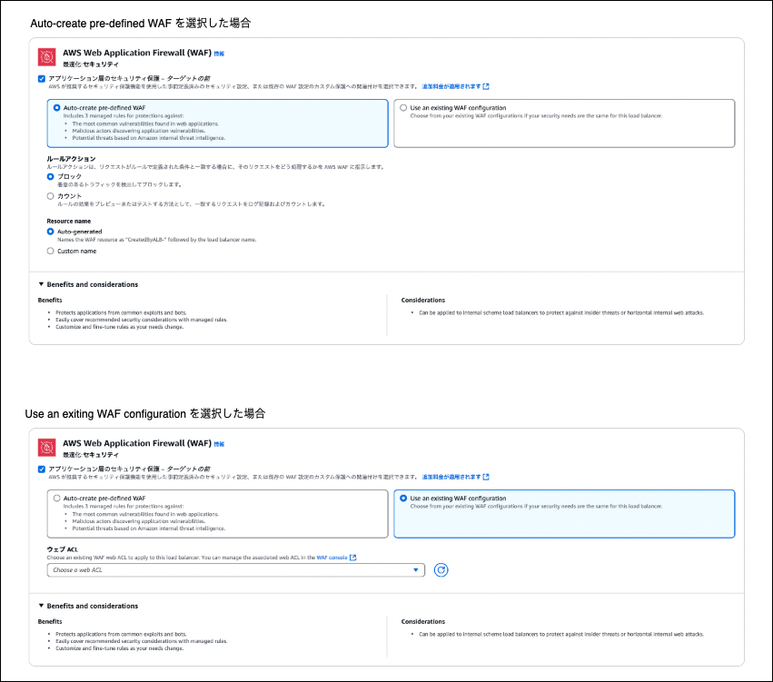

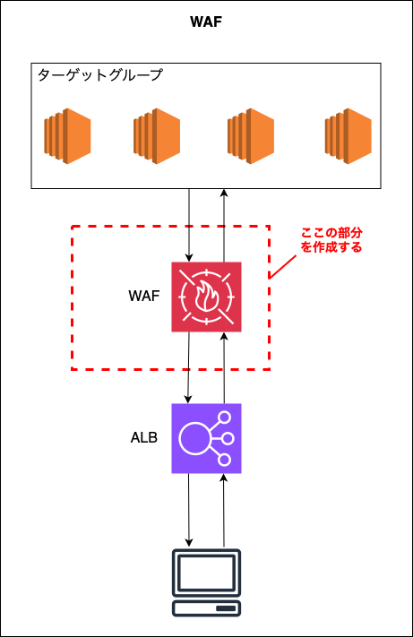

- `AWS Web Application Firewall (WAF)`

    - `アプリケーション層のセキュリティ保護 - ターゲットの前`

        - ALB からターゲットへののリクエストをチェックする WAF を作成するかど

        

    - `Auto-create pre-defined WAF`

        - AWS が用意しているデフォルトの WAF (Web ACL) を利用する

        - `ルールアクション`

            - マネージドルール内のルールに一致した時のアクションを Block か Count にする

         

        - `Rousource name`

            - 作成する Web ACL の名前を自動作成のものにするか自分で名前を付けて作成するか

     

    - `Use an exiting WAF configuration`

        - 自分が作成した WAF (Web ACL) を利用する

        - `ウェブ ACL`

            - 利用する作成済みの Web ACL

 
 

- `AWS Global Accelerator`
    - クライアントからのリクストを適切なリージョンに振り分けるサービス

    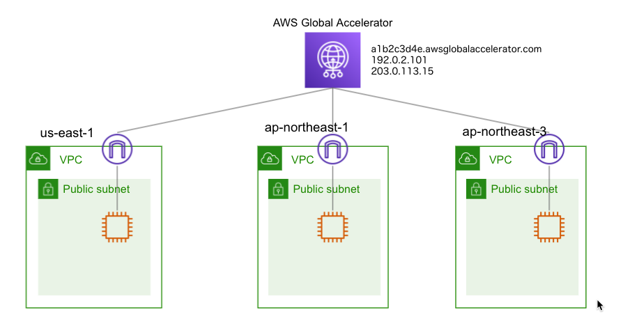

    引用: [AWS Global Acceleratorでアクセラレーターを作成する](https://www.yamamanx.com/aws-global-accelerator-create/)

 

最後に ALB の設定内容が表示されるので、問題なければ「ロードバランサーの作成」をクリックする

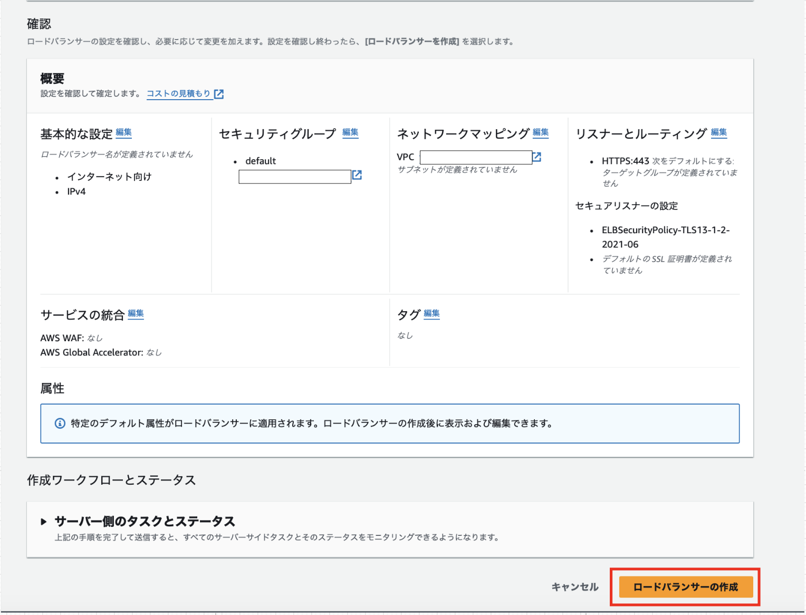

 
 

参考サイト

公式の ALB 説明ページ
- [Application Load Balancer の作成](https://docs.aws.amazon.com/ja_jp/elasticloadbalancing/latest/application/create-application-load-balancer.html#configure-load-balancer)

公式の HTTPS リスナーの設定についての説明ページ
- [Application Load Balancer 用の HTTPS リスナーを作成する](https://docs.aws.amazon.com/ja_jp/elasticloadbalancing/latest/application/create-https-listener.html#describe-ssl-policies)

ALB のセキュリティポリシーの選定について
- [ELB のセキュリティポリシー変更はブラウザの対応プロトコルを考慮して慎重に](https://dev.classmethod.jp/articles/sugano-028-security/)

CloudFront + WAF のオプションについて
- [[アップデート] Application Load Balancer コンソールから CloudFront + WAF を統合出来るようになりました](https://dev.classmethod.jp/articles/alb-cloudfront-integration-builtin-waf/)

WAF のオプションについて
- [[アップデート] Application Load Balancer のコンソール上でもワンクリックで、AWS WAF を作成し適用出来るようになりました](https://dev.classmethod.jp/articles/application-load-balancer-one-click-waf-integrations/)
- [Integrations for your Application Load Balancer](https://docs.aws.amazon.com/elasticloadbalancing/latest/application/load-balancer-integrations.html#load-balancer-waf)

---

### スキーム

- インターネット向け

    - ロードバランサーはパブリック IP アドレスを持つ

        - よって、ロードバランサーはインターネットからアクセスされることができる

    - 用途: 一般的なインターネットからのリクエストを割り振るロードバランサーに用いる

 

- 内部

    - ロードバランサーはプライベート IP アドレスのみを持つ

        - よって、ロードバランサーは VPC 内部からのみアクセスされる

    - 用途: VPC 内部のリクエストを割り振るロードバランサーに用いる (内部APIの負荷分散や、VPC内部のサービスへのリクエスト分散など)

 
 

参考サイト

[ALBの内部向けとインターネット向けの違いについて](https://blog.mmmcorp.co.jp/2025/02/18/types-of-alb/)