### カナリアリリース

#### イメージ

- canary (カナリアリリース) を作成すると対象のステージに紐づいた特別な canary ステージが作成されるイメージ

    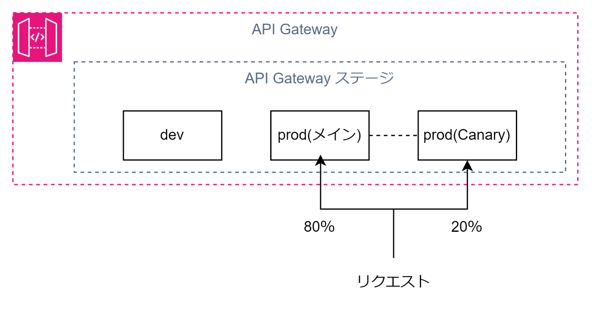

 

- 対象ステージに canary を作成したら、以降の対象ステージへの API デプロイは canary ステージへのデプロイになる

    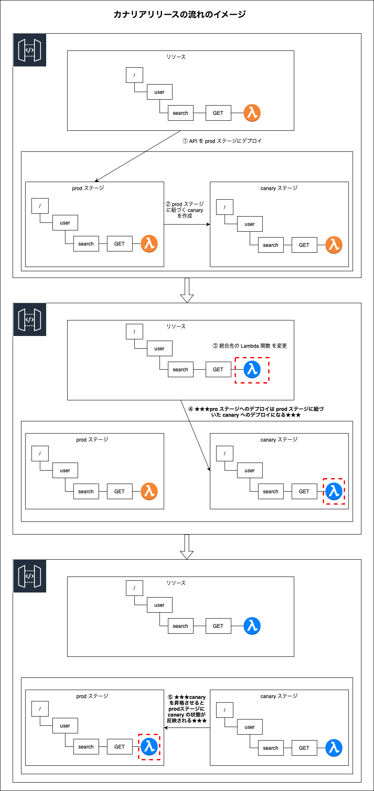

 
 

参考サイト

[API Gatewayの耐障害性を考える](https://zenn.dev/tech4anyone/articles/167873880acc7e#api-gatewayのカナリアリリース)

---

### 練習

#### 前準備

1. Lambda にて以下のように自身のバージョンを表示する簡単な関数を用意する

    - body での表示するバージョンだけ変えて新しくバージョンを発行し、バージョンによって返ってくるメッセージのバージョン部分が異なるようにする

        - バージョン1

           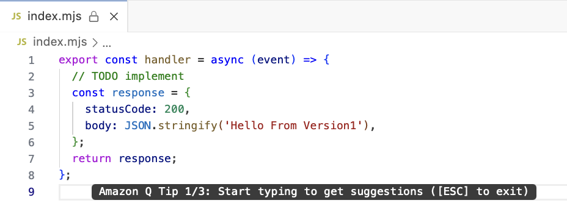

         

        - バージョン2

           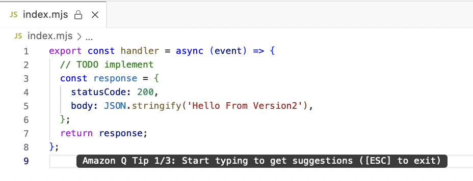

 

2. API Gateway にて REST API を作成

    - 適当なリソースを作成し、そのリソースにGETメソッドで上記 Lambda 関数のバージョン1を呼び出すように設定し、デプロイする

        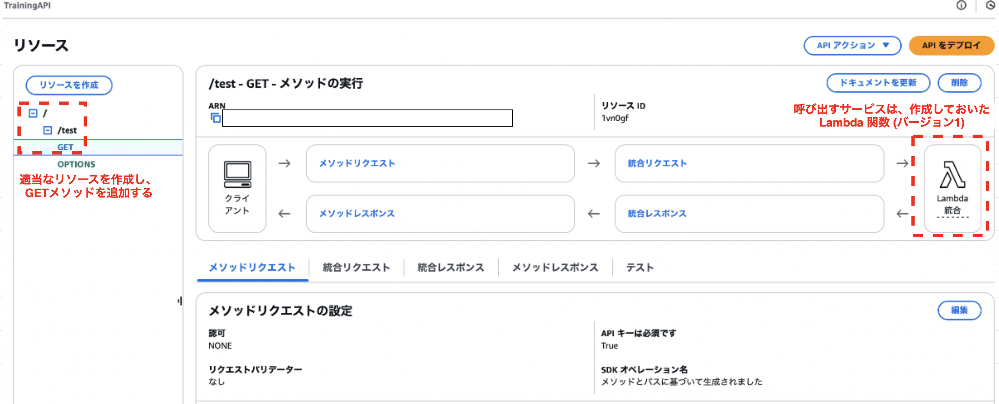

     

    - ちゃんとエンドポイントからレスポンスが返ってくることを確認

        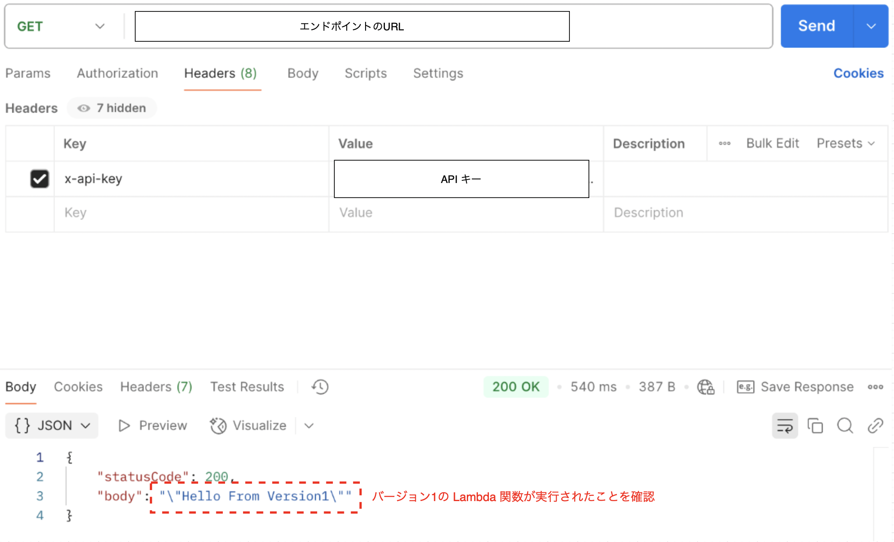

 

#### カナリアリリース練習

1. 対象のステージの Canaryタブにて、 `canaryの作成`をクリックする

    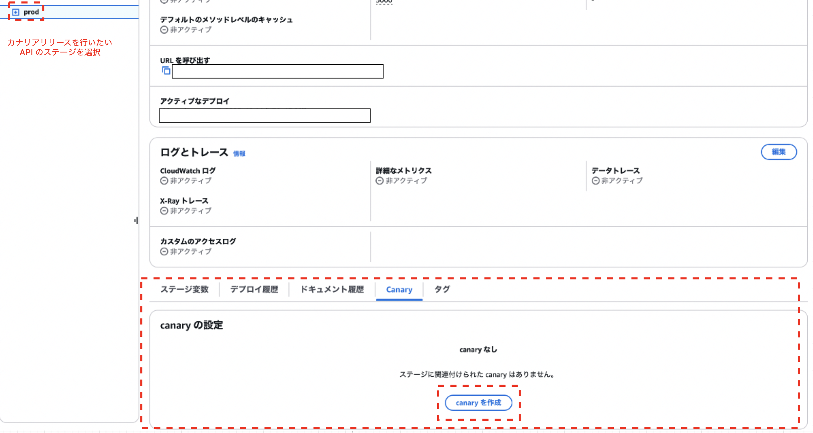

 

2. 各項目を設定し、`canaryを作成` をクリック

    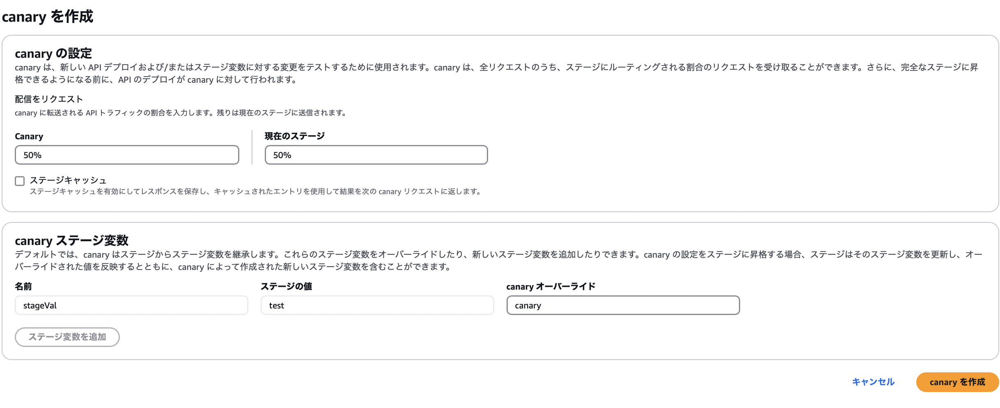

    - canary の設定

        - `配信をリクエスト`

            - canary: 作成する canaryへリクエストを割りふる割合

            - 現在のステージ: 現在のステージへリクエストを割り振る割合

         

        - `ステージをキャッシュ`

            - 現在のステージと作成する canary ステージではキャッシュは共有されないため、canary ステージ用にレスポンスをキャッシュするかどうかの設定項目

     

    - `canary ステージ変数`

        - 現在のステージ変数を canary ステージ用にオーバーライドするかどうかの設定項目

 

3. 呼び出す関数をバージョン2の Lambda 関数に変更してデプロイする

    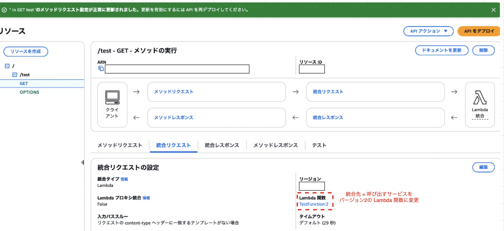

    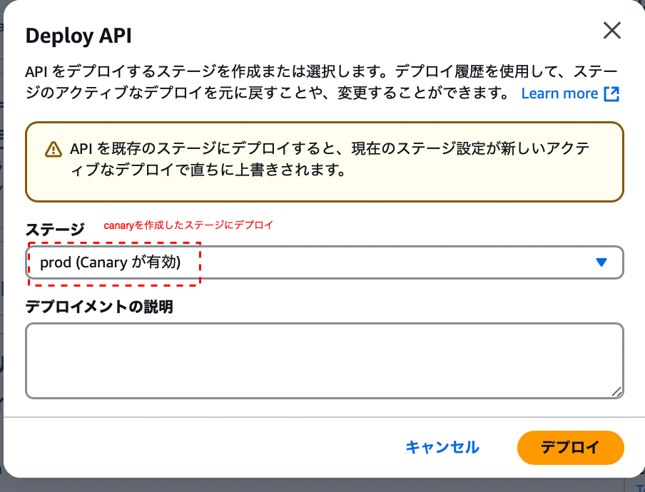

     

    - これでカナリアリリースでのデプロイ完了

 

#### カナリアリリース後の確認

- Postman でエンドポイントにGETリクエストを何回か送ってみる

    - 以下のように半々の確率でバージョン1かバージョン2の Lambda 関数のレスポンスが確認できれば

    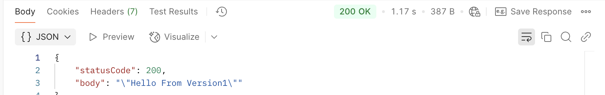
    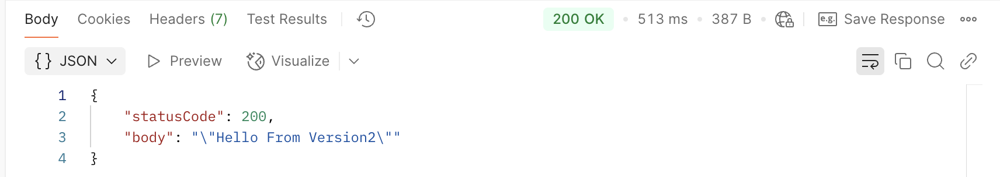

 

#### カナリアリリースを本番に昇格させる

- 新しい API (canary ステージへデプロイした API) に問題がなければ、 canary を本番に差し替える必要が出てくる

#### 手順

1. canary を設定したステージの Canary タブにて、`canary を昇格させる` をクリック

    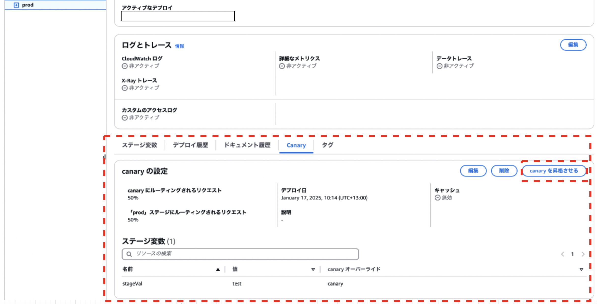

 

2. 適用したい項目にチェックをいれ `canary を昇格させる` をクリック

    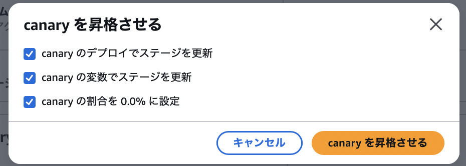

    - `canary のデプロイでステージを更新`

        - canary ステージにデプロイされている API を現在のステージに適用するかどうか
    
     

    - `canary の変数でステージを更新`

        - canary ステージでオーバーライドしている変数を現在のステージに適用するかどうか

     

    - `canary の割合を 0.0 % に設定`

        - canary のリクエスト振り分けの設定について、 canary ステージへのリクエストの振り分け率を 0% に更新するかどうか

 

3. カナリアリリースの設定がもう必要なけば、Canary タブにて `削除` をクリックして canary 設定を削除する

    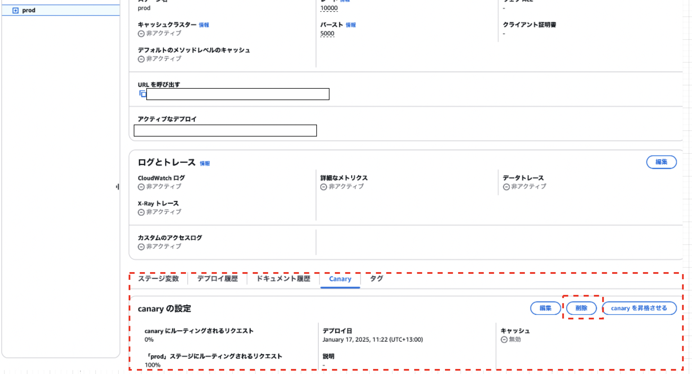

---

### カナリアリリースでの注意点

- 新しくエンドポイントを追加するようなケースの時はカナリアリリースでのデプロイはできない

    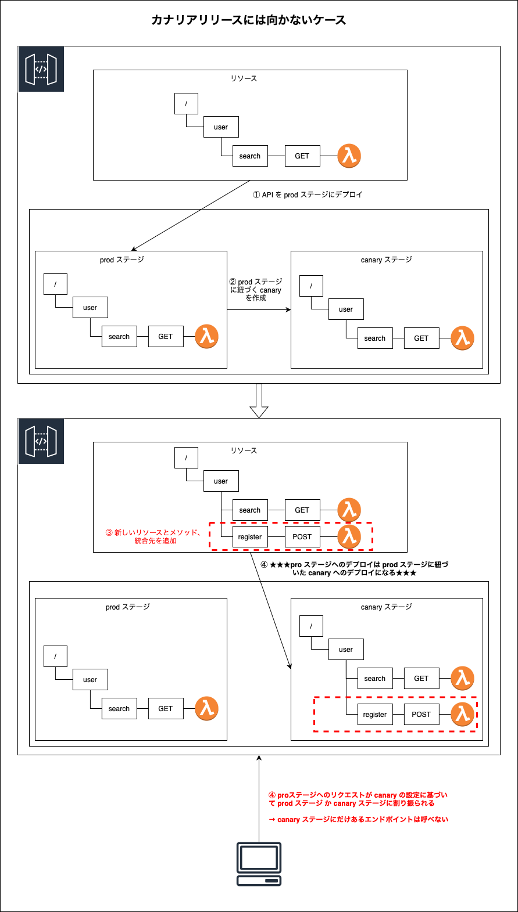