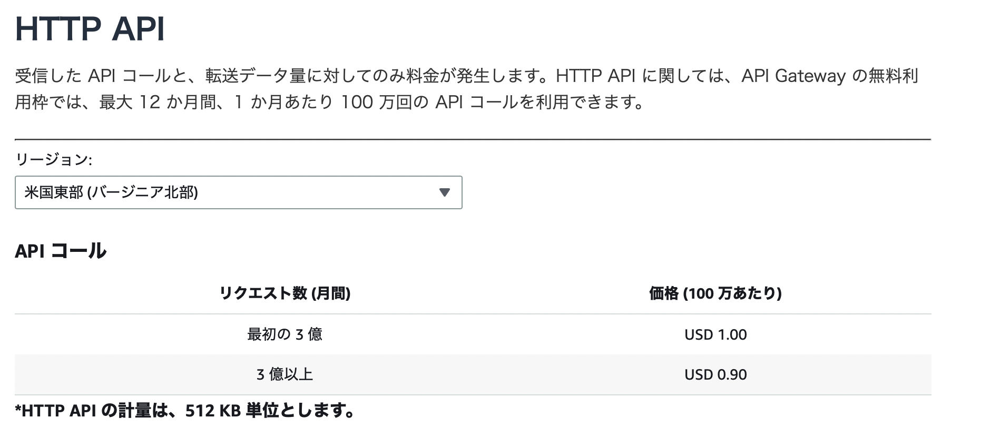
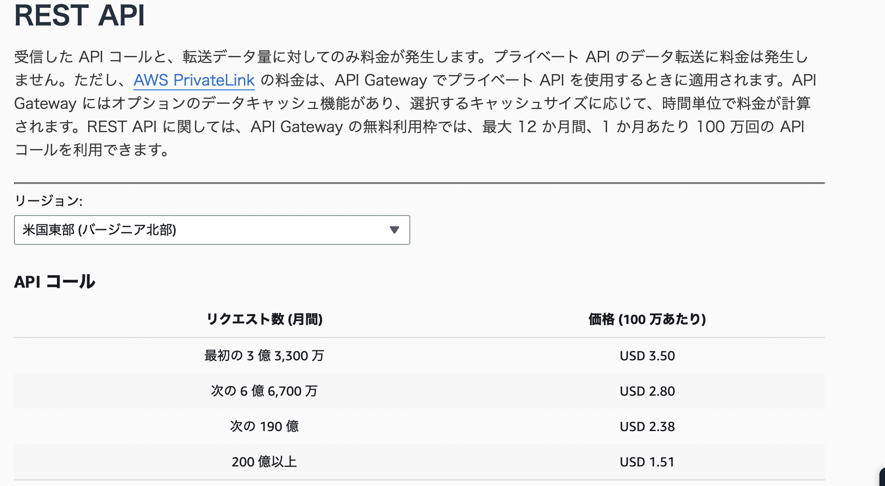
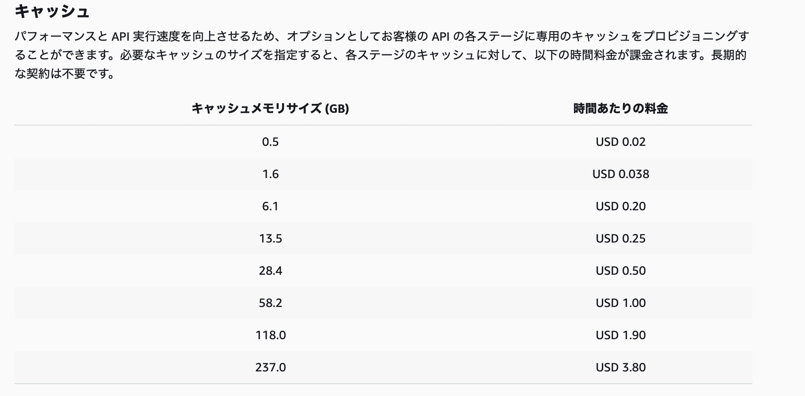
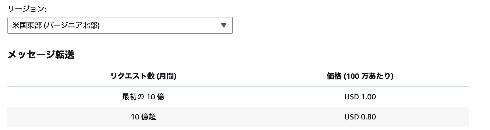
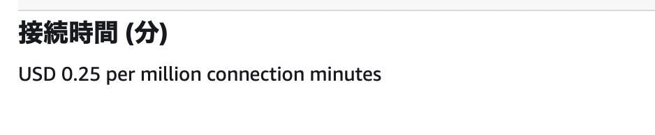
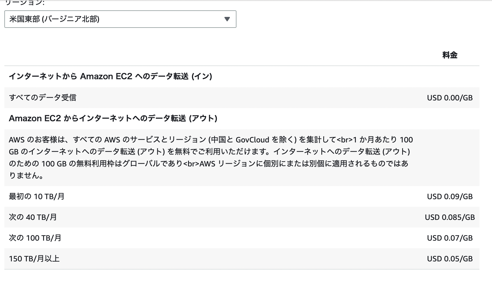

### API Gateway とは

- Web API を作成、公開、管理するフルマネージドなサービス

    - REST API, WebSocket API, HTTP API の作成などが可能

    - API用のサーバーを自前で用意する必要がなく、開発者は API の開発、保守のみに注力することができる

<br>

- API Gateway はリージョンサービス

<br>
<br>

参考サイト

[さっくり解説するAmazon API Gateway](https://qiita.com/shimajiri/items/2fb424629d9ddb9c9ef1)

---

### API Gateway での用語とコンセプト

#### リソース


<br>

- HTTPリクエストを受け取る特定のパス

- ★定義したリソース (= パス) に対してメソッド (GET/POST.PUT/DELETE) とバックエンドサービスを紐づける

<br>

#### ステージ


<br>

- デプロイ環境のこと

- ステージごとに　API の状態を分けて管理することができる

- 各ステージのエンドポイントの URL にはステージ名が含まれる

    

<br>

#### API キー


<br>

- API デベロッパーが API へのアクセスを制御するために使用する英数字の文字列

- APIキーは、API Gatewayで生成・管理される

<br>

#### API キーの機能

- APIキーを持つユーザーのみアクセス可能なAPIを作成する

- 使用量プランというものを作成することで、 API キーにクォータ（アクセス可能回数）、レート（アクセス頻度）などに制限をかけることができる

- APIキー毎のアクセス回数を取得できる

<br>

#### Autorizer (オーソライザー)


<br>

- ≒ 認可サーバ

- Lambda関数を利用して自前の認証処理を実装できる

- AWS Cognito を利用することもできる

<br>

#### モデル

- モデルはペイロード (データ本体) のデータ構造

<br>

#### リクエスト


<br>

- メソッドリクエスト

    - クライアントから APIGateway へのリクエスト

<br>

- 統合リクエスト

    - API Gateway からバックエンドサービスへのリクエスト

<br>

#### レスポンス


<br>

- メソッドレスポンス

    - バックエンドサービスから API Gateway へのレスポンス

<br>

- 統合レスポンス

    - API Gateway からクライアントへのレスポンス

<br>
<br>

参考サイト

リソースについて
- [イラストで理解するAPI Gateway](https://zenn.dev/fdnsy/articles/86897abce0bbf5)

リクエスト、レスポンスについて
- [AWS CLIで Web サイトを構築、管理、運用する(24日目)](https://qiita.com/hiro_qiita_/items/0ef3be7e6c40fdbf4c8f)

API キーについて
- [【ふわっとわかる Google Cloud】API Gatewayとは？API Keyとは？](https://easy-study-forest.com/apigateway-apikey/#toc2)
- [API GatewayのAPIキーと使用量プランについて調べてみた](https://dev.classmethod.jp/articles/try-api-gateway-usage-plan/)

---

### REAT API と HTTP API

#### 広義の意味

- HTTP API

    - HTTP プロトコルを利用して機能を提供しているプログラムのことを指す

<br>

- REST API

    - HTTP プロトコルを利用して機能を提供しているプログラムのこと

        - ★(広義の意味で) REST API は　HTTP API に属している

    <br>

    - REST API の特徴として、リソース（データ）を URI で指定し、HTTP メソッド（GET、POST、PUT、DELETE など）を使用してリソースを操作する

<br>

#### 狭義 (API Gateway 上) の意味

- API Gateway 上で提供される製品の違い

- HTTP API

    - シンプルで低コスト、低レイテンシーな RESTful API を作成できる製品

- REST API

    - HTTP API より高度な機能やセキュリティ、管理機能が必要な RESTful API の作成ができる製品

##### ポイント

- API Gateway 上では HTTP API, REST API のどちらとも RESTful API 製品である

- ★各 API によって利用できる[機能](./API_Gateway_Functions.md)に差がある

- HTTP API の方が REST API よりも低価格で利用できる

<br>
<br>

参考サイト

広義の意味での HTTP API と REST API
- [徹底解説：REST APIとHTTP APIとの相違点などを](https://apidog.com/jp/blog/how-rest-api-differs-from-http-api/)

狭義の意味での HTTP API と REST API
- [AWS API GatewayのHTTP APIとREAT APIの違い](https://qiita.com/pike3/items/54401975793b4750f180)
- [Amazon API Gatewayは「HTTP API」と「REST API」のどちらを選択すれば良いのか？ #reinvent](https://dev.classmethod.jp/articles/amazon-api-gateway-http-or-rest/)
- [REST API と HTTP API のどちらかを選択する](https://docs.aws.amazon.com/ja_jp/apigateway/latest/developerguide/http-api-vs-rest.html)

---

### コスト

#### HTTP API にかかるコスト

- API Gateway へのリクエスト数に対する課金

    - 100万回あたり \~~ UDS の課金形態

    - ★★★リクエストのサイズが 512 KB までは1件,
    それ以上は複数件のリクエストとしてカウントする★★★

    <br>

    

<br>

#### REST API にかかるコスト

- API Gateway へのリクエスト数に対する課金

    - 100万回あたり \~~ UDS の課金形態

    <br>

    

<br>

- [プロビジョニングするキャッシュ](./API_Gateway_Stageの作成.md#ステージ単体を作成する方法)への利用料金 (リージョンによって金額が異なる)

    

<br>

#### WebSocket API にかかるコスト

- クライアントと API Gateway 間でやり取りされるメッセージ数に対する課金

    - 送受信できるメッセージのサイズは最大 128 キロバイト (KB) で 32 KB で1つのメッセージとカウントされる

        - → 64KB のメッセージのメッセージ数は2件とカウントされる

    - 100万件あたり \~~ UDS の課金形態

    <br>

    

<br>

- 接続時間に対する課金 (リージョンによって金額が異なる)

    - 100万分あたり \~~ UDS の課金形態

    

<br>

#### どの API にも共通でかかるコスト

- データ転送に対しての課金

    - ★★★アウトバウンド (AWS からインターネット) のデータ転送量に対してのみ料金が発生する★★★

    - 金額は EC2 のデータ転送料金 (GB あたりの従量制料金) が適用される 

    - 100 GB のインターネットへのデータ転送 (アウト) までは無料

    <br>

    

<br>

#### 練習問題

1. HTTP API の例

    ```
    Q: 以下のような HTTP API を作成 & 運用している。1ヶ月の利用料金はいくらか?
    (リージョンはバージニア北部、1ヶ月 = 30日とする)

        - 1 分あたり 10,000 リクエストを受け付ける。

        - 各 リクエストのサイズは 12 KBで、レスポンスのサイズは 46 KB である

    
    A:
    1 ヶ月のリクエスト数にかかる料金に関して

        1ヶ月の総リクエスト数を計算すると、
        
            10,000 × 60 (分) × 24 (時間) × 30 (日) = 432,000,000

        よって、1ヶ月のリクエスト数に対する料金は、
        
            - 最初の3億リクエストまでの料金
                300,000,000 ÷ 1,000,000 × 1.00 (USD) = 300 USD

            - 以降のリクエスト数に対する料金
                132,000,000 ÷ 1,000,000 × 0.90 (USD) = 118.8 USD

    従って、リクエスト数に対する合計金額は 300 + 118.8 = 418.8 USD


    データ転送料金に関して

        (API Gateway に限定して) １ヶ月の AWS から インターネットへの総データ転送量は、

            46 (KB) * 432,000,000 (リクエスト数) = 19,872,000,000 (KB) =  19.872 (TB)

        よって、1ヶ月のデータ転送量 (Out) に対する料金は、
        
            - 10TB までのデータ転送料

                10000 (GB) × 0.09 (USD) = 900 USD

            - 以降のデータ転送料

                9872 GB × 0.085 (USD) = 839.12 USD
            
        従って、データ転送量の合計金額は 900 + 839.12 = 1,739.12 USD

    よって、1ヶ月に発生する API Gateway (HTTP API) の利用料金は、 418.8 + 1,739.12 = 2,167.92 USD
    ```

<br>

2. REST API の例

    ```
    Q: 以下の REST API を作成＆運用している。1ヶ月の利用料金はいくらか?

        - リージョン API (バージニア北部)

        - 1.6 GB のキャッシュをプロビジョニング

        - 1ヶ月に 500 万リクエストを受け付ける

        - レスポンスサイズは 3 KB

    A:

    1ヶ月のリクエスト数に対する料金について、

        5,000,000 (リクエスト数) ÷ 1,000,000 × 3.50 (USD) = 17.5 USD

    
    (API Gateway に限定して) １ヶ月の AWS から インターネットへの総データ転送量について、

        3 (KB) * 5,000,000 (リクエスト数) = 15,000,000 (KB) = 15 (GB)

        よって、データ転送にかかる料金は
        15(GB) × 0.09 (USD) = 1.35 (USD)

    
    プロビジョニングしたキャッシュに対する料金について、

        0.038 (1時間あたりの利用料金(USD)) × 24 (時間) × 30 (日) = 27.36 USD

    
    よって、1ヶ月に発生する API Gateway (REST API) の利用料金は、 17.5 + 1.35 + 27.36 = 46.21 USD
    ```

<br>

3. WebSocket API の例

    ```
    Q: 以下の WebSocket API を作成＆運用している。1ヶ月の利用料金はいくらか?

        - リージョンはバージニア北部

        - ユーザー数は 1,000 人

        - 各ユーザーは API に毎日 12 時間接続する

        - 各ユーザーは 100 件のメッセージを送信し、500 件のメッセージを受け取る

        - メッセージのサイズは 3 KB
    
    A:

    1ヶ月の総接続時間にかかる料金について、

        1ヶ月の総接続時間 (分) は

            12 (1ユーザーの1日の接続時間) × 1,000 (ユーザー数) × 30 (日) = 360,000 (時間) =  21,6000,000 (分)
        
        よって、発生する料金は

            21,600,000 (分) ÷ 1,000,000 × 0.25 (USD) = 5.4 USD


    1ヶ月の総メッセージ数に対する料金について、

        送信メッセージ数は

            100 (件) × 1,000 (ユーザー) × 30 (日) = 3,000,000 (件)

        受信メッセージ数は

            500 (件) × 1,000 (ユーザー) × 30 (日) = 15,000,000 (件)

        よって、合計メッセージ数は 3,000,000 + 15,000,000 = 18,000,000 (件)


        従って、1ヶ月のメッセージ数に対して発生する料金は

            18,000,000 ÷ 1,000,000 × 1,00 (USD) = 18 USD
    

    1ヶ月のデータ転送量に対する料金に関して、

            API Gateway からユーザー(インターネット)へのデータ転送 (Out) 量は

                1ヶ月のユーザーの送受信メッセージ数 × メッセージのサイズ 

                    15,000,000 (件) × 3 KB = 45,000,000 (KB) = 45 (GB)

            よって、データ転送量に対して発生する料金は

                45 (GB) × 0.95 (USD) = 42.75 USD


    よって、1ヶ月に発生する API Gateway (WebSocket API) の利用料金は、 5.4 + 18 + 42.75 = 66.15 USD
    ```

<br>
<br>

参考サイト

[Amazon API Gateway の料金](https://aws.amazon.com/jp/api-gateway/pricing/)

[外部から AWS のバックエンドサービス利用を実現する仕組みをグラレコで解説](https://aws.amazon.com/jp/builders-flash/202004/awsgeek-api-gateway/)

---

### API Gateway について何か忘れた時は

とにかく [Black Belt の資料](https://d1.awsstatic.com/webinars/jp/pdf/services/20190514_AWS-Blackbelt_APIGateway_rev.pdf)がわかりやすい

<br>
<br>

参考サイト

[\[AWS Black Belt Online Seminar\] Amazon API Gateway](https://d1.awsstatic.com/webinars/jp/pdf/services/20190514_AWS-Blackbelt_APIGateway_rev.pdf)