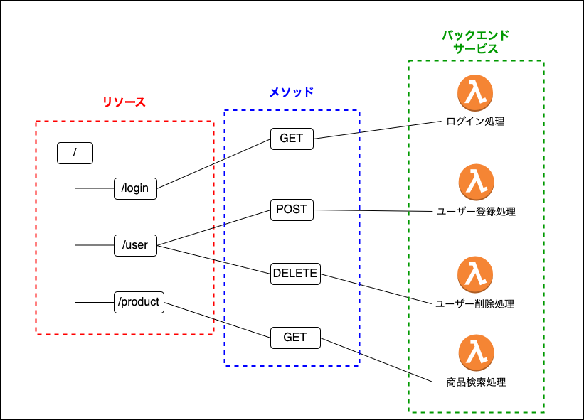
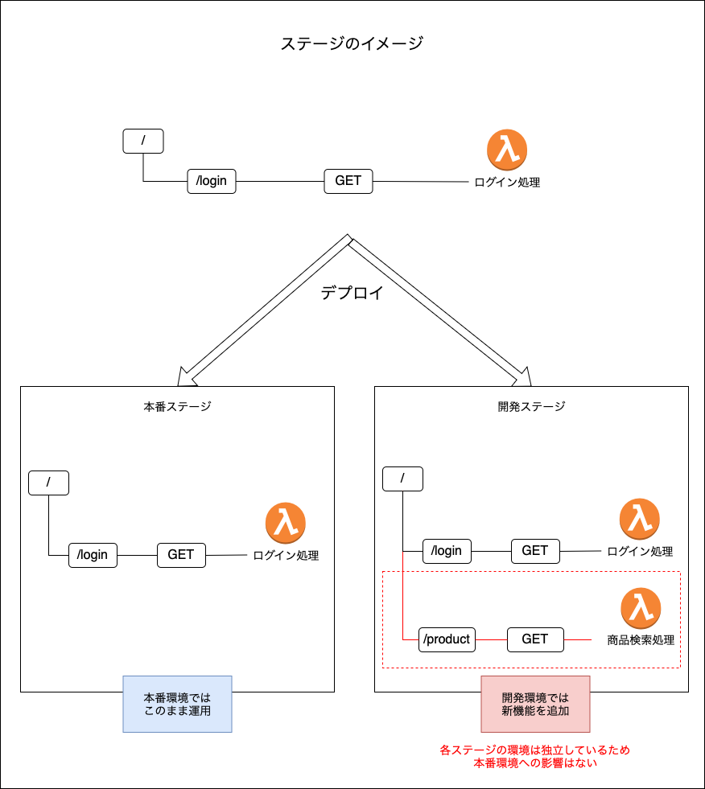
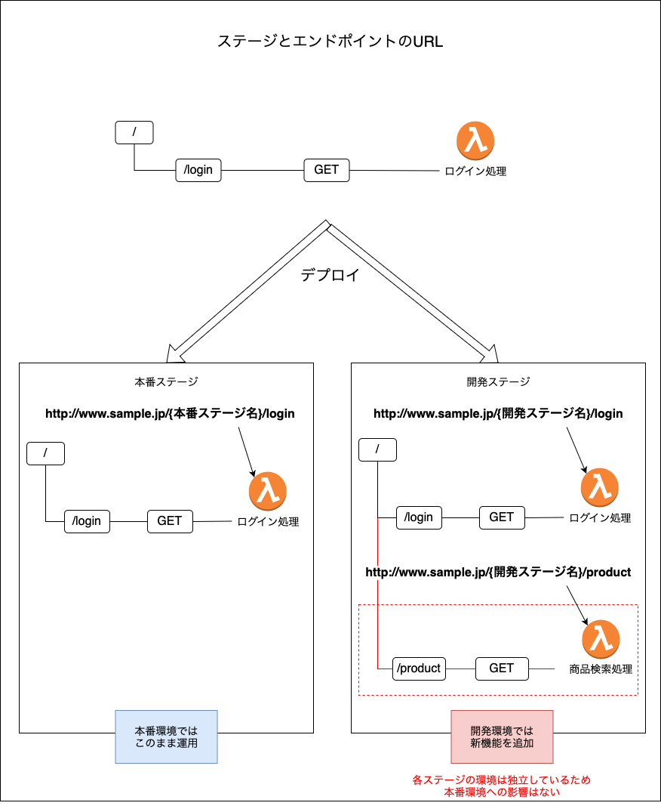
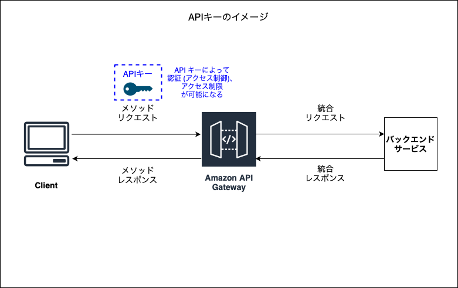
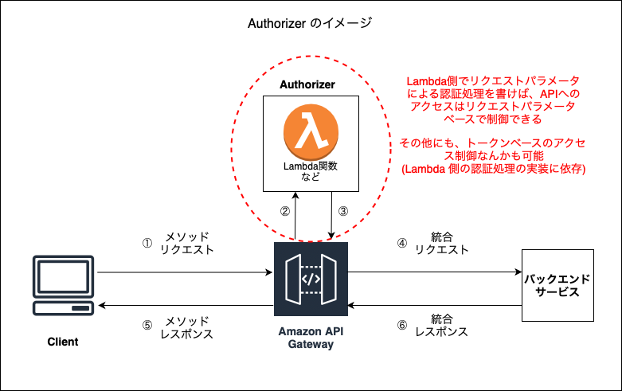
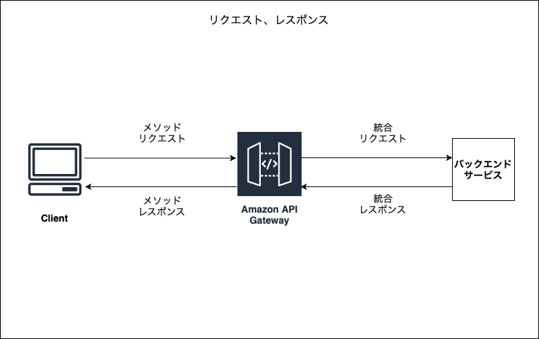

### API Gateway とは

- Web API を作成、公開、管理するフルマネージドなサービス

    - REST API, WebSocket API, HTTP API の作成などが可能

    - API用のサーバーを自前で用意する必要がなく、開発者は API の開発、保守のみに注力することができる

 

- API Gateway はリージョンサービス

 
 

参考サイト

[さっくり解説するAmazon API Gateway](https://qiita.com/shimajiri/items/2fb424629d9ddb9c9ef1)

---

### API Gateway での用語とコンセプト

#### リソース

 

- HTTPリクエストを受け取る特定のパス

- ★定義したリソース (= パス) に対してメソッド (GET/POST.PUT/DELETE) とバックエンドサービスを紐づける

 

#### ステージ

 

- デプロイ環境のこと

- ステージごとに　API の状態を分けて管理することができる

- 各ステージのエンドポイントの URL にはステージ名が含まれる

    

 

#### API キー

 

- API デベロッパーが API へのアクセスを制御するために使用する英数字の文字列

- APIキーは、API Gatewayで生成・管理される

 

#### API キーの機能

- APIキーを持つユーザーのみアクセス可能なAPIを作成する

- 使用量プランというものを作成することで、 API キーにクォータ（アクセス可能回数）、レート（アクセス頻度）などに制限をかけることができる

- APIキー毎のアクセス回数を取得できる

 

#### Autorizer (オーソライザー)

 

- ≒ 認可サーバ

- Lambda関数を利用して自前の認証処理を実装できる

- AWS Cognito を利用することもできる

 

#### モデル

- モデルはペイロード (データ本体) のデータ構造

 

#### リクエスト

 

- メソッドリクエスト

    - クライアントから APIGateway へのリクエスト

 

- 統合リクエスト

    - API Gateway からバックエンドサービスへのリクエスト

 

#### レスポンス

 

- メソッドレスポンス

    - バックエンドサービスから API Gateway へのレスポンス

 

- 統合レスポンス

    - API Gateway からクライアントへのレスポンス

 
 

参考サイト

リソースについて
- [イラストで理解するAPI Gateway](https://zenn.dev/fdnsy/articles/86897abce0bbf5)

リクエスト、レスポンスについて
- [AWS CLIで Web サイトを構築、管理、運用する(24日目)](https://qiita.com/hiro_qiita_/items/0ef3be7e6c40fdbf4c8f)

API キーについて
- [【ふわっとわかる Google Cloud】API Gatewayとは？API Keyとは？](https://easy-study-forest.com/apigateway-apikey/#toc2)
- [API GatewayのAPIキーと使用量プランについて調べてみた](https://dev.classmethod.jp/articles/try-api-gateway-usage-plan/)

---

### REAT API と HTTP API

#### 広義の意味

- HTTP API

    - HTTP プロトコルを利用して機能を提供しているプログラムのことを指す

 

- REST API

    - HTTP プロトコルを利用して機能を提供しているプログラムのこと

        - ★(広義の意味で) REST API は　HTTP API に属している

     

    - REST API の特徴として、リソース（データ）を URI で指定し、HTTP メソッド（GET、POST、PUT、DELETE など）を使用してリソースを操作する

 

#### 狭義 (API Gateway 上) の意味

- API Gateway 上で提供される製品の違い

- HTTP API

    - シンプルで低コスト、低レイテンシーな RESTful API を作成できる製品

- REST API

    - HTTP API より高度な機能やセキュリティ、管理機能が必要な RESTful API の作成ができる製品

##### ポイント

- API Gateway 上では HTTP API, REST API のどちらとも RESTful API 製品である

- ★各 API によって利用できる[機能](./API_Gateway_Functions.md)に差がある

- HTTP API の方が REST API よりも低価格で利用できる

 
 

参考サイト

広義の意味での HTTP API と REST API
- [徹底解説：REST APIとHTTP APIとの相違点などを](https://apidog.com/jp/blog/how-rest-api-differs-from-http-api/)

狭義の意味での HTTP API と REST API
- [AWS API GatewayのHTTP APIとREAT APIの違い](https://qiita.com/pike3/items/54401975793b4750f180)
- [Amazon API Gatewayは「HTTP API」と「REST API」のどちらを選択すれば良いのか？ #reinvent](https://dev.classmethod.jp/articles/amazon-api-gateway-http-or-rest/)
- [REST API と HTTP API のどちらかを選択する](https://docs.aws.amazon.com/ja_jp/apigateway/latest/developerguide/http-api-vs-rest.html)

---

### コスト
