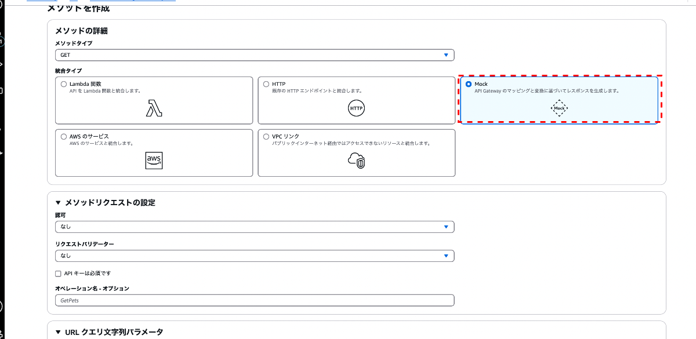

### API の作成

1. マネージドコンソールより API Gateway 画面に遷移し、`API` をクリック

    

    

<br>

2. 今回は外部からアクセスできる REST API を作成するので REST API の `構築`を選択する

    

<br>

3. API の作成方法を選択する

    - 新しい API

        - 1から自分で API を作成する方法

        

    <br>

    - 既存の API をクローン

        - すでに作成ずみの API をコピーして作成する方法

        

    <br>

    - API をインポート

        - OpenAPI や Swagger といった定義ファイルから API を作成する方法

        

    <br>

    - サンプル API

        - AWS が用意しているテンプレートをもとに API を作成する方法

        

<br>

4. 作成する API の[エンドポイントタイプ](./API_Gateway_Functions.md#エンドポイントタイプ)を選択する

    - 今回は `リージョン` を選択

    

<br>

5. API の作成方法とエンドポイントタイプを選択したら `APIを作成` をクリック

    

---

### リソースの作成

- パスを追加する

    - API Gateway でのリソースというものの理解については[こちら](./API_Gateway.md#リソース)を参照

<br>

#### リソースの追加手順

1. マネジードコンソールの API Gateway 画面のサイドメニューから `API` を選択し、リソースを追加したい API をクリックする

    

<br>

2. サイドメニューの `リソース` からリソース画面に遷移し、 `リソースを作成` ボタンをクリック

    

<br>

3. 追加したいパス名 (= リソース) を入力し、 `リソースを作成` ボタンをクリック

    - プロキシリソース

        - [greedy パス変数](#greedy-パス変数)を使用したパスのこと

        - greedy パス変数 (`{proxy+}`) を利用して、 greedy パスより深いパスを指定したリクエストも全て greedy なリソースで受け取る

            ```
            [例]
            リソースパス: /user
            greedy 変数: {proxy+}
            
            上記の設定で作成したプロキシリソースは /user 以降のパスを指定した全てのリクエストを受け取る

            /user でも /user/search でも /user/dept/area/ でも
            ```

    <br>

    - CORS (クロスオリジンリソース共有)

        - API Gateway で作成する当 API の CORS を有効にするかどうか

        - 異なるオリジンから API Gateway で作成する API を呼び出したい場合に有効にする必要がある

    <br>

    

<br>
<br>

参考サイト

プロキシリソースオプションの greedy パス変数について
- [【新機能】Amazon API Gatewayの設定方法にcatch-allパス変数、ANYメソッド、Lambdaとの新しいプロキシ連携の3機能が追加。](https://dev.classmethod.jp/articles/api-gateway-adds-three-features/)
- [API Gatewayで/{proxy+}メソッドを活用する方法](https://qiita.com/hatsukaze/items/12f9ec31fcacc73f2e50#1-proxyメソッドとは)
- [API Gateway のアップデート – API 開発を簡素化する新機能](https://aws.amazon.com/jp/blogs/news/api-gateway-update-new-features-simplify-api-development/)

API Gateway の CORS について
- [Amazon API Gateway をクロスオリジンで呼び出す (CORS)](https://dev.classmethod.jp/articles/amazon-api-gateway-cors/)
- [[AWS CDK] API Gateway(REST API)のCORSの動作を確認してみた](https://dev.classmethod.jp/articles/cors-on-rest-api-of-api-gateway/)

---

###  リソースに紐づく HTTP メソッド の作成とエンドポイントの結びつけ


<br>

#### メソッドの作成手順

1. 作成済みのリソース (= パス) を選択し、 `メソッドを作成` ボタンをクリックする

    

<br>

2. メソッド作成画面にて必要項目を設定する

    ##### メソッドの種類および統合タイプの設定

    - メソッドの種類: 作成する HTTP メソッドの種類 (GET, POST, PUT, DELETE など)

    

    <br>

    - 統合タイプ: API Gateway がクライアントからリクエストを受信した後にそのリクエストを転送するバックエンドサービスの種類のこと

        

        引用: [外部から AWS のバックエンドサービス利用を実現する仕組みをグラレコで解説](https://aws.amazon.com/jp/builders-flash/202004/awsgeek-api-gateway/)

        <br>

        

        引用: [\[AWS Black Belt Online Seminar\] Amazon API Gateway](https://d1.awsstatic.com/webinars/jp/pdf/services/20190514_AWS-Blackbelt_APIGateway.pdf)

        <br>

        - Lambda 関数

            - 概要

                

                引用: [\[AWS Black Belt Online Seminar\] Amazon API Gateway](https://d1.awsstatic.com/webinars/jp/pdf/services/20190514_AWS-Blackbelt_APIGateway.pdf)

            <br>

            - マネージドコンソール画面

                

                <br>

                - ★Lambda プロキシ統合

                    - API Gateway がクライアントからのリクエストに含まれているパラメーターをイベントオブジェクトとして Lambda 関数に直接渡すようになる機能

                    - Lambda プロキシ統合を利用しない場合、API Gateway から Lambda 関数へリクエストパラメータの受け渡しは行われない

                        - ★Lambda 側でリクエストパラメータを受け取りたい場合は以下の2つの方法がある

                            - Lambdaプロキシ統合を利用する

                            - マッピングテンプレートを作成する

                                - マッピングテンプレート: リクエストからどのパラメータを抽出し何という変数名で Lambda に渡すかを定義する機能 (レスポンスも同様)

                <br>

                - Lambda 関数

                    - 呼び出す Lambda 関数のリージョンと ARN を指定する

                <br>

                - 統合のタイムアウト

                    - API Gateway が、統合先 (Lambda 関数) からの応答が完了するまで待機する最大時間のこと
        <br>

        - HTTP

            - 概要

                

                引用: [\[AWS Black Belt Online Seminar\] Amazon API Gateway](https://d1.awsstatic.com/webinars/jp/pdf/services/20190514_AWS-Blackbelt_APIGateway.pdf)

            <br>

            - マネージドコンソール画面

                

                <br>

                - ★HTTP プロキシ統合

                    - Lambda プロキシ統合の HTTP 版

                <br>

                - HTTP メソッド
                
                    - API Gateway から統合先へ送るリクエストのメソッド

                <br>

                - エンドポイント URL

                    - 統合先のエンドポイント URL

                <br>

                - コンテンツの処理

                    

                    - クライアントから送信されたリクエストデータを受け取り、必要に応じて変換して統合先のバックエンドに渡す機能

                        - パススルー　(= データ変換なし)

                            - リクエストのデータをそのままバックエンドに送信し、レスポンスもそのままクライアントに返す方法

                        <br>

                        - バイナリに変換

                            - リクエストやレスポンスのデータをバイナリ形式に変換する方法

                            - 画像ファイルを扱いたい場合に選択することがある

                        <br>

                        - テキストに変換

                            - リクエストやレスポンスのデータをテキスト形式に変換する方法

                            - JSONやXMLなどのテキストデータを扱いたい場合に選択することがある

                        <br>

                    

                <br>

                - 統合のタイムアウト

                    - API Gateway が、統合先からの応答が完了するまで待機する最大時間のこと

        <br>

        - Mock

            - 概要

                

                引用: [\[AWS Black Belt Online Seminar\] Amazon API Gateway](https://d1.awsstatic.com/webinars/jp/pdf/services/20190514_AWS-Blackbelt_APIGateway.pdf)

            <br>

            - マネージドコンソール画面

                

                <br>

                - 統合先に関する設定項目は特になし
        
        <br>

        - AWS のサービス

            - 概要

                

                引用: [\[AWS Black Belt Online Seminar\] Amazon API Gateway](https://d1.awsstatic.com/webinars/jp/pdf/services/20190514_AWS-Blackbelt_APIGateway.pdf)

            <br>

            - マネージドコンソール画面

                

                <br>

                - AWS リージョン

                    - API Gateway から呼び出す AWS サービスのリージョン

                <br>

                - AWS のサービス

                    - API Gateway から呼び出す AWS サービス

                <br>

                - AWS サブドメイン

                    - バックエンドの AWS サービスのサブドメイン

                    - 基本的には記入しなくていい

                <br>

                - HTTPメソッド

                    - API Gateway からバックエンドの AWS サービスに送るリクエストの HTTP メソッド

                <br>

                - アクションタイプ: ざっくりいうと、バックエンドの AWS サービスの API の呼び方

                    - アクション

                        - バックエンドの AWS サービスの API がサポートしているアクションの場合に選択する

                    <br>

                    - パスオーバーライド

                        - リクエストにリソースパスを含めることがバックエンドの AWS サービスの API で要求される場合に選択する
                <br>

                - アクション名

                    - アクションタイプで「アクション」を指定した場合に設定する項目

                    - 呼び出すアクション名 (≒ API 名)を設定する

                <br>

                - 実行ロール

                    - API Gateway がバックエンドの AWS をサービスを呼ぶ際に API Gateway に付与する権限 (ARN)

                <br>

                - 認証情報キャッシュ

                    

                    <br>

                    - ざっくり言うと、認証結果をキャッシュするかどうか

                        - するとしたらどの認証情報をキャッシュするか

                <br>

                - コンテンツの処理

                    - クライアントから送信されたリクエストデータを受け取り、必要に応じて変換して統合先のバックエンドに渡す機能　(統合先が Lambda でも同様の項目があるので、詳しくはそちらを参照)

                <br>

                - 統合のタイムアウト

                    - API Gateway が、統合先の AWS サービスからの応答が完了するまで待機する最大時間のこと

        <br>

        - VPC リンク

            - 概要

                

                引用: [\[AWS Black Belt Online Seminar\] Amazon API Gateway](https://d1.awsstatic.com/webinars/jp/pdf/services/20190514_AWS-Blackbelt_APIGateway.pdf)

            <br>

            - マネージドコンソール画面

                

                <br>

                - VPC プロキシ統合

                    - Lambda プロキシ統合や HTTP プロキシ統合と同じく、自動でパラメータがマッピングされる機能

                <br>

                - HTTP メソッド

                    - API Gateway からバックエンドへのリクエストを転送する時のメソッド

                <br>

                - VPC リンク

                    - 特定のステージ毎に接続したいVPCリンクを指定可能

                    

                <br>

                - エンドポイント URL

                    - ネットワークロードバランサーのドメイン名

                <br>

                - 統合のタイムアウト

                    - 他の統合タイプの「統合のタイムアウト」と同じ

            <br>

            ##### メソッドリクエストの設定

            - [メソッドリクエスト](./API_Gateway.md#リクエスト) (= クライアントから API Gatewayへのリクエスト) に関する設定

            

            <br>

            - 認可

                

                - APIリクエストのアクセス制御を設定するための項目

                - ★対象のリソース & HTTP メソッドのリクエストに対して利用する Authorizer を指定する

                - 「AWS IAM」を選択すると、特定の IAM ユーザーやロールのみがAPIにアクセスできるようになるらしい

            <br>

            - リクエストバリデーター

                - クライアントからのリクエストデータの構造を検証するかどうか

                    - 検証するとしたら、どこまで(パラメータ、リクエストヘッダ、リクエストボディ)を検証するのか

                <br>

                

            <br>

            - API キーは必須です

                - クライアントからのリクエストに [API キー](./API_Gateway.md#api-キー)を必須にするかどうか

            <br>

            - オペレーション名

                - 作成する当メソッドを識別するための名前 (オプショナル)

            <br>

            ##### URL クエリ文字列パラメータ

            - 特定のクエリパラメータを必須項目にしたり、キャッシュ対象に指定する

            

            <br>

            ##### HTTP リクエストヘッダー

            - リクエストヘッダー内の特定の項目を必須項目にしたり、キャッシュ対象に指定する

            

            <br>

            ##### リクエスト本文

            - リクエストのペイロード　(≒ ボディ) の構造を定義する

                - コンテンツタイプ

                    - リクエストペイロード部分のデータ形式を指定 (大抵は 'application/json')

                <br>

                - モデル

                    - 事前に定義済みの[モデル](./API_Gateway.md#モデル) (= リクエストペイロード部分の構造) を指定

            

<br>

3. 各項目の設定が完了したら `メソッドを作成` ボタンをクリックする

    


<br>
<br>

参考サイト

統合タイプについて
- [\[AWS Black Belt Online Seminar\] Amazon API Gateway](https://d1.awsstatic.com/webinars/jp/pdf/services/20190514_AWS-Blackbelt_APIGateway.pdf)

Lambda プロキシ統合について
- [【AWS API Gateway, Lambda】プロキシ統合を使うとき/使わないときの値のやりとり](https://bftnagoya.hateblo.jp/entry/2022/11/08/134800#プロキシ統合とは)
- [API Gateway が「Lambda プロキシ統合」でさらに使いやすくなっててびっくりした話](https://dev.classmethod.jp/articles/api-gateway-lambda-integration-fabu/)

HTTP プロキシ統合について
- [Amazon API Gateway (REST) の HTTP 統合で、統合先にクエリ文字列を転送するために必要な設定を確認してみた](https://dev.classmethod.jp/articles/api-gateway-rest-http-query-string/)

HTTP統合の設定項目「コンテンツの処理」について
- [【図解】API Gatewayの仕組みや特徴、設定項目を分かりやすく解説](https://konishi-tech.com/api-gateway/#setting2)

AWSサービス統合の設定項目「アクション」について
- [API Gateway を他の AWS サービスのプロキシとして使用するにはどうすればよいですか?](https://repost.aws/ja/knowledge-center/api-gateway-proxy-integrate-service)
- [AWS の API を理解しよう ! 初級編 ~ API の仕組みと利用方法を理解しよう](https://aws.amazon.com/jp/builders-flash/202209/way-to-operate-api/)

VPCリンク統合について
- [【新機能】API Gateway VPC integrationを使ってみた #reinvent](https://dev.classmethod.jp/articles/aws-reinvent-apigateway-vpc-integration/)

メソッドリクエストの「リクエストバリデーター」について
- [API Gateway REST APIのリクエスト検証機能を使って、不正なパラメーターのリクエストを弾く](https://dev.classmethod.jp/articles/api-gateway-request-validation/)

---

### パスパラメーターを受け取るリソースの作成

- [リソースの作成](#リソースの作成)にて、リソース名を `{}`でパスパラメータ名をくくって作成する

<br>

#### 例: `/test` 以降にパスパラメータをつけて呼び出すエンドポイントを作成したい

<br>

1. リソースの作成にて `/test` までのリソースを作成する

    

<br>

2. `/test` 以降にリソースを作成する。この時、リソース名 (=受け取りたいパスパラメーター名) を `{}` でくくる

    

<br>

3. `/test/{param}` に HTTP メソッドと統合先を紐付ける

    

<br>

4. Postman で呼んでみる

    

    <br>

    - 結果: ちゃんと統合先の Lambda 関数が呼び出された

        

    <br>

    - ちなみに、パスパラメーターは `event` オブジェクトの `pathParameters` に格納される (Node.js)

        

<br>
<br>

参考サイト

[AWS APIGatewayでパスパラメータの設定を行う](https://qiita.com/yamapyblack/items/c037c4e07123929d9046)

---

### greedy パス変数


<br>

#### 作成方法

TODO: greedyパスを用いたリソース(パス)の作成方法を書く

<br>
<br>

参考サイト

[【新機能】Amazon API Gatewayの設定方法にcatch-allパス変数、ANYメソッド、Lambdaとの新しいプロキシ連携の3機能が追加。](https://dev.classmethod.jp/articles/api-gateway-adds-three-features/#Catch-all%25E3%2583%2591%25E3%2582%25B9%25E5%25A4%2589%25E6%2595%25B0)

[API Gateway のアップデート – API 開発を簡素化する新機能](https://aws.amazon.com/jp/blogs/news/api-gateway-update-new-features-simplify-api-development/)

---

### ANY メソッド


<br>

#### 作成方法

TODO: ANY メソッドの定義方法を書く

<br>
<br>

参考サイト

[【新機能】Amazon API Gatewayの設定方法にcatch-allパス変数、ANYメソッド、Lambdaとの新しいプロキシ連携の3機能が追加。](https://dev.classmethod.jp/articles/api-gateway-adds-three-features/#Catch-all%25E3%2583%2591%25E3%2582%25B9%25E5%25A4%2589%25E6%2595%25B0)

[API Gateway のアップデート – API 開発を簡素化する新機能](https://aws.amazon.com/jp/blogs/news/api-gateway-update-new-features-simplify-api-development/

---

### その他の項目

#### カスタムドメイン

- 自分で取得したドメインを API に割り当てることができる


<br>

#### VPC リンク

- VPC内のリソースにアクセスするために VPC リンクというものを作成できる

