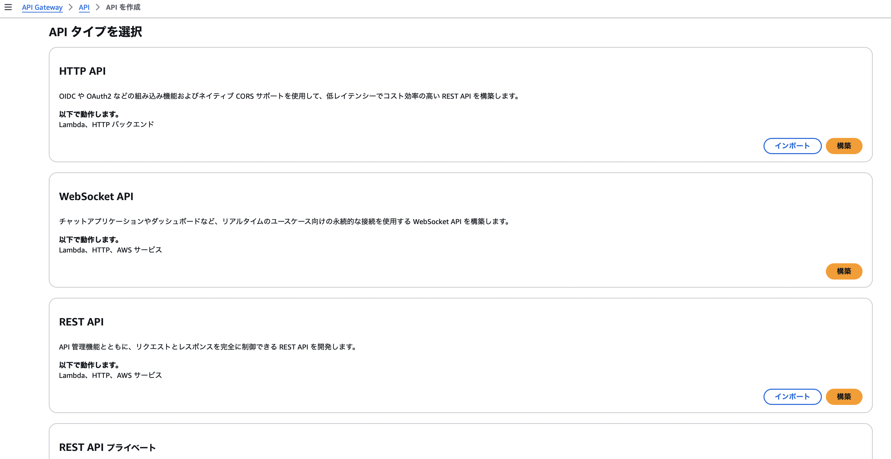

### API Gateway の作成

1. マネージドコンソールより API Gateway 画面に遷移し、`API` をクリック

    

    

 

2. 今回は外部からアクセスできる REST API を作成するので REST API の `構築`を選択する

    

 

3. API の作成方法を選択する

    - 新しい API

        - 1から自分で API を作成する方法

        

     

    - 既存の API をクローン

        - すでに作成ずみの API をコピーして作成する方法

        

     

    - API をインポート

        - OpenAPI や Swagger といった定義ファイルから API を作成する方法

        

     

    - サンプル API

        - AWS が用意しているテンプレートをもとに API を作成する方法

        

 

4. 作成する API の[エンドポイントタイプ](./API_Gateway_Functions.md#エンドポイントタイプ)を選択する

    - 今回は `リージョン` を選択

    

 

5. API の作成方法とエンドポイントタイプを選択したら `APIを作成` をクリック

    

---

### その他の項目

#### カスタムドメイン

- 自分で取得したドメインを API に割り当てることができる

 

#### VPC リンク

- VPC内のリソースにアクセスするために VPC リンクというものを作成できる

