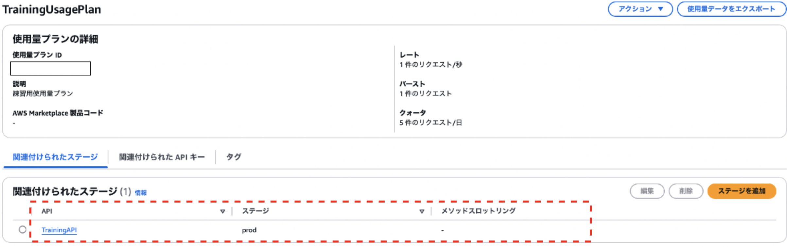
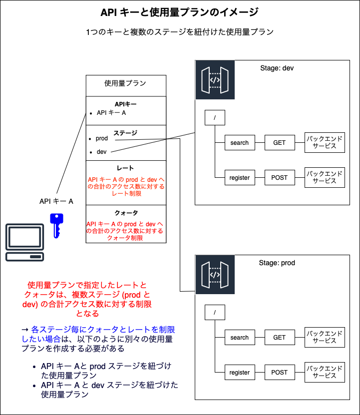
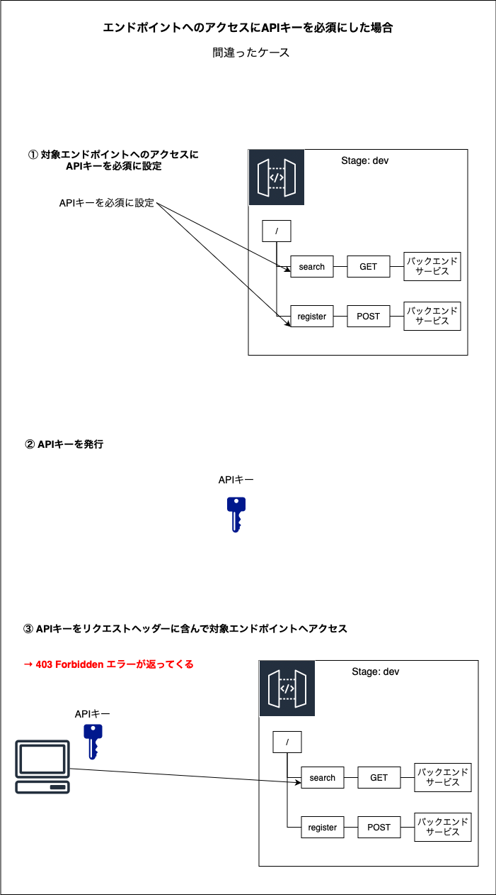

### API キーと使用量プランとは

#### API キー

- クライアントから API へのアクセスを制御するために使用する英数字の文字列 

    - 使用量プランと共に利用することでアクセスの制御が可能になる

- 詳しくは[こちら]()を参照

 

#### 使用量プラン

- **API キーとステージの組み合わせ**に対してのアクセス制御を設定する機能 (アクセス頻度(毎秒)やアクセス回数の制限)

 
 

参考サイト

[API GatewayのAPIキーと使用量プランについて調べてみた](https://dev.classmethod.jp/articles/try-api-gateway-usage-plan)

---

### API キーの作成

1. API Gateway のマネージドコンソール画面にて、サイドメニューから `API キー` を選択する

    

 

2. API キー画面にて `API キーの作成` をクリック

    

 

3. 各項目を設定し、`保存` をクリック

    

     

    - 名前

    - 説明

    - API キー

        - API キーの中身 = 文字列 の生成の仕方についての項目

        - `自動`

            - 自動で文字列を生成する

         

        - `カスタム`

            

            -　自分で API キーの中身である文字列を決める

 

4. 念の為 API キーが作成されたか確認する

    

---

### 使用量プランの作成

1. API Gateway のマネージドコンソール画面にて、サイドメニューから `使用量プラン` を選択する

    

 

2. 使用量プラン画面にて、`使用量プランを作成` をクリック

    

 

3. 各項目を設定し、`使用量プランを作成` をクリック

    

     

    - 名前

    - 説明
    
    - スロットリング

        - クライアントの特定期間 (1秒) 内のAPI呼び出しの制限を設定する項目

        - スロットリング制限はベストエフォートのため、制限以上のリクエストが呼び出されることもある

        - `レート`

            - クライアントが1秒間で呼び出すことのできるリクエスト数

        - `バースト`

            - バーストとは: レートで指定した制限を超えたリクエスト数が送信された時に,すぐにスロットリングエラーを起こさないように余っているトークンを使用してリクエストを処理する仕組み

            - 詳しくは[こちら](./API_Gateway_Stageの作成.md#ステージ単体を作成する方法)のバーストを参照

            - ★★★貯められるトークン容量 ≒ レート以上のリクエストが送信された時に処理できるリクエスト数の限界 を設定する項目★★★

     

    - クォータ

        - クライアントの特定期間 (1日 / 1週間 / １ヶ月) 内のAPI呼び出しの制限を設定する項目

        - クォータ制限はベストエフォートのため、制限以上のリクエストが呼び出されることもある

        - `リクエスト`

            

            - 指定した期間内のリクエストの上限数

 

4. 使用量プランが作成されたことを確認

    

 
 

参考サイト

バーストについて
- [【新機能】Amazon API Gatewayに「使用量プラン」機能が追加。キーごとにスロットリングやリクエストの制限が可能に](https://dev.classmethod.jp/articles/usage-plan-for-api-gateway/)
- [Amazon API Gateway は何をしてるのか](https://dev.classmethod.jp/articles/what-does-amazon-api-gateway-do/#toc-token-bucket)

---

### 使用量プランにて API キーとステージを組み合わせる

#### イメージ

 

#### 手順

1. 作成した使用量プランを選択する

    

 

2. 関連付けられたステージタブにて `APIステージを追加` もしくは `ステージを追加` をクリックする

    

 

3. 使用量プランに紐付けるステージを設定する

    

     

    - メソッドレベルのスロットリング (オプション)

        - 対象 API の対象ステージにて特定のリソース & HTTP メソッドに別途スロットリング制限をかけることができる
    
 

4. 使用量プランに対象 API の対象ステージが紐づけられたことを確認

    

 

5. 関連付けられた API キータブにて、`API キーを追加` をクリックする

    

 

6. 使用量プランに紐付ける API キーを設定する

    - 作成済みの API キーを指定することができる

    

     

    - API キーを使用量プランに紐付けるこのタイミングで API を作成することもできる

    

 

7. 使用量プランに対象の API キーが紐づけられたことを確認

    

 
 

[API GatewayのAPIキーと使用量プランについて調べてみた](https://dev.classmethod.jp/articles/try-api-gateway-usage-plan)

---

### API キーとステージの組み合わせパターンとその時の使用量プランの挙動

- 1つの API キーと複数のステージを紐づけた使用量プラン

    

 

- 複数の API キーと1つのステージを紐づけた使用量プラン

    

 

- 複数の API キーと複数のステージを紐づけた使用量プラン

    

 
 

参考サイト

[API GatewayのAPIキーと使用量プランについて調べてみた](https://dev.classmethod.jp/articles/try-api-gateway-usage-plan)

---

### API キーと使用量プランの削除

- 使用量プラン削除の前に、API キーやステージの紐付けを削除しないと使用量プランの削除はできない

    - 使用量プランの関連付けられたステージタブにてステージの紐付けを削除する

    - 使用量プランの関連付けられた API キータブにて API キーの紐付けを削除する

---

### API キーと使用量プランの注意点

- 特定のリソースのHTTPメソッドへのリクエストに API キーを必須にした場合

    - API キーを作成して、リクエストに付与しただけではアクセスできない

        

     

    - 対象ステージと API キー指定して使用量プランを作成することで初めて API キーが必須のパスにてリクエストが受け付けられる

        
        
 

- 使用量プランに API キーを紐づけただけでは使用量プランのスロットリングやクォータの制限は効かない

    - API キーとステージを紐づけることで初めて使用量プランの制限が効くようになる
