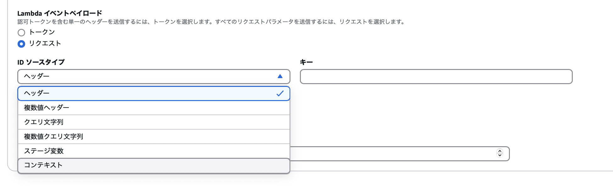
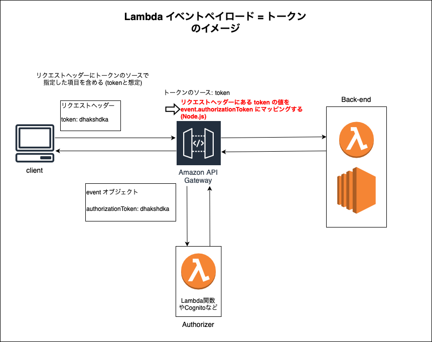
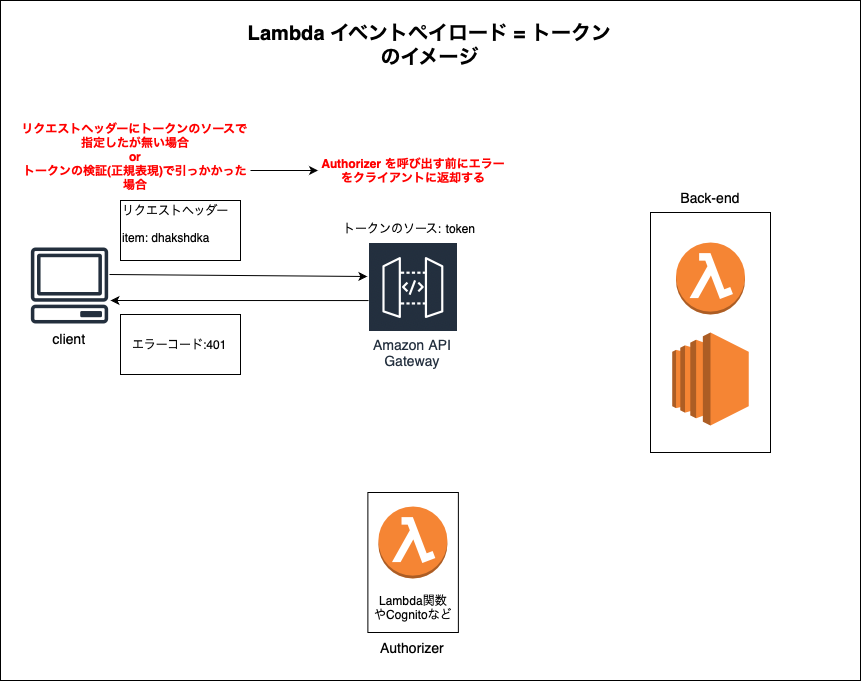
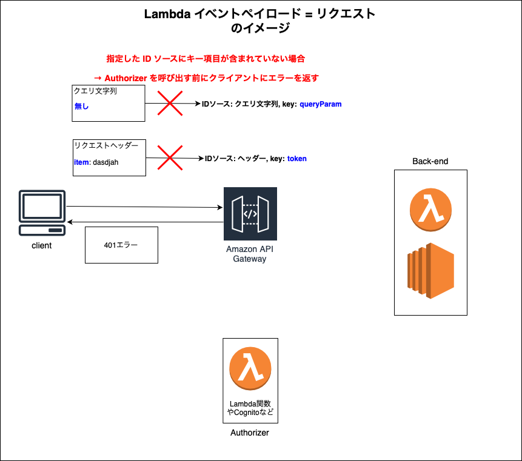

### Authorizer の作成

- Authorizerについては[こちら](./API_Gateway.md#autorizer-オーソライザー)を参照

#### 手順

1. マネージドコンソールにて API Gateway 画面に遷移

 

2. Authorizer を設定したい API を選択し、API 詳細画面のサイドメニューから `オーソライザー` を選択する

    

 

3. `オーソライザーの作成` をクリック

    

 

4. 各項目を設定し、 Authorizer を作成する

    - \*作成する Authorizer のタイプによって設定項目が異なることに注意

    ##### Authorizer の タイプが Lambda 関数の場合

    

     

    - オーソライザー名

        - 作成する当オーソライザーの名前

     

    - Lambda 関数

        - Authorizer (= 認証処理)として呼び出したい Lambda 関数とそのリージョンを指定する

     

    - Lambda 呼び出しロール

        - API Gateway に付与にする Lambda オーソライザー関数を呼び出すアクセス許可を指定 (オプショナル)

     

    - [Lambda イベントペイロード](#lambda-イベントペイロード)

        - API Gateway から Authorizer (= Lambda 関数) へのデータの渡し方を選択する

        - トークン

            - １ヘッダーのトークンで認証する場合はこちらを選択するといいらしい

            

             

            - トークンのソース

                - トークンの値が入っているヘッダーの項目名

                - この項目は Lambda 関数の event オブジェクトの authorizationToken にマッピングされる

                    - Lambda 関数 (Node.js) でトークンの値を取得する際は `event.authorizationToken` で取得できる

                - API Gateway へのリクエストのヘッダーに指定したトークンのソースが無い場合、Authorizer を呼び出さず、 API Gateway から 401 エラーが返される

             

            - トークンの検証

                - 認証用のLambda関数を呼び出す前に行うトークンの値のバリデーション (正規表現)

                - この検証に引っかかった場合、Authorizer を呼び出さず、 API Gateway から 401 エラーが返される

         

        - リクエスト

            - ヘッダー以外の項目、あるいは複数の値で認証する場合はこちらを選択するといいらしい

            

             

            - ID ソースタイプ

                - 認証用に参照するデータがどこに保存されているかを指定する項目

                    - ヘッダー

                        - Lambda 関数 (Node.js) にて `event.headers.key名` で取得可能

                     

                    - 複数値ヘッダー

                        - Lambda 関数 (Node.js) にて `event.multiValueHeaders.key名` で取得可能

                     

                    - クエリ文字列

                        - Lambda 関数 (Node.js) にて `event.queryStringParameters.key名` で取得可能

                     

                    - 複数値クエリ文字列

                        - Lambda 関数 (Node.js) にて `event.multiValueQueryStringParameters.key名` で取得可能

                     

                    - ステージ変数

                        - Lambda 関数 (Node.js) にて `stageVariables = event.stageVariables.key名` で取得可能
                    
                     

                    - コンテキスト

                        - Lambda 関数 (Node.js) にて `stageVariables = event.requestContext.key名` で取得可能

            - キー

                - 項目名

                - Lambda 関数では event オブジェクトの対応するプロパティに格納される

     

    - 認可のキャッシュ

        - トークンのソースもしくは ID ソースの値をキャッシュキーにし、同じ値が設定されたリクエストは、認証用の Lambda 関数 (オーソライザー) を呼び出す代わりに、キャッシュされたオーソライザーの結果を使用する

    - TTL

        - キャッシュの生存時間

     

    ##### Authorizer の タイプが AWS cognito の場合

    

     

    - オーソライザー名

        - 作成する当オーソライザーの名前
    
     

    - Cognito ユーザープール

        - 認証に使う Cognito のユーザープールを指定

     

    - トークンのソース

        - トークンの値が入っているヘッダーの項目名

     
    
    - トークンの検証

        - Cognito にトークンを渡す前に、API Gateway 側で行うトークンの値のバリデーション (正規表現)

 
 

Lambda イベントペイロードについて
- [Lambdaオーソライザーのトークンベースとリクエストパラメータベースの挙動を比べて、どちらを選択するべきか考えてみた](https://dev.classmethod.jp/articles/lambda-authorizer-toke-request/)
- [AWS APIGateway Custom Authorizer入門 ](https://future-architect.github.io/articles/20210610a/)
- [API Gateway Lambda オーソライザーへの入力](https://docs.aws.amazon.com/ja_jp/apigateway/latest/developerguide/api-gateway-lambda-authorizer-input.html)

認可のキャッシュについて
- [AWS Lambda オーソライザーを使用して HTTP API へのアクセスを制御する](https://docs.aws.amazon.com/ja_jp/apigateway/latest/developerguide/http-api-lambda-authorizer.html#http-api-lambda-authorizer.caching)
- [Amazon API Gateway Lambdaオーソライザーの認証キャッシュを有効化し挙動を確認してみた](https://dev.classmethod.jp/articles/api-gateway-lambda-authorizer-cache/)
- [API Gateway の Lambda オーソライザーキャッシュを使う時に問題となる実装を検証してみた](https://dev.classmethod.jp/articles/api-gateway-authorizor-cache-policy/)
- [AWS APIGateway Custom Authorizer入門 ](https://future-architect.github.io/articles/20210610a/#認可のキャッシュ)

---

### Authorizer　の設定

1. Authorizer を設定したいリソースとHTTPメソッドを選択し、メソッドリクエストの `編集` をクリックする

    - メソッドリクエストの設定にて、認可が NONE になっている = Authorizer が設定されていない

     

    

 

2. メソッドリクエストの設定にて、`認可` の項目に作成した Authorizer を指定し `保存` をクリック

    - 作成した Authortizer

    

     

    

    ↓

    

 

3. Authorizer を設定した API をデプロイする

    - Authorizer を設定したリソース + HTTP メソッドを確認

        - メソッドリクエストの設定の認可に指定した Authorizer 名が設定されていること

    - `API をデプロイ` をクリック

     

    

 

5. ステージを選択してデプロイした後、ちゃんと反映されているか確認

    - デプロイした API を選択し、サイドメニューの `ステージ` を選択

    - リソース & HTTP メソッドの `認可` に指定したAuthorizer の種類が設定されていることを確認 (今回はカスタム)

     

    

---

### Lambda イベントペイロード

- Authorizer に渡す認証情報をトークンベースにするかリクストベースにするかに関する設定項目

 

#### トークンベース

 

- 認証情報はリクエストヘッダーの項目に格納される

- 1つのヘッダー項目の値で認証する場合はこちらを選択する

- トークンのソースに指定した項目がリクエストヘッダーに含まれていない、もしくは、Authorizer作成の際に設定したトークンの検証の正規表現に引っかかった場合、 Authorizer を呼び出す前に API Gateway からエラーが返却される

 

#### リクエストベース

 

- 認証情報はリクエストヘッダーの項目、クエリ文字列、パスパラメータ、[ステージ変数](#ステージ変数とは)、[コンテキスト](#コンテキストとは)に含めることができる

- ヘッダー以外の項目、あるいは複数の値で認証する場合はこちらを選択するといいらしい

- トークンベースの認証と同様に、指定した ID ソースにキー項目が含まれていない場合 Authorizer を呼び出す前に API Gateway からエラーが返却される

 
 

参考サイト

[Lambdaオーソライザーのトークンベースとリクエストパラメータベースの挙動を比べて、どちらを選択するべきか考えてみた](https://dev.classmethod.jp/articles/lambda-authorizer-toke-request)

---

### ステージ変数とは

- API Gateway のステージごとに設定できる環境変数のこと

- ステージ変数に呼び出す Lambda 関数のエイリアスを設定することで、特定のステージの API を呼んだら特定のエイリアスの Lambda 関数を呼び出すことができるようになる

    

     

- リクエストベースの認証時にステージ変数の情報を参照できる

    - event.stageVariables.{ステージ変数名} にマッピングされる (Node.js)

 
 

参考サイト

[API Gatewayの耐障害性を考える](https://zenn.dev/tech4anyone/articles/167873880acc7e)

---

### コンテキストとは

- Lambda 関数が受け取るオブジェクトで、呼び出し、関数、および実行関数に関する情報を示すメソッドおよびプロパティが格納されたオブジェクト = コンテキスト(オブジェクト)と呼ぶ

 

- リクエストベースの認証を設定した場合は、eventオブジェクトにコンテキスト情報が含まれる

    - event.requestContext にマッピングされる (Node.js)

 
 

参考サイト

[ambda コンテキストオブジェクトを使用して Node.js 関数の情報を取得する](https://docs.aws.amazon.com/ja_jp/lambda/latest/dg/nodejs-context.html)