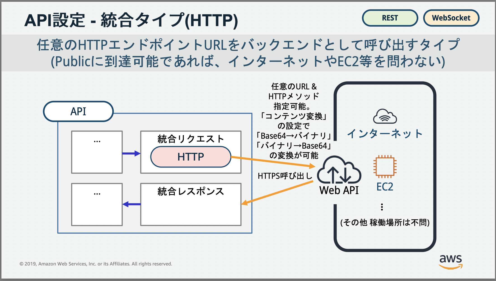
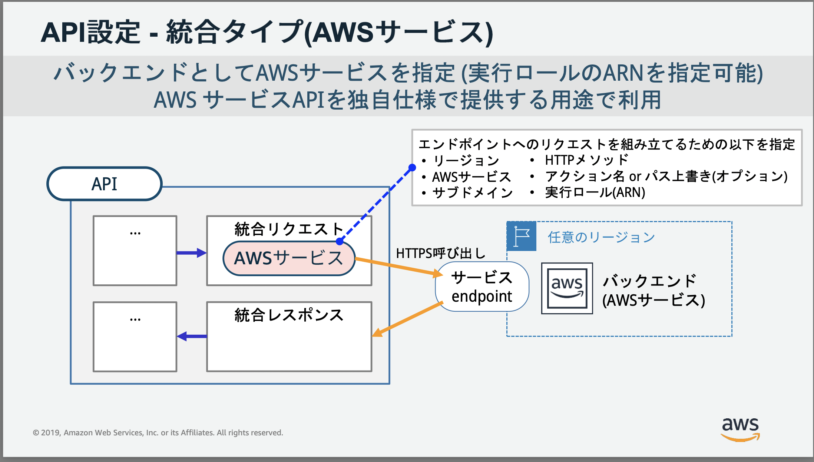

###  エンドポイントタイプ

- 作成 & デプロイする API を呼び出す方法に関する種類のこと

- 以下の3種類のエンドポイントタイプがある

    - エッジ最適化 (Edge-optimized)

        - アクセス元から最も近い CloudFront のエッジサーバーを経由して API Gateway にデプロイされている API にアクセスする

        

     

    - リージョン別

        - クライアントからリージョンの REST API に直接リクエストする

        

     

    - プライベート

        - インターネット経由でアクセスできず、 VPC内からしかアクセスできない
        
        

 
 

参考サイト

[API とは ? ~ Amazon API Gateway でできること ~](https://aws.amazon.com/jp/builders-flash/202004/awsgeek-api-gateway/)

---

### セキュリティ

- 悪意のあるユーザーやトラフィックの急増など、特定の脅威から API を保護する方法

#### 相互 TLS 認証

- クライアントとサーバーの双方向認証
    
    - ★通常の TLS 認証とはクライアントから見てサーバーが信頼していいサーバーかどうかを判断するための手段 (クライアント側も SSL 証明書を提示する)

    

    引用: [TLS相互認証（mTLS）とは、APIのmTLSを実装する](https://apidog.com/jp/blog/how-to-proceed-mtls-api/)

 

- 相互 TLS を利用するには以下のような条件がある

    - クライアント証明書を作成する必要がある

    - S3 にクライアント証明書をアップロードする必要がある

    - 相互 TLS を利用したい API にはカスタムドメイン名を設定する必要がある

 

#### バックエンド認証用の証明書

- API Gateway に SSL 証明書を置き、その接続先となるバックエンドに公開鍵を配置する認証方法

    - バックエンド側で送られてきたリクエストが　API Gatway からのものであることを確認する

    

 

#### AWS WAF

- AWS WAF (Web Application Firewall) を利用して API を守る機能

    

    引用: [AWS WAF ＋ API Gateway構成をカウントモードで構築し、ルールに該当するリクエストのログを取得してみた](https://dev.classmethod.jp/articles/output-requestlog-cloudwatch-aws-waf-api-gateway-count-mode/)

 
 

参考サイト

相互 TLS そのものについて
- [TLS相互認証（mTLS）とは、APIのmTLSを実装する](https://apidog.com/jp/blog/how-to-proceed-mtls-api/)

API Gateway での相互 TLS について
- [相互 TLS 認証でサーバーレス API にアクセスする方法 (AWS Private CA)](https://blog.serverworks.co.jp/api-gateway-mutual-tls-auth)

WAF の利用について
- [AWS WAF ＋ API Gateway構成をカウントモードで構築し、ルールに該当するリクエストのログを取得してみた](https://dev.classmethod.jp/articles/output-requestlog-cloudwatch-aws-waf-api-gateway-count-mode/)
- [CDN+WAF+SPAの基本をAWSで簡単に構築する無料日本語ハンズオンを受講しました](https://dev.classmethod.jp/articles/handson-for-beginners-cloudfront-waf/)

--- 

### 認証 (Authorizer)

- バックエンドへのアクセス制御

- バックエンドにリクエストを転送する前に、認証サーバーにリクエストを転送する

    - 認証結果に問題がなければバックエンドにリクエストを渡す

    - 認証結果に問題があればクライアントにエラーを返す

 

- 認証に利用できるサービスは以下のものがある

    - #### IAM

        - クライアントからのリクエストに必要な権限（execute-api:Invoke）をもった IAM 認証情報が含まれいるものだけ認証し、統合先にリクエストを転送する

            - 必要な権限 (ポリシー)　を持ったIAMユーザーを作成する必要がある
        
         

        - API Gateway から SDK を作成し、その SDK を利用することでリクエストに必要な IAM 認証情報を持ったリクエストの作成ができる

            - 詳しくは[こちら](https://dev.classmethod.jp/articles/api-gateway-iam-authentication-lambda/)を参照

         

        - もしくは IAM ユーザーのアクセスキーとシークレットアクセスキーをリクエストのヘッダーに含めることで Postman からでも必要な認証情報を含んだリクエストをすることができる

            - 詳しくは[こちら](https://qiita.com/ita-k/items/5d6e8ceaf3f0a970b594)を参照

     

    - #### リソースポリシー

        - リソースポリシー (≒ リソースベースのポリシー): アクセスされるリソースに対して、アクセス可能な条件を設定できる機能

        - API Gateway の対象の API にアクセスできる条件を設定したリソースポリシーを作成することで、API へアクセスできるリクエストを制御する方法

        - 詳しくは[こちら](https://dev.classmethod.jp/articles/api-gateway-resource-policy/)を参照

     

    - #### Lambda 関数

        - 自分で認証関数を Lambda で作成し、API へアクセスできるリクエストを制御する方法

        - 詳しくは[こちら](./API_Gateway_Authorizer.md)を参照

     

    - #### Amazon Cognito

        - Amazon Cognito という他の AWS の認証サービスを利用して API へアクセできるリクエストを制御する方法

---

### API 管理

#### カスタムドメイン

- 独自のドメイン名で API を公開することができる機能

 

#### API キー

- クライアントからの API 呼び出しを制限できる機能

    - 使用量プラン機能と一緒に利用する必要がある

    - API キーと使用量プランについては[こちら](./API_Gateway_APIキーと使用量プラン.md)を参照

 

#### クライアント毎のレート制限

- API Gateway が1秒間に処理できるリクエスト数の上限

    - 使用量プランとAPIキーを利用する必要がある

- 詳しくは[こちら](./API_Gateway_APIキーと使用量プラン.md)を参照

 

#### クライアント毎の使用量制限

- API Gateway が特定の期間 (1日 / 1週間 / 1ヶ月) 処理できるリクエスト数の上限

    - 使用量プランとAPIキーを利用する必要がある

- 詳しくは[こちら](./API_Gateway_APIキーと使用量プラン.md)を参照

---

### 開発

#### CORS

- API Gateway で作成する API の CORS を有効にすることができる機能

- 有効にすることで異なるオリジンから API Gateway にある API を呼び出すことができる

 

#### テスト呼び出し

- マネージドコンソール (AWS CLI、または API Gateway 用の AWS SDK ) から API のテスト呼び出しをすることができる機能

    

 

#### キャッシュ

- API へのレスポンスをキャッシュするこができる機能

- ★別途利用料金が発生する

 

#### ユーザー制御のデプロイ

- API 開発者の任意のタイミングでデプロイすることができる機能

- API を更新したからといって勝手にデプロイされない

 

#### 自動デプロイ

- API に対する変更がなされたとき、自動でデプロイされる機能

 

#### カスタムゲートウェイレスポンス (Custom Gateway Response)

- API レベルのエラーが発生した際、エラーレスポンスのカスタマイズができる機能

    - API キーが必要なエンドポイントに対して API キーを含めないでリクエストした場合、 `403` のエラーコードと `{"message":"Forbidden"}` のエラーメッセージが返ってくる

        → カスタムゲートウェイレスポンスを利用することで、エラーの内容を具体的なものにカスタマイズすることができる

- 詳しくは以下の記事などを参照

    - [API Gateway REST APIのデフォルトのゲートウェイレスポンスをカスタムする方法を試してみた [AWS CDK]](https://dev.classmethod.jp/articles/change-default-dateway-response-configuration-for-api-gateway-reat-api/)

    - [ゲートウェイレスポンスの注意点【API Gateway REST API】](https://zenn.dev/august/articles/67c76de854cb6d)

- API レベルのエラーについては[こちら](https://docs.aws.amazon.com/ja_jp/apigateway/latest/developerguide/supported-gateway-response-types.html)を参照

 

#### カナリアリリースデプロイ

- 新しバージョンの API を段階的にリリースするデプロイ方法

- 詳しくは[こちら](./API-Gateway-カナリアリリース.md)を参照

 

#### リクエストの検証

- バックエンドサービスにリクエストを転送する前に、クライアントからのリクエストをチェックすることができる機能

    - エンドポイントへのリクエストに必要なクエリ文字列、ヘッダー項目が含まれているかをチェックすることができる

    - リクエストのペイロードが想定した構造になっているかをチェックすることができる

 

#### リクエストパラメータ変換

- クライアントからのリクエストのパスパラメータ、クエリ文字列パラメータ、HTTP ヘッダー をバックエンドサービスの都合のいい形に変換(マッピング)することができる

- [マッピングテンプレート](https://docs.aws.amazon.com/ja_jp/apigateway/latest/developerguide/models-mappings.html)という機能を利用する必要がある

 

#### リクエスト本文変換

- リクエストパラメータ変換と同様に、クライアントからのリクエストのペイロードをバックエンドサービスの都合のいい形に変換(マッピング)することができる

- こちらも- [マッピングテンプレート](https://docs.aws.amazon.com/ja_jp/apigateway/latest/developerguide/models-mappings.html)という機能を利用する必要がある

---

### モニタリング

#### Amazon CouldWatch メトリクス

 

#### CouldWatch Logs へのアクセスログ

- アクセスログ: CloudWatchLogs に任意に作成したロググループを指定する。指定したロググループにアクセスログが送信される

- API へのアクセスログを CoudlWatch Logs に記録することができる

 

#### Amazon Data Firehose へのアクセスログ

- API へのアクセスログを Amazon Data Firehose に記録することができる

 

#### 実行ログ

- 実行ログ: 自動的に作成されるロググループに送信される

- API の実行ログを CoudlWatch Logs に記録することができる

 

#### AWS X-Ray トレース

- AWS X-Ray というサービスと連携して、API へのリクエストの流れを追跡したり、各ポイント(API Gateway, バックエンドサービスなど)でどのくらい時間がかかっているかなどを記録する機能

- 追跡結果は AWS X-Ray で確認可能

---

### 統合

- API Gateway から呼び出すバックエンドのこと

 

#### パブリック HTTP エンドポイント

- 任意のHTTPエンドポイント

    

    引用: [\[AWS Black Belt Online Seminar\] Amazon API Gateway](https://d1.awsstatic.com/webinars/jp/pdf/services/20190514_AWS-Blackbelt_APIGateway.pdf)

 

#### AWS サービス

- 他の AWS サービス

    

    引用: [\[AWS Black Belt Online Seminar\] Amazon API Gateway](https://d1.awsstatic.com/webinars/jp/pdf/services/20190514_AWS-Blackbelt_APIGateway.pdf)

 

#### Network Load Balancer とのプライベート統合

- プライベート統合: VPC内のリソースをバックエンドとしてリクエストを処理するようにできる機能

- VPC 内にある HTTP/HTTPS リソースに Network Load Balancer を経由してリクエストを送信する

    

    引用: [[レポート]サーバーレスアプリ用のロードバランサーの選択方法 #reinvent #NET301](https://dev.classmethod.jp/articles/choosing-the-right-load-balancer-for-serverless-applications-net301-in-reinvent2020/)

     

- API Gateway と Network Load Balancer を接続するために使用する VPC リンクを作成する必要がある

 

#### Application Load Balancer とのプライベート統合

- VPC 内にある HTTP/HTTPS リソースに Application Load Balancer を経由してリクエストを送信する

    

    引用: [[レポート]サーバーレスアプリ用のロードバランサーの選択方法 #reinvent #NET301](https://dev.classmethod.jp/articles/choosing-the-right-load-balancer-for-serverless-applications-net301-in-reinvent2020/)

     

- API Gateway と Application Load Balancer を接続するために使用する VPC リンクを作成する必要がある

 

#### AWS Cloud Map とのプライベート統合

- VPC 内にある HTTP/HTTPS リソースに Cloud Map を経由してリクエストを送信する

    

    引用: [Configuring private integrations with Amazon API Gateway HTTP APIs](https://aws.amazon.com/jp/blogs/compute/configuring-private-integrations-with-amazon-api-gateway-http-apis/)

- API Gateway と Cloud Map を接続するために使用する VPC リンクを作成する必要がある

 

#### Mock 統合

- API Gateway から直接 API レスポンス (モック) を返す機能

    

    引用: [\[AWS Black Belt Online Seminar\] Amazon API Gateway](https://d1.awsstatic.com/webinars/jp/pdf/services/20190514_AWS-Blackbelt_APIGateway.pdf)

---

### 基本的な機能一覧

上記で記載した機能一覧が[こちら](https://docs.aws.amazon.com/ja_jp/apigateway/latest/developerguide/http-api-vs-rest.html)を参照したもの　