### ステージの作成

- ステージの作成方法はいくつかある

 

#### API をデプロイする際にステージも作成する方法

1. デプロイ & ステージを作成したい API を選択し、サイドメニューの `リソース` を選択

    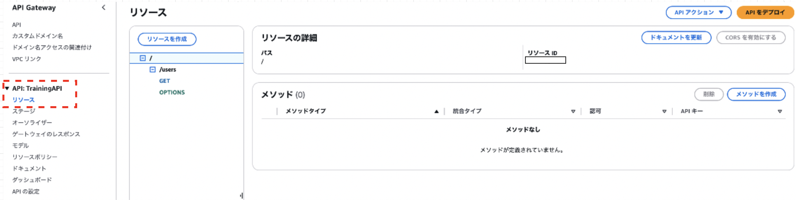

 

2. `API を`デプロイ` をクリックする

    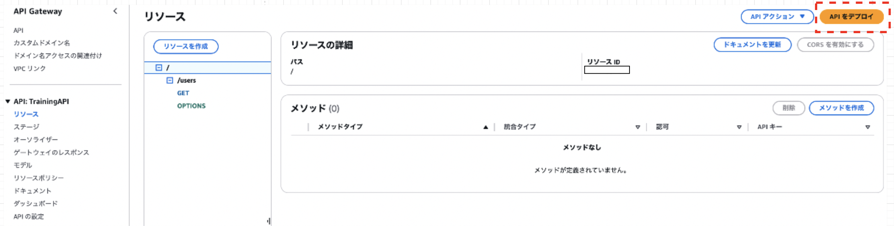

 

3. API のデプロイ先となるステージを選択

    - 新しいステージを選択すると、API のデプロイの際にステージも作成する

    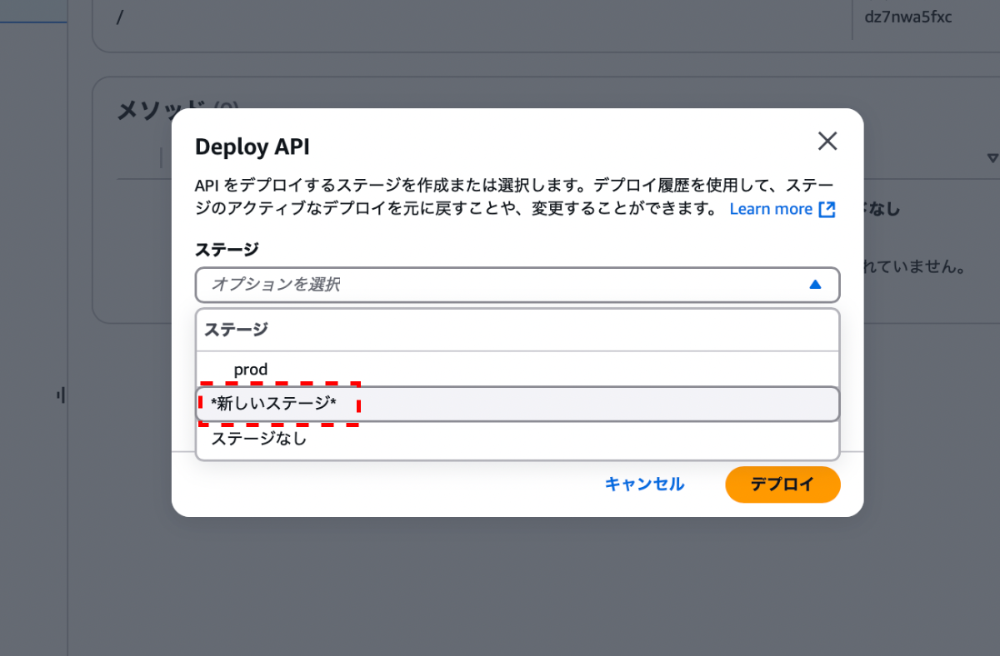

 

#### ステージ単体を作成する方法

1. ステージを作成したい API を選択し、サイドメニューの `ステージ` を選択する

    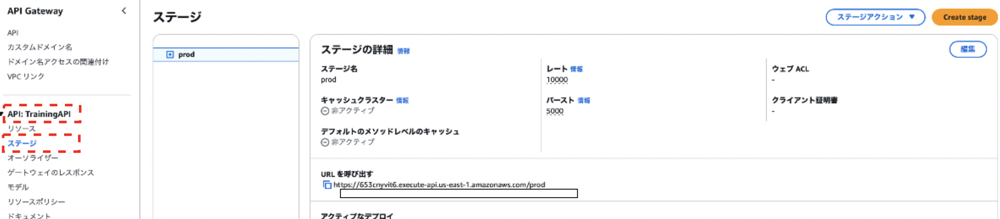

 

2. `Create stage` をクリックする

    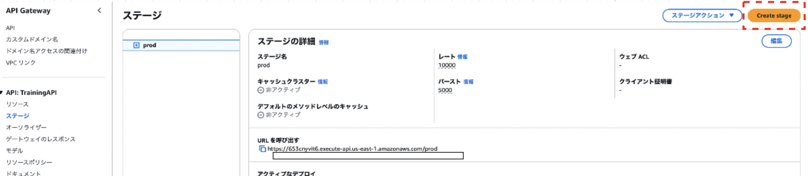

 

3. 作成するステージに関する項目を設定する

    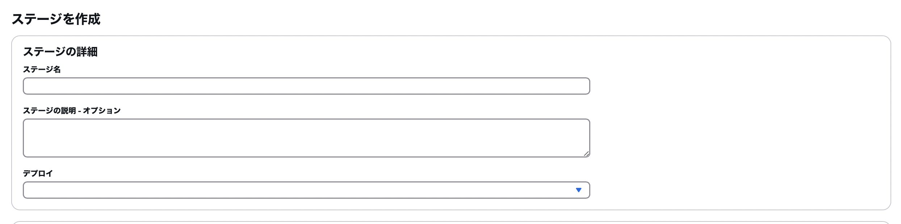

    - ステージの詳細

        - `ステージ名`

        - `ステージの説明`

        - `デプロイ`

            - 過去のデプロイ履歴からデプロイ内容をコピーすることができる

            - ステージ単体の作成の場合、デプロイ内容は過去の履歴を元に作成する

     

    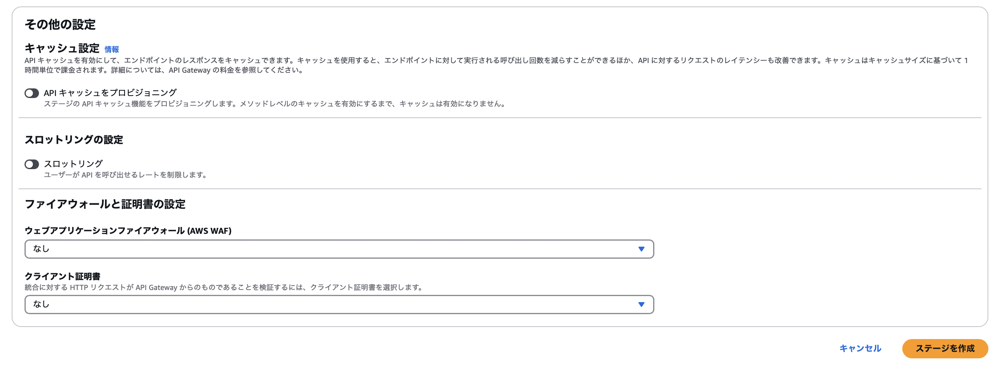

     

    - キャッシュ設定

        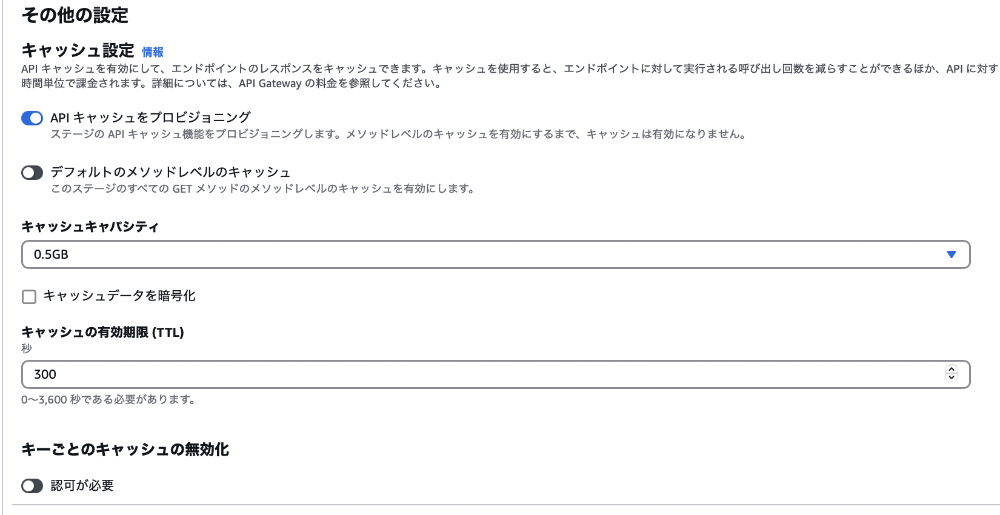

        - `API キャッシュをプロビジョニング`

            - 対象ステージに対して、キャッシュ用のストレージを割り当てる設定項目

            - ★★★キャッシュをプロビジョニング(キャッシュ用のストレージを確保)すると、追加料金が発生することに注意

            - プロビジョニングには最長で4分ぐらいかかるらしい

            - キャッシュのプロビジョニング後に容量を変更することも可能
            
                - しかし、既存のキャッシュストレージを削除し、新しいキャッシュストレージを作成するので、既存のキャッシュデータは削除されることに注意

             

            - `デフォルトのメソッドレベルのキャッシュ`

                - ステージ全体に対してキャッシュを有効にする設定

                    - 有効にするとデフォルトではそのステージの全ての GET メソッドのみでキャッシュが有効になる

             

            - `キャッシュキャパシティ`

                - 割り当てるキャッシュストレージ容量

                - 容量によってキャッシュの使用料金が変わってくる

             

            - `キャッシュデータを暗号化`

                - データを暗号化してキャッシュする設定項目

                - 暗号化を有効にすると、データサイズが大きくなる可能性がある

             

            - `キャッシュの有効期限 (TTL)`

                - キャッシュの保持期間

             

            - キーごとのキャッシュの無効化

                - API Gateway のキャッシュが有効化されてるステージの API へのリクエストのヘッダーに `Cache-Control: max-age=0` が付与されていると、キャッシュが有効化されているにも関わらずキャッシュではなく、バックエンドにデータを取りに行く

                - 当項目は上記のようなリクエストに対する設定項目

                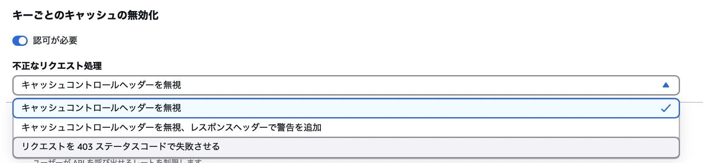

                - `認可が必要`

                    - チェックした (=有効にした) 場合

                        → 認可されたリクエストのみ上記のようなキャッシュクリアのリクエストを受け付ける

                        - 認可されたリクエストとは、`execute-api:InvalidateCache` という Action を許可するポリシーがアタッチされたユーザーを作成し、そのユーザーの`アクセスキー ID` と`シークレットアクセスキー`を リクエストヘッダーに含めたリクエストのこと

                    - チェックしない場合
                    
                        → どのようなリクエストでもキャッシュクリアのリクエストを受け付ける

                 

                - `不正なリクエストの処理`

                    - 認可されていないキャッシュクリア (ヘッダーに `Cache-Control: max-age=0` が付与された) リクエストを受け取った場合の対応を設定する項目

                    - `キャッシュコントロールヘッダーを無視する`

                        - 指定されたパスへのレスポンスのキャッシュをクリアしない

                        - そのほかのリクエストと同様に、キャッシュにあればキャッシュからデータを取得してクライアントに返送する

                     

                    - `キャッシュコントロールヘッダーを無視し、レスポンスに警告を追加する`

                        - 「キャッシュコントロールヘッダーを無視する」 + レスポンスヘッダーに `warning` という項目で警告を追加する

                     

                    - `403ステータスコードでリクエストに失敗する`

                        - キャッシュすら見に行かず、403 エラーを返す

     

    - スロットリングの設定

        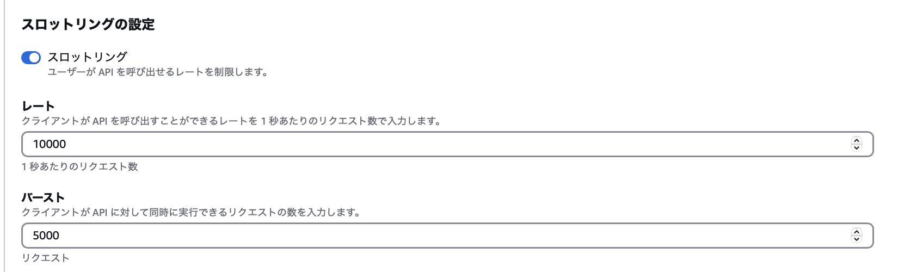

        - スロットリング

            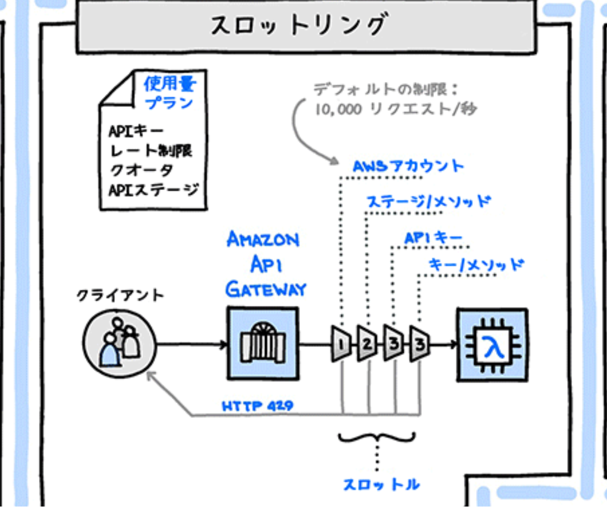

            引用: [外部から AWS のバックエンドサービス利用を実現する仕組みをグラレコで解説](https://aws.amazon.com/jp/builders-flash/202004/awsgeek-api-gateway/)

             

            - ユーザーが API を呼び出せるレートを制限するか否かを設定する項目

            - スロットリングはあくまでもベストエフォートで適用される

            - `レート`

                - クライアントが API を呼び出すことができるレートを 、1 秒あたりのリクエスト数で設定する

                - 対象ステージの全てのメソッドの合計呼び出し回数に対する制限

             

            - `バースト`

                - リクエスト数が設定したレートを超えても直ちにスロットリングエラーを返すのではなく、一時的に貯めておいたバッファを消費してリクエストを処理する (= バースト)

                - [EC2 のバースト](./EC2_バースト可能クラス.md)と同じ感じ

                - ここで設定するのは対象ステージの全てのメソッドの呼び出しに対して適用されるバースト値

     

    - ファイヤーウォールと証明書の設定

        - `ウェブアプリケーションファイヤーウォール (WAF)`

            - 利用する [WAF](./WAF.md) を指定

            - WAF: 不正なリクエストや攻撃からAPIを守るためのルールを設定できるサービスらしい
        
         

        - `クライアント証明書`

            - API Gateway から統合先への統合リクエストにクライアント証明書を付与する

            - これによって、API の統合先が API Gateway からのリクエストのみを受け入れるように設定できる

 

4. 項目の設定が完了したら `ステージを作成` をクリックする

    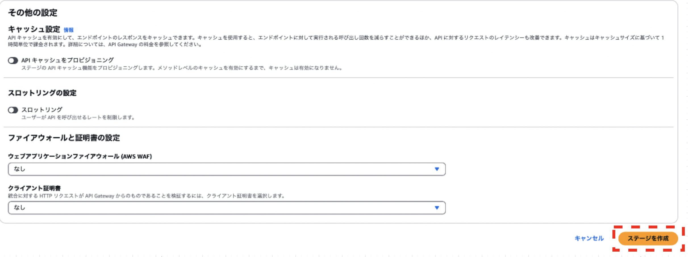

 
 

参考サイト

キャッシュの有効化について
- [API Gateway での REST API のキャッシュ設定](https://docs.aws.amazon.com/ja_jp/apigateway/latest/developerguide/api-gateway-caching.html)
- [【AWS】APIGatewayにキャッシュを設定する際にハマったこと](https://qiita.com/thim/items/abc3e42a3a993546ba7c)
- [API Gateway - API キャッシュを有効にして応答性を強化する](https://qiita.com/leomaro7/items/c13c5cee168ed56ccc38)

キーごとのキャッシュの無効化について
- [Amazon API Gateway の「キーごとのキャッシュの無効化」機能を使って特定リソースパスのみキャッシュ更新をしてみた](https://dev.classmethod.jp/articles/api-gateway-invalidatecache-key/)
- [【図解】API Gatewayの仕組みや特徴、設定項目を分かりやすく解説](https://konishi-tech.com/api-gateway/#setting3)
- [API Gateway のキャッシュエントリの無効化 ~ API Gateway のキャッシュエントリの無効化](https://docs.aws.amazon.com/ja_jp/apigateway/latest/developerguide/api-gateway-caching.html#invalidate-method-caching)

認可されたリクエストについて
- [Amazon API Gateway の「キーごとのキャッシュの無効化」機能を使って特定リソースパスのみキャッシュ更新をしてみた](https://dev.classmethod.jp/articles/api-gateway-invalidatecache-key/)
- [関数化しIAM認証をかけたLambda関数をPostmanから呼び出してみる](https://qiita.com/enumura1/items/be93d3c8fe282fbf48e0)

スロットリングの設定について
- [API Gateway で REST API のステージをセットアップする ~ ステージ設定の変更](https://docs.aws.amazon.com/ja_jp/apigateway/latest/developerguide/set-up-stages.html#how-to-stage-settings)
- [Amazon API Gatewayのスロットリングについて調査してみた](https://dev.classmethod.jp/articles/apigateway-throttling-test/)
- [API Gatewayのスロットリング設定とスロットリング時の通知設定を行う](https://poota.net/archives/375)

バーストについて
- [2022/9 API Gatewayでクラウド破産しない](https://www.cview.co.jp/cvcblog/2022.09.28.0yhjkgycqopilr55wbavo)

---

### ステージアクション

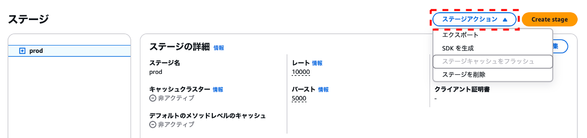

 

#### エクスポート

- API の定義をエクスポートすることができる

    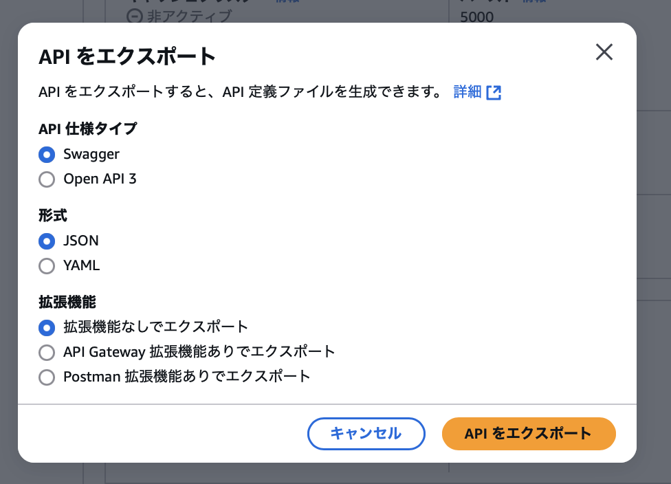

 

#### SDK を生成

- クライアントプログラムから対象ステージの API へのリクエスト機能などを持つ SDK (プログラム) を生成 & ダウンロードすることができる

    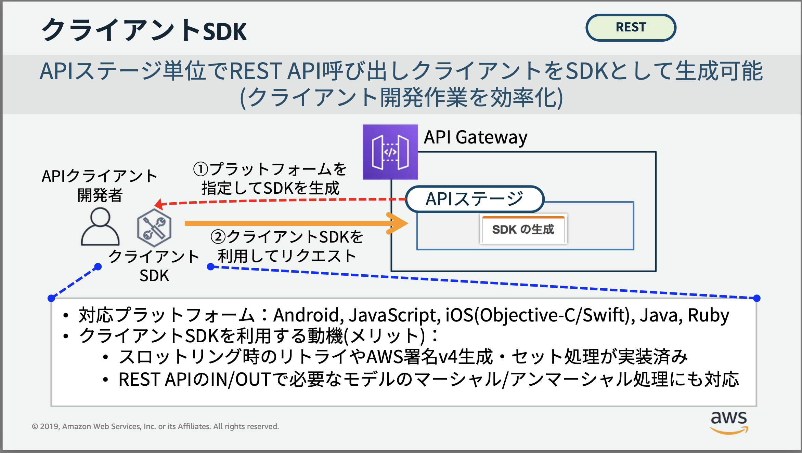

    引用: [\[AWS Black Belt Online Seminar\] Amazon API Gateway](https://d1.awsstatic.com/webinars/jp/pdf/services/20190514_AWS-Blackbelt_APIGateway_rev.pdf)

 
 

参考サイト

[API Gateway を Swagger 形式（API Gateway 拡張機能あり）でエクスポートする方法を教えてください](https://dev.classmethod.jp/articles/tsnote-api-gateway-export-of-swagger/)

[\[AWS Black Belt Online Seminar\] Amazon API Gateway](https://d1.awsstatic.com/webinars/jp/pdf/services/20190514_AWS-Blackbelt_APIGateway_rev.pdf)

---

### ログとトレース

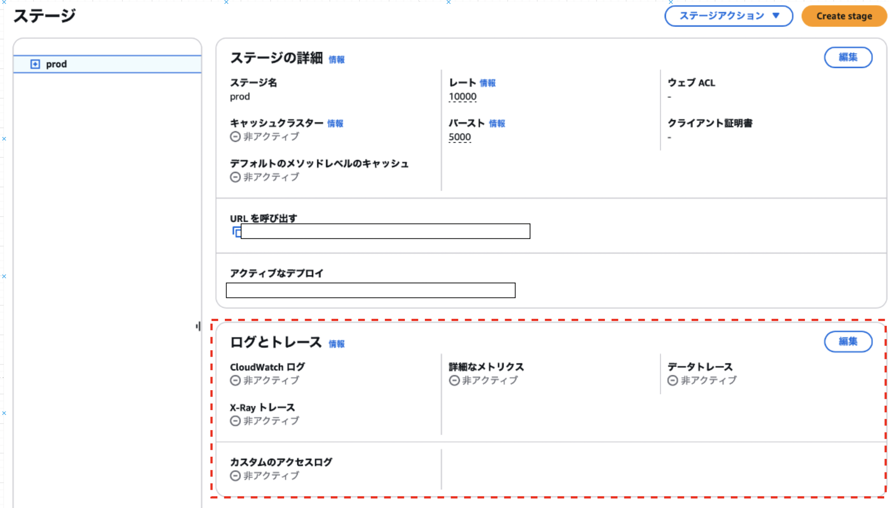

 

- ログ: API Gateway へのアクセスログ、エラーログ、リクエスト、レスポンス情報などを CloudWatchLogs に送信する機能

- トレース

 

#### 設定項目

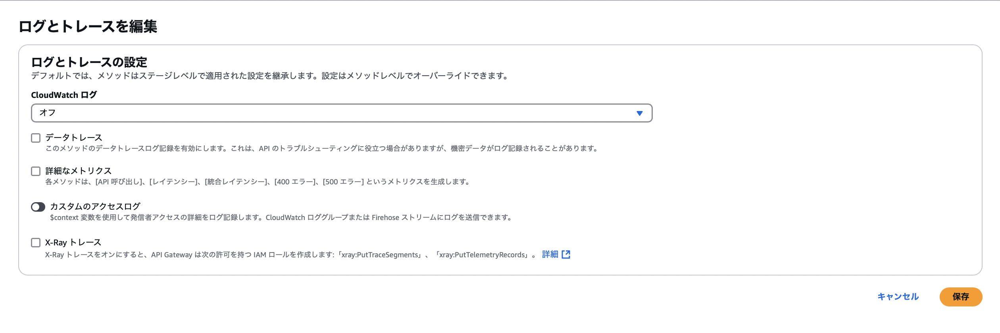

- `CloudWatch ログ`

    - CloudWatchLogs に送信するログの種類を指定

    - 実行ログ = 自動的に作成されるロググループに送信される

    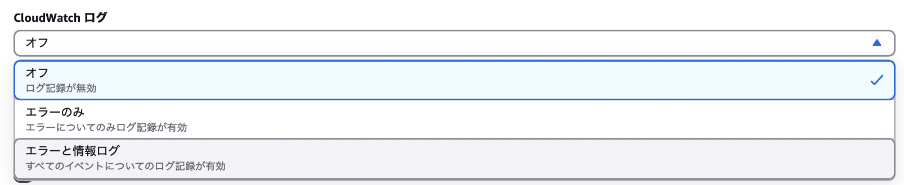

    - `オフ`

        - ログを出力しない

     

    - `エラー`

        - エラーログのみ送信

     

    - エラー情報とログ

        - 実行ログ(リクエストやレスポンス内の情報は送信されない) とエラーログを出力

 

- `データトレース`

    - リクエストやレスポンスのパラメータ値やペイロードなどを含むトレースログというものを  CloudWatchLogs に送信する

    - 本番環境では有効にしない方がいい

 

- `詳細なメトリクス`

    - API Gateway に関するメトリクス (API呼び出し、レイテンシーなど) CloudWatch で利用可能になる

 

- カスタムのアクセスログ

    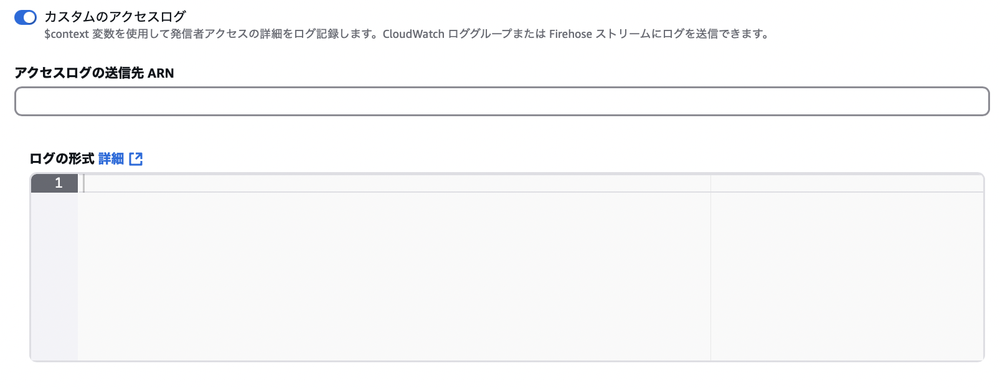

    - アクセスログ = CloudWatchLogs に任意に作成したロググループを指定する。指定したロググループにログが送信される

    - 自分の見たい情報をログとして CloudWatchLogs に送信することができる

     

    - `アクセスログの送信先 ARN`

        - 送信先のロググループの ARN

     

    - `ログの形式`

        - 出力したいログの形式やデータ項目を指定する

        - context 情報が取得できる

 

- `X-Ray トレース`

    - アプリケーションが処理するデータを収集するサービスである AWS X-Ray を利用して、API Gateway の利用状況のデータを収集&モニタリングする機能

    - (X-Ray のサービスマップを使うことで) エンドポイント毎のレスポンスにおけるエラーの割合や、レスポンスを送信するまでにかかった時間などを視覚的に表示してくれる

 

#### CloudWatchLogs と X-Ray トレースの違い

- CloudWatchLogs: **ログの収集 & 異常の検知のためのサービス**

- X-Ray: 各サービスコンポーネントでどの処理にどれぐらい時間が掛かっているのかのデータを収集&視覚的にわかりやすく表示する機能だったり、サービス間の連携も表示してくれるので、**サービス全体のパフォーマンスの分析などに役立つサービス**

    

    引用: [AWS X-Ray とは](https://qiita.com/miyuki_samitani/items/ba9330f621a3e9f50fb5)

 
 

参考サイト

ログとトレースについて
- [【AWS】よくあるサーバレス構成のログ出力先設定とログ内容を確認](https://qiita.com/kaburagi_/items/3497be40455288d9d9fc#4api-gateway)
- [APIGWのログ取得 (実行ログ•アクセスログ) を有効化 / 無効化する方法](https://iret.media/108790)
- [API Gateway のログを Cloudwatch ログで確認する方法]()https://tech-note-meeting.com/2021/07/24/post-1103/
- [API Gateway で REST API の CloudWatch ログ記録を設定する](https://docs.aws.amazon.com/ja_jp/apigateway/latest/developerguide/set-up-logging.html)
- [【AWS】API Gatewayのログ設定方法](https://qiita.com/nyanp_p/items/c1f3a1b3e23fff97897a)

AWS X-Ray について
- [AWSでアプリケーションの可観測性を高めよう！CloudWatch LogsとX-Rayの活用法](https://envader.plus/article/499)
- [API GatewayがX-Rayをサポートしたのでやってみる](https://qiita.com/hayao_k/items/e9ed5aefe3eb8ad42108#トレースの有効化)

---

### その他の項目

#### ステージ変数

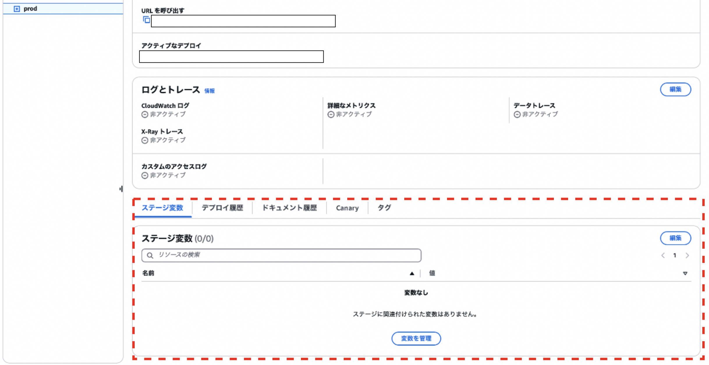

- ステージ毎に固有の環境変数のようなもの

 

#### デプロイ履歴

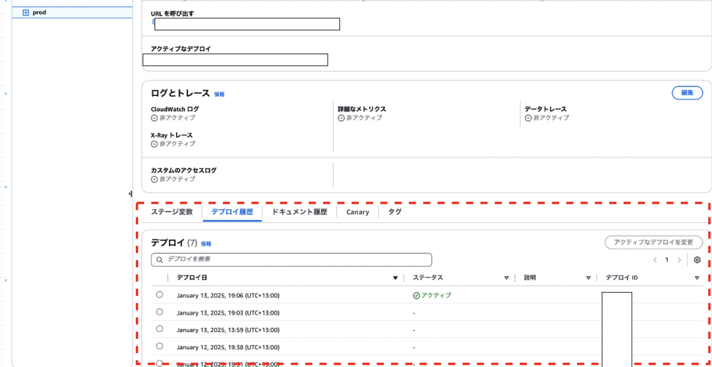

- 選択しているステージへの API のデプロイ履歴

 

#### ドキュメント履歴

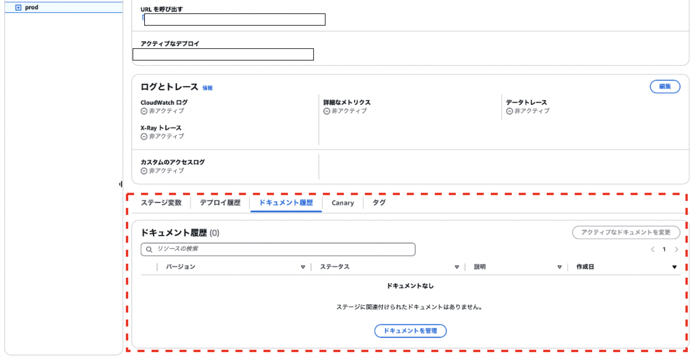

- 対象のステージにて公開された API の仕様書 (≒ ドキュメント) の履歴

 

#### canary

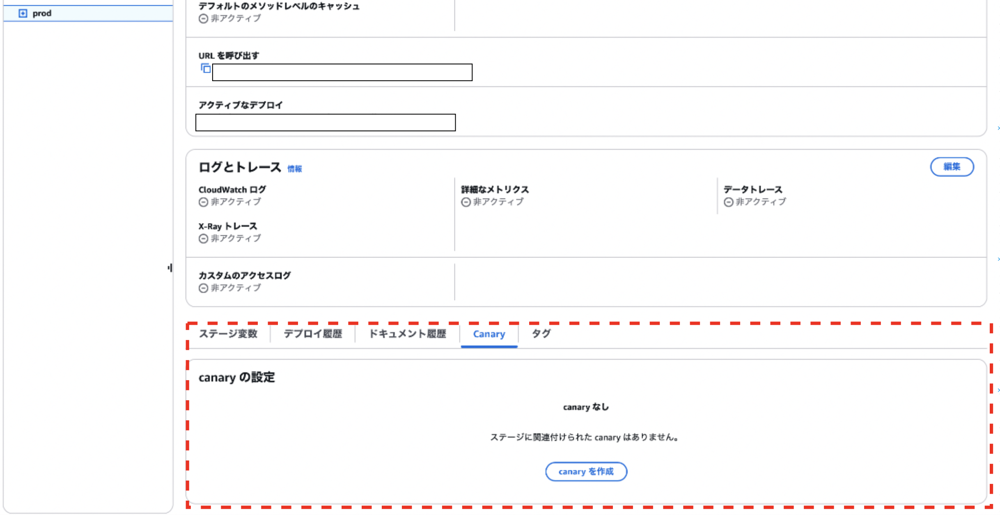

- カナリアリリース (アクセスのうち \~% は新しい API にアクセスさせ、残り \~% は既存の API にアクセスを振り分けるリリース方法) に関するに関するタブ

- 対象のステージに関連づけられたカナリアリリースデプロイの一覧 & 管理

 

#### タグ

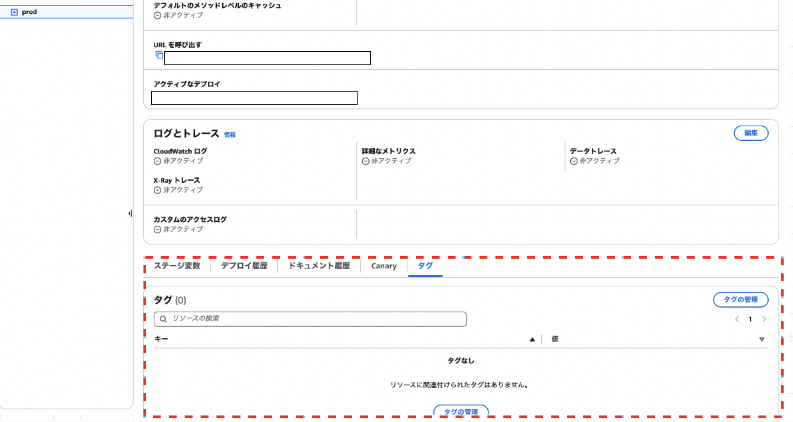

- 対象のステージに付けられているタグの一覧 & 管理
