### CDK とは

- Cloud Development Kit の略

<br>

- ざっくり説明すると、「プログラミング言語で AWS リソースを定義したファイルを CloudFormation のテンプレートに変換 & CloudFormation にデプロイできるツール」

    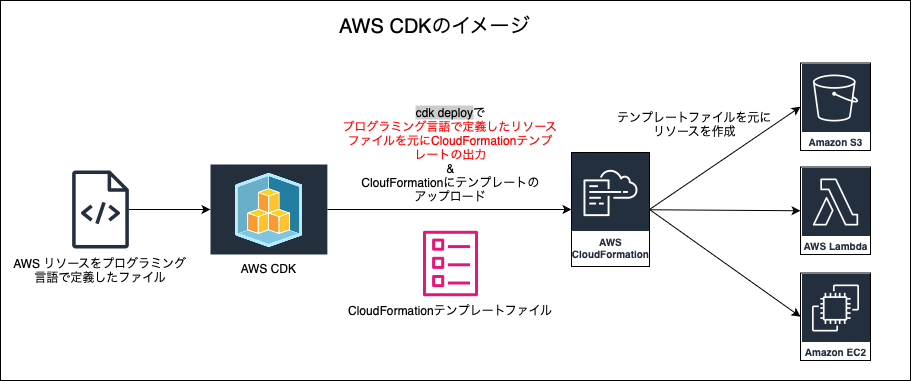

<br>

- CDK がサポートしている言語は以下の通り (2025/07)

    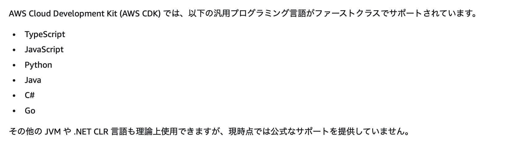

    引用: [AWS CDK でサポートされているプログラミング言語](https://docs.aws.amazon.com/ja_jp/cdk/v2/guide/languages.html)

<br>

#### CDK のメリット

- 自分にとって使いやすいプログラミング言語でリソースの定義ができるので、YAML や JSON で定義するよりも早く正確にリソース定義ができる 等

<br>
<br>

参考サイト

[もっとじっくり AWS CDK のコンセプト 第1回 AWS CDK とは：アプリの開発キット](https://www.ogis-ri.co.jp/otc/hiroba/technical/cdk-concepts/part1.html)

[【初心者向け】AWS CDK 入門！完全ガイド](https://zenn.dev/issy/articles/zenn-cdk-overview)

[使い慣れたプログラミング言語でクラウド環境を構築 ! AWS CDK をグラレコで解説](https://aws.amazon.com/jp/builders-flash/202309/awsgeek-aws-cdk/)

---

### CDK の中身

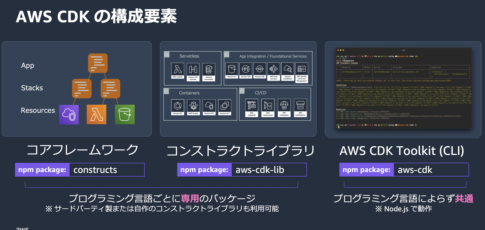

<br>

- CDK は主に以下の3つの要素から構成されている

    - #### AWS CDK Toolkit

        - 実態は `aws-cdk` パッケージ

        - ざっくり説明すると CDK の CLI 部分

        - `cdk diff` や `cdk deploy` は AWS CDK Toolkit が提供している機能
    
    <br>

    - #### AWS Construct Library

        - 実態は `aws-cdk-lib` パッケージ

        - プログラミング言語で AWS リソースを定義するためのライブラリ

            
        
    <br>

    - #### Core Framework

        - 実態は `constructs` パッケージ

        - コンストラクトライブラリで作成されたリソースを[スタック](#スタック)としてまとめ上げ、さらに[アプリケーション](#アプリケーション)として1つにまとめたりする仕組みを指す

            

    <br>

    

<br>
<br>

参考サイト

[もっとじっくり AWS CDK のコンセプト 第1回 AWS CDK とは：アプリの開発キット](https://www.ogis-ri.co.jp/otc/hiroba/technical/cdk-concepts/part1.html)

---

### CDK に登場する概念

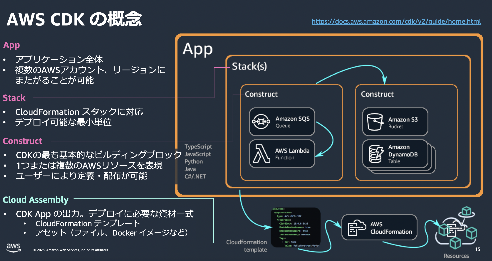

引用: [AWS Black Belt Online Seminar AWS Cloud Development Kit (CDK) Basic #1](https://pages.awscloud.com/rs/112-TZM-766/images/AWS-Black-Belt_2023_AWS-CDK-Basic-1-Overview_0731_v1.pdf)

<br>

- #### コンストラクト

    - 1つ以上の AWS リソースから構成されるコンテナのみたいなもの

    - 具体的には [コンストラクトライブラリ](#aws-construct-library) で提供されている機能から作成する

<br>

- #### スタック

    - [CloudFormation での Stack](https://github.com/MasaGt/aws/blob/main/CloudFormation.md#スタック) に相当

    - 1つ以上のコンストラクトから構成されるコンテナみたいなもの

<br>

- #### アプリケーション

    - 1つ以上のスタックから構成されるコンテナみたいなもの

    - CDK プロジェクト全体のルート = アプリケーション

        - `cdk synth`, `cdk deploy` などのコマンドのエントリーポイント
<br>

#### ポイント

- 上記3つの概念はツリー構造の関係にある

    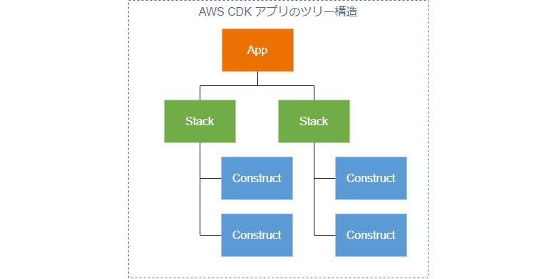

    引用: [もっとじっくり AWS CDK のコンセプト 第1回 AWS CDK とは：アプリの開発キット](https://www.ogis-ri.co.jp/otc/hiroba/technical/cdk-concepts/part1.html)

    <br>

    

    <br>

- ★実は App (アプリケーション) もスタックもコンストラクトを継承したクラスであり、上記の 「AWS CDK アプリのツリー構造」は**コンストラクトのツリー構造**とも理解することができる

    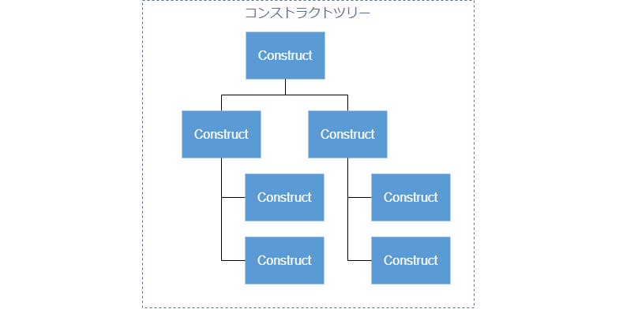

    引用: [もっとじっくり AWS CDK のコンセプト 第1回 AWS CDK とは：アプリの開発キット](https://www.ogis-ri.co.jp/otc/hiroba/technical/cdk-concepts/part1.html)
 
<br>

#### レベルの違うコンストラクト

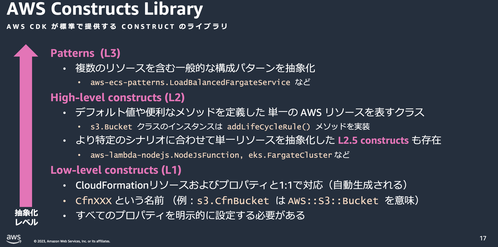

引用: [AWS Black Belt Online Seminar AWS Cloud Development Kit (CDK) Basic #1](https://pages.awscloud.com/rs/112-TZM-766/images/AWS-Black-Belt_2023_AWS-CDK-Basic-1-Overview_0731_v1.pdf)

<br>

- ##### Low Level (L1)

    - L1 コンストラクトは CloudFormation テンプレートでリソースを定義するような書き方が特徴

        - 別名として CloudFormation リソースコンストラクトとも呼ばれる

            
    
    <br>

    - ★L1 コンストラクトのクラスは `Cfn~~~` といったように、クラス名の頭に `Cfn` がついている

        - L1 コンストラクトクラスは [CfnResource](https://docs.aws.amazon.com/cdk/api/v2/docs/aws-cdk-lib.CfnResource.html) というクラスを継承している

            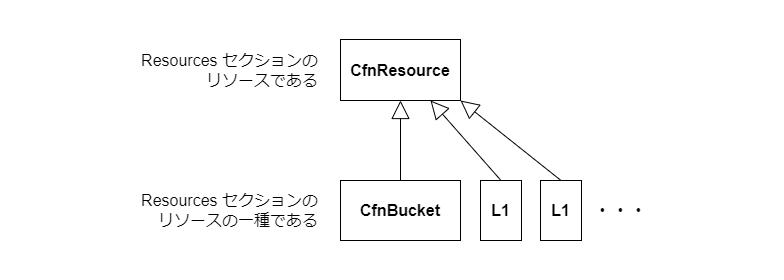

            引用: [もっとじっくり AWS CDK のコンセプト 第2回 L1 コンストラクトとテンプレート生成](https://www.ogis-ri.co.jp/otc/hiroba/technical/cdk-concepts/part2.html)

<br>

- ##### High Level (L2)

    - L1 よりも抽象化され、簡潔にリソースを定義できるのが特徴

        

    <br>

    - L2 コンストラクトクラスは [Resource](https://docs.aws.amazon.com/cdk/api/v2/docs/aws-cdk-lib.Resource.html) というクラスを継承している

        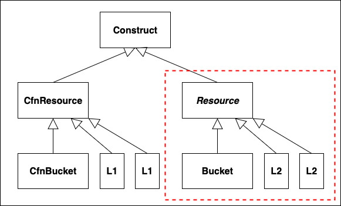

        引用: [もっとじっくり AWS CDK のコンセプト 第2回 L1 コンストラクトとテンプレート生成](https://www.ogis-ri.co.jp/otc/hiroba/technical/cdk-concepts/part2.html)

<br>

- ##### Patterns (L3)

    - L1, L2 コンストラクトを組み合わて作成する、より高レベルなコンストラクト

        - CDK (aws-cdk-lib) が提供している L3 コンストラクトもあれば、自分で L1, L2 コンストラクトを組み合わせて独自の L3 コンストラクトを定義することもできる

            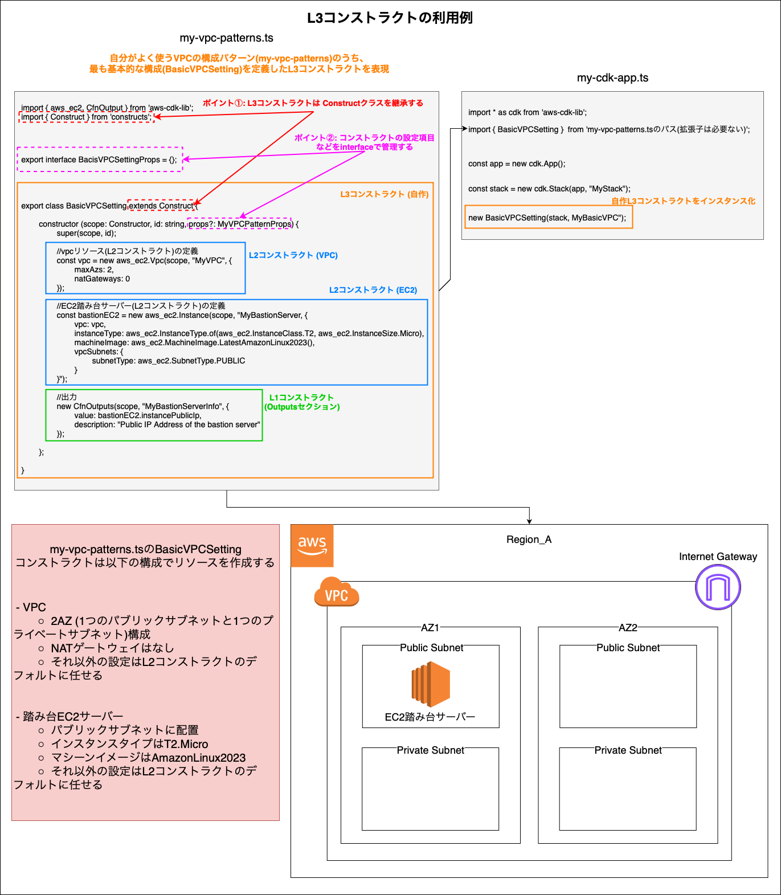

    <br>

    - L3 コンストラクトモジュール名の末尾には patterns をつけるのが通例

        - L3 コンストラクトモジュール内のクラス (= L3コンストラクト) には、ぱっと見でどのようなものができるのかわかりやす名前を付けると良い

            

            引用: [AWS CDK 2.208.0](https://docs.aws.amazon.com/cdk/api/v2/docs/aws-cdk-lib.aws_ecs_patterns-readme.html)

    <br>

    - ★L1, L2 コンストラクトにはそれぞれ共通の親クラス CfnResource, Resource があるが、L3 コンストラクトには無く、Construct クラスを継承していれば十分だそう

        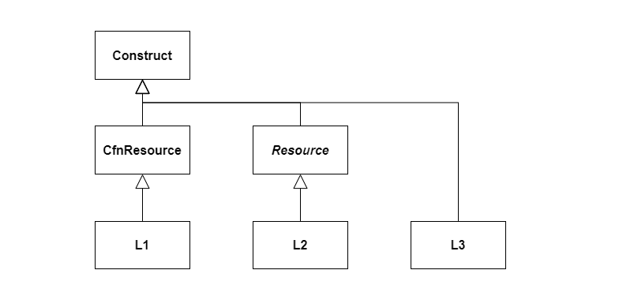

        引用: [もっとじっくり AWS CDK のコンセプト 第4回 L3 コンストラクトの境界](https://www.ogis-ri.co.jp/otc/hiroba/technical/cdk-concepts/part4.html)

<br>

#### L2 と L1 コンストラクトの比較

- 2つとも AWS リソースを表すクラスであり、Construct クラスを継承しているのは同じ

    

    引用: [もっとじっくり AWS CDK のコンセプト 第3回 L2 コンストラクトの基本](https://www.ogis-ri.co.jp/otc/hiroba/technical/cdk-concepts/part3.html)

<br>

- L1 コンストラクトは CloufFormation のテンプレートでリソースを定義するのとほとんど変わらない = リソースの細かい設定までしなければならないことが多い

<br>

- L2 コンストラクトは多くの設定項目についてデフォルト値が定義済みであり、より簡潔に書くことができる = 適当に書いてると意図しない設定でリソースが作成されてしまう可能性があることに注意

    - L2 コンストラクトでもリソースの細かい設定は可能

<br>
<br>

参考サイト

[AWS Black Belt Online Seminar AWS Cloud Development Kit (CDK) Basic #1](https://pages.awscloud.com/rs/112-TZM-766/images/AWS-Black-Belt_2023_AWS-CDK-Basic-1-Overview_0731_v1.pdf)

[AWSのCDKに入門してみた](https://qiita.com/matsunao722/items/f18114c37f1667d171c4)

[もっとじっくり AWS CDK のコンセプト 第1回 AWS CDK とは：アプリの開発キット](https://www.ogis-ri.co.jp/otc/hiroba/technical/cdk-concepts/part1.html)

[もっとじっくり AWS CDK のコンセプト 第2回 L1 コンストラクトとテンプレート生成](https://www.ogis-ri.co.jp/otc/hiroba/technical/cdk-concepts/part2.html)

[もっとじっくり AWS CDK のコンセプト 第3回 L2 コンストラクトの基本](https://www.ogis-ri.co.jp/otc/hiroba/technical/cdk-concepts/part3.html)

[もっとじっくり AWS CDK のコンセプト 第4回 L3 コンストラクトの境界](https://www.ogis-ri.co.jp/otc/hiroba/technical/cdk-concepts/part4.html)

---

### CDK のセットアップ

1\. IAM ユーザーのアクセスキーとシークレットアクセスキーを用意する

- ローカルから CDK コマンドでテンプレートをアップロードするには、認証情報が必要だから

    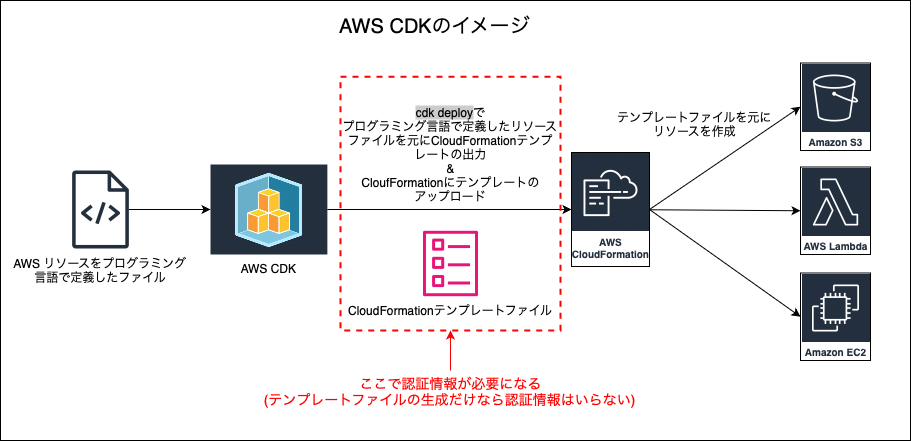

    <br>

- ★IAM ユーザーで認証する代わりに、IAM Identity Center を利用した SSO (Single Sign-On) でも可能

<br>

2\. Node.js をインストール

- CDK ([AWS CDK Toolkit](#aws-cdk-toolkit)) は TypeScript で書かれたライブラリのため、CDK を実行するには Node.js が必要

<br>

3\. 後の cdk deploy や cdk diff コマンドの実行に必要な AWS リソース (スタック) を作成するために `cdk bootstrap` を実行する

- ★ **(bootstrap コマンドによって作成されたリソースを削除しない限り)** 対象アカウント、リージョンにつき1回だけ実行すれば良い
    
    ```bash
    #デフォルトプロファイルを作成しているなら --profileオプションは必要ない
    npx aws-cdk bootstrap --profile <profile>
    ```

    

<br>
<br>

参考サイト

[AWS CDKはグローバルでインストールしない](https://qiita.com/goataka/items/003c8c78f35570a6fc27)

[AWS CDK に入門すっぞ①](https://qiita.com/Saaaaasaki/items/86bd2108f3acf193678c#前提条件)

[AWS CDK ブートストラップ](https://docs.aws.amazon.com/ja_jp/cdk/v2/guide/bootstrapping.html)

---

### CDK ~ リソースの定義からデプロイまで

#### 前提条件

- [CDK のセットアップ](#cdk-のセットアップ)までは完了済み

<br> 

#### デプロイまでの流れ

1. CDK プロジェクトの作成

    - 空のディレクトリ (後の CDK プロジェクト) を作成し、そのディレクトリに移動する

        ```bash
        mkdir cdk-app
        cd cdk-app
        ```
    
    <br>

    - cdk init コマンドを実行し、現在のディレクトリ (空のディレクトリ) に CDK プロジェクトに必要なリソースを準備する

        ```bash
        #★aws-cdkのinitコマンドでCDKプロジェクトの初期化
        npx aws-cdk init --language typescript

        #aws-cdkをグローバルインストールしている場合は以下の方法でinitコマンドを実行できる
        cdk init --language typescript
        ```

        - ★[aws-cdk の init コマンドは空のディレクトリで実行しないと動かない](./issues/CDK-initコマンドがうまく動かない.md)ことに注意

        - aws-cdk init コマンドの使い方は以下の通り

            - `npx aws-cdk init <TEMPLATE> --language <LANGUAGE>`

                - TEMPLATE は app か sample-app から選択する (基本的には指定しなくていい = デフォルトの app でいい)

                - LANGUAGE は CDK アプリ作成に使用する言語を指定

                    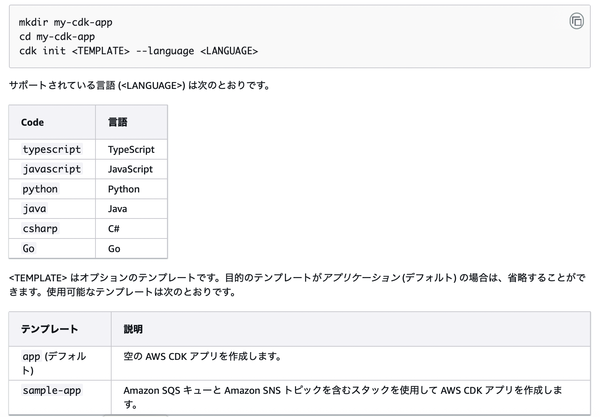

                    引用: [AWS CDK CLI リファレンス ](https://docs.aws.amazon.com/ja_jp/cdk/v2/guide/cli.html)

    <br>

    - aws-cdk init コマンドによって作成されるディレクトリやファイルについては以下の通り

        

        <br>

        - \bin

            - [アプリケーション](#アプリケーション) 定義を置いておくディレクトリ

                

        <br>

        - \lib

            - [スタック](#スタック) や [コンストラクト](#コンストラクト) の定義を作成したり、置いておくディレクトリ

                

        <br>

        - cdk.json

            - cdk コマンドを実行する際に渡すメタデータ (コマンドのオプションなど) が定義されているファイル

<br>
<br>

2. リソースの定義

    - 今回はシンプルな Lambda 関数を作成してみる

        - アプリケーションモジュール (今回の例では cdk-app.ts) にて `env: {~~}` の行をコメントアウトする (詳しくは[こちら](./AWS_CDK_コンテキスト.md)を参照)

            

        <br>
        
        - 次に、スタックモジュール (今回の例では cdk-app-stack.ts) にて Lambda リソースの定義を記述する

            

<br>
<br>

3. リソースのデプロイ

    - ★デプロイ前に差分確認

        - 特に L2 コンストラクトでリソースを定義している場合、自分で直接定義していないリソースも作成されることがよくあるので、`cdk diff`コマンドで最終的に何がデプロイされるのかを確認することはとても大事

            
    <br>

    - リソースのデプロイ

        - 差分確認の結果、意図した通りのリソースが作成されるようであれば `cdk deploy` コマンドでリソースのデプロイを実行する

            

    <br>

    - デプロイ結果の確認

        - マネージメントコンソールや AWS CLI などから、作成したリソースの確認を行う

            

<br>
<br>

4. デプロイしたリソースの削除

    - `cdk destroy` コマンドでデプロイしたリソースの削除ができる

        
    
    <br>

    - ★[bootstrpコマンドによって作成されたリソース](#cdk-のセットアップ) (S3 や ECR) にもファイルが格納されることがあるので、必要なければそれらのファイルも削除する

        - CDK アプリから作成される CloudFormation テンプレートは CDKToolKit スタックの S3 に保存される

        - Lambda 関数を作成した場合、かつ zip から作成する場合は zip ファイルが CDKToolKit スタックの S3 に保存される

        - Lambda 関数を作成した場合、かつコンテナイメージから作成する場合はコンテナイメージが CDKToolKit スタックの ECR に保存される

            

<br>
<br>

5. bootstrap したリソース (IAM Role, S3, ECR) の削除

    - ★`cdk bootstrap destroy` というようなコマンドは無いし、 `cdk destroy` では bootstrap で作成されたスタックは破棄できない

        - ★★**CDKToolKitスタックを手動で削除する必要がある**

            - CDKToolKit スタックを削除すると、IAM Role、 ECR は自動で削除される
        
        <br>
        
        - ★★CDKToolKit の S3 バケットは[削除ポリシー](https://docs.aws.amazon.com/ja_jp/AWSCloudFormation/latest/TemplateReference/aws-attribute-deletionpolicy.html)が Retain で作成される。**よって、 CDKToolKit スタックを削除しても S3 バケットは残るので、 S3 バケットも手動で削除する必要がある**

            - [bootstrap コマンドで実行するテンプレートファイルを修正](https://docs.aws.amazon.com/ja_jp/cdk/v2/guide/bootstrapping-customizing.html#bootstrapping-customizing-template)すれば S3 バケットの削除ポリシーを Delete で作成できる (めんどくさい)

---

### 料金

- CDK の利用は無料

- ★CDK から作成した AWS リソース (インスタンス)の利用料金は別途発生する

    - 例: cdk deploy コマンドは変換&生成した CloudFormation テンプレートを S3 にアップロードし、 CloudFormation でリソースを作成するコマンド

        - S3 のストレージ料金が発生する

        - TODO: CloudFormation でリソースを作成する際に S3 バケットへの GET アクセスが発生するのかどうかを調べる

---

### おまけ

- #### 公式のリファレンスでの L1、L2、L3 コンストラクトの見つけ方

    - L1 コンストラクト

        - aws-cdk-lib/~~ の **CloudFormation Resources**

            

    <br>

    - L2 コンストラクト

        - aws-cdk-lib/~~ の **Constructs**

            

    <br>

    - L3 コンストラクト

        - aws-cdk-lib/~~**-patterns** の **Constructs**

            

<br>
<br>

- #### cdk synth コマンド

    - `cdk syth` はデプロイに必要なファイル (CloudFormation テンプレートなど) を生成するコマンド

        - `cdk deploy` コマンドは `cdk synth` コマンドで生成されたテンプレートファイルを AWS CloudFormation 上にデプロイし、インフラを構築・更新するコマンド

        - ★`cdk deploy` は**内部で cdk synth を実行する**
    
    <br>

    - ★cdk synth で出力された CloudFormation テンプレートファイルから手動でリソースを作成することも可能

        - ★★ただし、手動で作成すると CDK の管理から外れるので、更新や削除がめんどくさくなる

        - さらに、手動で CloudFormation 上にテンプレートファイルをアップロードし、スタックを作成する場合、パラメーターの入力が必要になる (CDK deploy はそのパラメーターを自動で入力してくれていた)

<br>
<br>

参考サイト

- cdk synth コマンドについて

    [もっとじっくり AWS CDK のコンセプト](https://www.ogis-ri.co.jp/otc/hiroba/technical/cdk-concepts/part7.html)