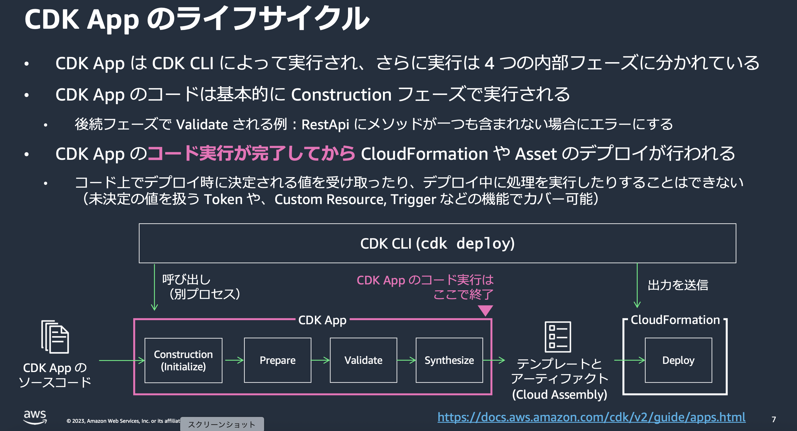

### Aspects とは

 

- Aspect と Aspects があり、機能が異なることに注意

    
    - **Aspect** → IAspect を実装するクラスであり、コンストラクトに対する「フィルターやルール」のような機能

    - **Ascpets** → Aspect を管理するものというイメージ。「どのコンストラクトツリー」に対し、どの「Aspect」達を適用するのかを管理する機能

        

 

- Aspcets は **prepare フェーズ**で実行される

    

    引用: [AWS Cloud Development Kit (CDK) ~ Basic #2 ~ 基本的なコンポーネントと機能](https://pages.awscloud.com/rs/112-TZM-766/images/AWS-Black-Belt_2023_AWS-CDK-Basic-2-Features_0831_v1.pdf)

 
 

参考サイト

[CDK Aspectsを使ってコンプライアンスに準拠したリソースチェックを自動化する](https://dev.classmethod.jp/articles/cdkv2-aspects-to-deploy-compliant-resources/)

[AWS Cloud Development Kit (CDK) ~ Basic #2 ~ 基本的なコンポーネントと機能](https://pages.awscloud.com/rs/112-TZM-766/images/AWS-Black-Belt_2023_AWS-CDK-Basic-2-Features_0831_v1.pdf)

---

### 具体的な Aspects の利用例

- サンプル CDK アプリとして VPC, EC2, Security Group, RDS, S3 で構成されるスタックを定義

    

 

#### 利用方法

1. IAspect インターフェースを実装したクラスを作成 (=コンストラクトに対するルール/チェックを作成するようなイメージ)

    - `Aspect.visit(node: IConstruct)` にコンストラクトに対するルール/チェック処理を書く

    - `Aspect.visit(node: IConstruct)` 内にて、まずは `instanceof` で Constrcut の種類を判定するのが一般的 (そうでないとルール/チェックの対象ではないコンストラクトに対しても処理を実行してしまう)

        
    
 

2. Aspects で対象コンストラクトツリーに適用したい Aspect を設定する

    - `Apsects.of(<対象コンストラクトツリーの開始点>).add(new <Aspectクラス>())`

        

 

#### ポイント

- `Aspect.visit()` 内でエラーを起こす場合、 即時エラー (throw Error) か [Annotaions](./AWS_CDK_Annotations.md) によってエラー発生のタイミングが微妙に異なる

    

 

- Aspect は Stack で無く Construct に適用するので、 App, Stack, Construct を対象にできる

    - = L1,L2,L3 コンストラクトに対して Aspect を設定することもできる

        
    
     

    - ただし、Stack に適用すれば全体に行き渡るので、一括適用したい場合は Stack に対して Aspect を設定するのが一般的

 
 

参考サイト

[CDK Aspectsを利用してベストプラクティスに従ったインフラストラクチャを構築する](https://aws.amazon.com/jp/blogs/news/align-with-best-practices-while-creating-infrastructure-using-cdk-aspects/)

[CDK Aspectsを使ってコンプライアンスに準拠したリソースチェックを自動化する](https://dev.classmethod.jp/articles/cdkv2-aspects-to-deploy-compliant-resources/)

---

### おまけ

#### Aspect.visit() の中で各リソースをチェックする際になぜ Cfn\~\~ の L1 コンストラクトで型チェックを行うのか

 

- ★L2コンストラクトの前提知識: L2 コンストラクトは実態として、メインとなる L1 コンストラクト (Resource) とその他の L2, L1 コンストラクトで構成される

    

 

- 結論: L2 コンストラクトでの型チェックでもいい**が**以下の理由などから **L1 コンストラクトでの型チェックの方が都合がいい**

    1. L2 コンストラクトは L1 コンストラクトのラッパーであり、Aspect.visit() は L1 コンストラクトまでたどり着く

    2. L2 コンストラクトよりも L1 コンストラクトの方が詳細な設定が可能であるため、 Aspect.visit() でコンストラクトのプロパティの変更を行いたい場合などは L1 コンストラクトで扱った方が便利

    

 
 

参考サイト

[もっとじっくり AWS CDK のコンセプト 第3回 L2 コンストラクトの基本](https://www.ogis-ri.co.jp/otc/hiroba/technical/cdk-concepts/part3.html)