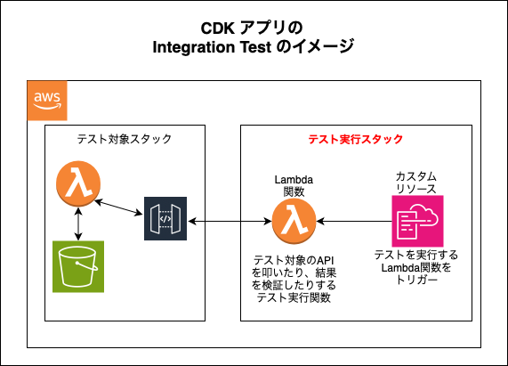
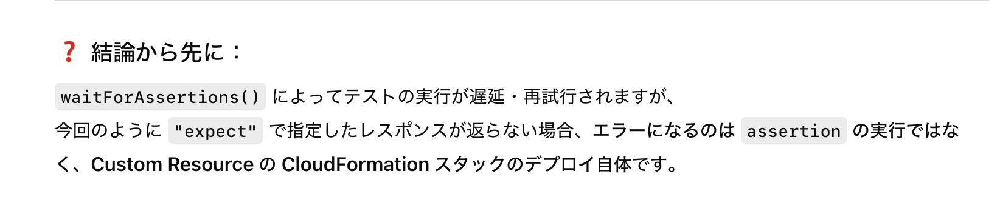
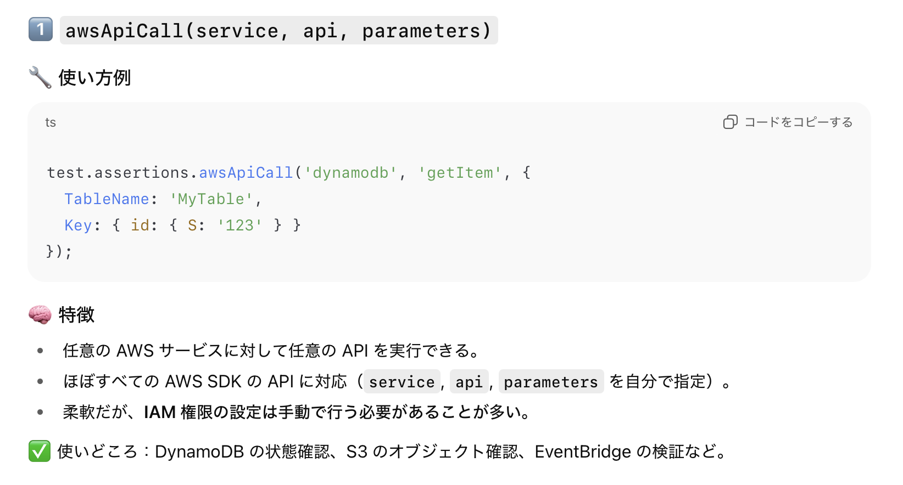
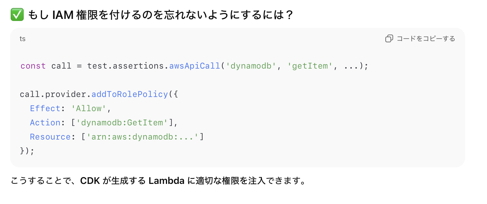
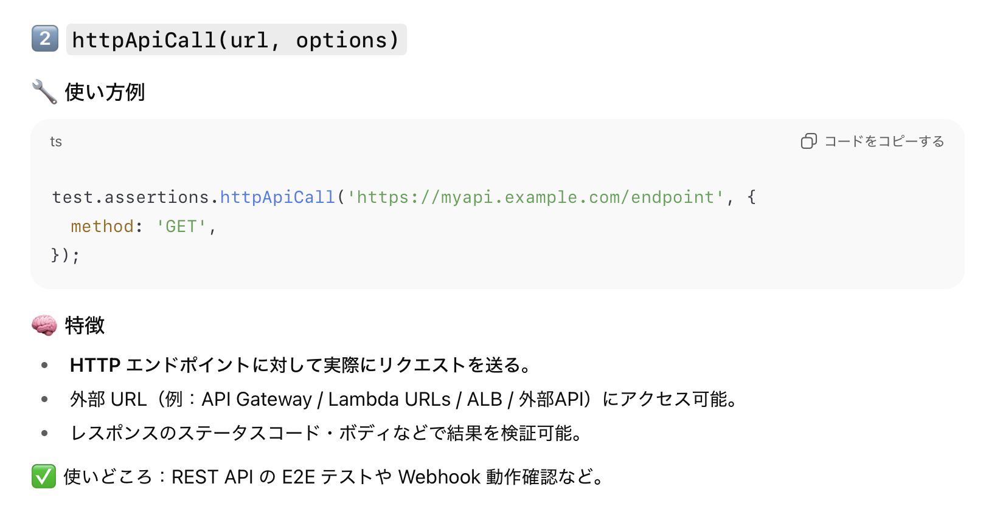
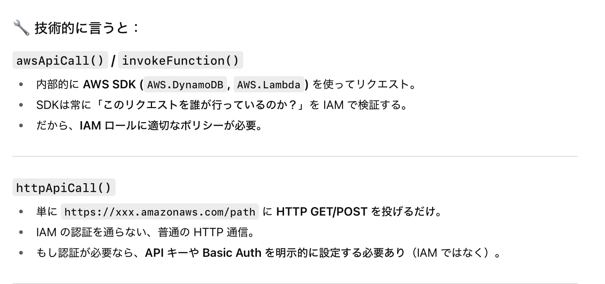
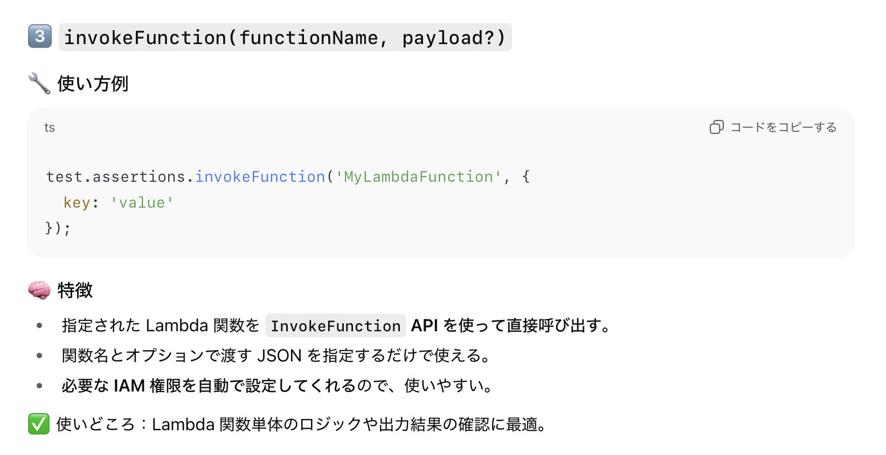

### CDK アプリの Integration Test

- [Snapshot テスト](./AWS_CDK_Snapshot_Test.md) や [Fine-grained Assertions テスト](./AWS_CDK_Fine-grained_Assertion_Test.md) などのユニットテストは **デプロイ前の Cloud Formation Template に対して行う**

<br>

- 一方、 Integration Test は **デプロイ済みのリソースに対して行う**

<br>

- Integration Test を行うには [integ-test-alpha](#integ-tests-alpha) と [integ-runner](#integ-runner) というパッケージを別途インストールする必要がある

    ```bash
    npm install -D @aws-cdk/integ-runner @aws-cdk/integ-tests-alpha
    ```

<br>

#### 用語

- ##### integ-tests-alpha

    - 結合テストケースを作成するためのパッケージ

        - テストケースに対してのアサーションも提供

<br>

- ##### integ-runner

    - integ-test-alpha で作成したテストケースを実行するための CLI

    - 後述のイメージにあるようにテスト対象スタック + テスト実行/検証スタックをデプロイしたり破棄する 

<br>

#### イメージ



<br>

- AWS Cloud Formation 上にテスト対象スタックと**そのスタックをテストするスタック**をデプロイする

    - テストを実行するスタックの正体は Lambda 関数 + カスタムリソースであり、テスト対象への API コールやその結果の検証を行う

<br>
<br>

参考サイト

[AWS CDKで作った環境をinteg-testとinteg-runnerをつかって連結テストしてみる](https://qiita.com/letsgomeow/items/2629e712309ed75ac9b3)

[How to write and execute integration tests for AWS CDK applications](https://aws.amazon.com/jp/blogs/devops/how-to-write-and-execute-integration-tests-for-aws-cdk-applications/)

[AWS CDK アプリケーションのためのインテグレーションテストの作成と実行](https://aws.amazon.com/jp/blogs/news/how-to-write-and-execute-integration-tests-for-aws-cdk-applications/)

---

### Integration Test のサンプル

#### ポイント

- ★(JavaScritp や TypeScriptの場合) テストファイルの名前は `integ.` で始める必要がある 

<br>

#### 手順

1. テストファイルにて空の App インスタンスを作成する

    ```ts
    //テストコード
    import * as cdk from "aws-cdk-lib";

    //Step1. ★★★空のAppを作成★★★
    const app = new cdk.App();
    ```

<br>

2. テスト対象のスタックを生成し、1で作成した App に追加する

    ```ts
    //テストコード
    import * as cdk from "aws-cdk-lib";
    import { TestTargetStack } from "テスト対象スタックのパス";

    //Step1. 空のAppを作成
    const app = new cdk.App();
    
    //Step2. ★★★テスト対象のスタックを生成★★★
    const testTarget = new TestTargetStack(app, "MyStack");
    ```

<br>

3. ★IntegTest コンストラクトを作成し、 App に追加する

    - ★★コンストラクトは App 直下に追加することは基本的にできないが、IntegTest コンストラクトは特別

        ```ts
        //テストコード
        import * as cdk from "aws-cdk-lib";
        import { TestTargetStack } from "テスト対象スタックのパス";
        import * as it from "@aws-cdk/integ-tests-alpha"; //★★★IntegTestコンストラクトがあるパッケージ★★★

        //Step1. 空のAppを作成
        const app = new cdk.App();
        
        //Step2. テスト対象のスタックを生成
        const testTarget = new TestTargetStack(app, "MyStack");

        //Step3. ★★★IntegTestインスタンス(コンストラクト)を生成★★★
        const integTest = new it.IntegTest(app, "TestStack", {
            testCases: [targetStack] //testCasesにテスト対象のスタックを指定
        });
        ```

    <br>

    - IntegTest の第3引数である [IntegTestProps](https://docs.aws.amazon.com/cdk/api/v2/docs/@aws-cdk_integ-tests-alpha.IntegTestProps.html) には**テストケース**や integ-runner の挙動に関するオプションを指定することができる

        ```ts
         new IntegTest(
            scope,
            "id",
            {
                // ↓testCasesにテスト対象のスタックを指定
                testCases: [stack],
                // ↓静的アセットの中身も差分比較するかどうか
                diffAssets: true,
                // ↓integ-runnerの裏で実行されるcdk deployとcdk destroyへのオプション
                cdkCommandOptions: {
                    deploy: {
                        args: {
                            profile: "profile",
                            requireApproval: cdk.cloud_assembly_schema.RequireApproval.NEVER
                        }
                    },
                    destroy: {
                        args: {
                            profile: "profile",
                            force: true
                        }
                    }
                }


            }
        );
        ```

        - IntegTestProps の代表的なプロパティは以下の通り
            
            - testCases

                -  テスト対象のスタック (integ-runner コマンドでデプロイされるスタック)

                - ★複数のスタックを指定することもできる

            <br>

            - diffAssets

                - Lambda 関数のコード、Dockerfile、画像や html などの静的ファイルも integ-runner 実行時のスナップショットテストにおいて差分検出の対象とするかどうか

            <br>

            - [cdkCommandOptions](https://docs.aws.amazon.com/cdk/api/v2/docs/aws-cdk-lib.cloud_assembly_schema.CdkCommands.html)

                - integ-runner 実行時に内部で実行される cdk deploy, cdk destroy に対して事前にオプションを指定することができるプロパティ

                - 上記サンプルで指定された cdkCommandOptions から integ-runner 実行時に裏で動く cdk deploy, cdk destroy コマンドは以下の通り

                    ```bash
                    # スタックデプロイ時
                    cdk deploy --profile <profile> --require-approval never

                    # スタック破棄時
                    cdk destroy --profile <profile> --force true
                    ```

<br>

4. テスト対象スタックに対して、実行したいアクション (API コール) を記述する

    ```ts
    //テストコード
    import * as cdk from "aws-cdk-lib";
    import { TestTargetStack } from "テスト対象スタックのパス";
    import * as it from "@aws-cdk/integ-tests-alpha"; //★★★IntegTestコンストラクトがあるパッケージ★★★

    //Step1. 空のAppを作成
    const app = new cdk.App();
    
    //Step2. テスト対象のスタックを生成
    const testTarget = new TestTargetStack(app, "MyStack");

    //Step3. IntegTestインスタンス(コンストラクト)を生成
    const integTest = new it.IntegTest(app, "TestStack", {
        testCases: [targetStack] //testCasesにテスト対象のスタックを指定
    });

    //Step4. ★★★テスト対象スタックにあるLambda関数を呼び出す★★★
    const lambdaCall = integTest.assertions. invokeLambda(functionName: "function-name");
    ```

<br>

5. 実行した API コールの結果を expect() で検証する

    - APIコールの結果は、expect の引数 ExpectedResult として渡ってくる

    ```ts
    //テストコード
    import * as cdk from "aws-cdk-lib";
    import { TestTargetStack } from "テスト対象スタックのパス";
    import * as it from "@aws-cdk/integ-tests-alpha"; //★★★IntegTestコンストラクトがあるパッケージ★★★

    //Step1. 空のAppを作成
    const app = new cdk.App();
    
    //Step2. テスト対象のスタックを生成
    const testTarget = new TestTargetStack(app, "MyStack");

    //Step3. IntegTestインスタンス(コンストラクト)を生成
    const integTest = new it.IntegTest(app, "TestStack", {
        testCases: [targetStack] //testCasesにテスト対象のスタックを指定
    });

    //Step4. テスト対象スタックにあるLambda関数を呼び出す
    const lambdaCall = integTest.assertions. invokeLambda(functionName: "function-name");

    //Step5. ★★★APIコールの結果を評価する★★★
    lambdaCall.expect(it.ExpectedResult.objectLike({
        StatusCode: 200 //ステータスコードが200で返ってくることを期待
    }));
    ```

<br>

6. [integ-runner](https://www.npmjs.com/package/@aws-cdk/integ-runner) コマンドでテストを実行する

    ```bash
    integ-runner [引数] [オプション]
    ```

    <br>

    - 引数にはテストファイル名を指定することができる
        
        - テストファイル名を指定しない場合、[--directory](#--directory) で指定されたディレクトリ以下の全ての integ.~~.ts(js) ファイルを実行する

    <br>

    - ★integ-runner を実行すると、まずはスナップショットテストが開始され、それにパスすると Integration Test (スタックを実際に CloudFormation にデプロイしてのテスト) が行われる

        - ★★[Unit Test のスナップショットテスト](./AWS_CDK_Snapshot_Test.md) とは異なり、初回の場合は必ず失敗するので [--update-on-failed](#--update-on-failed) を付与して実行する

    <br>

    #### よく利用するオプション達

    ##### `--directory`

    - テストファイルが配置されているディレクトリを指定するオプション

    <br>
    
    ##### `--clean`

    - integ-runner でデプロイされたスタックを自動で削除するオプション

    <br>

    - ★cdk destroy と同様に integration-runner コマンドに [--clean](#--clean) オプションが付与されていても、**リソースの RemovalPolicy が RETAIN になっているものは破棄されない**

    <br>

    ##### `--no-clean`

    - `--clean` とは逆に、integ-runner でデプロイされたスタック (テスト対象スタック&テスト実行スタック) を削除せずに残しておくオプション

    <br>

    ##### `--parallel-regions`

    - テスト対象のスタック + テスト実行スタックをデプロイするリージョンを指定
    
    <br>

    - デフォルトでは `us-east-1`, `us-east-2`, `us-west-2` が指定されている

    <br>

    - ★利用する profile に紐づいていないリージョンを指定しても OK

        <br>

        - ★★`--parallel-regions` は、プロファイルに紐づくデフォルトリージョン設定を上書きして、指定された各リージョンで順番にデプロイ＋テストを実行する (AWS CLI の --region オプションと同じ)

            ```json
            // ~/.aws/config
            [profile myProfile]
            region = us-east-1
            output = json
            ```

            ```bash
            # us-east-1以外のリージョンを指定してもOK
            env AWS_PROFILE=myProfile npx aws-cdk --parallel-regions us-east2,use-west1
            ```

    <br>

    ##### `--update-on-failed`

    - integ-runner のスナップショットテストに失敗しても、次のステップである Integration Test (スタックのデプロイ + API コールでテスト実行) に進む

    <br>

    ##### `--force`

    - スナップショットテストが成功の場合、integ-runner は次のステップである Integration Test をスキップする

    <br>

    - --force オプションを付与することでスナップショットテストが成功しても、強制的に Integration Test に進めることができる

<br>
<br>

参考サイト

[CDK でインテグレーションテストをやってみる](https://blog.i-tale.jp/2024/03/d7/)

---

### 複数のテストケースの登録

- IntegTest では複数のテストケースを testCases プロパティに指定することができる

    ```ts
    //Integration Test ファイル
    import { Stack, StackProps } from "aws-cdk-lib";
    import { aws_lambda as lambda } from "aws-cdk-lib";
    import { Construct } from "constructs";
    import path from "path";
    import { App } from "aws-cdk-lib";
    import * as it from "@aws-cdk/integ-tests-alpha"

    interface StackUnderTestProps extends StackProps {
    architecture?: lambda.Architecture;
    functionName: string;
    }

    //テスト対象のスタック(Lambda関数のみで構成される)
    class StackUnderTest extends Stack {
        constructor(scope: Construct, id: string, props: StackUnderTestProps) {

            super(scope, id, props);

            new lambda.Function(this, 'Handler', {
                runtime: lambda.Runtime.NODEJS_LATEST,
                handler: 'index.handler',
                code: lambda.Code.fromAsset(path.join(__dirname, '../resources')),
                architecture: props.architecture,
                functionName: props.functionName
            });
        }
    }

    //Step1. App の作成
    const app = new App();

    //Step2. テスト対象のスタックを生成

    //arm64アーキテクチャのLambda関数で構成されるスタック
    const stack1 = new StackUnderTest(app, 'Stack1', {
        architecture: lambda.Architecture.ARM_64,
        functionName: "func1"
        }
    );

    //amdアーキテクチャのLambda関数で構成されるスタック
    const stack2 = new StackUnderTest(app, 'Stack2', {
        architecture: lambda.Architecture.X86_64,
        functionName: "func2"
        }
    );

    //Step3. IntegTestを作成し、testCasesにテスト対象のスタックを登録
    const integTest = new it.IntegTest(
        app,
        'DifferentArchitectures',
        {
            //★★★ここ★★★
            testCases: [
                stack1,
                stack2
            ],
        }
    );

    //Steo4&5. テストで行いたい操作を実行&結果の評価
    integTest.assertions.invokeFunction({functionName:"func1"})
                        .expect(it.ExpectedResult.objectLike({
                            StatusCode: 200
                        }));

    integTest.assertions.invokeFunction({functionName:"func2"})
                        .expect(it.ExpectedResult.objectLike({
                            StatusCode: 200
                        }));
    ```

<br>

#### 疑問

- 複数のテスト対象スタックを登録した際、Integration Test の挙動はどうなるのか?

    <br>

    - 登録した分だけテスト対象スタックとして CloudFormation にデプロイされる

    <br>

    - アサーションは指定した API コールの対象があるスタックに対して1回だけ実行される

        - ★テスト対象のスタック全てに対して、それぞれAPIコールを実行するわけではないことに注意

    

<br>

- 複数のスタックを testCases に登録するようなユースケースとは?

    <br>

    - 複数のスタックがまとめて 1 つの IntegTest の対象になるようなケース

        - 例: 複数のスタックから成り立っているサービスの Integration Test など

    <br>

    - 複数環境での比較を行うようなケース

        - 例: 同じ種類のリソースから構成されるスタックで、そのリソースの設定を変えたバージョンでもテストしたい場合など

---

### IntegTest の assertionStack とは

- assertionStack とは integ-runner コマンドで Integration Test を実行する際に、自動で作成&デプロイされる、**テストを実行するスタック**のこと

    - 通常は IntegTest が自動で用意してくれるが、自分で作成したスタックを assertionStack としてデプロイすることも可能

<br>

- 以下の様に、IntegTest コンストラクトには assertionStack というプロパティがあり、コンストラクターの引数でも渡すことができる

    ```ts
    //Integration Test ファイル
    import { Stack, StackProps } from "aws-cdk-lib";
    import { aws_lambda as lambda } from "aws-cdk-lib";
    import { Construct } from "constructs";
    import path from "path";
    import { App } from "aws-cdk-lib";
    import * as it from "@aws-cdk/integ-tests-alpha"

    //テスト対象のスタック
    class StackUnderTest extends Stack {
        constructor(scope: Construct, id: string, props?: StackProps) {
            super(scope, id, props);

            new lambda.Function(this, 'Handler', {
                runtime: lambda.Runtime.NODEJS_LATEST,
                handler: 'index.handler',
                code: lambda.Code.fromAsset(path.join(__dirname, '../resources')),
                functionName: "testFunction"
            });
        }
    }

    //Step1. App の作成
    const app = new App();

    //Step2. テスト対象のスタックを生成
    const stack = new StackUnderTest(app, 'MyStack');

    // ★★★自分でassertionStackを用意★★★
    const assertionStack = new Stack(app, "MyAssertionStack");

    //Step3. IntegTestを作成し、testCasesにテスト対象のスタックを登録
    const integTest = new it.IntegTest(
            app,
            'DifferentArchitectures',
            {
                testCases: [ stack1 ],
                assertionStack: assertionStack //★★★自分で用意したスタックをassertionStackとして指定★★★
            }
        );

    // Step4&5, テスト実行&結果の評価
    integTest.assertions.invokeFunction({
        functionName: "testFunction"
    }).expect(it.ExpectedResult.objectLike({
        StausCode: 200
    }));
    ```

<br>

#### 疑問

- assertionStack を自分で用意する場合、カスタムリソースと Lambda 関数も自分で用意する必要がある?

    - A: カスタムリソースと Lambda 関数を自分で用意する必要はない。 IntegTest 側が指定された assertionStack に自動でそれらのリソースを用意してくれる

        

<br>

- assertionStack を自作で用意する必要がある様なユースケース

    - テスト対象スタックとテスト実行スタックを別リージョンに分けてテストしたい (クロスリージョンテスト) ケース

    <br>

    - テスト対象スタックとテスト実行スタックを別アカウントに分けてテストしたい (クロスアカウントテスト) ケース

    <br>

    - 複数の Integration Test で assertionStack を共有したい場合

    <br>
    
    - アサーションスタックに追加リソースを含める必要がある場合

        - 例: テスト対象が 「VPC のプライベートサブネットに配置された Lambda 関数」だとする。assertionStack にも同じ VPC リソース or VPC Peering を含めないとテスト対象にアクセスできない

---

### IntegTest における Assertions の２つの利用方法

- ここでの Assertions の意味

    - 広義のアサーション

        - CloudFormation にデプロイしたテスト対象に対して任意のアクションを実行し、その結果を検証すること

    <br>

    - 狭義の意味

        - 広義のアサーションを実行するための仕組み ([Assertions Property](#assertions-property) や [Built-in Assertions](#built-in-assertions))

<br>

- IntegTest では2つのアサーション方法がある

    1. #### Assertions Property

        - IntegTest の assertions プロパティ ([IDeployAssert](https://docs.aws.amazon.com/cdk/api/v2/docs/@aws-cdk_integ-tests-alpha.IDeployAssert.html)) が提供するメソッドを使ってテスト対象へのアクション&結果の検証を行う方法

            ```ts
            import { Stack, StackProps } from "aws-cdk-lib";
            import { aws_lambda as lambda } from "aws-cdk-lib";
            import { Construct } from "constructs";
            import path from "path";
            import { App } from "aws-cdk-lib";
            import * as it from "@aws-cdk/integ-tests-alpha"

            interface StackUnderTestProps extends StackProps {
                architecture?: lambda.Architecture;
                functionName: string;
            }

            //テスト対象のスタック定義
            class StackUnderTest extends Stack {
                constructor(scope: Construct, id: string, props: StackUnderTestProps) {
                    super(scope, id, props);

                    new lambda.Function(this, 'Handler', {
                        runtime: lambda.Runtime.NODEJS_LATEST,
                        handler: 'index.handler',
                        code: lambda.Code.fromAsset(path.join(__dirname, '../resources')),
                        architecture: props.architecture,
                        functionName: props.functionName
                    });
                }
            }

            const app = new App();

            const testTargetStack =  new StackUnderTest(
                app,
                "MyStack",
                {
                    architecture: lambda.Architecture.ARM_64,
                    functionName: "MyFunction"
                }
            );

            //★★★IntegTestを作成★★★
            const integTest = new it.IntegTest(
                app,
                "MyIntegTest",
                {
                    testCases: [testTargetStack]
                }
            );

            //★★★Assertions Propertyの1つであるawsApiCallを利用★★★
            const apiCall = integTest.assertions.awsApiCall(
                "lambda",
                "invoke",
                {
                    FunctionName: "MyFunction"
                }
            ).expect(it.ExpectedResult.objectLike({
                StatusCode: 200
            }));

            //★★★必要な権限を付与★★★
            apiCall.provider.addToRolePolicy({
                Effect: 'Allow',
                Action: ['lambda:InvokeFunction'],
                Resource: ['*'],
            });
            ```

    <br>

    2. #### Built-in Assertions

        - アサーションオブジェクト (コンストラクト) を作成してテスト対象へのアクション&結果の検証を行う方法

        - ★Built-in Assertions は IntegTest コンストラクトを直接利用することはないが、「IntegTest コンストラクトの作成」&「testCases プロパティにテスト対象のスタックの登録」は必須
        
            ```ts
            import { Stack, StackProps } from "aws-cdk-lib";
            import { aws_lambda as lambda } from "aws-cdk-lib";
            import { Construct } from "constructs";
            import path from "path";
            import { App } from "aws-cdk-lib";
            import * as it from "@aws-cdk/integ-tests-alpha"

            interface StackUnderTestProps extends StackProps {
                architecture?: lambda.Architecture;
                functionName: string;
            }

            //テスト対象のスタック定義
            class StackUnderTest extends Stack {
                constructor(scope: Construct, id: string, props: StackUnderTestProps) {
                    super(scope, id, props);

                    new lambda.Function(this, 'Handler', {
                    runtime: lambda.Runtime.NODEJS_LATEST,
                    handler: 'index.handler',
                    code: lambda.Code.fromAsset(path.join(__dirname, '../resources')),
                    architecture: props.architecture,
                    functionName: props.functionName
                    });
                }
            }

            const app = new App();

            const testTargetStack =  new StackUnderTest(
                app,
                "MyStack",
                {
                    architecture: lambda.Architecture.ARM_64,
                    functionName: "MyFunction"
                }
            );

            //★★★IntegTestを作成(必須)★★★
            const integTest = new it.IntegTest(
                app,
                "MyIntegTest",
                {
                    testCases: [testTargetStack]
                }
            );

            //★★★Built-in Assertionsの1つであるAwsApiCallを利用★★★
            const apiCall = new it.AwsApiCall(testTargetStack, "MyAPICall", {
                service: "lambda",
                api: "invoke",
                parameters: {
                    FunctionName: "MyFunction"
                }
            })expect(it.ExpectedResult.objectLike({
                StatusCode:200
            }));;

            //★★★必要な権限を付与★★★
            apiCall.provider.addToRolePolicy({
                Effect: 'Allow',
                Action: ['lambda:InvokeFunction'],
                Resource: ['*'],
            });
            ```

<br>

#### Assertions Property と Built-in Assertions の違い

- ★Assertions Property はテスト対象スタックとは別で **テスト実行スタック (カスタムリソース + Lambda 関数)** を作成&デプロイし、任意のアクションを実行 & 結果の検証を行う

    

<br>

- ★Built-in Assertions は**テスト対象スタックの中**にカスタムリソースと Lambda 関数を追加し、任意のアクション & 結果の検証を行う

    

<br>
<br>

参考サイト

Jest でのアサーション

- [Jest 入門1](https://qiita.com/TTwithTT/items/eee451b795de977f60d0#アサーション)

---

### IntegTest の waitForAssrtions とは

- 結果が期待通りになるまでアサーションを繰り返し再実行する仕組み

    - ★テストコード中にて DynamoDB にデータを登録するような処理を書いている場合、データの登録のが反映される前にアサーションが実行されることがある

    - ↑の時に waitForAssertions を利用することで、DyndamoDB にデータが反映されるまでアサーションを再実行し続けることができ、 falseNagative なケースを避けることができる

        ```ts
        /*
        * テストコード
        * テスト対象 (API Gateway + カスタムリソース + DynamoDB + Lambda関数)からなるスタック
        */
        import * as cdk from "aws-cdk-lib";
        import { IntegrationStack } from "../lib/integration-stack";
        import * as it from "@aws-cdk/integ-tests-alpha";

        //Step1. 空のAppを作成
        const app = new cdk.App();

        //Step2. テスト対象のスタックを生成
        const targetStack = new IntegrationStack(app, "MyStack");

        //Step3. IntegTestインスタンス (コンストラクトを生成)
        const integTest = new it.IntegTest(app, "TestStack", {
            testCases: [targetStack] //testCasesにテスト対象のスタックを指定
        });

        //★★★Step3.5 dynamoに認証用ユーザーの登録★★★
        const userID = "100";
        const putItemCall = integTest.assertions.awsApiCall(
            'DynamoDB',
            'putItem',
            {
                TableName: targetStack.userTable,
                Item: {
                    user_id: { S: userID },
                    name: { S: 'UserA' }
                },
            }
        );

        //Step4. ★★★対象のリソースに任意のアクションを実行&アサーション★★★
        integTest.assertions.httpApiCall(
            `${targetStack.endpointURL}?user_id=${userID}`,
            {
                method: "GET",
                headers: {
                    "Auth": "Allow"
                },
            }
        ).expect(
            it.ExpectedResult.objectLike({
                status: 200,
                body: "Hello From Lambda"
            })
        ).waitForAssertions({ //★★★ここ★★★
            totalTimeout: cdk.Duration.seconds(25), //再実行リミット時間
            interval: cdk.Duration.seconds(5), //アクション＆結果の評価を再実行する間隔
        });
        ```

        <br>

        

    <br>
    
    - ★★設定した時間を超えても期待する結果が得られない場合、テスト実行スタックのデプロイエラーになりテストが終了する (**そのアサーションだけが fail になり以降のテストに続くわけではないことに注意**)

        

---

### API 呼び出し (アクションの実行) 方法 

- IntegTest ([Asserrtions Property](#assertions-property)) では次の3つの API コール関数が利用できる ([Built-in Assrtions](#built-in-assertions) でも同様のコンストラクトが用意されている)

<br>

#### IDeployAssert.awsApiCall

- service: Lambda, DynamoDB, S3 などの AWS サービス

- api: service に対するアクション

- parameters: 実行するアクション (api) によって必要となるパラメーターは異なる

    - ★各サービスとアクションについては[こちら](https://docs.aws.amazon.com/ja_jp/)を参照



<br>

- ★基本的には service に対するアクション (api) の権限を手動で付与する必要がある



<br>

#### IDeployAssert.httpApiCall

- url: リクエスト対象のエンドポイント URL

- options: リクエストの種類(GRT/POST/PUT/DELETEなど)やリクエストに含めるパラメーターなど



<br>

- ★★httpApiCall には IAM 権限の付与は基本的に必要ない



<br>

#### IDeployAssert.invokeFunction

- ★invokdeFunction で呼び出す Lambda 関数のアクセス権限は自動で付与される



<br>

#### まとめ


<br>
<br>

参考サイト

[AWS ドキュメントへようこそ](https://docs.aws.amazon.com/ja_jp/)