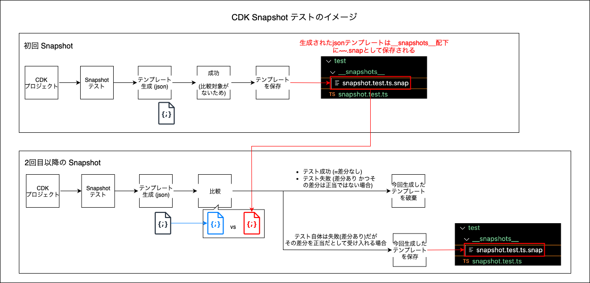
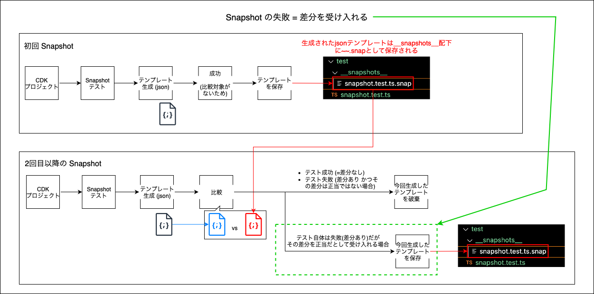

### CDK のスナップショットテスト



#### ポイント

- テストツールとしては jest や Vitest を利用する

- [アサーションライブラリ](#アサーションライブラリとは)として jest / Vitest の他に `aws-cdk/assertions` が CDK のテストのために用意されている

<br>

#### Snapshot テストの実践

- ★cdk init でプロジェクトを作成した場合は必要なモジュールはインストール済み

    - そうでない場合は別途 jest や ts-jest, @types/jest, aws-cdk などをインストールする必要がある

<br>

1. CDK プロジェクト直下の test ディレクトリにテストファイル作成する (cdk init で自動で作成される `test/<cdkプロジェクト名>.test.ts` にを利用してもいい)

<br>

2. テストファイルにて、Snapshot を実行するコードを書く

    - App インスタンスを作成し、その App インスタンスにテスト対象の Stack / Construct を追加する

    <br>

    - Template.fromStack(Stack); にてテンプレートファイルを生成する

    <br>

    - toMatchSnapshot マッチャー関数でテンプレートファイルの差分検出を行う

    ```ts
    /**
     * テストファイル
     */
    //Appとアサーションライブラリは下のimport文のように一気にimportすることも可能 (余分なクラスもimportされることに注意)
    //import * as cdk from 'aws-cdk-lib';
    import { App } from 'aws-cdk-lib';
    import { Match, Template } from 'aws-cdk-lib/assertions'; //アサーションライブラリの利用に必
    import { MyStack } from '../lib/my-stack'; //テスト対象
    
    test("Snapshot Test for MySatck", () => {
        const app = new App();
        //StackをAppに入れる
        const myStack = new MyStack(app, "MyStack");

        //★テンプレートファイルを生成
        const template = Template.fromStack(stack);

        //Snapshotテスト(テンプレートファイルの差分検出)
        expect(template.toJSON()).toMatchSnapshot();

    });
    ```

<br>

3. テストの実行

    - jest の実行

        ```bash
        npx jest

        #package.jsonのscriptにtestとして定義済みの場合
        npm run test
        ```

<br>
<br>

参考サイト

[AWS CDKのスナップショットテストに必要最低限の基礎](https://qiita.com/kiyoshi999/items/a3242159c1495249b751)

[【AWS CDKテスト入門】SnapshotテストとAssertionテストの使い方について考えてみた](https://qiita.com/pensuke628/items/8031748057a6ad6861f8)

---

### アサーションライブラリとは


<br>

- jest や Vitest は テスティングツール (フレームワーク) + アサーションライブラリ

---

### 差分を受け入れる場合

- ★差分が検出された場合、Snapshot テストは失敗するので**スナップショットしたテンプレートは破棄される**。よって、「CDK アプリ側のコードを元に戻す」or「差分を受け入れる = 変更を正当なものと判断する」をしない限り次の Snapshot テストも失敗する

    

<br>

- `jest --updateSnapshot (-u)` コマンドを実行することで、差分が生じたテンプレートファイルを正当だとし、Snapshot テストをパスする

    

<br>
<br>

参考サイト

[AWS CDK における単体テストの使い所を学ぶ](https://aws.amazon.com/jp/builders-flash/202411/learn-cdk-unit-test/)

[AWS CDKに求められるテストとその方法](https://dev.classmethod.jp/articles/awscdk-snapshot-test)

[AWS CDKのスナップショットテストに必要最低限の基礎](https://qiita.com/kiyoshi999/items/a3242159c1495249b751#スナップショットの更新方法)

---

### おまけ

#### Snapshot を利用するべきケース

- 以下のメリットがデメリットを上回ることが多いので、基本的に導入すべき

<br>

- メリット

    - ライブラリのバージョン変更によって、リソース (= テンプレート) になんらかの変更が生じる場合、 Snapshot テストで検知できる

    - リファクタリング結果がリソース (= テンプレート) に影響を及ぼす場合、検知可能

    - 数行で Snapshot テストを導入できる

<br>

- デメリット

    - 意図した変更がある場合でも、 Snapshot テスト自体は失敗する

    - 1番初回の Snapshot テストは意図した通りのリソース (= テンプレート)でなくとも、テストが成功しちゃう

        - [Fine-grained Assertions テスト](./AWS_CDK_Fine-grained_Assertion_Test.md)でそこは補う必要あり

<br>
<br>

参考サイト

[AWS CDKのテストはどこまで書くべきか？](https://zenn.dev/cariot_dev/articles/4296d2e354507e#snapshot-test)

[AWS CDK における単体テストの使い所を学ぶ](https://aws.amazon.com/jp/builders-flash/202411/learn-cdk-unit-test/)

[【AWS CDKテスト入門】SnapshotテストとAssertionテストの使い方について考えてみた](https://qiita.com/pensuke628/items/8031748057a6ad6861f8#感想)