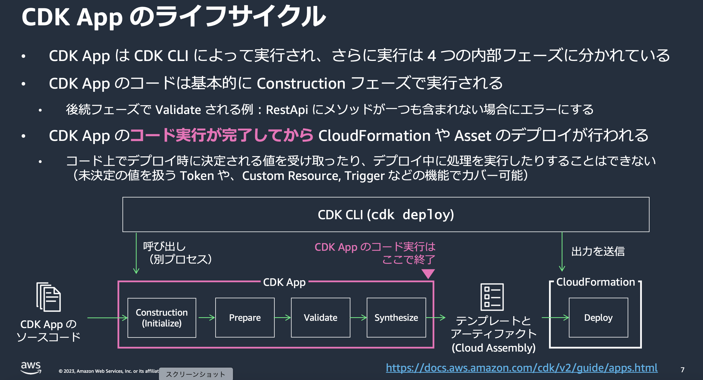

### そもそもバリデーションとは

- バリデーションとは不正な値を検出するための処理のこと

- バリデーション処理は**アプリ側で実装する必要がある**

- バリデーション処理が正しく動くことを確かめるためにバリデーションテストを行う

---

### バリデーション処理を書く場所

1. `Aspect.visit(scope: IConstruct)` にバリデーション処理を書く

    - 詳しくは[こちら](./AWS_CDK_Aspects.md)を参照

<br>

2. `Construct.node.addValidation(validation: IValidation)` を利用して `IValidation.validate()` にバリデーション処理を書く

    - 詳しくは[こちら](#constructnodeaddvalidationvalidation-ivalidation)を参照

<br>

3. アプリコードの任意の場所に書く

    ```ts
    // アプリ側のコード
    import * as cdk from 'aws-cdk-lib';
    import { Construct } from 'constructs';
    import { aws_lambda as lambda } from 'aws-cdk-lib';

    /**
     * Lambda関数 のみを持つシンプルなスタック
     */
    export class MyStack extends cdk.Stack {

        constructor(scope: Construct, id: string, props?: cdk.StackProps) {
            super(scope, id, props);

            // デプロイ先のステージ (値は"dev"か"prod") をコンテキストから取得
            const stage = this.node.tryGetContext('stage');

            // ★バリデーション処理
            if (!stage) {
                throw new Error('stageが設定されていません');
            } else if (stage !== 'dev' && stage !== 'prod') {
                throw new Error('stageに設定できる値は "dev" か "prod" のみです');
            }
            
            // Lambda関数生成
            new lambda.Function(
                // 以下省略
            );
        }
    }
    ```

<br>
<br>

#### ポイント

- バリデーションの実装方法によって、その**バリデーション処理が実行されるタイミングが異なる**

    

    引用: [AWS Cloud Development Kit (CDK)](https://pages.awscloud.com/rs/112-TZM-766/images/AWS-Black-Belt_2023_AWS-CDK-Basic-2-Features_0831_v1.pdf)

    <br>

    1. `Aspect.visit(scope: IConstruct)` にバリデーション処理を書く場合

        - Prepare フェーズでバリデーション処理が実行される

    <br>

    2. `Construct.node.addValidation(validation: IValidation)` を利用して `IValidation.validate()` にバリデーション処理を書く場合

        - validate フェーズでバリデーション処理が実行される

    <br>

    3. アプリコードの任意の場所に書く場合

        - construct フェーズでバリデーション処理が実行される (上記の Aspect.visit()、IValidation.validate() を除く)

<br>

- ★どのバリデーション処理でも、synth フェーズ前に実行されるので、**Token の値が決まらない**

    

    <br>

    - ★★バリデーション処理を行う前にその対象が Token かどうかの判定を行い、Token の場合はバリデーション処理の対象外にする必要がある

    - ★★Token かどうかを判断するには、`Token.isUnresolved(obj: any)` を利用する → Token の場合 true、そうで無い場合 false を返す

        

<br>
<br>

参考サイト

[AWS CDK におけるバリデーションの使い分け方を学ぶ](https://aws.amazon.com/jp/builders-flash/202406/cdk-validation/)

[365歩のテック - AWS CDKでバリデーションを行う(addValidation)](https://go-to-k.hatenablog.com/entry/cdk-add-validation)

[CDKでValidationする本当の方法 / cdk-validation](https://speakerdeck.com/gotok365/cdk-validation)

[AWS Cloud Development Kit (CDK)](https://pages.awscloud.com/rs/112-TZM-766/images/AWS-Black-Belt_2023_AWS-CDK-Basic-2-Features_0831_v1.pdf)

[トークンと AWS CDK](https://docs.aws.amazon.com/ja_jp/cdk/v2/guide/tokens.html#tokens-check)

---

### バリデーション処理でのエラーの投げ方

1. `throw new Error(message: string)` で即時エラーを投げる方法

    ```ts
    /**
     * IAspectを実装したクラス
     * S3のプロパティチェックを行う
     */
    import * as s3 from "aws-cdk-lib/aws-s3";
    import { IConstruct } from "constructs";

    export class S3Aspect implements IAspect {
        visit(node: IConstruct): void {
        if (node instanceof s3.CfnBucket) {
            // バケットのバージョニングが有効になっていればOK
            if (
                Token.isUnresolved(node.versioningConfiguration) &&
                !node.versioningConfiguration
            )
            {
                throw new Error("バケットのバージョニングが有効になっていません");
            }
        }
    }
    }
    ```

<br>
<br>

2. `Annotations.of(scope: IConstruct).addError(message: string)` でエラーアノテーションを付与する方法

    - 詳しくは[こちら](./AWS_CDK_Annotations.md)を参照

        ```ts
        /**
        * IAspectを実装したクラス
        * S3のプロパティチェックを行う
        */
        import * as s3 from "aws-cdk-lib/aws-s3";
        import { IConstruct } from "constructs";

        export class S3Aspect implements IAspect {
            visit(node: IConstruct): void {
            if (node instanceof s3.CfnBucket) {
                // バケットのバージョニングが有効になっていればOK
                if (
                    Token.isUnresolved(node.versioningConfiguration) &&
                    !node.versioningConfiguration
                )
                {
                    //★throw new Errorの代わりにAnnitationsでエラーアノテーションを付与
                    Annotations.of(node).addError("バケットのバージョニングが有効になっていません");
                }
            }
        }
        }
        ```

<br>
<br>

#### ポイント

- `throw new Error(message: string)` でエラーを投げると以降の処理は中止する

- `Annotations.of(scope: IConstruct).addError(message: string)` でエラーアノテーションをつけても、テンプレートの合成は行われる

<br>
<br>

参考サイト

[AWS CDK におけるバリデーションの使い分け方を学ぶ](https://aws.amazon.com/jp/builders-flash/202406/cdk-validation/)

---

### バリデーション処理のテスト方法

- 今回は以下のサンプルを対象にバリデーションテストを行ってみる

    - Context として bucketName という変数が渡されることを期待

        - bucketName という変数が渡ってこない場合: **エラーアノテーションを付与する**

    <br>

    - 作成する S3 バケットのバージョニング設定が有効になっていることを期待

        - バケットのバージョニング設定が有効になっていない場合は**エラーを発生させ、以降の処理を中止する**

    

<br>
<br>

#### ポイント

- ★エラーの投げ方によって、判定方法が異なることに注意

<br>
<br>

#### throw new Error("message": string) でエラーを投げる場合

- ★`expect().toThrow()` で投げられるエラーを判定する

- ★expect() の引数にはコールバック関数を渡し、そのコールバック関数内で `cdk.synth()` を実行する

    - `cdk.synth()` を実行することで、constructフェーズ → synthesize フェーズまで実行される
    - ★★`Template.fromStack()` でも synth をトリガーできる


    

<br>
<br>

#### Annotations.of(scope: ICounstruct)addError("message": string) でエラーアノテーションをアタッチする場合

- ★aws-cdk-lib/assertions の `Annotations.fromStack(stack: Stack)` で対象スタックに付与されているアノテーションを取得

    - `assertions.Annotations.fromStack(stack: Stack)` も app.synth() 同様に　synth をトリガーする

<br>

- ★`Annotations.findError(constructPath: string, message: any)` でエラーアノテーションを判定する

<br>

- Annotations.of().addWarningV2() をテストしたい場合 Annotations.findWarning() で判定できる

    

<br>
<br>

参考サイト

[JEST - Expect](https://archive.jestjs.io/docs/ja/22.x/expect#tothrowerror)

---

### Construct.node.addValidation(validation: IValidation)

- 対象の Construct (App, Stack, L1/L2 コンストラクト) にバリデーション処理を追加するメソッド

<br>

#### 使い方


<br>

- `Contruct.node.addValidation(validation: IValidation)` には IValidation を実装したクラスを引数に渡す

<br>

- `IValidation.validate()` は文字列型の配列を return する

    - 空の配列を返す場合 → エラーは発生しない

    - 配列に1つでも文字列がある場合 → CDK が内部で thow new Error でエラーを投げる

    - ★配列に要素がある場合 → 複数の Error が投げられる

<br>

- ★`IValidation.validate()` のバリデーション処理は validate フェーズに実行される

    

<br>
<br>

参考サイト

[AWS CDKでバリデーションを行う(addValidation)](https://go-to-k.hatenablog.com/entry/cdk-add-validation)

---

### おまけ

#### aws-cdk-lib/assertions の Annotations と aws-cdk-lib の Annotations 

- aws-cdk-lib の Annotations

    - アプリコード中で使う

    - Construct (App, Stack, L1/L2 Construct) にアノテーションを付与するためのモジュール

    

<br>

- aws-cdk-lib/assertions の Annotations

    - 主にテストコード中で使う

    - Construct に付与されたアノテーションを取得&判定するためのモジュール

    

<br>
<br>

#### テストコード中の app.synth()

- テストコードで app.synth() を実行しても CloudAssembly は生成されない

    

<br>

- テストコード中の app.synth() で CloudAssembly を生成させる方法もある

    - App インスタンス作成時にコンストラクタ引数として { outdir: "出力先のパス+出力名" } を渡す

        

        <br>

    - ★アプリ側の App インスタンスでも有効 (outdir プロパティは Cloud Assembly の出力先を指定する設定項目)

    - ★★テスト実行時に Cloud Assembly を出力する意味は基本的に無いし、考えもなく出力すると cdk synth や cdk deploy が出力する Cloud Assembly を上書く可能性もあるのでやらない方がいい
