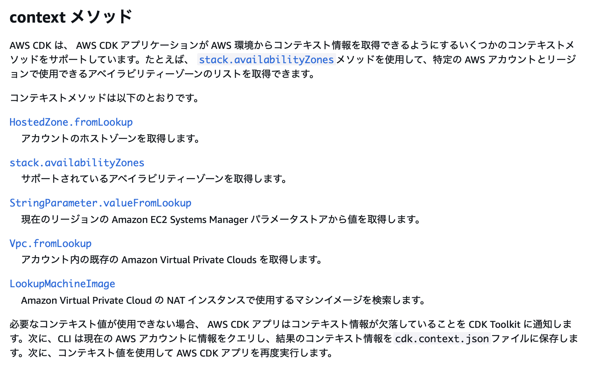
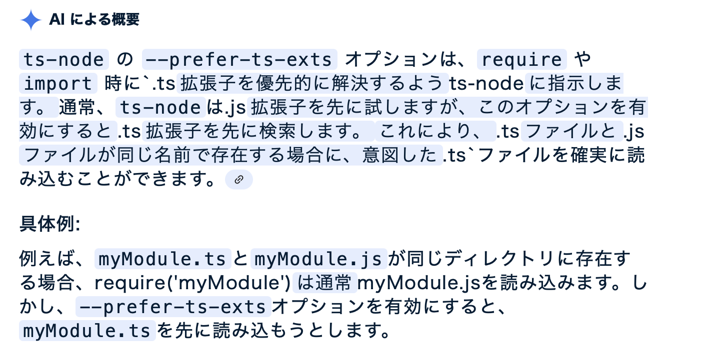

### CDK におけるコンテキストとは

- CDK におけるContextには2つの意味がある

    1. コンストラクトの機能としてのコンテキスト

        - コンストラクトにデータを注入するための機能

    <br>

    2. データ構造としてのコンテキスト (コンテキスト値)

        - キーとバリューの組み合わせ

<br>

- 親コンストラクトのコンテキストは子コンストラクトでも参照可能

    - 一方で、子コンストラクトのコンテキストは親コンストラクトから参照できない

        

<br>
<br>

参考サイト

[もっとじっくり AWS CDK のコンセプト 第8回 コンテキストの基本](https://www.ogis-ri.co.jp/otc/hiroba/technical/cdk-concepts/part8.html)

[コンテキスト値と AWS CDK](https://docs.aws.amazon.com/ja_jp/cdk/v2/guide/context.html)

---

### コンテキストの利用方法1 ~ getContext() ・ setContext()

- Construct クラスの node プロパティが持つ getContext() / tryGetContext() ・ setContext() でコンテキストの設定・取得を行う

    - ★App、Stack も Construct クラスを継承しているため、App, Stack でも node.getContext() ・ node.setContext() の利用が可能

    <br>

    - ★★Construct.node プロパティとは**その Construct のメタ情報やツリー構造に関する情報にアクセスするためのエントリポイント**らしい

        

<br>

- setConext() によるコンテキストの設定はあまり使わず、[cdk.json](#コンテキストの利用方法2--cdkjsoncdk-contextjson) や [--contextオプション](#コンテキストの利用方法3--cdk-コマンドの---context-オプション)でコンテキストを設定するのが一般的

<br>
<br>

#### コンテキストの設定

- `Construct.node.setContext(key: string, value: any)`

    ```TypeScript
    import * as cdk from 'aws-cdk-lib';
    import { Construct } from 'constructs';

    const app = new cdk.App();
    //★コンテキストの設定
    app.node.setContext("AppConext", "App Val");

    const stack = new cdk.Stack(app, "myStack", {});
    //★コンテキストの設定
    stack.node.setContext("StackContext": "Stack Val");

    const construct1 = new Construct(stack, "myConstruct", {});
    //★コンテキストの設定
    construct1.node.setContext("ConstructContext": "Construct Val");
    ```

<br>
<br>

#### コンテキストの取得

- `Construct.node.getContext(key: string)`

    ```TypeScript
    //コンテキストの設定の続き
    
    // "App Val" を取得
    const appContext = app.node.getContext("AppConext");

    // "Stack Val" を取得
    const stackContext = stack.node.getContext("StackConext");

    // "Construct Val" を取得
    const constructContext = construct1.node.getContext("ConstructContext");

    //★存在しないコンテキストキーを指定するとエラーが発生
    const otherContext = app.node.getContext("OtherContext");
    ```

<br>

- `Construct.node.tryGetContext(key: string)`

    ```TypeScript
    //コンテキストの設定の続き
    
    // "App Val" を取得
    const appContext = app.node.tryGetContext("AppConext");

    // "Stack Val" を取得
    const stackContext = stack.node,tryGetContext("StackConext");

    // "Construct Val" を取得
    const constructContext = construct1.node.tryGetContext("ConstructContext");

    //★存在しないコンテキストキーを指定するとundefinedが返ってくる
    const otherContext = app.node.tryGetContext("OtherContext");
    ```

<br>

#### getContext() と tryGetContext() の違い

- getContext()

    - 存在しないコンテキストキーを指定するとエラーが発生

    <br>

    - 必須コンテキストを取得する場合に使う

        - そのコンテキストが設定されてなければエラーを投げ、リソースの作成を中止するようなケースに役立つ

<br>

- tryGetContext()

    - 存在しないコンテキストキーを指定すると undefined が返ってくる

    <br>

    - 存在するかどうかわからないコンテキストを取得する場合に使う

        - tryGetContext() の結果、undefined ならばデフォルト値を利用するようなケースに役立つ

<br>

#### ポイント

- 親コンストラクトのコンテキストは子コンストラクトでも参照可能

    - ★親コンストラクトで設定したコンストラクトであっても、**子コンストラクトの node.getContext() / node.tryGetContext()** でコンテキストの取得が可能

        - ★★getContext() / tryGetContext() は現在のノードだけでなく親ノードもたどって検索する仕様 (DoublyLinkedList みたいにノードは親ノードと子ノードへの参照を持つ)

            ```TypeScript
            import * as cdk from 'aws-cdk-lib';

            const app = new cdk.App();
            //コンテキストの設定
            app.node.setContext("AppConext", "App Val");

            const stack = new cdk.Stack(app, "myStack", {});
            //★Appに渡したコンテキストの取得が可能
            stack.node.getContext("AppContext");
            stack.node.tryGetContext("AppContext");
            ```
    
<br>
<br>

参考サイト

[もっとじっくり AWS CDK のコンセプト 第8回 コンテキストの基本](https://www.ogis-ri.co.jp/otc/hiroba/technical/cdk-concepts/part8.html)

---

### コンテキストの利用方法2 ~ cdk.json / cdk.context.json

- #### cdk.json とは

    - cdk コマンドを実行する際に必要なメタデータ (コマンドのオプションなど) が定義されているファイル

    <br>

    - ★ざっくり説明すると、cdk コマンドのグローバルオプションなどを事前に設定しておけるファイルが cdk.json

        - 例: context の key=value のペアを cdk.json に定義しておくことで、 cdk コマンド実行時に --context オプションでコンテキストを渡さなくて済むようになる

            ```json
            #cdk.json
            {
                "app": "npx ts-node --prefer-ts-exts bin/{cdkプロジェクトのappモジュール}.ts",
                "context": {
                    "context-key1": "value1",
                    "context-key2": 2
                }
            }
            ```

            ```diff
            #上のようなcdk.jsonがあるCDKプロジェクトでのdeployコマンドは簡潔になる

            - npx aws-cdk deploy --context context-key1="value1" context-key2=2

            + npx aws-cdk deploy
            ```

    <br>

    - ★cdk.json の context 項目にはコンテキスト値の他に[機能フラグ](#cdkjson-の機能フラグとは)も設定できる

    <br>

    - ★★cdk コマンドのグローバルオプション全てを cdk.json に設定できるわけではないことに注意 

    <br>

    - また、--parameters のような、特定の cdk コマンドにのみ使えるオプションは cdk.json に設定することはできない

        ```json
        #cdk.json
        {
            #以下のようにparametersの定義はできない
            "parameters": [
                "val1",
                "val2",
                ...
            ]
        }
        ```

<br>
<br>

- #### cdk.context.json とは

    - 合成 (synthesize) 中に AWS アカウントから取得した値をキャッシュするファイル

        

        引用: [もっとじっくり AWS CDK のコンセプト 第9回 コンテキストと「環境」](https://www.ogis-ri.co.jp/otc/hiroba/technical/cdk-concepts/part9.html)

    <br>

    - コンテキストメソッドという **主に AWS アカウントの既存の AWS リソースや環境固有の情報を検索するメソッド (ルックアップメソッドとも呼ばれるらしい)** を利用すると、CDK は cdk.context.json というファイルを作成し、取得した情報を保存する

        

        引用: [コンテキスト値と AWS CDK - context メソッド](https://docs.aws.amazon.com/ja_jp/cdk/v2/guide/context.html#context-methods)

    <br>

    - cdk.context.json があることで、「決定的な」動作を保証するらしい

        - 要するに、同じデプロイ結果 (環境) を担保するために cdk.context.json が利用される

            

            

    <br>

    - ★cdk.context.json にはアカウント ID などが保存されることがあるので注意

        ```JSON
        #cdk.context.jsonの例
        #aws_ec2.MachineImage.lookup().getImage()とaws_ec2.Vpc.fromLookup()を利用したら以下のコンテキストがキャッシュされた
        #<>でくくられた値には実際の値が入る
        {
            #↓aws_ec2.MachineImage.lookup().getImage()の検索結果
            "ami:account=<アカウントID>:filters.image-type.0=machine:filters.name.0=amzn2-ami-hvm-*-x86_64-gp2:filters.state.0=available:region=<リージョン>": "ami-0e2c86481225d3c51",
            #↓aws_ec2.Vpc.fromLookup()の検索結果
            "vpc-provider:account=<アカウントID>:filter.tag:Name=<VPC名>:region=<リージョン>:returnAsymmetricSubnets=true": {
                "vpcId": "<VPC-ID>",
                "vpcCidrBlock": "10.0.0.0/16",
                "ownerAccountId": "<アカウントID>",
                "availabilityZones": [],
                "subnetGroups": [
                {
                    #検索結果のVPCのパブリックサブネットの情報
                    "name": "Public",
                    "type": "Public",
                    "subnets": [
                    {
                        "subnetId": "<Subnet-ID>",
                        "cidr": "10.0.0.0/20",
                        "availabilityZone": "<AZ>",
                        "routeTableId": "<ルーターテーブルID>"
                    },
                    {
                        "subnetId": "<Subnet-ID>",
                        "cidr": "10.0.32.0/20",
                        "availabilityZone": "<AZ>",
                        "routeTableId": "<ルーターテーブルID>"
                    }
                    ]
                },
                {
                    #検索結果のVPCのプライベートサブネットの情報
                    "name": "Isolated",
                    "type": "Isolated",
                    "subnets": [
                    {
                        "subnetId": "<Subnet-ID>",
                        "cidr": "10.0.0.0/20",
                        "availabilityZone": "<AZ>",
                        "routeTableId": "<ルーターテーブルID>"
                    },
                    {
                        "subnetId": "<Subnet-ID>",
                        "cidr": "10.0.0.0/20",
                        "availabilityZone": "<AZ>",
                        "routeTableId": "<ルーターテーブルID>"
                    }
                    ]
                }
                ]
            }
        }
        ```

        - ★★AWS アカウント ID 単体では機密情報になり得ないとのことだが、取り扱いには注意するべき by [公式](https://docs.aws.amazon.com/ja_jp/accounts/latest/reference/manage-acct-identifiers.html)

    <br>

    - ★cdk.context.json をクリアしないと、ずっと cdk.context.json から情報を取得する

        - cdk.context.json 内のコンテキスト情報をクリアするには以下のような方法がある

            1. cdk.context.json の中身または cdk.context.json 自体を手動で削除

            <br>

            2. `npx aws-cdk context --clear` コマンドで cdk.context.json の中身を全てクリアする

            <br>

            3. `npx aws-cdk context --reset <インデック>` コマンドで cdk.context.json のコンテキスト値を**指定して**削除する

                - `npx aws-cdk context` で、cdk.json と cdk.context.json に保存されているコンテキスト値 (機能フラグも含まれる) を一覧で確認することができる

                <br>

                - `npx aws-cdk context --reset` は、cdk.json のコンテキスト値は削除できない

<br>
<br>

参考サイト

cdk.json について

- [もっとじっくり AWS CDK のコンセプト 第8回 コンテキストの基本](https://www.ogis-ri.co.jp/otc/hiroba/technical/cdk-concepts/part8.html)

- [AWS CDK CLI リファレンス - 設定 (cdk.json)](https://docs.aws.amazon.com/ja_jp/cdk/v2/guide/cli.html#cli-config)

- [AWS CDK CLI コマンドリファレンス - オプションの提供と設定](https://docs.aws.amazon.com/ja_jp/cdk/v2/guide/ref-cli-cmd.html#ref-cli-cmd-configure)

- [ローカルブランチで作成した Lambda 関数をワークフローでデプロイする方法【CodeCatalyst】 cdk.json ファイル](https://qiita.com/hazure_engineer/items/70163bcec568444f5dfa#cdkjson-ファイル)

<br>

cdk.context.json について

- [The necessity of “cdk.context.json” in AWS CDK](https://dev.to/aws-heroes/the-necessity-of-cdkcontextjson-in-aws-cdk-3jp1)

- [もっとじっくり AWS CDK のコンセプト 第9回 コンテキストと「環境」](https://www.ogis-ri.co.jp/otc/hiroba/technical/cdk-concepts/part9.html)

- [AWS CDKにおける「cdk.context.json」の必要性](https://go-to-k.hatenablog.com/entry/cdk-context-json)

- [CDK Toolkit Library と CDK CLI の違い](https://go-to-k.hatenablog.com/entry/cdk-toolkit-cli-comparison)

- [コンテキスト値と AWS CDK](https://docs.aws.amazon.com/ja_jp/cdk/v2/guide/context.html#context-viewing)

<br>

アカウントIDは機密情報かどうかについて

- [AWS アカウント 識別子の表示](https://docs.aws.amazon.com/ja_jp/accounts/latest/reference/manage-acct-identifiers.html)

- [Are AWS account IDs sensitive information?](https://www.lastweekinaws.com/blog/are-aws-account-ids-sensitive-information/)

<br>

Cloud Assembly について

- [もっとじっくり AWS CDK のコンセプト 第1回 AWS CDK とは：アプリの開発キット](https://www.ogis-ri.co.jp/otc/hiroba/technical/cdk-concepts/part1.html)

---

### コンテキストの利用方法3 ~ cdk コマンドの --context オプション

- cdk コマンドに --context オプションをつけることで、コマンドからコンテキストを設定することが可能

    - key=value の形式でコンテキスト値を指定する

    - 複数のコンテキスト値を渡す際は --context オプションを繰り返す

        ```bash
        npx aws-cdk <コマンド> --context key=value

        #aws-cdk をグローバルインストールしていれば以下のように実行もできる
        cdk <コマンド> --context key1=value1 --context key2=value2
        ```

<br>

- ★--context オプションで渡されるコンテキストは App のコンテキストに設定される

    - よって、その子スタック / 子(孫)コンストラクトであれば、**どこからでも node.getContext() ・ node.tryGetContext() で参照可能**

<br>
<br>

参考サイト

[もっとじっくり AWS CDK のコンセプト 第8回 コンテキストの基本](https://www.ogis-ri.co.jp/otc/hiroba/technical/cdk-concepts/part8.html)

---

### 外部からCDKプロジェクトに値を渡す他の方法

1. #### --parametersオプション

    - ★context とは異なり cdk.json 中に定義することはできない

    <br>

    - CDK コマンドの --parameters オプションで渡ってくる値を CDK プロジェクト内で取得するには `aws-cdk-lib.CfnParameter` クラスを利用する

        - ★複数のパラメーターを渡したい場合は、それぞれ個別に --parameters を使って渡す

            ```bash
            npx aws-cdk deploy --parameters key1=val1 --parameters key2="val2"
            ```

            ```TypeScript
            //Stackモジュール
            import * as cdk from 'aws-cdk-lib';
            import { Construct } from 'constructs';

            export class MyStack extends cdk.Stack {
                constructor(scope: Construct, id: string, props?: cdk.StackProps) {
                    super(scope, id, props);

                    // pram1の受け取り
                    const param1 = new cdk.CfnParameter(this, "key1", {type: "Number", description: "param1"});
                    
                    // param2の受け取り
                    const param2 = new cdk.CfnParameter(this, "key2", {type: "String", description: "param2"});
                }
            }
            ```

    <br>

    - ★★ parameters の値が反映されるのは deploy 時のため、synth 時は値がまだ設定されないことに注意

        

    <br>

    - [公式](https://docs.aws.amazon.com/ja_jp/cdk/v2/guide/parameters.html)では、CDK プロジェクトに外部から値を渡す方法としてコンテキストの利用を推奨している

        → CDK では parameters を利用するべきではない

<br>
<br>

2. #### dotenv + process.env 変数

    - dotenv を利用して環境変数を .env で管理する

        ```bash
        npm install -D dotenv
        ```

    <br>

    - ★グローバル変数 process は Node.js の機能なので、TypeScript で利用するためには @types/node が必要となる

        - `cdk init` コマンドで CDK プロジェクト (TypeScript) を作成した場合、`@types/node` はインストール済みになっているはず

        - 自分でインストールする際は以下のコマンドを実行

            ```bash
            npm install -D @types/node
            ```

    <br>

    - dotenvの詳しい使い方は[こちら](https://zenn.dev/hayato94087/articles/007b5f5d68bec4)を参照

<br>
<br>

参考サイト

parameters オプションについて

- [パラメータと AWS CDK](https://docs.aws.amazon.com/ja_jp/cdk/v2/guide/parameters.html)

- [CloudFormation パラメータを使用して CloudFormation 値を取得する](https://docs.aws.amazon.com/ja_jp/cdk/v2/guide/get-cfn-param.html)

- [実践！AWS CDK #4 Context](https://dev.classmethod.jp/articles/cdk-practice-4-context/#toc-1)

<br>

環境変数 (process.env) について

- [AWS CDKメモ - 環境変数を.envファイルから読んでCDKで使う](https://zenn.dev/shimo_s3/articles/8c03c83d44c639#環境変数を.envファイルから読んでcdkで使う)


- [CDKのデプロイ先アカウントはどう定義すればいいの？](https://www.cloudbuilders.jp/articles/2798/)

---

### おまけ

1. #### cdk.context.json はコミットすべき?

    - [公式](https://docs.aws.amazon.com/ja_jp/cdk/v2/guide/context.html#context-construct)曰くコミットすべき

        - しかし、 cdk.context.json にアカウント ID や VPC ID などの情報が含まれることには留意する

<br>
<br>

2. #### cdk.json の機能フラグとは

    - CDK の特定の機能を ON / OFF にする仕組み
    
    - ★cdk.json の context 項目にて設定される

        - ★★コンテキスト値と機能フラグが context 項目に混在する

            ```json
            {
                "context": {
                    "機能フラグ1": true,
                    "機能フラグ2": false
                }
            }
            ```

            <br>

    - 機能フラグはなんのためにあるのか?

        - 破壊的変更を伴う機能変更を安全に反映するための仕組み = コードを書き換えることなく特定の機能を有効にしたり無効にしたりできる仕組み

            - 破壊的変更とは、既存の AWS CDK アプリが今まで通りに動作しなくなるような新機能や機能変更のこと

            - ★cdk.json に設定されていない機能フラグのデフォルト値は、機能フラグごとに異なる

                - 各機能フラグとそのデフォルト値については[FEATURE_FLAGS.md](https://github.com/aws/aws-cdk/blob/main/packages/aws-cdk-lib/cx-api/FEATURE_FLAGS.md)を参照すること

<br>
<br>

3. #### cdk.json の app とは

    ```json
    {
        "app": "npx ts-node --prefer-ts-exts bin/{cdkプロジェクトのappモジュール}.ts"
    }
    ```

    - ★app 項目に設定されているコマンドの意味は

        - 「ts-node で cdk プロジェクト直下の bin にある \~\~.ts (appモジュール) を実行する」

            - ts-node: TypeScript のコードを Node.js で実行できるようにするツール = TypeScript のコードをコンソール上で実行できるようにするツール

            <br>

            - TypeScript の実行ツールとして ts-node の他に tsx もある

            <br>

            - --prefer-ts-exts オプションはできるだけ TypeScript ファイルを優先して import/require するオプション

                
        
    <br>

    - ★★--app オプションに指定できるものは以下の2種類

        1. app モジュール (ts-node で実行)

        <br>

        2. クラウドアッセンブリが格納されているディレクトリ

            - クラウドアッセンブリ (Cloud Assembly) が格納されているディレクトリを指定すると、synth プロセスをスキップする

                ```bash
                #プロジェクトルート直下に cdk.out が生成されている場合
                npx aws-cdk deploy --app cdk.out
                ```

                ```json
                #cdk.jsonに--app cdk.outを事前に定義する場合
                {
                    "app": "cdk.out"
                }
                ```
            <br>

            - しかし、普通は app モジュールを実行し Cloud Assembly を生成するのが一般的 (--app に生成済みの
             Cloud Assembly を指定してしまうと、 CDK プロジェクトを修正しても反映されなくなる)

                - クラウドアッセンブリ (Cloud Assembly) とは、cdk synth によって作成されるファイル群のこと。cdk delpoy は Cloud Assembly をデプロイする
                
                    

                    引用: [もっとじっくり AWS CDK のコンセプト 第1回 AWS CDK とは：アプリの開発キット](https://www.ogis-ri.co.jp/otc/hiroba/technical/cdk-concepts/part1.html)

                <br>

                - Cloud Assebly はデフォルトで CDK プロジェクト直下の cdk.out に出力される

<br>
<br>

4. 1つの CDK プロジェクトに複数の App モジュールを含めることができる

    - ただし、cdk コマンドで実行できる App は1つだけ = --app オプションでどの App モジュールをエントリーポイントにするか指定する必要がある

    - 詳しくは [こちら](./CDK_Template/Multi-App/README.md)を参照

<br>
<br>

参考サイト

cdk.context.json のコミットの是非について

- [コンテキスト値と AWS CDK](https://docs.aws.amazon.com/ja_jp/cdk/v2/guide/context.html#context-construct)

- [AWS CDKでデプロイするときはキャッシュ（cdk.context.json）にも注目しよう](https://dev.classmethod.jp/articles/aws-cdk-deploy-check-context-json-cache/#%25E5%2585%2588%25E3%2581%25AB%25E7%25B5%2590%25E8%25AB%2596)

- [CDK Toolkit Library と CDK CLI の違い](https://go-to-k.hatenablog.com/entry/cdk-toolkit-cli-comparison)

<br>

機能フラグについて

- [もっとじっくり AWS CDK のコンセプト 第8回 コンテキストの基本](https://www.ogis-ri.co.jp/otc/hiroba/technical/cdk-concepts/part8.html)

- [365歩のテック AWS CDKにおける「cdk.context.json」の必要性](https://go-to-k.hatenablog.com/entry/cdk-context-json)

- [CDK Feature Flags](https://github.com/aws/aws-cdk/blob/main/packages/aws-cdk-lib/cx-api/FEATURE_FLAGS.md)

<br>

cdk.json の app 項目について

- [AWS CDK CLI コマンドリファレンス - グローバルオプション](https://docs.aws.amazon.com/ja_jp/cdk/v2/guide/ref-cli-cmd.html#ref-cli-cmd-options)

- [AWS CDK CLI リファレンス - アプリケーションコマンドを指定する](https://docs.aws.amazon.com/ja_jp/cdk/v2/guide/cli.html#cli-app-command)