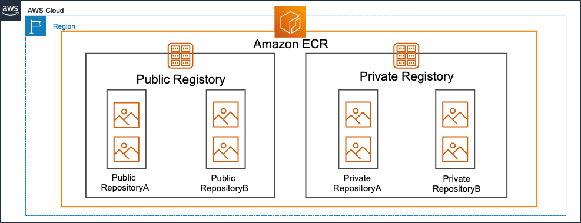
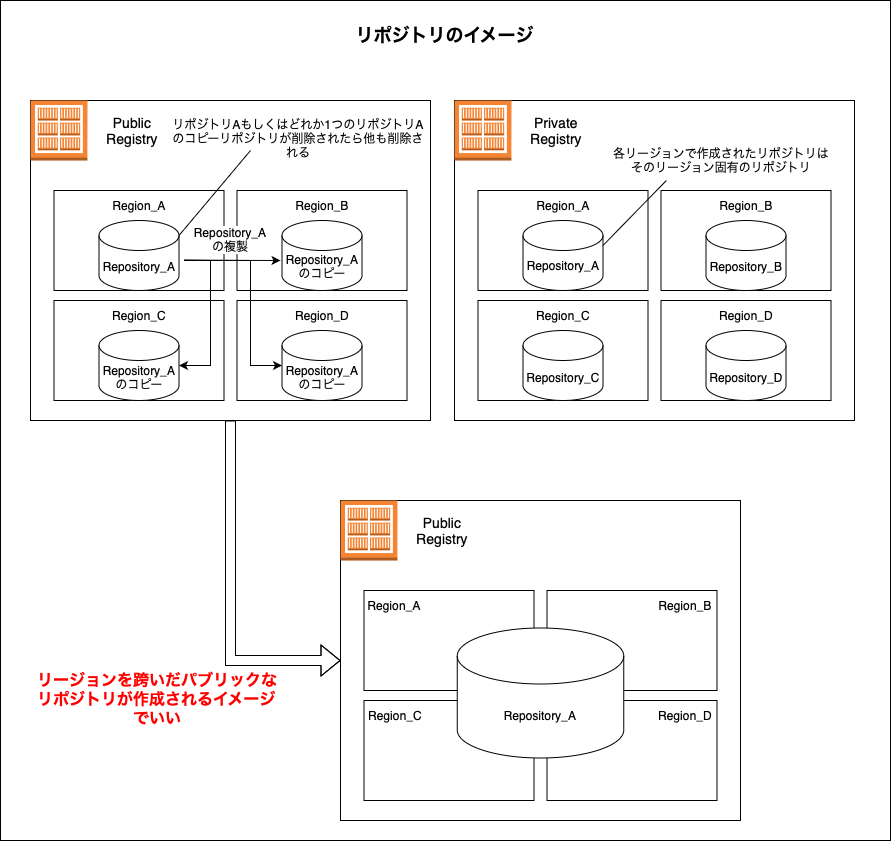
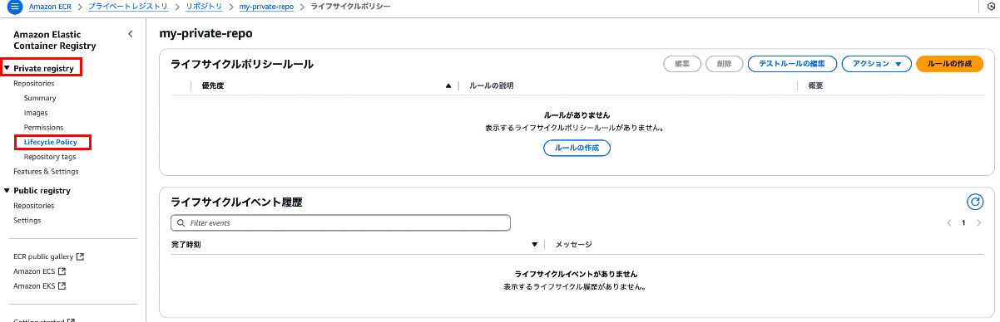
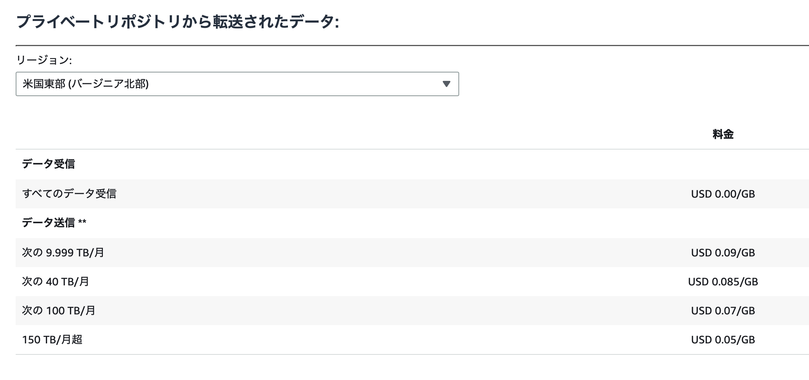
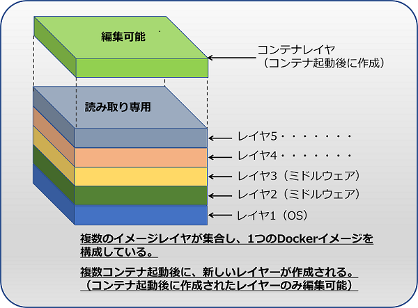
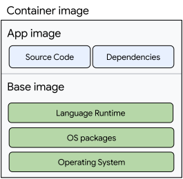

### AWS ECR とは

- Elastic Container Registry の略

 

- フルマネージドの Docker コンテナイメージのレジストリサービス

    - コンテナレジストリとは、**文脈によって**、コンテナイメージを保存しておく場所 (サーバー or リポジトリ) だったり、コンテナイメージのバージョン管理や配布を行えるツールだったりを意味する

    - AWS ECR ではコンテナイメージの保管場所の意味でのレジストリを提供するサービスのイメージ

 

- ECR はリージョンサービス

 
 

参考サイト

[【ふわっとわかるIT用語】コンテナレジストリとは？](https://easy-study-forest.com/it-container-container-registry/)

[Managed Service Column ＜システム運用コラム＞ コンテナレジストリとは？パブリックレジストリとプライベートレジストリの違い](https://www.rworks.jp/system/system-column/sys-entry/21778/)

[Amazon Elastic コンテナレジストリのよくある質問 ~ Amazon ECR はグローバルサービスですか?](https://aws.amazon.com/jp/ecr/faqs/#product-faqs#faqs-ecr-faqs-general-4-trigger)

---

### レジストリとリポジトリ

 

引用: [AWS再入門ブログリレー2022 Amazon ECR編](https://dev.classmethod.jp/articles/re-introduction-2022-ecr/)

 

#### レジストリ (Registry)

- レジストリとは、ざっくり言うと複数の[リポジトリ](#リポジトリ)の集まり

 

- ECR では Public Registry と Private Registry がある

    - **Public Registry**

        - AWS アカウントを必要とせず、IAM 認証情報を使用しなくても、誰でもどこからでもイメージをプルできるレジストリ

         

        - イメージのプッシュは適切な IAM 権限が必要

         

        - ★Public Registry に作成するリポジトリは全 AWS リージョンにレプリケートされる

            - ★★2025/04/01 現在で利用可能なリージョンは `バージニア北部` と `オハイオ` のみ = Public Registry にリポジトリを作成するとその2リージョンにレプリケートされる
    
     

    - **Private Registry**

        - ★イメージのプッシュ&プルには IAM 権限が必要

            - IAM ユーザー、グループ、ロールにアタッチする[アイデンティティベースのポリシー](./IAM_Policy.md#アイデンティティベースのポリシー-1)で ECR へのアクションの権限を設定できる

             

            - また、Registry や Repository にアタッチする[リソースベースのポリシー](./IAM_Policy.md#リソースベースのポリシー-1)で ECR へのアクションの権限を設定することも可能

         

        - Public Registry では利用できない機能を Private Registry では利用できる

            - [コンテナイメージのクロスリージョンレプリケーションやクロスアカウントレプリケーション](#クロスリージョンおよびクロスアカウントレプリケーション)

            - [イメージの脆弱性スキャン](#イメージスキャン)

            - [プルスルーキャッシュルール](#プルスルーキャッシュルール)

 

- ★ECR では **AWS アカウントごと**に1つの Public Registry と Private Registry が与えられている

    - 新規で Public Registry / Private Registry の作成はできない

 
 

#### リポジトリ (Repository)

 

- ざっくり言うと、コンテナイメージを保存する保存場所

- Public Registry にリポジトリを作成すると Public Repository になり、Private Registry にリポジトリを作成すると Private Repositoryになる

    - **Public Repository**

        - 2025/04/01 時点では`バージニア北部` と `オハイオ` でしか利用できない

            - 詳しくは[こちら](https://dev.classmethod.jp/articles/ecr-public-repository-docker-certification-errorlient/)を参照

         

        - パブリックリポジトリへプッシュしたコンテナイメージは、他のリージョンのパブリックリポジトリに自動で複製される

            - イメージ的には、リージョンを跨いだ1つのパブリックリポジトリがわかりやすい

         

        - パブリックリポジトリに保存されているコンテナイメージは [Amazon ECR パブリックギャラリー](https://gallery.ecr.aws)に自動で公開される

         

        - プライベートリポジトリには無い、コンテナイメージの検索機能が提供されている

     

    - **Private Repository**

        - ★リージョンごとに作成される

            - [Private Registry のクロスリージョン機能](#クロスリージョンおよびクロスアカウントレプリケーション)を利用すると、とあるリージョンのリポジトリへプッシュしたコンテナイメージが他のリージョンのリポジトリに複製される

 
 

参考サイト

レジストリとリポジトリについて
- [AWS再入門ブログリレー2022 Amazon ECR編](https://dev.classmethod.jp/articles/re-introduction-2022-ecr/)
- [CR のレジストリとリポジトリの違い](https://qiita.com/shate/items/a24ae736bcd91787801c)
- [AWS ECRを理解したい](https://zenn.dev/oktan/articles/c8f06658e12b71)

 

Public Registry, Public Repository について
- [AWS からのニュース re:Invent – Docker Official Images on Amazon ECR Public](https://www.docker.com/ja-jp/blog/news-from-aws-reinvent-docker-official-images-on-amazon-ecr-public/)
- [［速報］AWS、Docker Hubの代替を狙う「Amazon Elastic Container Registry Public」提供開始。AWS re:Invent 2020](https://www.publickey1.jp/blog/20/awsdocker_hubamazon_elastic_container_registry_publicaws_reinvent_2021.html)
- [ECRをパブリックレジストリとして利用可能になりました！ #reinvent](https://dev.classmethod.jp/articles/ecr-public-registry/)

---

### 特徴

#### 他の AWS サービスとの統合 (連携)

- [AWS ECS](./AWS_ECS.md) (Elastic Container Service) と簡単に連携できる

    - [ECS](./AWS_ECS.md) や EKS、 Lambda と連携でき、AWS 上でコンテナアプリケーションの開発から本稼働まで済ませることができる

        - 例: ECR にプッシュしたコンテナイメージを ECS で動かす&公開する

 
 

#### セキュリティ

- ECR へのコンテナイメージのプッシュ、 ECR からのコンテナイメージのプルは HTTPS で行われる

    - ★★ECR を利用する場合、**S3 のストレージ使用量は発生しない**が、ECR 独自のストレージ使用量は発生する

 

- ECR へプッシュされたイメージは S3 に保管され、保管時には暗号化される

    - デフォルトでは、暗号化に利用されるキーは S3 が管理する SSE-S3

    - [KMS](https://github.com/MasaGt/aws/blob/395f884f7fc610aae01a03180cfcbf1b46180059/KMS.md) に保管してあるキーを代わりに使うことも出来る (KMS の利用料金が発生することに注意)

 

- [レジストリポリシー](#レジストリポリシー)と[リポジトリポリシー](#リポジトリポリシー)によるアクセスコントロールも可能

    - (同一アカウントの場合) 上記のポリシーを利用する代わりに IAM ユーザー、グループ、ロールに対して付与するアイデンティティベースのポリシーでもアクセスコントロール可能
    
    - クロスアカウントの場合はレジストリ or リポジトリポリシーとアイデンティティベースのポリシーの両方の設定が必要

 
 

#### 高可用性

- コンテナイメージは S3 に保存されるので、冗長性と耐久性に優れた形で保管される

    - S3 は選択されたリージョンのうち3つの AZ に複製されるから

 
 

#### Docker のサポート

- ECR へのコンテナイメージのプッシュや ECR からのプルは AWS CLI からだけではなく、**Docker クライアントからも行うことができる**

    - Docker クライアントとは Docker を操作するための CLI ツール

 
 

参考サイト

[AWS ECRの特徴8つ｜コンポーネント4つもあわせて紹介！](https://www.openupitengineer.co.jp/column/it-technology/8512)

[【AWS】Amazon Elastic Container Registry(ECR)について解説します。](https://www.acrovision.jp/service/aws/?p=2761)

[Amazon ECR の暗号化のベストプラクティス](https://docs.aws.amazon.com/ja_jp/prescriptive-guidance/latest/encryption-best-practices/ecr.html)

[AWS再入門ブログリレー2022 Amazon ECR編](https://dev.classmethod.jp/articles/re-introduction-2022-ecr/)

---

### 機能

#### ライフサイクルポリシー

- ★プライベートリポジトリのみの機能

 

- ライフサイクルポリシーとは、**リポジトリに保存してあるイメージに対して条件を設定し、その条件に一致したイメージを自動で削除する機能**

    - 例: リポジトリにプッシュしてから30日以上経過したイメージを期限切れに (=削除) する様にライフサイクルポリシーを作成&設定

 

- ライフサイクルポリシーを設定すると、すぐに反映されてしまうため誤った条件を設定してしまうと実は必要だったイメージが削除されてしまう恐れがある

    - ライフサイクルポリシーには**リハーサル機能**というものがあり、実際に反映する前に作成したライフサイクルポリシーの影響範囲を確認することができる

 

- マネージドコンソールから設定したい場合、ライフサイクルポリシーを設定したいプライベートリポジトリを選択し、サイドメニューにある `Lifecycle Policy` をクリックする

    

 
 

#### イメージスキャン

- ★プライベートレジストリのみの機能

 

- レジストリ内のコンテナイメージの脆弱性スキャン (= 脆弱性のチェック) を行う機能

    - コンテナイメージの詳しい構成については[こちら](#コンテナイメージの構成について)を参照

 

- イメージスキャンには以下の2種類がある

    1. 基本スキャン

        - Clairと呼ばれるオープンソースの脆弱性データベースを参照してスキャンしているらしい

        - 内容: OS パッケージの脆弱性スキャン = **コンテナイメージの OS レイヤーの脆弱性チェック**

         

        - スキャンのタイミング: コンテナイメージを ECR にプッシュした時、または手動で基本スキャンを実行可能

         

        - ★基本スキャンの利用に料金は発生しない

     

    2. 拡張スキャン

        - [Amazon Inspector](https://www.wafcharm.com/jp/blog/amazon-inspector-for-beginners/)でスキャンする方法

        - 内容: OS パッケージ + プログラミング言語パッケージの脆弱性スキャン

            - ★★プログラミング言語パッケージとは、npm や pip でインストールしたモジュールのこと

         

        - スキャンのタイミング: コンテナイメージを ECR にプッシュした時、または拡張スキャンが利用しているツールの脆弱性情報が更新されたら自動で再スキャンが実行される

            - ★拡張スキャンでは手動でのスキャンはできない

         

        - ★拡張スキャンは利用料金 (AWS Inspectorのスキャン料金) が発生することに注意

            - push 時のスキャン: 0.09 USD (バージニア北部リージョン)

            - 再スキャン: 0.01 USD (バージニア北部リージョン)

         

        - イメージを何度もプッシュするようなリポジトリに拡張スキャンを利用すると結構な費用が発生することに注意

 
 

#### クロスリージョンおよびクロスアカウントレプリケーション

- ★プライベートレジストリのみの機能

 

- **レジストリを丸ごと**、他のリージョンのレジストリに複製したり、他アカウントのレジストリに複製できる

 

- **レジストリ内のリポジトリ単位**で他リージョンに複製したり、他アカウントに複製することもできる

 

- ★データ転送料金が発生することに注意

    - 転送元 (= 複製元) は転送先のリージョンに基づいたデータ送信料がかかる

    - 転送先 (= 複製先) のデータ受信料は発生しない

 
 

#### プルスルーキャッシュ

- ★プライベートレジストリのみの機能

 

- ECR プライベートレジストリ内にパブリックレジストリのリポジトリをキャッシュする機能

    - キャッシュ後は、24時間に1回キャッシュを最新のものに更新してくれる

 

- キャッシュされたコンテナイメージはプライベートレジストリに保存されるので、ストレージの使用料金が発生することに注意

 
 

参考サイト

ライフサイクルポリシーについて
- [ECR「ライフサイクルポリシー」でイメージの保管数を管理する](https://www.skyarch.net/blog/ecr「ライフサイクルポリシー」でイメージの保管/)
- [Amazon ECRライフサイクルポリシーを試してみる](https://blog.serverworks.co.jp/ecr-image-lifecycle)
- [ECRのライフサイクルポリシー設定によるリポジトリ容量の節約](https://dev.classmethod.jp/articles/ecr-lifecycle/)

 

イメージスキャンについて
- [ECRのイメージスキャンはどちらのタイプを選ぶべきなのか](https://blog.serverworks.co.jp/ecr-image-scan)
- [When and How to Use Trivy to Scan Containers for Vulnerabilities](https://www.jit.io/resources/appsec-tools/when-and-how-to-use-trivy-to-scan-containers-for-vulnerabilities)
- [チュートリアルDockerコンテナの脆弱性スキャン ~ Dockerイメージを更新します。](https://gitlab-docs.creationline.com/ee/tutorials/container_scanning/#update-the-docker-image)
- [Amazon ECRとInspectorのイメージスキャン機能の違い](https://qiita.com/hayao_k/items/889f2a6cdc4e377fb634)
- [新たなAmazon Inspectorと統合されたAmazon ECRのイメージスキャン拡張版がリリースされました！ #reinvent](https://dev.classmethod.jp/articles/amazon-ecr-enhanced-scanning/)

 

クロスリージョンレプリケーションについて

- 

 

クロスアカウントレプリケーションについて

 

プルスルーキャッシュについて

- [Amazon ECRプルスルーキャッシュリポジトリをVPCエンドポイント経由で試す](https://qiita.com/t_tsuchida/items/d3c284aac0f84a597c70)
- [Amazon ECRに「プルスルーキャッシュリポジトリ」機能が追加されました #reinvent](https://dev.classmethod.jp/articles/ecr-pull-through-cache-repositories/)

---

### レジストリポリシーとリポジトリポリシーによるアクセスコントロール

- #### レジストリポリシー

    - レジストリに対して設定するリソースベースのポリシー

        - そのレジストリの全てのリポジトリに適用される

     

    - ★プライベートレジストリのみに設定可能

 
 

- #### リポジトリポリシー

    - 対象のリポジトリに対して設定するリソースベースのポリシー

        - そのリポジトリにのみ適用される

     

    - ★プライベートリポジトリ、パブリックリポジトリの両方で設定可能

 
 

参考サイト

[ECRのレジストリポリシーとリポジトリポリシーの違い（初学者むけ）](https://zenn.dev/ustack/articles/cb38623fe2b119)

---

### 料金

#### 基本的なコスト

1. [ストレージ料金](#ストレージ料金)

2. [データ転送にかかる料金](#データ転送料)

3. [暗号化の種類によってかかる料金](#暗号化にかかる料金)

 
 

#### ストレージ料金

- ★リージョン、レジストリの種類 (パブリック/プライベート) 関係なく、リポジトリに保存されてるデータ 1GB あたり 0.01 USD (2025/05/12 時点)

- パブリックリポジトリのみ、常時 50GB 分のストレージ料金の無料枠が提供される

 
 

#### データ転送料

- プライベートレジストリ (リポジトリ) の場合

    - プライベートリポジトリへのイメージの put にはデータ転送料金 (in) は発生しない

    - プライベートリポジトリからイメージの pull には **pull されるプライベートリポジトリ側にて** データ転送料 (out) が発生する

        - リージョンによってデータ転送料 (out) は異なる

     

    

    引用: [Amazon Elastic Container Registry の料金](https://aws.amazon.com/jp/ecr/pricing/?nc1=h_ls)

 

- パブリックレジストリ (リポジトリ) の場合

    - パブリックリポジトリは特定のリージョンに作成されるわけではないので、パブリックリポジトリからのデータ転送料にリージョンは関係ない

    - パブリックリポジトリへの put にはデータ転送料金 (in) は発生しない

    - パブリックリポジトリからの pull には **pull されるパブリックリポジトリ側にて** データ転送料 (out) が発生する
        
        - ユーザーの種類 (アノニマス / AWS ユーザー) や pull 先 (AWS リージョン / AWS リージョン以外) によって内容が異なってくる

        - ★アノニマスユーザーから 500GB 以上 pull される場合、パブリックリポジトリにそれ以上 pull できなくなる制限がかかる

     

    

    引用: [Amazon Elastic Container Registry の料金](https://aws.amazon.com/jp/ecr/pricing/?nc1=h_ls)

 
 

#### 暗号化にかかる料金

- SSE-S3 の場合、料金は発生しない

- SSE-KMS の場合、 KMS 側で料金が発生する

- DSSE-KMS の場合、 KMS 側と ECR 側の両方で料金が発生する

    - DSSE-KMS は米国の GovCloud リージョンのみで利用可能な暗号化タイプなので、基本的には関係ないと考えて良い

引用: [Amazon Elastic Container Registry の料金](https://aws.amazon.com/jp/ecr/pricing/?nc1=h_ls)

 
 

参考サイト

[Amazon Elastic Container Registry の料金](https://aws.amazon.com/jp/ecr/pricing/?nc1=h_ls)

---

### コンテナイメージの構成について

- ★Docker のコンテナイメージの構成は以下のような感じになっている

    

    引用: [【入門】Dockerイメージ（images）の仕組みとコマンド一覧まとめ](https://www.kagoya.jp/howto/cloud/container/dockerimage/)

 

- OS レイヤーの中身は filesystem と仮想化OSの動きを模倣するための Libraries で構成されている

- ★カーネル自体はホスト PC のカーネルを使う

    

    引用: [今から追いつくDocker講座！AWS ECSとFargateで目指せコンテナマスター！〜シリーズ1回目〜](https://www.youtube.com/watch?v=DS5HBTMG1RI&list=PLtpYHR4V8Mg-jbuk4yoXhXwJtreodnvzg&index=2)

 
 

- ★プログラミング言語ポッケージとは?

    

    [ベースイメージの自動更新を構成する](https://cloud.google.com/run/docs/configuring/services/automatic-base-image-updates?hl=ja)
