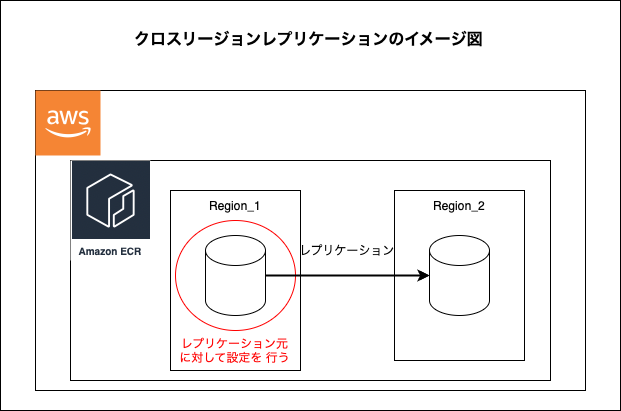
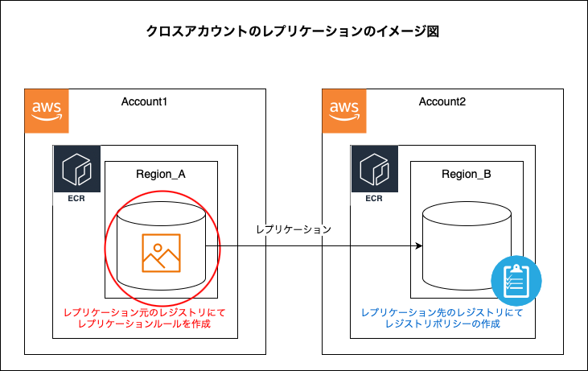

### クロスリージョンレプリケーション (Cross Region Replication)

 

 

#### ポイント

- クロスリージョンレプリケーションは、個別のリポジトリではなく、**レジストリに対して設定するもの**

 

- レプリケーション元へのイメージの**削除**はレプリケーション先に反映されない

    - つまり、上記画像の Region_1 のリポジトリからイメージを削除しても Region_2 のリポジトリからはイメージは削除されず残ったまま
    
    - イメージを削除する場合は、レプリケーション元とレプリケーション先の各々でイメージ削除を行う必要がある

 
 

#### 手順

1. 複製元の ECR レジストリ画面のサイドメニューにある `Features & Settings` の下にある `Replication` か、画面の `レプリケーション ` の編集ボタンをクリックする

    

 

2. `ルールを追加`　をクリックし、レプリケーションの設定を行う

    

 

3. 送信先タイプに `クロスリージョンレプリケーション` を選択し、 `次へ` をクリックする

    

 

4. レプリケーション先となるリージョンを設定し、`次へ` をクリック

    

 

5. レプリケーションにフィルタリングをかけたい場合、フィルタを追加し `次へ` をクリック

    

     

    - ★リポジトリフィルタ (リポジトリ名) を入力すると、そのリポジト名から始まるリポジトリのみをレプリケーション元に設定する

        - 例: リポジトリフィルタに `test` と入力すると、`test` や `test-repo`, `test01` などのリポジトリのみをレプリケーション元として設定するようなる

        
        
 

6. レプリケーションの設定内容を確認し、`ルールを送信` をクリックする

    

 

7. 設定が完了すると、`Replication` 画面に追加したレプリケーションルールが表示される

    

 
 

参考サイト

[Amazon ECRのクロスリージョンレプリケーションを試してみた](https://dev.classmethod.jp/articles/20240229-ecr-crr/)

[ECRのクロスリージョン・クロスアカウントレプリケーションが、複製元で対象リポジトリの限定が可能に！](https://dev.classmethod.jp/articles/ecr-replicate-individual-repositories-regions-accounts/)

[【AWS】ECRのクロスリージョンレプリケーション利用時の注意事項](https://wakaru-blog.com/blog/ecr-replication/)

---

### クロスアカウントレプリケーション (Cross Account Replication)

 

 

#### ポイント

- レプリケーション元とレプリケーション先でそれぞれ設定する必要がある

    - レプリケーション元: レプリケーションルールの作成

    - レプリケーション先: レジストリポリシーを作成し、レプリケーションによる書き込みを許可

 

- [クロスリージョンレプリケーション](#クロスリージョンレプリケーション-cross-region-replication)と同様に、イメージの削除はレプリケーションされない

 
 

#### 手順

##### レプリケーション元のアカウント側の操作

1. 複製元の ECR レジストリ画面のサイドメニューにある `Features & Settings` の下にある `Replication` か、画面の `レプリケーション ` の編集ボタンをクリックする

    

 

2. `ルールを追加`　をクリックし、レプリケーションの設定を行う

    

 

3. 送信先タイプに `クロスアカウントレプリケーション` を選択し、 `次へ` をクリックする

    

 

4. レプリケート先のアカウント ID とリージョンを指定し `次へ` をクリックする

    - ★★レプリケート先のレジストリポリシーで**レプリケーションを許可**するよう設定する必要がある

    

 

5. レプリケーションにフィルタリングをかけたい場合、フィルタを追加し `次へ` をクリック

    

 

6. レプリケーションの設定内容を確認し、`ルールを送信` をクリックする

    

 

7. 設定が完了すると、Replication 画面に追加したレプリケーションルールが表示される

    

 

##### レプリケーション先のアカウント側の操作

1. レプリケーション先となるレジストリの `Features & Settings` から `Replications` か `許可の編集` をクリックする

    

 

2. `ステートメントの生成` をクリックし、**レジストリポリシー**を生成する

    

 

3. クロスアカウントレプリケーションを許可するよう定義し、`保存` をクリックする

    - ポリシータイプ
        - クロスアカウントレプリケーション

     

    - ステートメント ID
        - 当ポリシーの ID のようなもの (管理しやすいものであればなんでも OK)

     

    -  アカウント

        - レプリケーション元の AWS アカウント ID

    

 

4. 保存後はレジストリポリシー画面に自動で遷移するので、設定内容を確認する

    - クロスアカウントレプリケーションを許可するポリシーの内容

        - 自分のレジストリにリポジトリを作成するアクションを許可

        - 自分のレジストリにイメージをレプリケーションするアクションを許可

    
    
 
 

#### 動作確認

1. レプリケーション元のリポジトリにイメージをプッシュする

    

 

2. レプリケーション先のレジストリに同名のリポジトリが作成されている & イメージがレプリケーションされていることを確認する

    

 
 

参考サイト

[AWS ECRのクロスアカウントレプリケーションを設定してみた](https://tech-blog.yayoi-kk.co.jp/entry/2021/03/08/110000)

[ECRのクロスリージョン/クロスアカウントレプリケーションを試す](https://blog.shikoan.com/ecr-replication/)