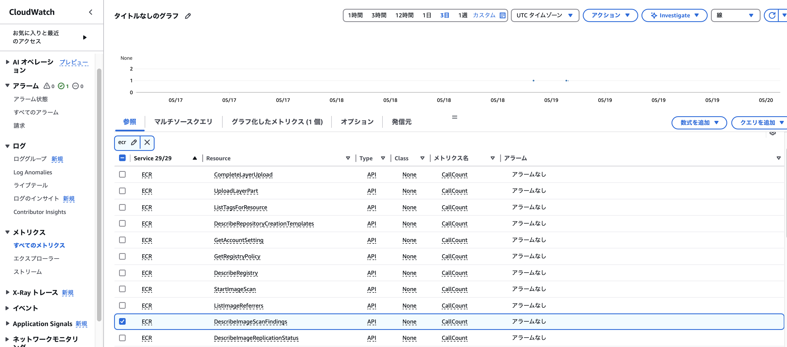

### 基本スキャン

- ★基本スキャンは DB や web サーバーなどのミドルウェアはスキャンの対象にしない

- ★スキャニング設定はレジストリに対して行う

    - フィルタリングで特定のリポジトリに限定することもできる

<br>

#### プッシュ時に基本スキャンを走らせる手順

1. AWS コンソールマネージメントにロングインし、ECR に遷移し、サイドメニューにある `Features & Settings` 以下の `Scanning` もしくは Features & Settings 画面の `スキャン中 編集` をクリックする

    

<br>

2. 各項目を設定し、`保存` をクリック

    - スキャンタイプ

        - 基本スキャンを選択

    <br>

    - プッシュファイルターのスキャン

        - `プッシュ時に全てのリポジトリをスキャンする` にチェックを入れることで、当レジストリに作成された全てのリポジトに対して Push 時スキャンを走らせることもできる

        <br>

        - フィルターを追加することで、特定のリポジトリへの Push 時のみスキャンを走らせることが出来る

            - フィルターにはワイルドカード (\*) を使うこともできる

    

<br>

#### Push 時スキャンの動作確認

1. AWS CLI で基本スキャン設定済み (プッシュ時のスキャンを有効化) のレジストリにイメージをプッシュする

    - ★スキャンに引っかかるように脆弱性のある以下のイメージをプッシュする

        ```bash
        docker pull cved/cve-2016-9838
        ```

    <br>

    - ★★AWS CLI 側ではスキャンに関する情報は何も表示されない

        

<br>

2. AWS マネージドコンソールにログインし、 ECR に遷移し、動作確認1でプッシュしたリポジトリのイメージを選択する

    

<br>

3. 選択したイメージの `スキャンと脆弱性` の項目にスキャン結果が表示される

    

<br>
<br>

#### 基本スキャンを手動で走らせる

- AWS マネージドコンソールから実行する場合

    - 手動スキャンを実行したいリポジトリに移動し、スキャン対象のイメージにチェックをいれ、`スキャン` をクリック (複数イメージに対して自動スキャンを走らせることが出来る)

        

    <br>

    OR

    <br>

    - 手動スキャンを実行したいイメージの詳細画面まで移動し、「スキャンと脆弱性」の項目にある `スキャン` をクリック (1つのイメージに対して自動スキャンを走らせる方法)

        

<br>

- AWS CLI から実行する場合

    1. `aws ecr start-image-scan` コマンドでイメージダイジェスト or イメージタグを指定して手動基本スキャンを実行する

        - ★--image-id に渡すイメージ ID をイメージダイジェストで取得するか、イメージタグで取得するかの違い

        ```bash
        # 必要であれば --region や --profile もつける

        # イメージタグを指定してスキャンを実行する場合
        aws ecr start-image-scan --repository-name <repo_name> --image-id imageTag=<tag_name>

        # イメージダイジェストを指定してスキャンを実行する場合
        aws ecr start-image-scan --repository-name <repo_name> --image-id imageDigest=<sha256_hash>
        ```

        

    <br>
    <br>

    2. `aws ecr describe-image-scan-findings` コマンドでスキャン結果を確認する

        - このコマンドも**イメージタグかイメージダイジェスト**で確認したいスキャン結果のイメージを指定する

        ```bash
        # 必要であれば --region や --profile もつける

        # イメージタグを指定してスキャン結果を確認する場合
        aws ecr describe-image-scan-findings --repository-name <repo_name> --image-id imageTag=<tag_name>

        # イメージダイジェストを指定してスキャンを実行する場合
        aws ecr describe-image-scan-findings --repository-name <repo_name> --image-id imageDigest=<sha256_hash>
        ```

        

<br>
<br>

参考サイト

[Amazon ECR でスキャンするリポジトリを選択するためのフィルター](https://docs.aws.amazon.com/ja_jp/AmazonECR/latest/userguide/image-scanning-filters.html#image-scanning-filters-wildcards)

[Amazon ECR で OS 脆弱性がないか調べるためのイメージの手動スキャン](https://docs.aws.amazon.com/ja_jp/AmazonECR/latest/userguide/manual-scan.html)

[Amazon ECR での基本スキャンの結果の取得](https://docs.aws.amazon.com/ja_jp/AmazonECR/latest/userguide/describe-scan-findings.html)

---

### 拡張スキャン

- AWS コンソールマネージメントにロングインし、ECR に遷移し、サイドメニューの `Scanning` にて、スキャンタイプを `拡張スキャン` に変更する拡張スキャンが利用できる

    - ★拡張スキャンではプッシュ時のスキャンは利用できない

        - その代わりに連続スキャン (脆弱性情報が更新されたら自動で再スキャンが実行される) が利用できる

            - フィルターを追加することで、対象のリポジトリのみ連続スキャンの対象にすることが出来る

    

---

### スキャン結果の監視

- スキャン結果は [EvenrBridge](./EventBridge.md) に連携することで、異常があってもすぐ認識することが出来る

<br>
<br>

#### スキャン結果の監視設定手順

1. SNS トピックを作成する

    

<br>

2. EventBridge にてルールを作成する

    - 検出結果**全て**をターゲットに送信したい場合は、イベントパターンをパターンフォームから選択すればいい

        

    <br>
    <br>

    - ★★検出結果に条件を設定し、**その条件を満たしたスキャン結果の時だけ**ターゲットに送信したい場合は、カスタムパターンでイベントに条件を設定する必要がある

        - ★イメージスキャンイベントのイベントパターンは[こちら](https://docs.aws.amazon.com/ja_jp/AmazonECR/latest/userguide/ecr-eventbridge.html)を参照

        - ★イベントパターンに設定できる条件 (演算子など) は[こちら](https://docs.aws.amazon.com/ja_jp/eventbridge/latest/userguide/eb-create-pattern-operators.html)を参照

        

<br>

3. ECR にイメージをプッシュして確認する

    

<br>
<br>

#### ポイント

- ECR のイメージスキャンの結果、脆弱性が検出された場合、イベントの `finding-severity-counts` にその脆弱性のレベルと検出件数が出力される
    
    

    

<br>
<br>

#### 疑問: [CloudWatch](./CloudWatch.md) でスキャン結果のメトリクスを監視できないのか?

- 答え: できない

    - ECR のスキャン結果に関するメトリクス `aws ecr describe-image-scan-findings` あるが、 これは **イメージスキャン API のコール回数** のメトリクス

    - よって、CloudWatch は ECR スキャンの結果を監視し、脆弱性が発生された場合に通知することはできない

    

<br>
<br>

参考サイト

[Amazon ECR イベントと EventBridge](https://docs.aws.amazon.com/ja_jp/AmazonECR/latest/userguide/ecr-eventbridge.html)

[Amazon EventBridge のイベントパターンで使用する比較演算子](https://docs.aws.amazon.com/ja_jp/eventbridge/latest/userguide/eb-create-pattern-operators.html)