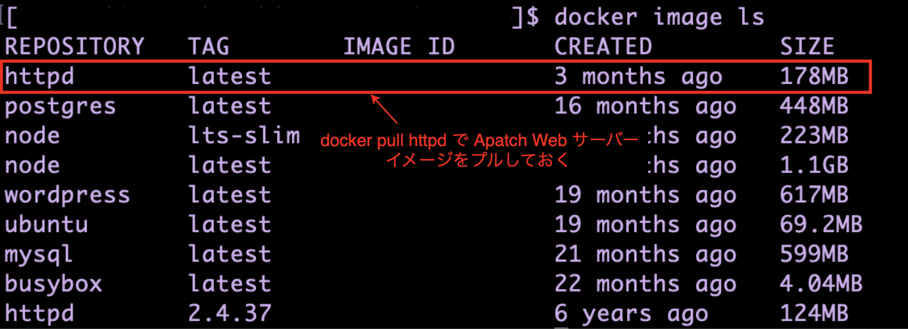
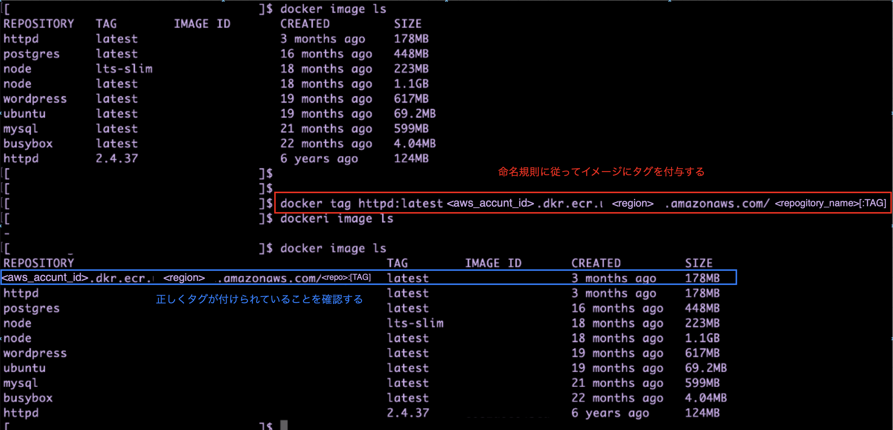

### ECR へイメージの push

- ★AWS CLI で行う

#### 大まかな手順

1. [ECR のレジストリにリポジトリを作成](#1-リポジトリの作成)
2. [イメージを用意](#2-イメージの用意)
3. [ECR から認証トークンを取得 & リポジトリにログイン](#3-ecr-から認証トークンを取得--リポジトリにログイン)
4. [イメージにタグをつける](#4-プッシュしたいイメージに新しくタグをつける)
5. [新しいタグをつけたイメージをプッシュ](#5-イメージをプッシュ)

<br>
<br>

#### 1. リポジトリの作成


<br>
<br>

#### 2. イメージの用意



<br>
<br>

#### 3. ECR から認証トークンを取得 & リポジトリにログイン

- ★CLI から ECR への操作を行う場合は、docker login でログインする必要がある

    - docker login する際に必要な情報は ECR から認証トークンを取得する必要がある

<br>

- 一般的には以下のコマンドで認証トークンの取得＆ログインを行う

    ```bash
    aws ecr get-login-password --region <region> | docker login --username AWS --password-stdin <aws_account_id>.dkr.ecr.<region>.amazonaws.com
    ```

    ##### 上記コマンドの解説

    - ECR へ認証トークンのリクエストをするには、`aws ecr get-login-password` コマンドで取得できる

        ```bash
        # リージョンとプロファイルオプションは省略可能
        aws ecr get-login-password --region <region> --profile <profile>
        ```

    - docker login で ECR リポジトリを指定してログインをする。ログインの際には `aws ecr get-login-password` で取得したトークンを使う

        ```bash
        # パスワードを打ち込む場合
        docker login -u <username> -p <password> <server>

        # パスワードを標準入力から取得する場合
        docker login -u <username> --password-stdin <server>
        ```

        

<br>

- ログインが成功すると、`$HOME/.docker/config.json` に認証情報が保存される

    

<br>
<br>

#### 4. プッシュしたいイメージに新しくタグをつける

- ★ECR では他のレジストリサービス (DockerHub など) と同じように、対象のリポジトリにイメージをプッシュするには、**そのイメージのタグをとある命名規則に従って付与する必要がある**

    - ★★タグ名はリポジトリ URI と同じにする必要がある
    
    ```bash
    docker tag <target>[:TAG] <aws_account_id>.dkr.ecr.<region>.amazonaws.com/<my-repository>[:TAG]
    ```

    

<br>
<br>

##### 5. イメージをプッシュ

- `docker push` コマンドでイメージをプッシュする

    ```bash
    docker push <aws_account_id>.dkr.ecr.<region>.amazonaws.com/<my-repository>[:TAG]
    ```

    

<br>

- ★手順4で説明した通り、正しいタグ名が付けられていないと push が失敗する
    
    

<br>
<br>

#### ポイント

- docker イメージの push 自体は docker コマンドで行う

- docker コマンドの操作対象 (リポジトリ) に対する認証を取得するために aws ecr コマンドを使う

<br>

#### ベストプラクティス

- ★1つのリポジトリにつき1種類の docker イメージを管理する

- 1つのリポジトリに2種類以上のイメージを管理することも可能だが、以下のようにタグの部分で名前を分けて管理することになる

    ```bash
    # image1 にタグを付与
    docker tag <image1> ~~:image1

    # image2 にタグを付与
    docker tag <image2> ~~:image2
    ```

<br>
<br>

参考サイト

[[初心者向けシリーズ] Dockerイメージを作成しAmazon ECRにプッシュする方法を確認してみた](https://dev.classmethod.jp/articles/beginner-series-to-check-how-t-create-docker-image-and-push-to-amazon-ecr/)

[Amazon ECR プライベートリポジトリへの Docker イメージのプッシュ](https://docs.aws.amazon.com/ja_jp/AmazonECR/latest/userguide/docker-push-ecr-image.html)

[AWS ECRにDockerイメージをpushする一連の流れを復習する](https://qiita.com/Ryku/items/7a3ae8a960bf2b59fcc0)

[Docker イメージを変更し、新しいタグをつけてpushする](https://zenn.dev/cozynooks/scraps/0fb00cc0f773ab#comment-46e713461ca2b5)

[AWS ECRで複数のコンテナイメージを管理するためのリポジトリ数](https://muriwashinai.hatenablog.com/entry/2024/07/01/070000)

[AWS CLIでECRにログインする時はget-loginではなくget-login-passwordを使おう](https://qiita.com/hayao_k/items/3e4c822425b7b72e7fd0)

[docker loginの認証はどこで実行されるか](https://qiita.com/autotaker1984/items/9b88b234b34b0e26fbdd)

---

### ECR からイメージの pull

- ★AWS CLI で行う

#### 大まかな手順

1. [ECR から認証トークンを取得 & リポジトリにログイン](#3-ecr-から認証トークンを取得--リポジトリにログイン)

2. [ECR からイメージをプル](#2-ecr-からイメージをプル)

<br>
<br>

#### 2. ECR からイメージをプル

- `docker pull` コマンドで指定したイメージを pull する

    ```bash
    docker pull <aws_account_id>.dkr.ecr.<region>.amazonaws.com/<repogitory_name>[:TAG]
    ```

<br>
<br>

参考サイト

[ECRを使ったコンテナ管理：DockerイメージをECRにプッシュするための基本と実践](https://qiita.com/free-honda/items/fc8de2af0abfc3be9eb9)

[ECRにDockerコンテナイメージをpush、pullする](https://zenn.dev/kouichirou/articles/62c8e49730776f)

[AWS ECRにDockerイメージをpushする一連の流れを復習する](https://qiita.com/Ryku/items/7a3ae8a960bf2b59fcc0)