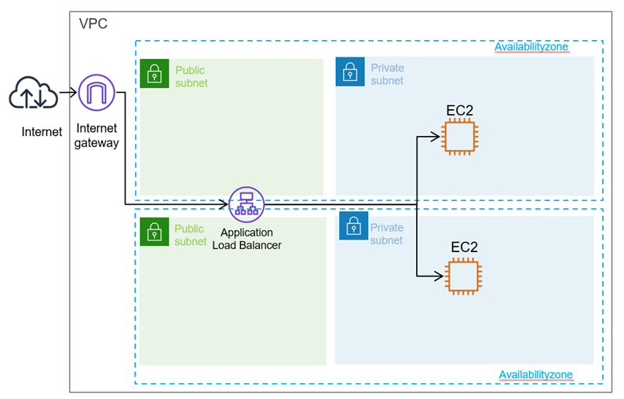
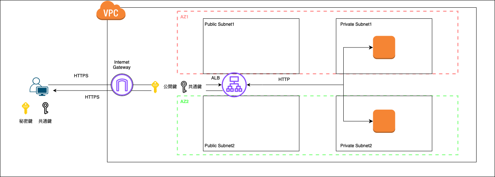
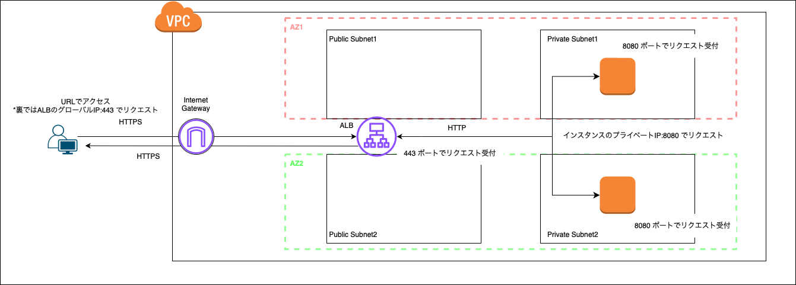

### AWS ELB とは

AWS でのロードバランサーを提供するサービスはElastic Load Balancing (ELB)

AZ サービス

ELB で利用できるロードバランサーは複数の種類がある

- #### ALB (Application Load Balancer)
    - 利用するには、2 AZ (Availability Zone) 以上が必要（1 AZ では起動できない
    - ロードバランサー自体への固定 IP 付与はできない
    - 対応プロトコル: HTTP、HTTPS
    
<br>

- #### NLB (Network Load Balancer)
    - 1 AZ または複数 AZ の指定が可能
    - ロードバランサー自体への固定 IP 付与可能
    - 対応プロトコル: TCP、UDP、TLS
    - SSL 化処理を持たせることができる
    - 1秒あたり数百万リクエストを処理可能

<br>

- #### GLB (Gateway Load Balancer)
    - 1 AZ または複数 AZ の指定が可能
    - ロードバランサー自体への固定 IP 付与はできない
    - 対応プロトコル: HTTP、HTTPS, TCP
    - AWS 上でサードパーティのセキュリティ製品(ファイアウォールなど)と組み合わせて使いたい場合に便利(**たぶん**)

<br>

*利用するロードバランサーによって料金が異なる

<br>

#### どのように使い分けをしたら良いのか?

ALB を選ぶケース
- HTTP,HTTPS リクエストの分散処理を行いたい
- ロードバランサーに SSL 化処理を行わせたい
- Web サービスを提供するケースで特に理由がなければ多分 ALB

<br>

NLB を選ぶケース
- 高速に処理を行わせたい、数秒間に何百万リクエストを捌かせたい
- リアルタイムのゲームとか
- HTTP/HTTPS以外のTCP、UDPを使用する場合

<br>

GLB を選ぶケース
- サードパーティのセキュリティ製品と組み合わせたい場合とか?

<br>
<br>

参考サイト

[[AWS Black Belt Online Seminar] Elastic Load Balancing (ELB)](https://d1.awsstatic.com/webinars/jp/pdf/services/20191029_AWS-Blackbelt_ELB.pdf)

[【初心者向け】Elastic Load Balancing(ELB) 入門！完全ガイド](https://zenn.dev/issy/articles/zenn-elb-overview#albapplication-load-balancer)

[AWSのロードバランサーとは？　ALB・NLBの違いと用途について](https://business.ntt-east.co.jp/content/cloudsolution/ih_column-26.html#section-6)

---

### ALB (Application Load Balancer)

ポイント1
- アクセスの経路: ユーザー -> ロードバランサー -> プライベートサブネットに配置されたインスタンス
    - ロードバランサーから NAT ゲートウェイを経由してプラベートサブネットにアクセスはしない
    - $\color{red} NAT ゲートウェイはプライベートサブネットからインターネットアクセスの時に経由される$



引用: [AWSのロードバランサーとは？　ALB・NLBの違いと用途について](https://business.ntt-east.co.jp/content/cloudsolution/ih_column-26.html)

<br>

ポイント2
- ロードバランサーにサーバー証明書を配置し、インターネット間の通信を HTTPS (SSL 暗号化) で行うことができる

- 一方で、ロードバランサーと VPC 上の Web サーバーなどのインスタンス間の通信は HTTP で行うことで、 Web サーバーの負荷を減らしたり、鍵の管理を楽にすることができる



<br>

ポイント3
- **インターネットからのアクセスを割り振りたい場合**
、ALB を作成する際にロードバランサーに Public Subnet を関連づける必要がある

    - イメージ的には ALB をパブリックサブネットに配置するイメージ

<br>

ポイント4
- ALB はポートフォーワーディング機能も持つ
    - ロードバランサーは https(443) ポートでインターネットからのアクセスを待ち受け

    - アクセスを受けた場合、 プライベートサブネットにある http 通信を 8080 ポートで待ち受けているインスタンスにリクエストを送る (設定によって他ポートでも可)

    - AWS 上で[ターゲットグループ](./AWS_ELB_TargetGroup.md)の作成が必要



<br>

ALB についての参考サイト1: [ロードバランサーのサブネットとルーティング](https://docs.aws.amazon.com/ja_jp/prescriptive-guidance/latest/load-balancer-stickiness/subnets-routing.html)

---
<div id="health-check"></div>

### ヘルスチェックとは

サーバーに異常が起きていないかを確認するために、ロードバランサーから定期的に振り分け先のサーバーにリクエストを送ること

<br>

#### ヘルスチェックの種類
- アクティブ型
    - ロードバランサーからリクエストを振り分ける対象のサーバーにリクエストを送り、そのレスポンスを監視する方法

<br>

- パッシブ型
    - サーバーのクライアントへのレスポンスを監視する方法
    - ロードバランサーからはヘルスチェックのリクエストを送信しないのがポイント

<br>

#### ヘルスチェックの方法 (アクティブ型)

-  pingチェック (IP レベルのチェック)
    -　ping　が通るかのチェック

<br>

- ポートチェック (TCP レベルのチェック)
    - SYN パケット（接続要求）を送付し、それに対する ACK パケット（確認応答）が返ってくるかどうかをチェックするらしい

<br>

- HTTP(S) チェック (コンテンツレベルのチェック)
    - サーバーへの HTTP(S) リクエストのレスポンスをチェックする
    - ALB のヘルスチェックがこれ

<br>

ポイント
- ヘルスチェックとは ELB 特有の機能ではなく、ロードバランサー全般が持つ機能のこと

<br>
<br>

参考サイト

ヘルスチェックの種類について
- [F5 GLOSSARYヘルスチェック](https://www.f5.com/ja_jp/glossary/health-check)

ヘルスチェックの方法について
- [ダウンサーバを回避して接続を維持する](https://atmarkit.itmedia.co.jp/ait/articles/0303/05/news001.html)

---

### スティッキーセッション

- 同じクライアント (同じセッション ID) からのリクエストを特定のサーバーにルーティングする機能

- 詳しくは[こちら](https://github.com/MasaGt/CS/blob/1613eb010b87df4b65d1d2f1eb0b2ff07ea96549/LoadBalancer.md)を参照

- ELB (ALB) にてスティッキーセッションを有効化する方法は[こちら](./AWS_ELB_TargetGroup_Attributes.md) を参照

<br>
<br>

参考サイト

[AWSのロードバランサーのスティッキーセッションの仕組み](https://techblog.techfirm.co.jp/entry/knowledge-about-elb-stickysession)

[【基礎から学ぶ】ELBのスティッキーセッションについてまとめてみた](https://blog.serverworks.co.jp/tech/2017/01/05/elb-sticky/#ELBのスティッキーセッションについて)

---

### リスナー、リスナールール、アクション

- #### ルール

    - リスナーは「どのプロトコル（HTTP/HTTPSなど）・ポートでリクエストを受け取るか」の定義のこと

<br>

- #### リスナールール

    - リクエストに対して設定するルールセットのこと

    - リスナールール内に条件とアクションを定義することで、条件に一致したリクエストに対するアクションを実行させることができる

<br>

- #### アクション

    - リスナールールに一致したリクエストに対する処理のこと

        - `ターゲットグループに転送`

            - 定義ずみの[ターゲットグループ](./AWS_ELB_TargetGroup.md)にリクエストを転送する

        <br>

        - `URL にリダイレクト`

            - 指定の URL にリクエストを転送する

        <br>

        - `固定レスポンスを返却する`

            - レスポンスコード、Content-Type、レスポンス本文を設定できる

<br>

- #### デフォルトアクション

    - 他のリスナールールにマッチしなかったときに実行されるアクションのこと

<br>
<br>

参考サイト

[【図解】ALBの構成要素（リスナー・ルールなど）やELBとの違いを解説【AWS】](https://konishi-tech.com/alb/)

[ELB（Elastic Load Balancer）のリスナーとは？AWSにおけるリスナーの基本的な役割と機能](https://www.issoh.co.jp/column/details/2893/)

[ALBリスナールールを使って特定パス以下のアクセスを許可IPからのみに制限する](https://dev.classmethod.jp/articles/alb-path-and-ip-based-restriction/)

[Application Load Balancer のリスナールール](https://docs.aws.amazon.com/ja_jp/elasticloadbalancing/latest/application/listener-update-rules.html)

---

### 利用料金

#### 基本的なコスト

- ロードバランサーの1時間ごとの利用料金

    - 作成後１時間ごとに使用料が発生する

    - 全く利用していなくとも、1時間ごとに料金は発生することに注意

    - 利用するロードバランサーの種類によって金額が異なる

<br>

- LCU (Load Balancer Capacity Unit)

    - ロードバランサーへの接続アクセス数/処理したバイト数などのうち、**一番使用量の多い要素にのみ** に対してさらに費用が発生する (1時間ごとに料金が発生)

    - 利用するロードバランサーの種類によって、LCU で評価される要素は異なる

    - 利用するロードバランサーによって、 1時間あたりの LCU 料金は異なる

<br>

#### 練習問題

1. ALB の利用料金の例

    ```
    作成した ALB の今月の利用状況は以下の通りであった、ALB の利用料金はいくらか?

        - リージョンはバージニア北部

        - クライアントは ALB に1秒あたり平均1つの新たなコネクションを確立する

        - 1つのコネクションで平均2分接続する

        - ALB 側で1秒間に処理するリクエスト/レスポンスの合計サイズは 300 KB

        - ALB ではリクエストのルーティングに 60 個のルールを設定し、すべてのリクエストに 60 個のルールが適用されるとする

            - ALB は毎秒5つのリクエストを受信する


    ◼️ ALB の利用料金を計算

    - バージニア北部での ALB の利用料金は0.0225 (USD/h)

    従って、 0.0225 × 24 (時間) × 30 (日) = 16.2 (USD/月)
    
    ----------------------

    ◼️ LCU の料金を計算

    以下の4つの要素について考えると...

    ● 新しい接続 (1 秒あたり)

        1. クライアントでは 1 秒あたり 1 つの新しいコネクションを確立する

        2. ALB の LCU の 1 つの評価要素である「新しい接続 (1秒あたり)」を見てみると
        
            - 1 LCU = 1秒に 25 個の新しいコネクションの確立

        3. ★よって、当 ALB の「新しい接続 (1秒あたり) 」の LCU は 1 / 25 = 0.04 LCU と評価される

    ----------------------

    ● アクティブ接続 (1 分あたり)

        ★アクティブ接続数の基本的な計算方法

            - 新しい接続数 (秒) × 接続時間 (秒)

        1. クライアントは 1 秒あたり1つの新しいコネクションを確立する = 1 分で 60 個のコネクションを確立する

        2. 1つのコネクションは 2 分 ALB に接続する = 1分で平均 120 個のコネクションが ALB に接続する

        3. ALB の LCU の 1 つの評価要素である「アクティブ接続 (1 分あたり)」を見てみると

            - 1 LCU = 1 分あたり 3,000 件のアクティブ接続、 (相互 TLS を利用している場合は 1 分あたり 1,500 件のアクティブ接続)

        4. よって、当 ALB の「アクティブ接続 (1 分あたり)」の LCU は 120 / 3,000 = 0.04 LCU と評価される

    ----------------------

    ● 処理タイプ = 処理されたリクストとそのレスポンスのバイト数 (GB/時)

        1. 当 ALB で処理するリクエスト/レスポンスの合計サイズは 300 KB

        2. よって、1時間に処理されるリクエスト/レスポンスの合計サイズは

            - 300 (KB/秒) × 60 (秒) × 60 (分) = 1,080,000 (KB)  = 1.08 (GB)

        3. ALB の LCU の 1 つの評価要素である「プロセスされたバイト数 (GB/時)」を見てみると

            - 1 LCU = 1 時間あたり 1 GB を処理した場合

        4. よって、当 ALB の「プロセスされたバイト数 (GB/時)」の LCU は 1.08 / 1.0 = 1.08 LCU と評価される
    
    ----------------------

    ● ルール評価 (1 秒あたり)

        - ★10 個のルール適用分は無料枠として提供されている

            - ★★★ ルール評価についてのLCU = リクエスト数(秒) × (適用されるルールの数 - 無料分の 10 個のルール)

        1. 当 ALB は毎秒5つのリクエストを受信する

        2. すべてのリクエストに 60 個のルールが適用されるとする

        3. よって、1秒間に適用されるルールの数は

            - 5 (リクエスト数) × ( 60 (適用ルール数) - 10 (無料利用枠) ) = 250 (適用ルール数/秒)

        4. ALB の LCU の 1 つの評価要素である「ルール評価 (1 秒あたり)」を見てみると

            - 1 LCU = 1 秒あたり 1,000 個のルール評価

        5. よって、当 ALB の「ルール評価 (1 秒あたり)」の LCU は 250 / 1000 = 0.25 LCU と評価される

    
    各要素の LCU の値を比較すると、一番大きい値は「プロセスされたバイト数 (GB/時)」の 1.08 LCU


    バージニア北部での LCU 料金は 0.008 (USD/h)

    したがって発生する LCU の料金は

        - 0.008 (USD) × 1.08 (LCU) × 24 (時間) × 30 (日) = 6.2208 (USD)

    ★★★　AWS の請求料金は少数第3位で四捨五入されるので、6.22 USD

    ----------------------

    ALB の利用料金と LCU の料金を合算して、16.2 + 6.22 = 22.42 USD

    したがって、22.42 USD の ALB 利用料金が発生する
    ```

<br>
<br>

参考サイト

[【AWS入門】AWSのELBとは？ロードバランサーの種類、特徴、料金を紹介](https://cloudnavi.nhn-techorus.com/archives/3640#ELB)

[Elastic Load Balancing 料金表](https://aws.amazon.com/jp/elasticloadbalancing/pricing/)

[【新機能】新しいロードバランサー Application Load Balancer（ALB）が発表されました](https://dev.classmethod.jp/articles/alb-application-load-balancer/)

[ALB 課金ルール](https://www.alibabacloud.com/help/ja/slb/application-load-balancer/product-overview/alb-billing-rules)