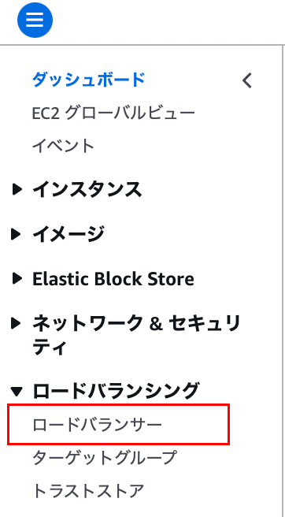
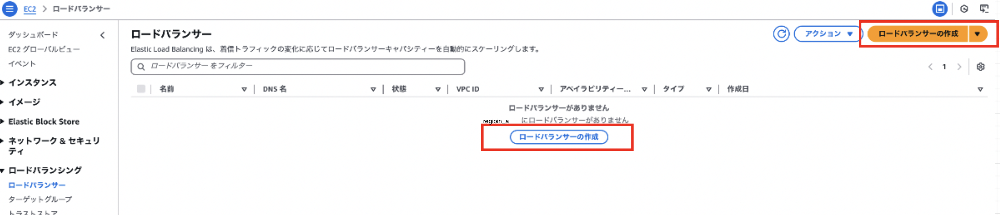
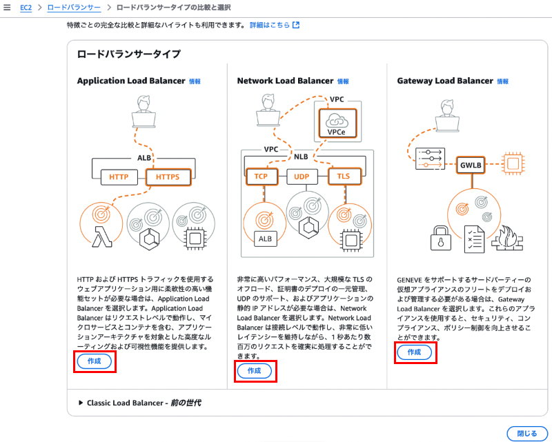

### ALB を作成する

1. マネージドコンソールにログインし、EC2 画面に遷移、サイドメニューから `ロードバランサー` を選択する

    

 

2. ロードバランサー画面にて、 `ロードバランサーの作成` をクリックする

    

 

3. 作成する ELB の種類を選択し `作成` をクリック

    

 

4. 必要事項を設定し、`ロードバランサーの作成` をクリックする

    #### 基本的な設定

    - `ロードバランサー名`

     

    - `スキーム`

        - 作成するロードバランサーの[スキーム](#スキーム)を選択

     

    - `ロードバランサーの IP アドレスタイプ`

        - IPv4

            - 作成するロードバランサーは IPv4 の IP アドレスのみ持つことができる

         

        - Dualstack
        
            - 作成するロードバランサーは IPv4 と IPv6 のどちらの IP アドレスも持つことができる

            - ★作成するロードバランサーを配置する**サブネットは IPv6 をサポートするものでなければならない**

         

        - パブリック IPv4 のない Dualstack (スキームが「インターネット向け」のみ選択可能)

            - 作成するロードバランサーは IPv6 の IP アドレスのみ持つことができる

            - ★作成するロードバランサーを配置する**サブネットは IPv6 をサポートするものでなければならない**

         
         

        #### ネットワークマッピング

        - `VPC`

            - 作成するロードバランサーを配置する VPC

         

        - `Availability Zones and subnets`

            - 作成するロードバランサーを配置する AZ とサブネット

            - ALB は最低 2 AZ を選択する必要がある

         
         

        #### セキュリティグループ

        - `セキュリティグループ`

            - 作成するロードバランサーに付与するセキュリティグループ

            - 例: HTTP / HTTPS のリクエストをターゲットに割り振るロードバランサーを作成する場合、HTTP / HTTPS を許可するインバウンドルールを設定したセキュリティグループを作成するロードバランサーに付与する必要がある

         
         

        #### リスナーとルーティング

        - `プロトコル`

            - 作成するロードバランサーが受け付けるリクエストのプロトコル

         

        - `ポート`

            - 作成するロードバランサーがリクエストを受け付けるポート番号

         

        - `デフォルトアクション`

            - デフォルトでのリクエストの振り分け先

         
         

        #### ロードバランサータグ

        - 作成するロードバランサーに付与するタグ
        
         
         

        #### Amazon Cloud Front + AWS Application Firewall (WAF)

        - `Apply application layer accceleration and security protections - in front of the load balancer`

             
            
            - `Security best practice`

         
         

        #### AWS Application Firewall (WAF)

        - `アプリケーション層のセキュリティ保護 - ターゲットの前`

             

            - Auto-create pre-defined WAF

                 

                - `ルールアクション`

                - `Resource name`

             

            - Use an existing WAS configration

                - `ウェブ ACL`
        
         
         

        #### AWS Global Accelerator

        - `複数のリージョンにグローバル負荷分散を適用`

             

            - `Accelerator 名`

 
 

参考サイト
ロードバランサーの IP アドレスタイプについて
- [【アップデート】インターネット向けApplication Load Balancer (ALB) が IPv6のみのアドレスをサポートしました](https://www.sunnycloud.jp/column/20240519-01/)

---

### スキーム

- インターネット向け

    - ロードバランサーはパブリック IP アドレスを持つ

        - よって、ロードバランサーはインターネットからアクセスされることができる

    - 用途: 一般的なインターネットからのリクエストを割り振るロードバランサーに用いる

 

- 内部

    - ロードバランサーはプライベート IP アドレスのみを持つ

        - よって、ロードバランサーは VPC 内部からのみアクセスされる

    - 用途: VPC 内部のリクエストを割り振るロードバランサーに用いる (内部APIの負荷分散や、VPC内部のサービスへのリクエスト分散など)

 
 

参考サイト

[ALBの内部向けとインターネット向けの違いについて](https://blog.mmmcorp.co.jp/2025/02/18/types-of-alb/)
