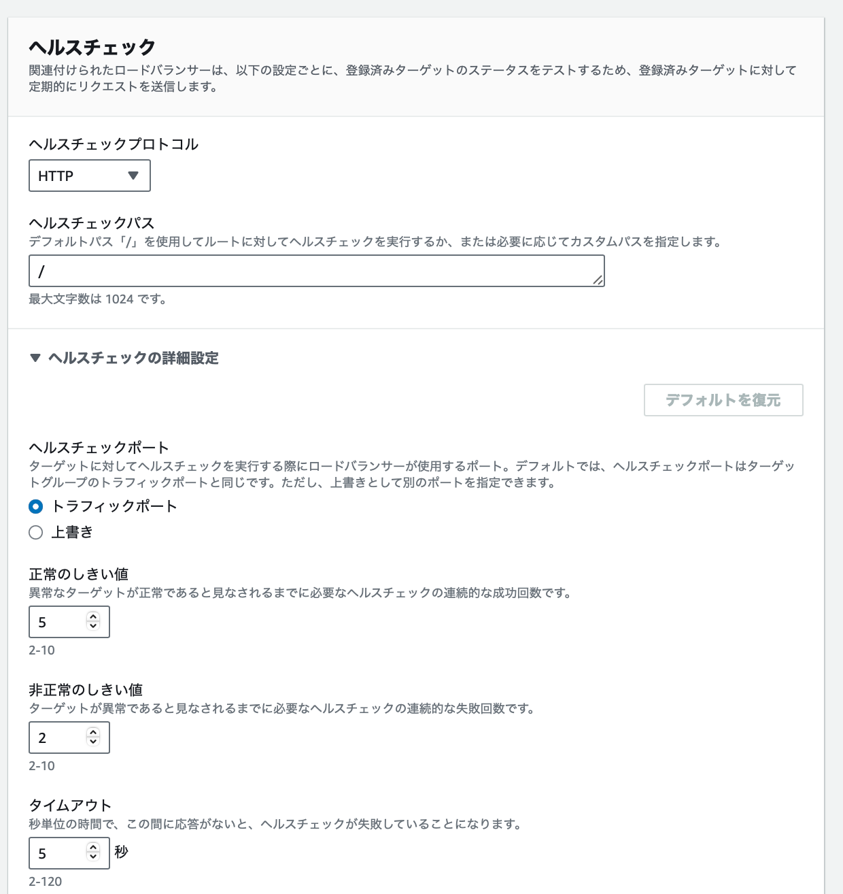
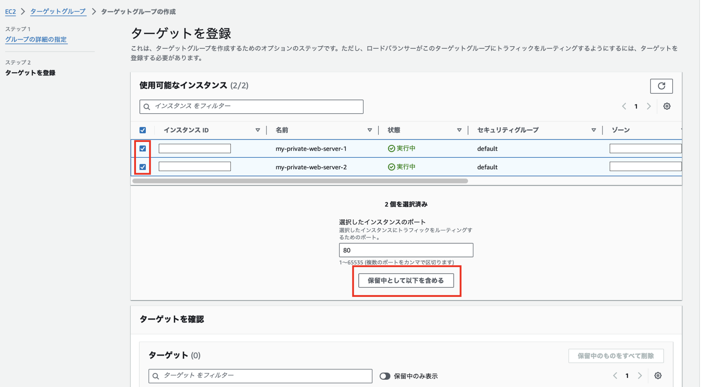

### ターゲットグループ (Target Group)

ターゲットグループとは、 ELB によってリクエストが振り分けられる対象のこと

- 下の画像でいうと プライベートサブネット1 & 2 に配置されているインス
タンス達

 

*ELB にターゲットグループを設定しないと、ELB はリクエストをどこに捌けばいいかわからないので、ターゲットグループの作成&設定は必ず必要

 
 

参考サイト

[【AWS】ロードバランサーを運用する上で重要！ターゲットグループのヘルスチェックの基本と設定方法](https://zenn.dev/takuh/articles/4446e12c607a6b#ターゲットグループとヘルスチェックの役割)

---

### ターゲットグループの作成

1\. EC2 ダッシュボードにて「ターゲットグループ」画面の「ターゲットグル
ープの作成」をクリックする

 

2\. ターゲットグループの設定

 

- ターゲットタイプ

    - `インスタンス`: 以下のインスタンスにアクセスの分散が可能
        - ロードバランサーを設置する VPC 上のインスタンスをターゲットグループに指定する

     
    
    - `IP アドレス`: 以下のインスタンスにアクセスの分散が可能

        - ロードバランサーを設置するVPC に接続しているオンプレ上のインスタンス

        - ロードバランサーを設置する VPC にペアリング接続している他の VPC 上のインスタンス

    - *ロードバランサーを設置する VPC 内のインスタンスにリクエストを割り振る場合、ターゲットタイプはインスタンスでいい

 

 

- `ターゲットグループ名`
    - 作成するターゲットグループ名

 

- `プロトコル: ポート`
    - ロードバランサーが、「なんのプロトコル」で「何番ポート」にリクエストを振り分けるかについての設定

    - ロードバランサーがユーザーとのやり取りを SSL 化していれば、 ロードバランサーとプライベートインスタンス(Webサーバー)間のやり取りは HTTP でいい

 

- `IPアドレスタイプ`
    - ターゲットグループに登録したいインスタンスのプライベートIPアドレスのタイプ

 

- `VPC`
    - ターゲットグループに設定するインスタンスがある VPC を選択

 

- `プロトコルバージョン`
    - ALB とターゲットのインスタンスとの間の通信プロトコルを指定

    - HTTP2 については[こちら](https://github.com/MasaGt/CS/blob/1613eb010b87df4b65d1d2f1eb0b2ff07ea96549/HTTP2.md)を参照

 

3\. ヘルスチェックの設定

ヘルスチェックについては[こちら](./AWS_ELB.md#ヘルスチェックとは)を参照

 

- `ヘルスチェックプロトコル`
    - ロードバランサーからリクエスト振り分け対象のサーバーへ送るリクエ
スト (ヘルスチェック) のプロトコル

 

- `ヘルスチェックパス`
    - ヘルスチェックリクエストの際に、指定されたパスをリクエストする

- `ヘルスチェックポート`
    - ヘルスチェックリクエストの際に、指定するポート番号

    - トラフィックポート
        - ALB がターゲットグループにリクエストをフォーワードする指定するポート番号

        - [こちらの項目](#port)で設定したポートでヘルスチェックリクエストを送る

    - 上書き
        - ALB がターゲットグループにリクエストをフォーワードする指定するポート番号とは**別途、ヘルスチェックリクエストの際に指定す
るポート番号**

- `正常な閾値`
    - リクエストを振り分ける対象のサーバーが正常であると見なすための基準: ヘルスチェックリクエストへのレスポンスが何回連続で成功したら正常と見なすか

- `非正常の閾値`
    - リクエストを振り分ける対象のサーバーが非正常であると見なすための基準: ヘルスチェックリクエストへのレスポンスが何回連続で失敗したら異常と見なすか

- `タイムアウト`
    - ヘルスチェックリクエストに何秒間応答がないと失敗(タイムアウト)と見なすか

- `成功コード`
    - ヘルスチェックリクエストへのレスポンスコードが何だと成功とするのか

 

4\. ターゲットの登録

ターゲットグループ (ELB がリクエストを振り分ける対象) に含める対象を選択する

 

- リクエストを振り分けたい対象にチェックをいれ「保留中として以下を含める」をクリック

 

 

- 画面下のターゲットを確認に選択が反映されていることを確認し、「ターゲットグループの作成」をクリックする

 
 

参考サイト

ターゲットタイプとは: [【AWS】ロードバランサーを運用する上で重要！ターゲットグループのヘルスチェックの基本と設定方法](https://zenn.dev/takuh/articles/4446e12c607a6b#ターゲットグループとヘルスチェックの役割)

ターゲットタイプに IP アドレスを設定する意味: [[新機能] ALBのターゲットにIPアドレスを指定可能になりました](https://dev.classmethod.jp/articles/ip-target-for-alb/)
