### TargetGroup の 属性 (Attributes) とは

- ★[TargetGroup の作成](./AWS_ELB_TargetGroup.md)時には設定できない

    - (必要に応じて) TargetGroup の作成後に編集する必要がある

 

- ざっくりと以下の項目などについての設定ができる

    - ターゲットグループに対してのリクエストを振り分けるアルゴリズム

    - [スティッキーセッション](./AWS_ELB.md#スティッキーセッション)の有効/無効化

    - ターゲットグループを正常とみなす要件

    - ターゲットグループが異常とみなされた場合の挙動

---

### TargetGroup の属性を編集する

1. マネージドコンソールにログイン後、EC2 画面に遷移し、サイドメニューにある `ターゲットグループ`を クリック

 

2. 属性を編集したいターゲットグループを選択し、アクションから `ターゲットグループ属性を編集` をクリック。もしくは、画面下部の属性タブを開き `編集` をクリックする

    

 

3. 各項目を設定し、`変更内容の保存` をクリックする

    

     

    - `登録解除の遅延 (ストリーミング間隔)`
        - ターゲットグループからターゲットを登録解除する際に、実際に登録解除するまでの待ち時間

        - 詳しくは[こちら](#登録解除の遅延について)を参照

     

    - `ロードバランシングアルゴリズム`

        - ELB がターゲットにリクエストを割り振るアルゴリズム

        - `ラウンドロビン`

            - リクエストを順番に均等に振り分ける方法

                

                引用: [ロードバランサー（LB）とは？仕組みやDNSラウンドロビンとの違いについて解説](https://www.rworks.jp/system/system-column/sys-entry/16305/)

             

        - `最小の未処理のリクエスト`

            - **未処理のリクエスト数が最も少ないターゲット**にリクエストを割り振る方法

             

        - `加重ランダム`

            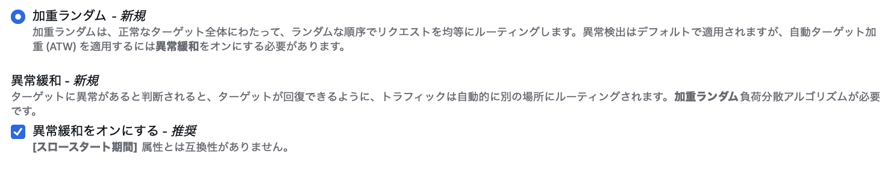

            - ターゲットグループ内の正常なターゲットにリクエストを**均等に、ランダムな順序**で振り分ける方法

            - `異常緩和`

                - [異常緩和](#異常緩和)の有効/無効化

     

    - `スロースタート期間`

        - 新しく登録されたターゲットに、リクエストを送信し始めるまでの猶予期間のこと

        - 詳しくは[こちら](#スロースタート期間)を参照

     

    

     

    - `維持設定`

        - スティッキーセッションの有効/無効の設定

        - 「維持設定をオンにする」= スティッキーセッションを有効化

        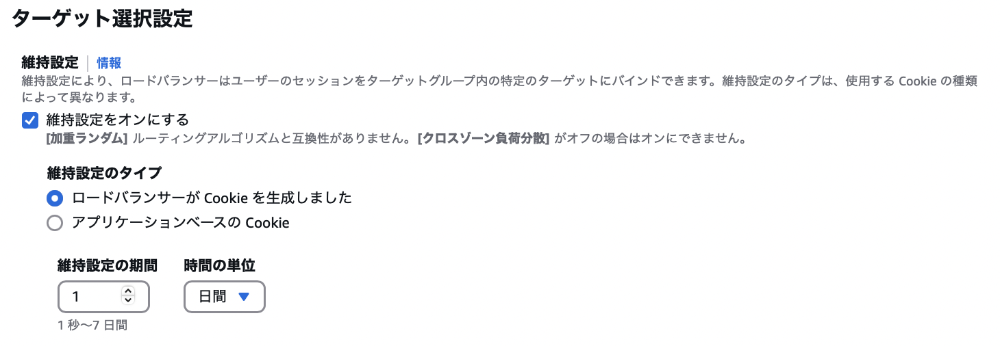

         

        - `維持設定のタイプ`

            - `ロードバランサーが Cookie を生成しました`

                - 同一ユーザーの判断を ALB 側で自動で生成する Cookie の値で判断する

                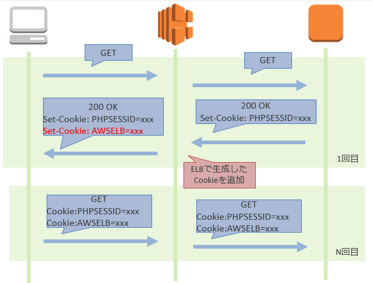

                引用: [【基礎から学ぶ】ELBのスティッキーセッションについてまとめてみた](https://blog.serverworks.co.jp/tech/2017/01/05/elb-sticky)

             

            - `アプリケーションベースの Cookie`

                - 同一ユーザーの判断をアプリケーション側で付与する Cookie の値で判断する

                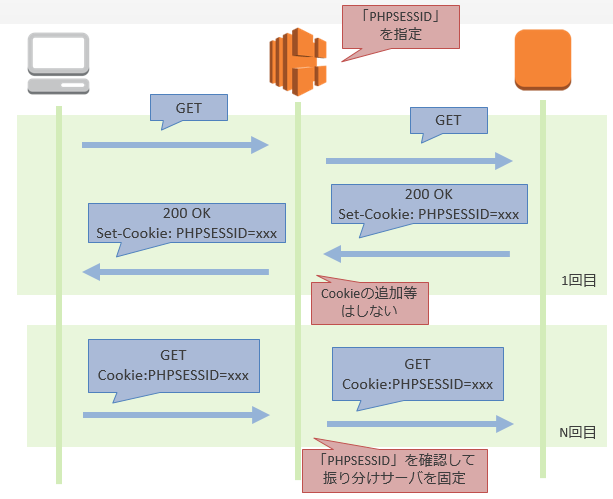

                引用: [【基礎から学ぶ】ELBのスティッキーセッションについてまとめてみた](https://blog.serverworks.co.jp/tech/2017/01/05/elb-sticky)

                 

                - アプリケーション側で付与する Cookie を使う場合、以下の画像のように ALB 側の維持設定の項目にて Cookie 名を事前に設定する必要がある

                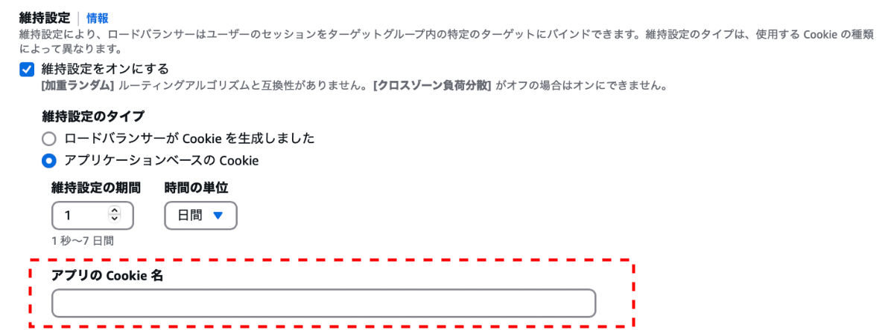

         

        - `維持設定の期間`

            - スティッキーセッションの有効期限 = Cookie の有効期限

     

    - `クロスゾーン負荷分散`

        - [クロスゾーン負荷分散](#クロスゾーン負荷分散)の ON/OFF
    
     

    

    

     

    - *設定タイプの「統合設定」と「詳細設定」の違い

        - DNS フェイルオーバーとフェイルオープンに対して個別に正常状態の条件を設定できるのが「詳細設定」。できないのが「統合設定」

     

    - `設定タイプ`

        - `統合設定`

            - [DNS フェイルオーバーとルーティングフェイルオープン](#dns-フェイルオーバーとルーティングフェイルオープン)のトリガーを一緒の条件で設定する

        - `詳細設定`

            - [DNS フェイルオーバーとルーティングフェイルオープン](#dns-フェイルオーバーとルーティングフェイルオープン)のトリガーを個別の条件で設定する

         

        - `正常状態の要件`

            - `最初限の正常なターゲット数`

                - DNS フェイルオーバー/リクエストフェイルオープンをトリガーするしきい値 (正常なターゲットの台数で指定)

             

            - `最初限の正常なターゲットパーセンテージ`

                - DNS フェイルオーバー/リクエストフェイルオープンをトリガーするしきい値 (正常なターゲットの割合で指定)

 
 

参考サイト

設定項目全般について

- [【初心者向け】Application Load Balancer（ALB）とターゲットグループの属性についてまとめてみた](https://blog.serverworks.co.jp/2023/04/13/115851#ターゲットグループの属性とは)
- [Application Load Balancer のターゲットグループ属性を編集する](https://docs.aws.amazon.com/ja_jp/elasticloadbalancing/latest/application/edit-target-group-attributes.html)

 

加重ランダムについて
- [Application Load Balancer のターゲットグループ](https://docs.aws.amazon.com/ja_jp/elasticloadbalancing/latest/application/load-balancer-target-groups.html#modify-routing-algorithm)

---

### 登録解除の遅延について

- ターゲットをターゲットグループから登録解除するまでの遅延時間

    - 遅延時間の間に、登録解除対象のターゲットへのリクエストを全て済ませてしまうのが目的

 

- ★ターゲットをターゲットグループから登録解除する際に、そのターゲットへの未処理のリクエストがなければ、登録解除の遅延を待たずにすぐ登録解除を行う

 

 
 

参考サイト

[AWS ALBのターゲットグループの登録解除の遅延は本当に遅延しているのか](https://qiita.com/rentama/items/1da1dbc882ce068eb882)

[Load Balancerの仕組み、構成](https://qiita.com/s_yanada/items/111c709b1362313dfebc#登録解除の遅延)

[[AWS Black Belt Online Seminar] Elastic Load Balancing (ELB)](https://d1.awsstatic.com/webinars/jp/pdf/services/20191029_AWS-Blackbelt_ELB.pdf)

---

### スロースタート期間

- 通常 ELB はターゲットへのヘルスチェックが成功した直後にリクエストを振り分ける (= スロースタート期間 0秒)

- スロースタート期間を設けることで、ELB はターゲットへのヘルスチェックが成功した後に設定された期間リクエストの振り分けを待つ

 
 

参考サイト

スロースタート期間について
- [【AWSチュートリアル】WEBサーバ用のALBを作成してみよう！](https://study-infra.com/aws-web-alb-02/#toc10)

ELB のヘルスチェックについて
- [ELBとRoute 53のヘルスチェック仕様の違い](https://dev.classmethod.jp/articles/health-check-spec-elb-route53/)

---

### 維持設定 (スティッキーセッション)

- ★★★ALB (+ CLB) と ELB のスティッキーセッションでは、同一ユーザー判定に利用されるものが違う★★★

#### ALB と CLB

- Cookie を利用して同一ユーザーの判断を行う

    - ALB によって自動で作成される Cookie

    - 接続先アプリケーションが付与する Cookie

    - ★Cookie なので違うブラウザからのアクセスの場合、接続先が異なる可能性がある

 

#### NLB

- 送信元 IP アドレスを利用して同一ユーザーの判断を行う

- ★[NAT や NAPT](https://github.com/MasaGt/CS/blob/eaaffa7d88a060f46c64a74b951105fe05d4eb6d/NAT-NAPT.md) を利用したリクエストの場合、全てのリクエストが1つの接続先に偏るので注意

 

#### ステッキーセッションの有効期間

##### ALB

- 維持設定の期間 (Cookie の有効期限) はリクエストごとに Cookie の有効期限がリセットされる

- よって、最終アクセスから維持設定の期間が経過すると、スティッキーセッションは一旦終了する

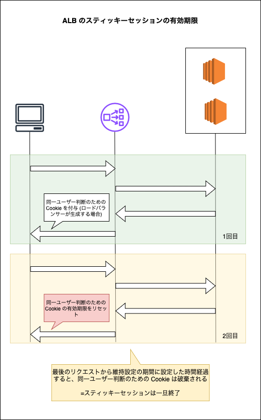

 

##### CLB

- **ALB と異なり**、維持設定の期間 (Cookie の有効期限) はリクエストごとに Cookie の有効期限がリセット**されない**

- よって、最初のアクセスから維持設定の期間が経過すると、スティッキーセッションは一旦終了する

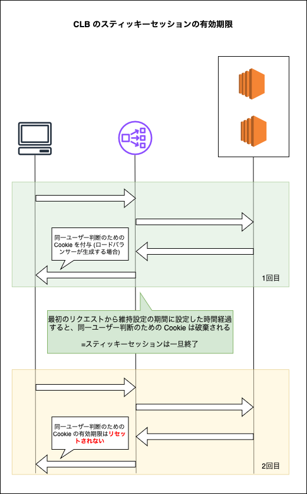

 

#### NLB

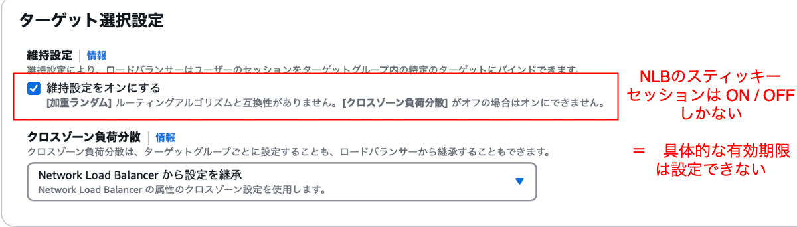

- 明確な有効期限はない

- ターゲットのヘルスチェックの状態が更新されたり、ターゲットグループに対してターゲットの登録や解除を行うことでスティッキーセッションがリセットされることがある

    - 上記のようなリセットがなければ、同一 IP からのリクエストはずっと固定接続先に振り分けられる 

 
 

参考サイト

[【基礎から学ぶ】ELBのスティッキーセッションについてまとめてみた](https://blog.serverworks.co.jp/tech/2017/01/05/elb-sticky)

[AWS Black Belt Online Seminar Elastic Load Balancing](https://pages.awscloud.com/rs/112-TZM-766/images/AWS-Black-Belt_2023_Elastic-Load-Balancing_0525_v1.pdf)

[ALBのスティッキーセッションの仕様について教えてください。](https://dev.classmethod.jp/articles/tsnote-alb-sticky-session-specification/)

[Network Load Balancer(NLB)のスティッキーセッション維持期間はどのくらいですか?](https://support.serverworks.co.jp/hc/ja/articles/5884706664473-Network-Load-Balancer-NLB-のスティッキーセッション維持期間はどのくらいですか)

[AWSのロードバランサーのスティッキーセッションの仕組み](https://techblog.techfirm.co.jp/entry/knowledge-about-elb-stickysession)

---

### クロスゾーン負荷分散

#### ELB \~ 複数 AZ 配置の実態

- ELB を複数 AZ に配置すると、各々の AZ に ELB の実態としての ENI が作成される
    
    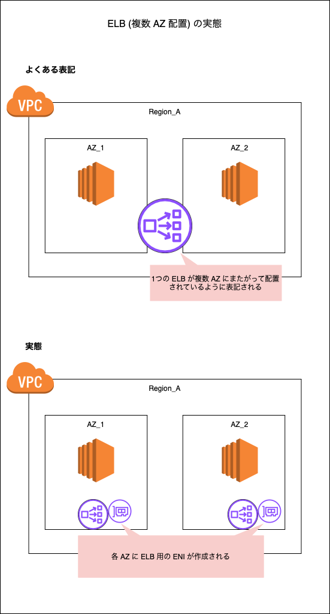

 

#### クロスゾーン負荷分散がオフの場合

- リクエストを受けた ELB は、**自身が属している AZ に配置されたターゲット**にリクエストを割り振る

    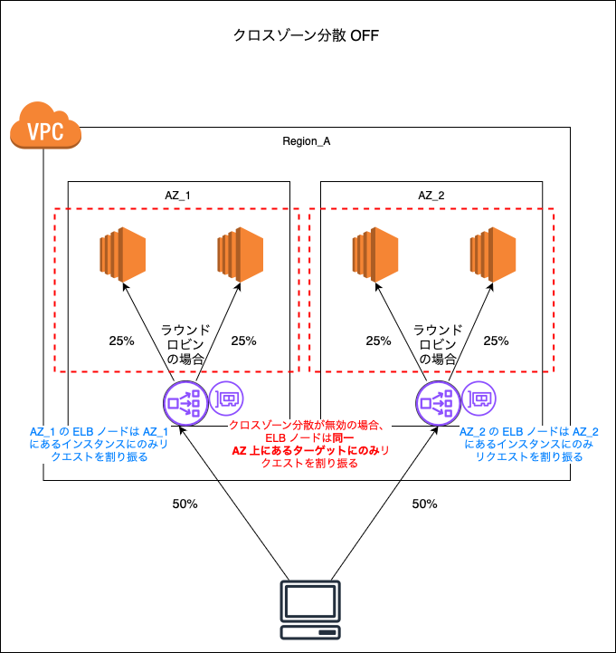

 

- 各 ELB ノードと同一 AZ にあるターゲット数がそれぞれ異なっている場合には以下のようにトラフィックが偏ってしまう
    
    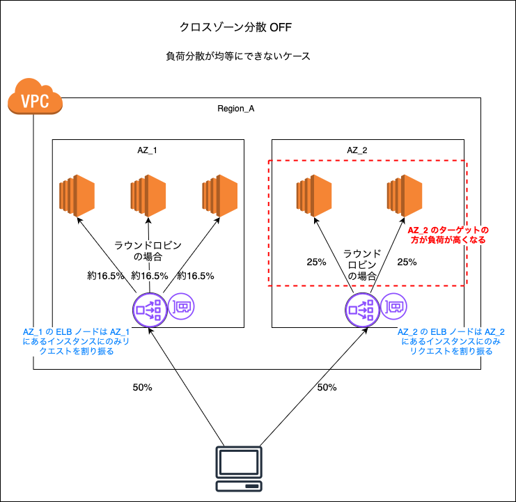

 

#### クロスゾーン負荷分散がオンの場合

- 各 ELB ノードは **AZ を跨いで全てのターゲット**にリクエストを割り振る

    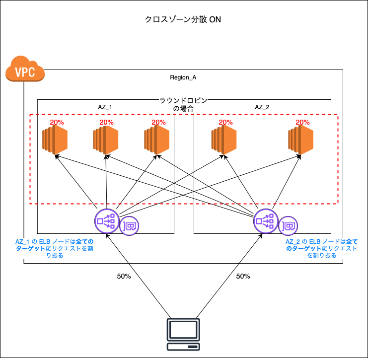

 

#### 重要なポイント

- ALB

    - デフォルトでクロスゾーン負荷分散がON

        - ★ELB ノードとターゲット間の AZ を跨いだデータ転送料はかからない

 

- NLB

    - デフォルトでクロスゾーン負荷分散は**OFF**

        - ★クロスゾーン負荷分散を ON にした時の AZ を跨いだデータ転送料が発生する

 

- GLB

    - デフォルトでクロスゾーン負荷分散は**OFF**

        - ★クロスゾーン負荷分散を ON にした時の AZ を跨いだデータ転送料が発生する

 
 

参考サイト

クロスゾーン負荷分散について
- [AWS Black Belt Online Seminar Elastic Load Balancing](https://pages.awscloud.com/rs/112-TZM-766/images/AWS-Black-Belt_2023_Elastic-Load-Balancing_0525_v1.pdf)

ELB の各サービスのデフォルトでのクロスゾーン負荷分散の ON / OFF について
- [ELBの種類によるクロスゾーン負荷分散のデフォルト値調べ](https://dev.classmethod.jp/articles/elb_crosszone_load_balancing_default_value)

クロスゾーン負荷分散について、および AZ を跨いだデータ転送料について
- [【初心者向け】Elastic Load Balancing(ELB) 入門！完全ガイド](https://zenn.dev/issy/articles/zenn-elb-overview#クロスゾーン負荷分散)

---

### DNS フェイルオーバーとルーティングフェイルオープン

#### クロスゾーン負荷分散との関係

- クロスゾーン負荷分散がオフの時

    - 正常なターゲットのカウントは各 AZ ごとに実行される

        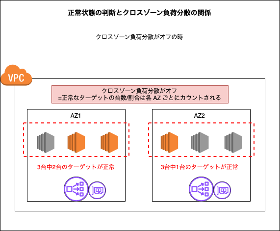

 

- クロスゾーン負荷分散がオンの時

    - 正常なターゲットのカウントは AZ を跨いだ全てのターゲットを対象に実行される

        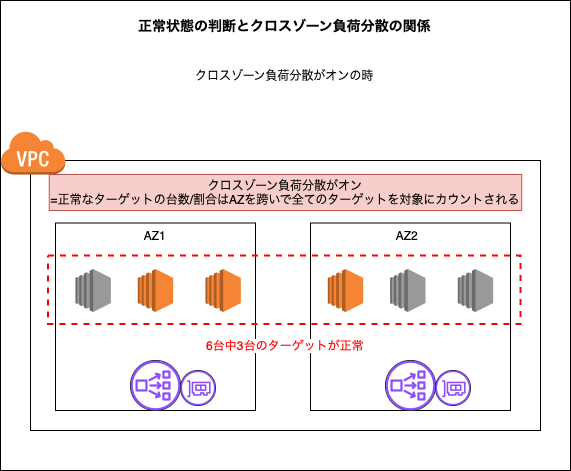
 
 

#### DNS フェイルオーバー

- **クロスゾーン負荷分散がオフの場合**: ELB ノードと同じ AZ 上のターゲットに対して設定された正常状態のしきい値を下回ると、**リクエストがそのゾーンの ELB ノードに割り振られなくなる**

    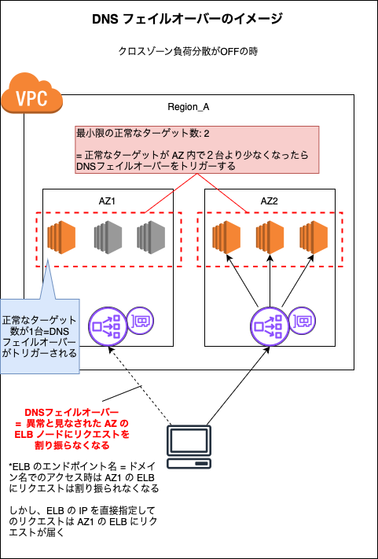

 

- **クロスゾーン負荷分散がオンの場合**: AZ を跨ぐ全てのターゲットに対して設定された正常状態のしきい値を下回ると、**全ての ELB ノードにリクエストが割り振られなくなる** (TODO: 実際にやってみて証拠を記載する)

    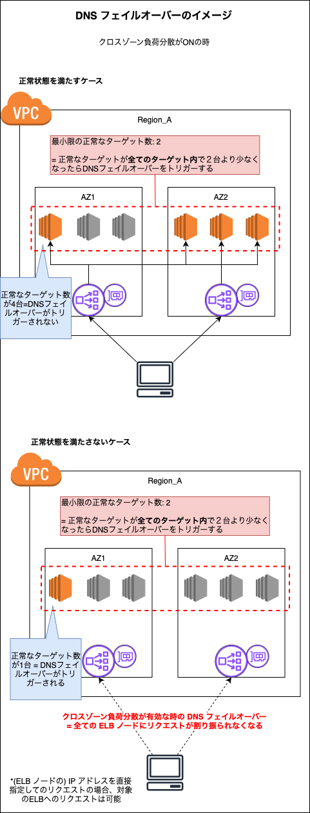

 
 

#### ルーティングフェイルオープンとは

- **クロスゾーン負荷分散がオフの場合**: ELB ノードと同じ AZ 上のターゲットに対して設定された正常状態のしきい値を下回ると、**ELB ノードは異常なターゲットにもリクエスを割り振るようになる**

    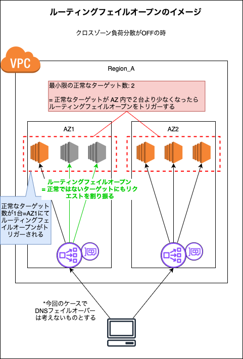

 

- **クロスゾーン負荷分散がオンの場合**: AZ を跨ぐ全てのターゲットに対して設定された正常状態のしきい値を下回ると、**全ての ELB ノードは異常なターゲットにもリクエストを割り振るようになる**

    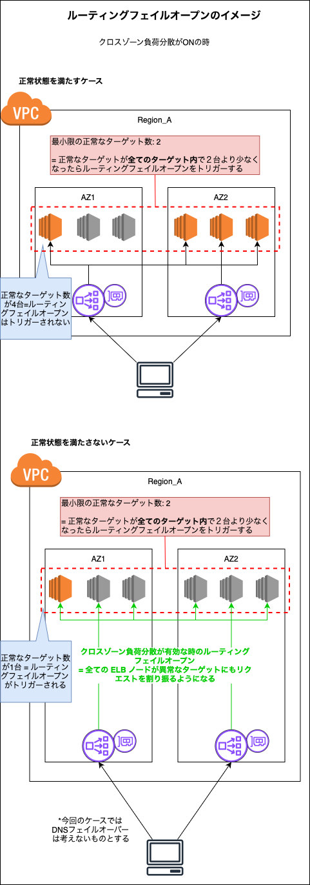

 
 

#### ポイント

- しきい値として正常なターゲットの台数と割合の両方を設定した場合、どちらかのしきい値に達した時、対象のアクション (DNS フェイルオーバー / ルーティングフェイルオープン) がトリガーされる

    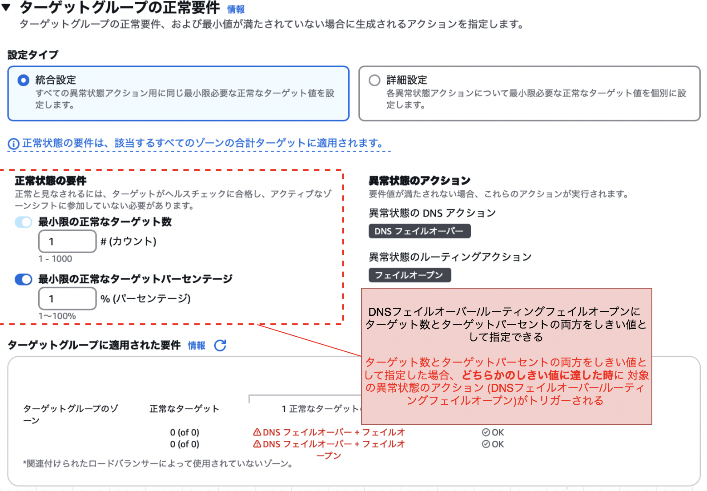

 

- DNS フェイルオーバーとルーティングフェイルオープンに個別のしきい値を設定する場合 (= 設定タイプに「詳細設定」を選択する場合) `DNSのフェイルオーバーのしきい値 >= ルーティングフェイルオープンのしきい値` である必要があるらしい

    - 上記の設定の場合、ルーティングフェイルオープンの有無に関わらず DNS フェイルオーバーが発生する = **ルーティングフェイルオープンよりも先に DNS フェイルオーバーがトリガーされる**

    - 個人的にはクロスゾーン負荷分散が無効の場合は上記のしきい値の関係を満たした方がいいが、クロスゾーン負荷分散が有効の場合は上記のしきい値の関係を満たした方がいいのかについては疑問が残る

        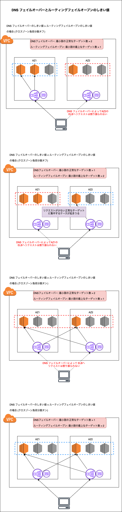

 
 

参考サイト

[Application Load Balancer のターゲットグループ](https://docs.aws.amazon.com/ja_jp/elasticloadbalancing/latest/application/load-balancer-target-groups.html#target-group-health)

[[アップデート] ELBにアプリケーションの可用性を向上する4つの機能が発表されました！#reinvent](https://dev.classmethod.jp/articles/elb-capabilities-application-availability/#toc-albnlb)

[AWS Black Belt Online Seminar Elastic Load Balancing](https://pages.awscloud.com/rs/112-TZM-766/images/AWS-Black-Belt_2023_Elastic-Load-Balancing_0525_v1.pdf)

---

### 加重ランダムとは

- ELB → ターゲットへのルーティングアルゴリズムの1つ

- 正常なターゲットへランダムにリクエストを割り振る

- ★★★「加重」という単語が付くからと言って**ターゲットへ割り振るリクエストに重みをつけれるというわけではない**ということに注意

- [異常緩和](#異常緩和)という機能を利用できる

 

#### ラウンドロビンとの違い

- ラウンドロビン
    - 正常なターゲットに均等かつ**順番のとおりに**ルーティングする

 

- 加重ランダム
    - 正常なターゲットに均等に、**ランダムな順序**でルーティング

    - [異常緩和](#異常緩和)を利用できる

 

#### 異常緩和

- ヘルスチェックで正常と判断されても、5xx 系のエラーレスポンスを返すターゲットへのリクエストの割合(加重)を自動的に下げる機能

    - 500 系のエラーレスポンスを検出する機能を異常検出と呼ぶ

        - ★加重ランダムが選択されると、自動で異常検出がオンになり、オフにすることはできない

 
 

参考サイト

異常緩和について
- [AWS re:Invent 2024 - Optimizing ELB traffic distribution for high availability (NET401) を聴講して](https://qiita.com/n_53_xx/items/e57ff23868055abf375b#targetの選択)
- [AWSのApplication Load BalancerにAutomatic Target Weightsという新機能が来てました](https://tech-blog.cloud-config.jp/2023-11-29-aws-application-load-balancer-new-feature-automatic-target-weights)
- [aws アプリケーション ロード バランサー エラスティックロードバランシング](https://docs.aws.amazon.com/ja_jp/elasticloadbalancing/latest/application/elb-ag.pdf)
- [AWS re:Invent 2023レポート【後編】AWSエンジニア向け、keynote以外の気になるアップデート](https://www.itis.nssol.nipponsteel.com/blog/aws-reinvent-2023-02.html)
