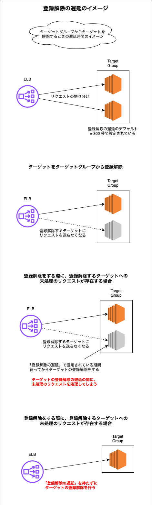

### TargetGroup の 属性 (Attributes) とは

- ★[TargetGroup の作成](./AWS_ELB_TargetGroup.md)時には設定できない

    - (必要に応じて) TargetGroup の作成後に編集する必要がある

 

- ざっくりと以下の項目などについての設定ができる

    - ターゲットグループに対してのリクエストを振り分けるアルゴリズム

    - [スティッキーセッション](./AWS_ELB.md#スティッキーセッション)の有効/無効化

    - ターゲットグループを正常とみなす要件

    - ターゲットグループが異常とみなされた場合の挙動

---

### TargetGroup の属性を編集する

1. マネージドコンソールにログイン後、EC2 画面に遷移し、サイドメニューにある `ターゲットグループ`を クリック

 

2. 属性を編集したいターゲットグループを選択し、アクションから `ターゲットグループ属性を編集` をクリック。もしくは、画面下部の属性タブを開き `編集` をクリックする

    

 

3. 各項目を設定し、`変更内容の保存` をクリックする

    

     

    - `登録解除の遅延 (ストリーミング間隔)`
        - ターゲットグループからターゲットを登録解除する際に、実際に登録解除するまでの待ち時間

        - 詳しくは[こちら](#登録解除の遅延について)を参照

     

    - `ロードバランシングアルゴリズム`

        - リクエストを割り振るアルゴリズム

        - `ラウンドロビン`

            - リクエストを順番に均等に振り分ける方法

                

                引用: [ロードバランサー（LB）とは？仕組みやDNSラウンドロビンとの違いについて解説](https://www.rworks.jp/system/system-column/sys-entry/16305/)

             

        - `最小の未処理のリクエスト`

            - **未処理のリクエスト数が最も少ないターゲット**にリクエストを割り振る方法

             

        - `加重ランダム`

            - ターゲットグループ内の正常なターゲットにリクエストを**均等に、ランダムな順序**で振り分ける方法

     

    - `スロースタート期間`

        - 新しく登録されたターゲットに、リクエストを送信し始めるまでの猶予期間のこと

        - 詳しくは[こちら](#スロースタート期間)を参照

     

    

     

    - `維持設定`

     

    - `クロスゾーン負荷分散`
    
     

    

     

    - 設定タイプ

        - `統合設定`

        - `正常状態の要件`

        - `最初限の正常なターゲットパーセンテージ`

     

    

     

    - 設定タイプ

        - `詳細設定`

         

        - DNS - 正常状態の要件

            - `最小限の正常なターゲット数`

             

            - `最初限の正常なターゲットパーセンテージ`

         

        - ルーティング - 正常状態の要件

            - `最小限の正常なターゲット数`

            - `最小限の正常なターゲットパーセンテージ`

 
 

参考サイト

設定項目全般について

- [【初心者向け】Application Load Balancer（ALB）とターゲットグループの属性についてまとめてみた](https://blog.serverworks.co.jp/2023/04/13/115851#ターゲットグループの属性とは)
- [Application Load Balancer のターゲットグループ属性を編集する](https://docs.aws.amazon.com/ja_jp/elasticloadbalancing/latest/application/edit-target-group-attributes.html)

 

加重ランダムについて
- [Application Load Balancer のターゲットグループ](https://docs.aws.amazon.com/ja_jp/elasticloadbalancing/latest/application/load-balancer-target-groups.html#modify-routing-algorithm)

---

### 登録解除の遅延について

- ターゲットをターゲットグループから登録解除するまでの遅延時間

    - 遅延時間の間に、登録解除対象のターゲットへのリクエストを全て済ませてしまうのが目的

 

- ★ターゲットをターゲットグループから登録解除する際に、そのターゲットへの未処理のリクエストがなければ、登録解除の遅延を待たずにすぐ登録解除を行う

 

 
 

参考サイト

[AWS ALBのターゲットグループの登録解除の遅延は本当に遅延しているのか](https://qiita.com/rentama/items/1da1dbc882ce068eb882)

[Load Balancerの仕組み、構成](https://qiita.com/s_yanada/items/111c709b1362313dfebc#登録解除の遅延)

[[AWS Black Belt Online Seminar] Elastic Load Balancing (ELB)](https://d1.awsstatic.com/webinars/jp/pdf/services/20191029_AWS-Blackbelt_ELB.pdf)

---

### スロースタート期間

- 通常 ELB はターゲットへのヘルスチェックが成功した直後にリクエストを振り分ける (= スロースタート期間 0秒)

- スロースタート期間を設けることで、ELB はターゲットへのヘルスチェックが成功した後に設定された期間リクエストの振り分けを待つ

 
 

参考サイト

スロースタート期間について
- [【AWSチュートリアル】WEBサーバ用のALBを作成してみよう！](https://study-infra.com/aws-web-alb-02/#toc10)

ELB のヘルスチェックについて
- [ELBとRoute 53のヘルスチェック仕様の違い](https://dev.classmethod.jp/articles/health-check-spec-elb-route53/)