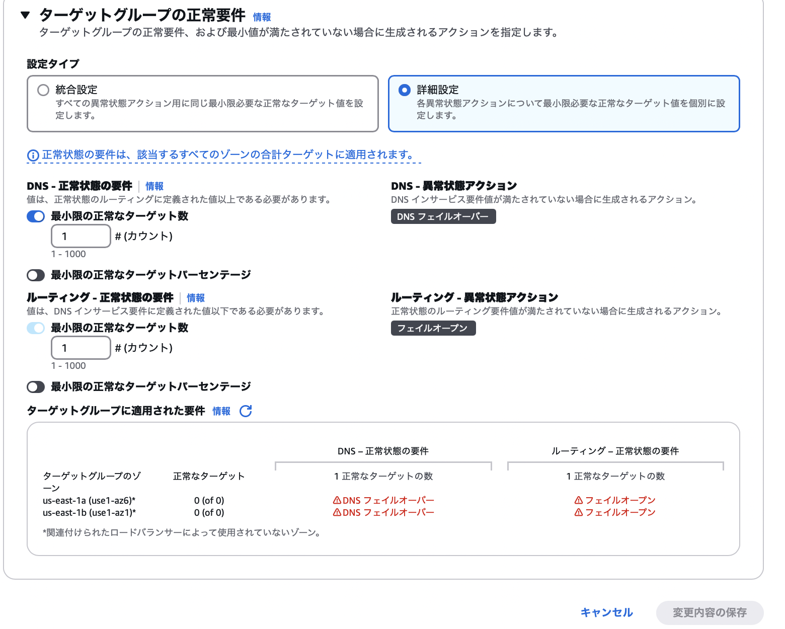

### TargetGroup の 属性 (Attributes) とは

- ★[TargetGroup の作成](./AWS_ELB_TargetGroup.md)時には設定できない

    - (必要に応じて) TargetGroup の作成後に編集する必要がある

 

- ざっくりと以下の項目などについての設定ができる

    - ターゲットグループに対してのリクエストを振り分けるアルゴリズム

    - [スティッキーセッション](./AWS_ELB.md#スティッキーセッション)の有効/無効化

    - ターゲットグループを正常とみなす要件

    - ターゲットグループが異常とみなされた場合の挙動

---

### TargetGroup の属性を編集する

1. マネージドコンソールにログイン後、EC2 画面に遷移し、サイドメニューにある `ターゲットグループ`を クリック

 

2. 属性を編集したいターゲットグループを選択し、アクションから `ターゲットグループ属性を編集` をクリック。もしくは、画面下部の属性タブを開き `編集` をクリックする

    

 

3. 各項目を設定し、`変更内容の保存` をクリックする

    

     

    - `登録解除の遅延 (ストリーミング間隔)`
        - ターゲットグループからターゲットを登録解除する際に、実際に登録解除するまでの待ち時間

        - 詳しくは[こちら](#登録解除の遅延について)を参照

     

    - `ロードバランシングアルゴリズム`

     

    - `スロースタート期間`

     

    

     

    - `維持設定`

     

    - `クロスゾーン負荷分散`
    
     

    

     

    - 設定タイプ

        - `統合設定`

        - `正常状態の要件`

        - `最初限の正常なターゲットパーセンテージ`

     

    

     

    - 設定タイプ

        - `詳細設定`

         

        - DNS - 正常状態の要件

            - `最小限の正常なターゲット数`

             

            - `最初限の正常なターゲットパーセンテージ`

         

        - ルーティング - 正常状態の要件

            - `最小限の正常なターゲット数`

            - `最小限の正常なターゲットパーセンテージ`

 
 

参考サイト

[【初心者向け】Application Load Balancer（ALB）とターゲットグループの属性についてまとめてみた](https://blog.serverworks.co.jp/2023/04/13/115851#ターゲットグループの属性とは)

[Application Load Balancer のターゲットグループ属性を編集する](https://docs.aws.amazon.com/ja_jp/elasticloadbalancing/latest/application/edit-target-group-attributes.html)

---

### 登録解除の遅延について

- ターゲットをターゲットグループから登録解除するまでの遅延時間

    - 遅延時間の間に、登録解除対象のターゲットへのリクエストを全て済ましてしまうのが目的

 

- ★ターゲットをターゲットグループから登録解除する際に、そのターゲットへの未処理のリクエストがなければ、登録解除の遅延を待たずにすぐ登録解除を行う

 

 
 

参考サイト

[AWS ALBのターゲットグループの登録解除の遅延は本当に遅延しているのか](https://qiita.com/rentama/items/1da1dbc882ce068eb882)

[Load Balancerの仕組み、構成](https://qiita.com/s_yanada/items/111c709b1362313dfebc#登録解除の遅延)

[[AWS Black Belt Online Seminar] Elastic Load Balancing (ELB)](https://d1.awsstatic.com/webinars/jp/pdf/services/20191029_AWS-Blackbelt_ELB.pdf)