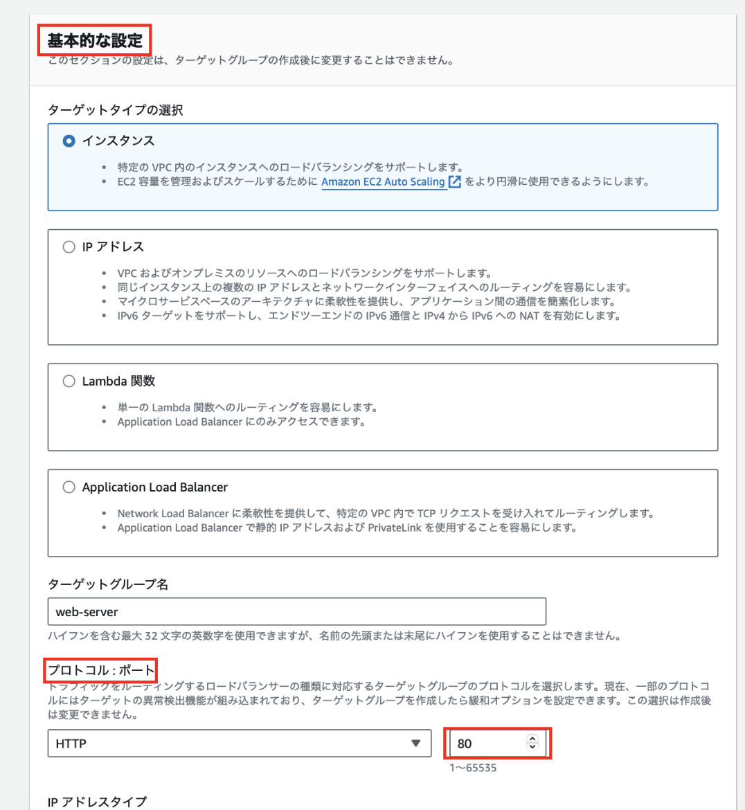
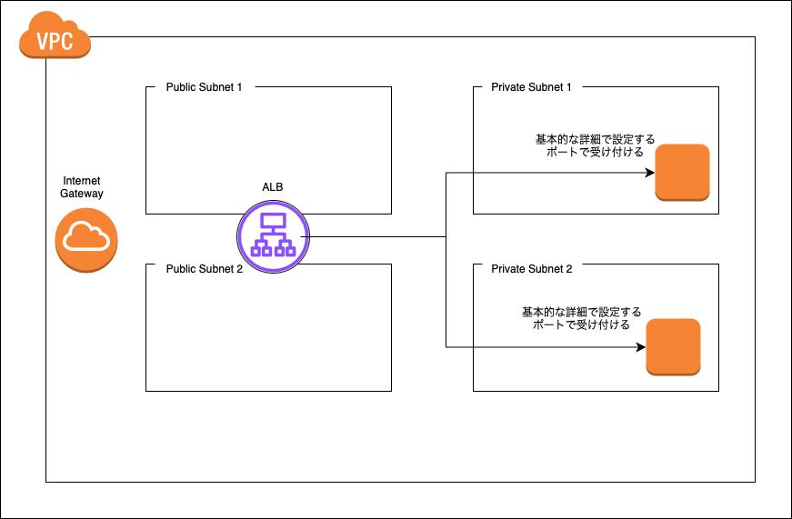
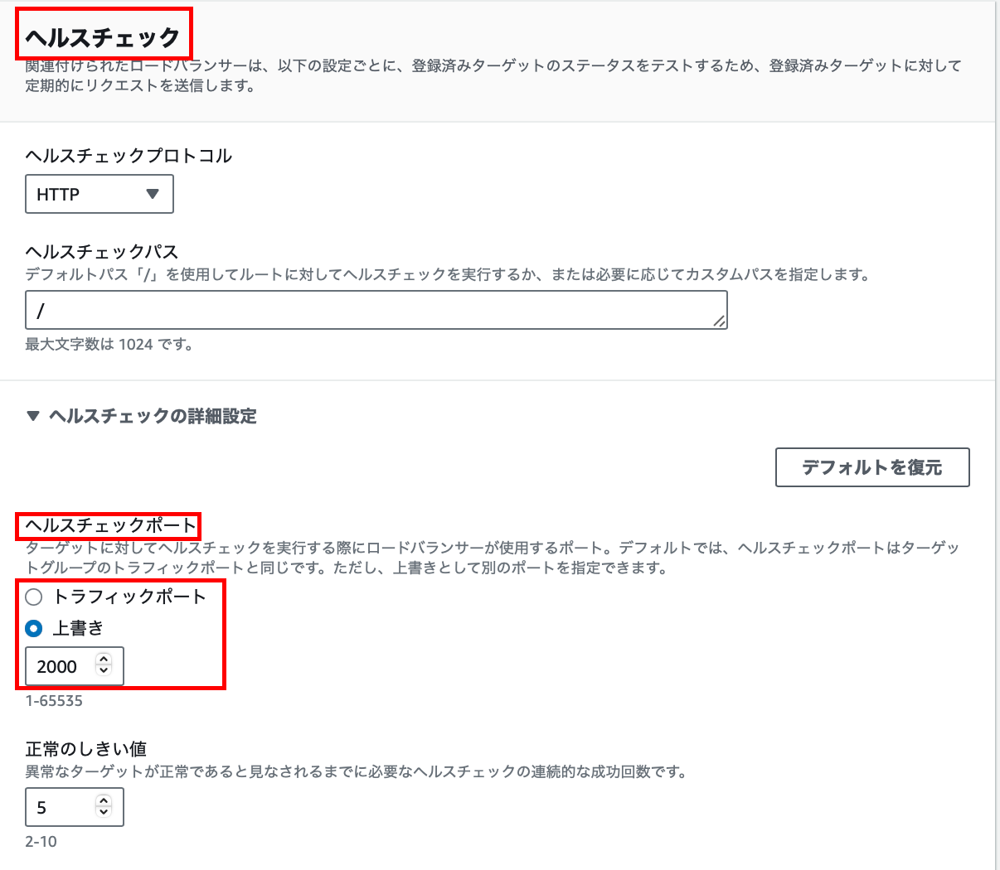
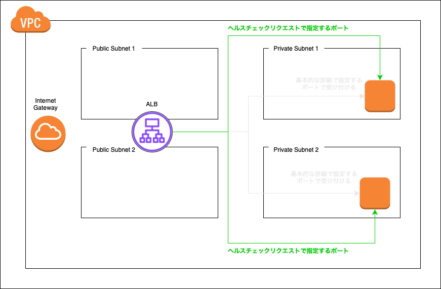
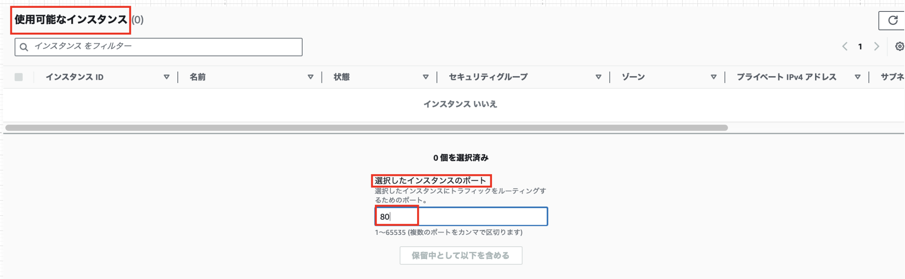
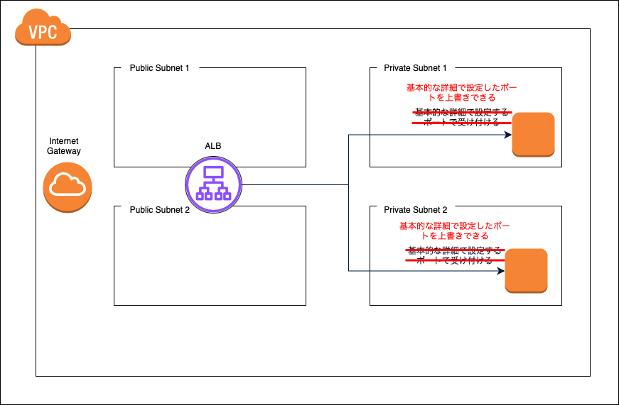
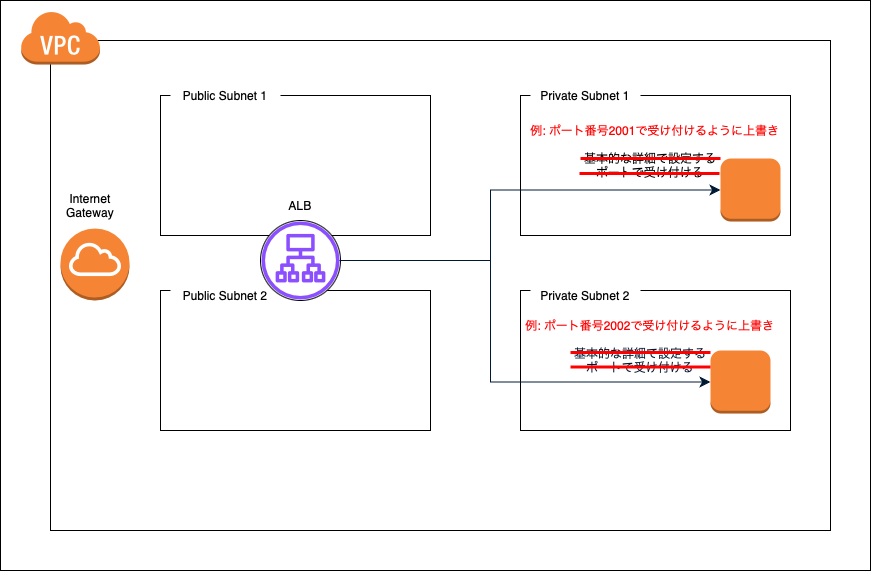

### Target Group 作成の際のポート番号に関する項目

Target Group を作成する際、ポート番号を設定する項目が3回登場するが、各項目が何を意味するのかが曖昧だった

---

### 基本的な設定

- ALB から振り分け先のインスタンスにリクエストを送る際に指定する **ターゲットグループ側の**ポート番号

 

---

### ヘルスチェック

ALB からのヘルスチェックリクエストの際に指定する **ターゲットグループの**ポート番号

 

----

### ターゲットを登録

基本的な詳細で指定したポート番号を上書きするための項目

ここで、基本的な詳細で指定したのとは異なるポート番号を設定すると、 ALB からのリクエストはこっちのポート番号を指定してリクエストを振り分ける

**個別のインスタンスごと**に上書きするポート番号を指定することもできる

 

 

---

参考サイト

参考1: [Application Load Balancerで設定する4種類のポート番号の意味を理解しよう](https://dev.classmethod.jp/articles/aws-alb-port/)

参考2: [ALB まわりのポートを整理する](https://qiita.com/yu-yama-sra/items/7ab3e6fdb2d3b73925d8)

参考3: [ELBのポートを考える](https://qiita.com/yabish/items/16a1c8bd1cfe889b679c)