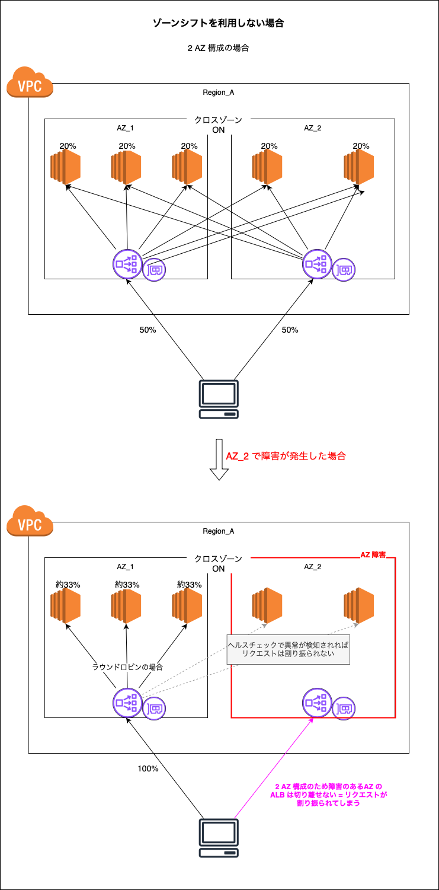

### ゾーンシフトとは

- AZ 障害が発生した際に、その AZ へリクエストを送らなくする機能のこと

    

 

- ALB は 2 AZ 以上で稼働させる必要があるが、ゾーンシフトを利用すると、一時的に 1 AZ での稼働も可能

    - ゾーンシフトを利用しない場合、2 AZ で ALB を運用中に AZ 障害が発生してもその AZ の ALB を切り離せない = **ALB は 3AZ で運用するのがベターとなっていた**

    

    

 
 

参考サイト

[ゾーンシフトを用いたクロスゾーン負荷分散](https://aws.amazon.com/jp/blogs/news/using-cross-zone-load-balancing-with-zonal-shift/)

[2AZ 構成の ALB でゾーンシフトを試してみた](https://dev.classmethod.jp/articles/zoneshift-2az-try/)

[ALBはなぜ3AZにするべきなのか](https://qiita.com/boronngo/items/6b3c3f6cf6d632e6cb94)