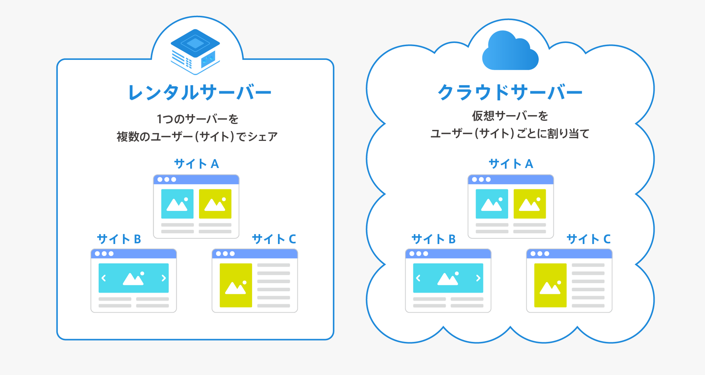

### AWS とは

Amason が提供するクラウドサービスのオンラインプラットフォーム

### クラウドとは

クラウドコンピューティングの略

- ストレージやサーバーなどのコンピューターリソースや、アプリケーションソフトウェアをインターネットを通して提供するサービス形態のこと

クラウドコンピューティングのメリット/デメリット

- メリット:
    - 初期費用がオンプレミスより安く済む

    - スケーリングが簡単(自動で行うように設定することも可能)

    - レンタル(共有サーバー)と同様に1台に複数のユーザーが同居しているが、それぞれが独自の仮想サーバーを割り当てられているため、他のユーザー(仮想サーバー)からの影響は受けにくい

   **仮想サーバーが他の仮想サーバーから影響を受けにくい理由**:
   - 仮想サーバーは物理サーバー上で独自のリソース（CPU、メモリ、ストレージなど）が割り当てられており、自身の割り当てられたリソースの中で、アクセスの処理やデータの管理を行うため、ほか仮想サーバーの影響を受けにくい

- デメリット

    - 維持費用(ランニングコスト)がかかる

    - 利用するサービス提供者によってはセキュリティ面の懸念がある (クラウドサービスプロバイダーがデータを保護するための十分な対策を講じていない場合、機密情報が漏洩する可能性がある)

    - 利用するクラウドサービスプロバイダーによってはカスタマイズ性が乏しい場合もある

 

クラウド以外のコンピューターリソースなどの調達方法
- オンプレミス
    - サーバー購入、構築、運用まで全て自社で行う方法

    - メリット:
        - 自由にカスタマイズできる
        - 障害が発生した際、自分たちで迅速に対応することができる

    - デメリット: 
        - 構築期間と構築コストがかかる
        - 構築できる人材が必要
        - 障害が発生した際は、全て自分たちで対応しなければいけない
        - スケーリングが難しい
        
 

- レンタル
    - 他の業者(サーバーを貸し出す業者)からコンピューターリソースを借りる方法

    - メリット: 
        - 初期費用はオンプレミスより安く済む
        - 運用費用はクラウドよりも安いことが多い
        - 運用や構築はレンタル業者に任す

    - デメリット:
        - (共有サーバーだった場合)1台のサーバーを他社と共有するため、他のサービスへアクセスが集中すると、自分のサービスにも影響を受ける
        - スケーリングが難しい
        - 初期構築の時間はクラウドよりも掛かる

    

    [レンタルサーバーとクラウドサーバーの違いは？クラウド化のメリット、デメリットを解説](https://knowledge.cpi.ad.jp/basic-knowledge/279/#:~:text=利用料金が従量制,大きな違いといえます%E3%80%82)

