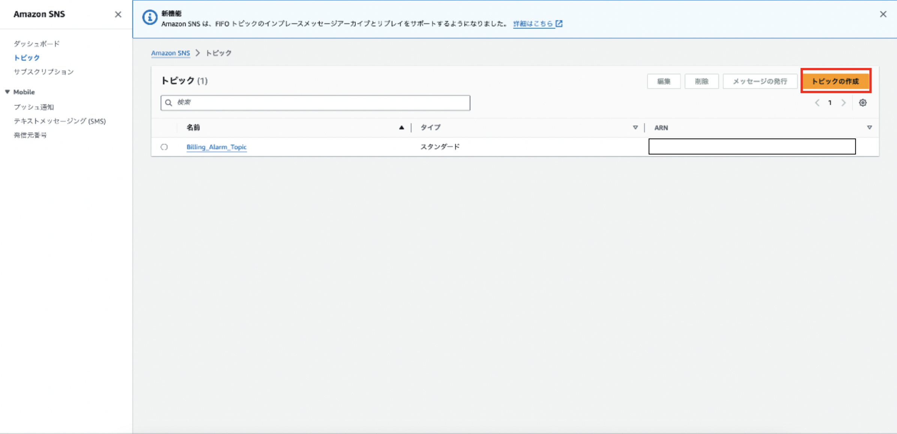

### Amazon SNS とは

Simple Notification Service の略

フルマネージド型のメッセージングサービス

-> サーバーをたてる必要がない & ソフトウェアも自分たちで更新する必要もない

Application-to-Application  (A2A) と Application-to-Person (A2P)
 の2つの通知方法を利用することができる

 

 

具体的な例

- A2P: ユーザーにメールやプッシュ通知を送信する
- A2A: 他のアプリケーションにメッセージを発行する
    - 例: CloudWatch で EC2 の CPU 使用状況を監視し、異常が起きたら AWS Chatbot にメッセージを送信する

        *AWS Chatbot とは Microsoft Teams や Slack などにメッセージを送信できるサービス

 
 

参考サイト

AWS SNS の A2A メッセージングの具体例
[AWS Chatbotを使ってみた](https://blog.serverworks.co.jp/2022/02/23/182459)

---

### AWS SNS について理解するために

#### 用語

Publisher
- メッセージの発行元
- Piblisher は Topic にメッセージを発行する

    

 

Topic
- Publisher と Subscriber の仲介役
- こいつがいることによって、 $\color{red}Publisher は Subscriber の存在を意識しなくて済む$
- Topic の種類にはスタンダードとFIFOお2種類がある

    - スタンダード Topic の特徴
        1. Pubilisher から送信されたメッセージの $\color{red}順番通り転送は保証されない$
        2. 同じメッセージが重複して配信される可能性がある
        3. 1秒間に多くのメッセージを処理できる

    - FIFO Topic の特徴
        1. Publisher から送信されたメッセージの順番通りに転送する
        2. [メッセージが重複して配信される](#メッセージの重複はなぜ起きる)ことはない
        3. 1秒間に300件件のメッセージを処理できる

    

 

Subscriber
- メッセージを受信する側 = Topic を Subscribeする側
- AWS のインスタンスだったり、個人(メールアドレスや電話番号)だったりする
- Subscriber はメッセージを受信するプロトコルを選ぶことができる (メールやプッシュ通知、HTTP/HTTPS など)

    

 

ファンアウト (Fan-out)
- 1つのメッセージを複数の受信者(エンドポイント)に同時に配信すること
- 一般的には `SNS → SQS → アプリケーション` のように SNS とエンドポイントの間に [SQS](./AmazonSQS.md) を挟むらしい
        
      [SQS の必要性]
      (SQSがなかったら) メッセージ受信後、アプリケーション側で何らかの理由で処理が失敗した場合、同じメッセージをSNSから取得できない。しかし、　SQS を間に挟むことによってメッセージを SQS から再取得できる。

 
 

参考サイト

各用語についての説明
- [【Terraformハンズオン】AWS SNSの基本とメール通知を実践してみよう](https://envader.plus/article/412)

トピックの種類について
- [AWS SNSトピックとサブスクライブを設定してみた](https://zenn.dev/myatti/articles/50f610c32229de#fifoとstandardの違い)

ファンアウトでのSQSの必要性
- [SNS to Lambda vs SNS to SQS to Lambda](https://stackoverflow.com/questions/42656485/sns-to-lambda-vs-sns-to-sqs-to-lambda)

- [SQS → Lambdaのリトライ処理について整理してみた](https://qiita.com/yoshiyama_hana/items/665ff4b949c4e7e96ad2)

---

### 利用方法

1. AWS コンソールから Amazon SNS ダッシュボードに移動

    

     

2. サイドメニューから `トピック` をクリックする

    

     

3. `トピックの作成` をクリック

    

     

4. 各項目を設定し、`トピックの作成` をクリック

    
    

---

### トピックの削除

1. AWS コンソールから Amazon SNS ダッシュボードに移動

    

     

2. サイドメニューから `トピック` をクリックする

    

     

3. 削除したいトピックを選択し、 '削除' ボタンをクリック

#### トピックに紐づいた Subscription の削除

トピックを削除しても、サブスクリプションは削除されないらしい

*AWS 公式では、トピックを削除すると、それに紐づいたサブスクリプションは非同期で自動的に削除されるらしい

1. AWS コンソールから Amazon SNS ダッシュボードに移動

2. サイドメニューから `サブスクリプション` を選択

3. 削除したいサブスクリプションを選択して `削除` をクリック

 
 

参考サイト

トピックを削除するとサブスクリプションも削除されると主張する公式
- [Amazon SNSトピックとサブスクリプションの削除](https://docs.aws.amazon.com/ja_jp/sns/latest/dg/sns-delete-subscription-topic.html)

トピックを削除してもサブスクリプションは削除されないと主張するサイト
- [SNS トピックを削除してもそこに関連づけられた SNS サブスクリプションは削除されない](https://dev.classmethod.jp/articles/deleting-sns-topic-does-not-delete-sns-subscriptions-associated-with-it/)

---

### メッセージの重複はなぜ起きる?

メッセージが失われないようにするためには、送信が成功したことが確実に判断できるまでリトライが行われる

→ これがメッセージ重複を引き起こす原因となる

 

メッセージの重複が起きてしまうシチュエーション例

- メッセージが配信される途中でネットワークの問題が発生
- Subscriber からの応答がない

など

 
 

参考サイト

[AWS SNSが重複してメッセージを配信してしまう](https://qiita.com/Ken_Fujimoto/items/2d82ac601507c651fb65)

---

### サブスクリプションが削除できない?

サブスクリプションのステータスはいくつかある

- 確認済み: サブスクライブ済み
- 保留中の確認: エンドポイント側でまだサブスクライブしてない
- 削除済み: Topic からのメッセージにあるサブスクリプション解約を押した 等

上記の中で、`保留中の確認` と `削除済み` ステータスのサブスクリプションは手動で削除することはできない

→ 48時間後に自動的に削除されるらしい

 
 

参考サイト

サブスクリプションの削除
- [Amazon SNSトピックとサブスクリプションの削除](https://docs.aws.amazon.com/ja_jp/sns/latest/dg/sns-delete-subscription-topic.html)

Subscription のステータスが削除済みになるには
- [削除された SNS のサブスクリプションを再度サブスクライブすることができない場合の対処方法](https://dev.classmethod.jp/articles/tsnote-sns-deleted-status-resub/)