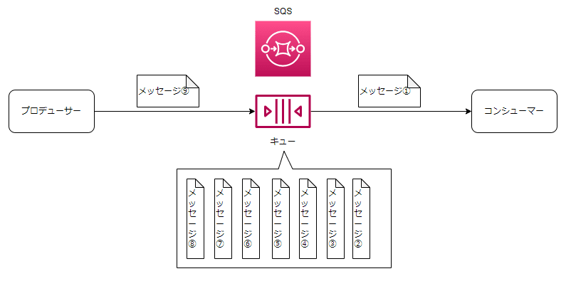
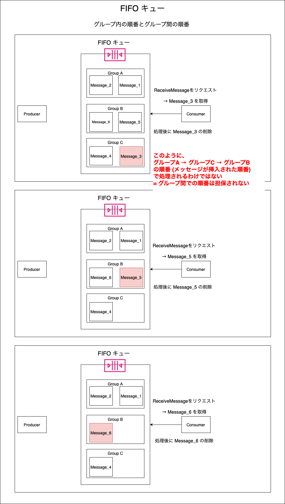
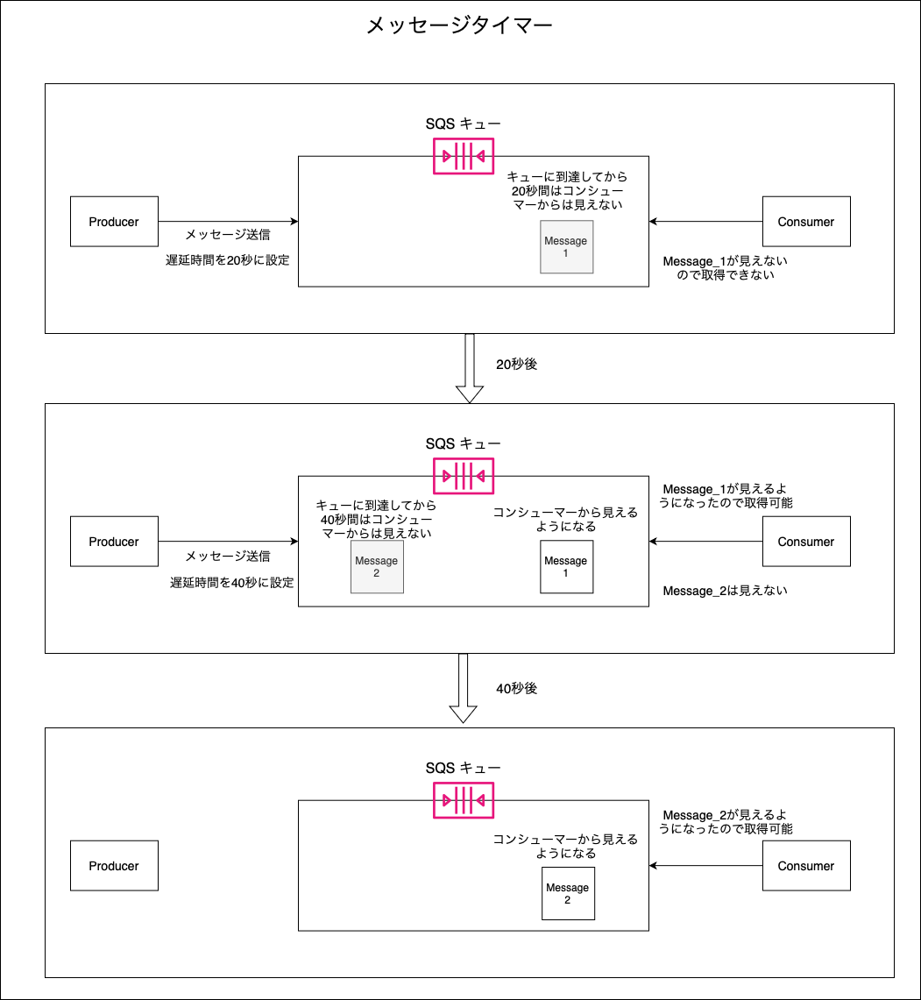

### SQS とは

- Simple Queue Service の略

- フルマネージドなメッセージングキューイングサービス

    - 異なるシステムやプロセス間でメッセージを一時的に格納し、送受信するための技術やサービス

- SQS はリージョンサービス

 

#### SQS を利用するメリット

引用: [アプリケーション間連携を疎結合で実現。「Amazon SQS」をグラレコで解説](https://aws.amazon.com/jp/builders-flash/202105/awsgeek-sqs/)

 

- メッセージの送信側と受信側のアプリケーションを疎結合にすることで、システム間で同期を取る必要がなくなる

- (システム間の SQS がメッセージを格納するので) 送信する側が大量にメッセージを送信しても、処理する側は自分のペースでメッセージ SQS から取得してを処理することができる
 
 

参考サイト

[メッセージキューとは？いまさら聞けないメリット・デメリット](https://www.alibabacloud.com/help/ja/cloud-migration-guide-for-beginners/latest/messagequeue)

[メッセージキュー AWS クラウドジョブをバッチ処理してアプリケーションを分離するための非同期メッセージング](https://aws.amazon.com/jp/message-queue/)

[アプリケーション間連携を疎結合で実現。「Amazon SQS」をグラレコで解説](https://aws.amazon.com/jp/builders-flash/202105/awsgeek-sqs/?awsf.filter-name=*all)

---

### SQS での重要なコンセプト

引用: [【初心者向け】Amazon Simple Queue Service (SQS) 入門！完全ガイド](https://zenn.dev/issy/articles/zenn-sqs-overview)

 

#### プロデューサー (Producer)

- メッセージの発行元

 

#### コンシューマー (Consumer)

- SQS からメッセージを取得するアプリケーション

- ★コンシューマーが自分でキューにポーリング (一定間隔でデータ有無を確認) する **Pull 型** の仕組み

    - ポーリングには以下の2種類がある

        1. ショートポーリング

            - デフォルトのポーリング方法

            - コンシューマーからのポーリングの際に、キューの中のメッセージの有無に関わらず即座にレスポンスが返される

                - キューにメッセージがない場合、**即座に**空のレスポンスが返却される

         

        2. ロングポーリング

            - キュー内のメッセージが空の場合はメッセージがキューに到達するか設定した待機時間まで経過するまでレスポンスは返却されない

                - 待機時間中もメッセージが無い場合は、空のレスポンスが返却される
            
            - キューへの問い合わせ回数を抑えることができるため、コスト削減にもつながる

            - AWS ではロングポーリングを設定することが推奨されている

#### メッセージ

- プロデューサーが送信するデータ

    - キューに保管される

    - コンシューマーがキューから取得する

- メッセージのサイズは最大で 256 KiB

    - Java / Python の拡張クライアントライブラリと S3 を併用することで最大 2GB までのメッセージを送ることができる

- ★メッセージはコンシューマーで処理されただけではキューから削除されない

    - メッセージをキューから削除するには...
        - コンシューマーが明示的にキューからメッセージを削除する
        - キューのメッセージ保持期間を過ぎて自動的に削除される

     

    - ★処理済みのメッセージがキューに残ると、他のコンシューマーから重複されて処理されてしまうので注意

#### キュー

- メッセージの保管場所

- 最大で14日保持することができる

- メッセージは デフォルトで `プロデューサー → キュー` 間 また、 `キュー → コンシューマー` 間で暗号化される

- また、キューでの保管時にもメッセージを暗号化できる (オプション)

    - SSE-SQS か SSE-KMS を使用てキューに保存されているメッセージを暗号化することもできる (オプション)

        SSE-SQS は KMS を利用しない SQS が管理する暗号化キー (KMS を利用しないので、 KMS の使用料が発生しない)

        - SSE-SQS の暗号化方式は AES-256

 
 

参考サイト

SQS の構成要素について
- [【初心者向け】Amazon Simple Queue Service (SQS) 入門！完全ガイド](https://zenn.dev/issy/articles/zenn-sqs-overview#sqs-とは)

- [アプリケーション間連携を疎結合で実現。「Amazon SQS」をグラレコで解説](https://aws.amazon.com/jp/builders-flash/202105/awsgeek-sqs/?awsf.filter-name=*all)

ポーリングの種類について

- [【初心者向け】Amazon SQS ショートポーリングとロングポーリングをわかりやすく解説](https://kazuqueue-tech.com/difference-short-long-polling/)
- [【初心者でも5分で分かる】Amazon SQS](https://asa3-cloud.com/【初心者でも5分で分かる】amazon-sqs/)

メッセージの暗号化について
- [Amazon SQSの保管時の暗号化でSQSマネージドな暗号化SSE-SQSが利用できるようになりました](https://dev.classmethod.jp/articles/amazon-sqs-sse-sqs/)

- [[アップデート]SQSのサーバサイド暗号化キーにSSE-SQSが追加されました](https://dev.classmethod.jp/articles/sse-sqs-add-update/)

---

### メッセージ配信の仕組み

#### 分散キュー

 

- キューはAZを跨いだ複数のサーバーからなり、メッセージを複数サーバーに冗長的に持つ構成となっている

    - *キューは何AZから構成され、何台のサーバーが同じメッセージを保持するのかという情報は無い (ユーザーとしては意識しなくていい部分)

 

#### メッセージの送信、取得の流れ

引用: [Amazon SQS による分散キュー](https://dev.classmethod.jp/articles/amazon-sqs-queue-service/)

 

1. プロデューサーから SQS キューへメッセージ送信

2. コンシューマーが SQS キューへポーリング

3. コンシューマーがメッセージの削除をする (SQS キューへメッセージ削除の API 呼び出す)

 

#### FIFO キュー

- `メッセージグループ ID (MessageGroupId)`

    

    引用: [Amazon SQS と処理の重複 後編 ~ FIFO キューの特徴](https://aws.amazon.com/jp/builders-flash/202403/sqs-process-duplication-2)

     

    - FIFO キューにメッセージを送信する際は `メッセージグループ ID ` というものを指定しないといけない

        - ★FIFO キュー内部にてメッセージは`メッセージグループ ID` でまとめられている

     

    - FIFO キューからメッセージを取得するときは、コンシューマーは**メッセージグループ ID を指定できない**
    
        = メッセージ取得の際はどのメッセージグループ ID のメッセージが取得されるかわからない

 

- FIFO キューへのメッセージの送信

    - プロデューサーはメッセージグループ ID を指定する必要がある

     

    - ★送信するメッセージに `メッセージ重複排除 ID (MessageDeduplicationId)` というパラメーターをつけることができる

        
        
        引用: [Amazon SQS と処理の重複 後編 ~ FIFO キューの特徴](https://aws.amazon.com/jp/builders-flash/202403/sqs-process-duplication-2)

         

        - メッセージ重複排除 ID を設定すると、キュー側では 5 分の間に同じメッセージ重複排除 ID を持つメッセージを何度受け取っても、キュー内には 2 度目以降のメッセージが保存されないように制御される

        - ★FIFO キューに送信する際に、各メッセージにいちいち メッセージ重複排除 ID を設定しなくても、 FIFO キュー自体の設定で `ContentBasedDeduplication` を ON にすると自動でメッセージにメッセージ重複排除 ID が付与されるようになる

 

- FIFO キューへのメッセージ取得

    - コンシューマーはメッセージグループ ID を指定できない

     

    - ★FIFO キューでは取得中のメッセージがあるグループからは、後続のメッセージが取り出せない

        

        引用: [Amazon SQS と処理の重複 後編 ~ FIFO キューの特徴](https://aws.amazon.com/jp/builders-flash/202403/sqs-process-duplication-2)

         

        - これによって FIFO キューから順番通りにメッセージ取得ができる

     
    
    - ★★Amazon SQS の FIFO キューではできるだけ同じメッセージグループ ID のメッセージを返すように設計されいてる

        - (レアなケースではあるが) 以下のような異なるグループのメッセージが取得されることも想定される 

            

            引用: [Amazon SQS と処理の重複 後編 ~ FIFO キューの特徴](https://aws.amazon.com/jp/builders-flash/202403/sqs-process-duplication-2)

     

    - ★★★FIFO キューでは同じグループのメッセージの順番は担保されているが、**グループ間の順番は担保されてないことに注意**

        

 
 

参考サイト

[Amazon SQS による分散キュー](https://dev.classmethod.jp/articles/amazon-sqs-queue-service/)

[Amazon Simple Queue Service とは](https://docs.aws.amazon.com/ja_jp/AWSSimpleQueueService/latest/SQSDeveloperGuide/welcome.html)

[Amazon SQS と処理の重複 後編 ~ FIFO キューの特徴](https://aws.amazon.com/jp/builders-flash/202403/sqs-process-duplication-2)

[【新機能】Amazon SQSにFIFOが追加されました！（重複削除/単一実行/順序取得に対応）](https://dev.classmethod.jp/articles/sqs-new-fifo/)

---

### キューの種類

#### スタンダードキュー(標準キュー)

 

- メッセージが送信された順番で配信しようするが、必ずしも順番通りになるとは限らない = ベストエフォート順序

- 複数のコンシューマーによってメッセージが取得される時、同じメッセージが重複して取得される時がある
    - [冪等性](./冪等性.md)を担保する必要がある場合は、スタンダードキューの代わりに [FIFO キュー](#fifo-キュー) を使用したり、コンシューマー側で重複メッセージを受信した場合の処理を設定する必要がある

- 高スループット
    - = 1秒間にスタンダードキューへのメッセージ送信、メッセージ取得、メッセージ削除のAPIを無制限に叩ける

- スタンダードキューの主な用途

    - 順番が重要ではなかったり、重複を許容するアプリケーション間でのメッセージングキュー

 

#### FIFO キュー

 

- メッセージは**(基本的には)**送信された順番に取得される

- メッセージは**(基本的には)**重複して取得されることはない
    - [可視性タイムアウト](#可視性タイムアウト-visibility-timeout)の設定によっては、メッセージが重複して取得されてしまう可能性もある (詳しくは[こちら](#メッセージの重複)を参照)

- ★スループットに制限がある
    - 1秒間に FIFO キューへのメッセージ送信、メッセージ取得、メッセージ削除のAPIはそれぞれ300回まで叩ける

    - FIFO には高スループットモードがあり、リージョンによって1秒間に最大 18,000 (or 9,000 or 4,500 or 2,400) 回のAPIコールが可能

 
 

参考サイト

[新機能】Amazon SQSにFIFOが追加されました！（重複削除/単一実行/順序取得に対応）](https://dev.classmethod.jp/articles/sqs-new-fifo/)

[Amazon SQS と処理の重複 前編 ~ 可視性タイムアウトの役割](https://aws.amazon.com/jp/builders-flash/202401/sqs-process-duplication/)

[Amazon SQS と処理の重複 後編 ~ FIFO キューの特徴]()https://aws.amazon.com/jp/builders-flash/202403/sqs-process-duplication-2/

[SQSのクオータが分かりにくい](https://zenn.dev/kiitosu/articles/3e50f22df039da)

[Amazon SQS が FIFO 高スループットモードのスループットクォータの引き上げを発表](https://aws.amazon.com/jp/about-aws/whats-new/2023/10/amazon-sqs-increased-throughput-quota-fifo-high-throughput-mode/)

---

### SQS の主要機能

#### デッドレターキュー

 

- 正常に処理できないメッセージを移動（退避）させるキューのこと

    - デッドレターキューは SQS の普通のキュー。どの SQS キューをデッドレターキュートとして使うかという名目的なもの

- 正常に処理できないメッセージが保持期間を過ぎるまでキューに残るのを防ぐ機能

    - いつまでもキューに残っていると、削除されるまでコンシューマから取り出され処理できない状況が繰り返される

- キューに 最大受信回数 (maxReceiveCount) を指定することでデッドレターキューに転送する条件が設定される

    - (たぶん) キューに指定する 最大受信回数 とは、メッセージが**コンシューマー**から返されるメッセージを受け取る回数

        - コンシューマーがメッセージを処理できず、キューに返却するとそのメッセージの受信回数が1増えるイメージ

- ★スタンダードキューのデッドレターキューはスタンダードキューでもある必要があり、FIFO キューのデッドレターキューはFIFOキューでもある必要がある

- デッドレターキューのメッセージの保持期間は普通の SQS と同じく最大14日

    - ★デッドレターキューの種類の違いによってメッセージの保持期間に違いがある

        - スタンダードキューのデッドレターキューの場合、**メッセージがデッドレターキューに移動された時された時メッセージのエンキュータイムスタンプが更新されない**

            

         
        
        - FIFO キューのデッドレターキューの場合、**メッセージがデッドレターキューに移動された時された時メッセージのエンキュータイムスタンプが更新される**

            

 

#### 可視性タイムアウト (Visibility Timeout)

 

- コンシューマーがメッセージを受信すると、そのメッセージが他のコンシューマからは見えなくなる = 他のコンシューマーがそのメッセージを受信できなくなる期間をもうける機能

    - 他のコンシューマーでのメッセージの重複処理を防ぐための機能

    - 他のコンシューマーから見えなくなるのは、可視性タイムアウトで設定された期間 (デフォルトで30秒) のみ
        - 可視性タイムアウトの時間は 0秒 ~ 12時間 の間で指定できる

    -　可視性タイムアウトで指定した時間を経過した場合は、他のコンシューマーからも見えなくなったメッセージが見えるようになる = 再度キューから取り出せる状態になる

 

#### 可視性タイムアウトの注意点

- ★ コンシューマーが処理にかかる時間より可視性タイムアウトを短くすると処理重複が発生する ([こちら]()を参照)
    - FIFO キューでもメッセージの重複処理が発生しうる

 

#### 遅延キュー (Delay Seconds)

 

- プロデューサーからのメッセージが到達した時、遅延キューで設定した期間はコンシューマーから見えなくする機能 = コンシューマーがそのメッセージを受信できなくなる期間をもうける機能

    - メッセージがすぐにコンシューマーに処理されるのを防ぐ機能

    -　メッセージの遅延期間 (DelaySeconds) は 0 ~ 15分の間で設定可能

 

#### メッセージタイマー

 

- 遅延キューのように、メッセージがキューに送信されてからコンシューマーに見えるようなるまでの遅延時間を設定できる機能

- ★各メッセージに対して設定する

    - よって、メッセージごとに異なる遅延時間を設定することができる

- ★★FIFO キューはメッセージタイマーをサポートしていない = 使えない

 
 

参考サイト

3機能全般について
- [AWS再入門ブログリレー Amazon SQS編](https://dev.classmethod.jp/articles/re-introduction-2020-amazon-sqs)

可視性タイムアウトについて
- [Amazon SQS可視性タイムアウト](https://docs.aws.amazon.com/ja_jp/AWSSimpleQueueService/latest/SQSDeveloperGuide/sqs-visibility-timeout.html#visibility-timeout-standard-fifo-queues)

デッドレターキューについて
- [デッドレターキューとは何ですか?](https://aws.amazon.com/jp/what-is/dead-letter-queue/)

デッドレターキュー: maxReceiveCount について
- [Amazon SQS Supports Reprocessing Messages from Dead-Letter Queue](https://www.infoq.com/news/2023/06/aws-sqs-dlq-redrive/)

メッセージタイマーについて
- [Amazon SQSメッセージタイマー](https://docs.aws.amazon.com/ja_jp/AWSSimpleQueueService/latest/SQSDeveloperGuide/sqs-message-timers.html)

---

### メッセージの重複

#### スタンダードキューのみに起こりうるメッセージの重複のケース

- at-least-once 配信の使用によるメッセージの重複

    - メッセージ削除の際に、そのメッセージを持つ複数サーバーのうち1台が使用できない場合、メッセージがそのサーバーに残り、のちに他のコンシューマーから取得されてしまうことがあるらしい

        

         

        → ★冪等性のある設計にする必要がある or FIFO キューにする

 

- プロデューサーのメッセージ送信時に問題が発生した場合

    

     

    → FIFO キューであればメッセージ重複排除 ID を使用してこの状況を防ぐことができる

 

#### FIFO キューとスタンダードキュー の両方で起こりうるメッセージの重複のケース

- 可視性タイムアウトの設定によって起こりうるメッセージの重複

    - メッセージを取り出した**コンシューマーの処理が終わるより先に可視性タイムアウトが切れてしまった場合**に、メッセージの重複が発生する

        

         

        → コンシューマー側から**可視性タイムアウトの変更と終了の API** を SQS にコールすることができる

        - 可視性タイムアウトが短すぎる場合

            - `ChangeMessageVisibility` アクションで**可視性タイムアウトの短縮または延長が可能**

        - 可視性タイムアウトが長すぎる場合

            - `ChangeMessageVisibility` アクションを通じて`VisibilityTimeout` に0秒を設定することで**可視性タイムアウトを終了する**ことができる

 

#### メッセージが重複して処理されるのを防ぐには

- 冪等性 (べきとうせい) を実現するように設計をすることが大事

    - 詳しくは[こちら](./冪等性.md)

 
 

参考サイト

SQS で起こりうるメッセージの重複のケースについて
- [Amazon SQS と処理の重複 前編 ~ 可視性タイムアウトの役割](https://aws.amazon.com/jp/builders-flash/202401/sqs-process-duplication/)

スタンダードキューのみで起きるメッセージの重複について
- [Amazon SQS at-least-once 配信](https://docs.aws.amazon.com/ja_jp/AWSSimpleQueueService/latest/SQSDeveloperGuide/standard-queues-at-least-once-delivery.html)

可視性タイムアウトの変更や終了の API について
- [Amazon SQS可視性タイムアウト](https://docs.aws.amazon.com/ja_jp/AWSSimpleQueueService/latest/SQSDeveloperGuide/sqs-visibility-timeout.html#changing-terminating-visibility-timeout)

---

### コスト

#### 基本的なコスト

1. SQS へのリクエスト数に応じた課金

    

     

    - 100万リクエストあたり \~~ USD の課金形態

        - その月のリクエストが多ければ多いほど100万リクエストあたりの料金は安くなっていく
    
     

    - 100万リクエストあたりの料金はリージョンによって料金が異なる

     

    - FIFO キューの方がスタンダードキューよりも100万リクエストあたりの料金が高い

     

    - ★無料利用枠として毎月100万リクエスト分が無料になる (無期限)
 
     

    - ★リクエストとは全ての SQS アクション (= メッセージ送信や順信、メッセージの削除などのキューへの操作を行う API コール)

        - 各アクションは[こちら](https://docs.aws.amazon.com/ja_jp/service-authorization/latest/reference/list_amazonsqs.html#amazonsqs-actions-as-permissions)を参照

        - 例: 1つのキューに1プロデューサーが1メッセージ送信し、1コンシューマーが受信、その後メッセージの削除を行うと...
            - 3 リクエスト (メッセージ送信、受信、削除の API が呼ばれるため)

     

    - ★ペイロードサイズがリクエスト数に関係してくる

        - ペイロード 64KB ごとに、1件のリクエストとして請求される

        - 例: 1つのメッセージ (ペイロード: 256KB) をキューに送信した
            
            - 1件の SendMessage リクエストではなく、 4件 (256KB / 64KB = 4) のリクエストとして請求される

            - ↑は ReceiveMessage や DeleteMessage の時も同じく4件のリクエストとして請求される

 

2. データ転送料金

    

     

    - SQS 側のデータ受信(In)は無料

    - SQS 側でのデータ送信(Out)には料金が発生する

        - 1GB あたり \~~ USD の課金形態

        - その月に転送したデータ量が多ければ多いほど、1GB あたりのデータ転送量は安くなる

        - リージョンによって金額が異なる

        - ★同じリージョンの EC2 または Lambda と SQS 間のデータ通信は無料

 

#### 追加で発生しうるコスト

1. KMS を利用して暗号化している場合

    - KMS の利用料金が発生する

 
 

参考サイト

[Amazon SQS の料金](https://aws.amazon.com/jp/sqs/pricing/)

[[AWS] SQS自分用まとめ](https://qiita.com/qiita-kurara/items/ba1f8779bb4a67e0489e#利用料金)