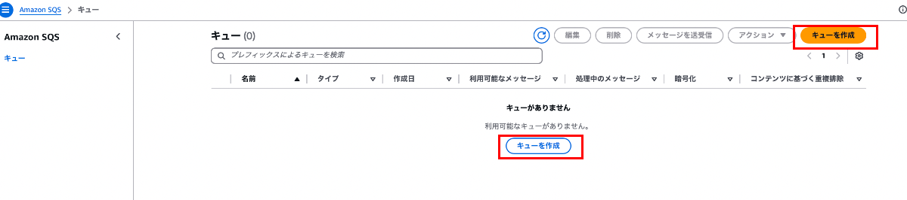
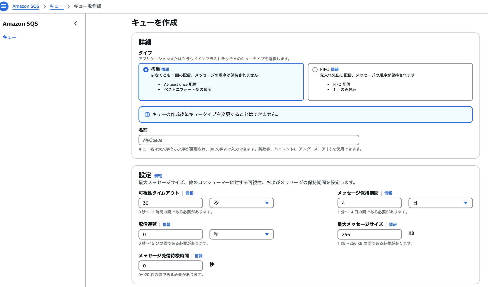
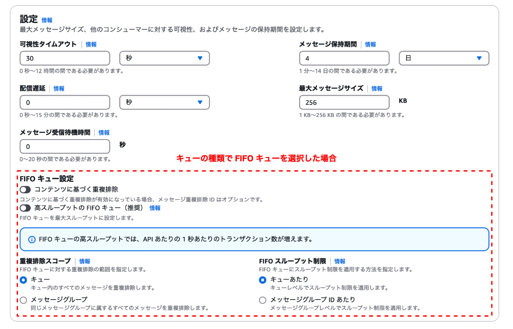
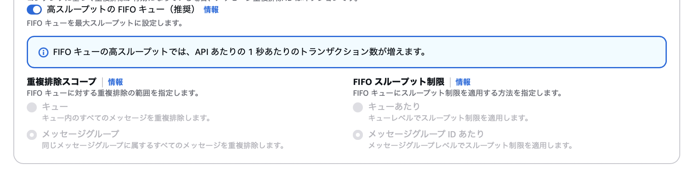
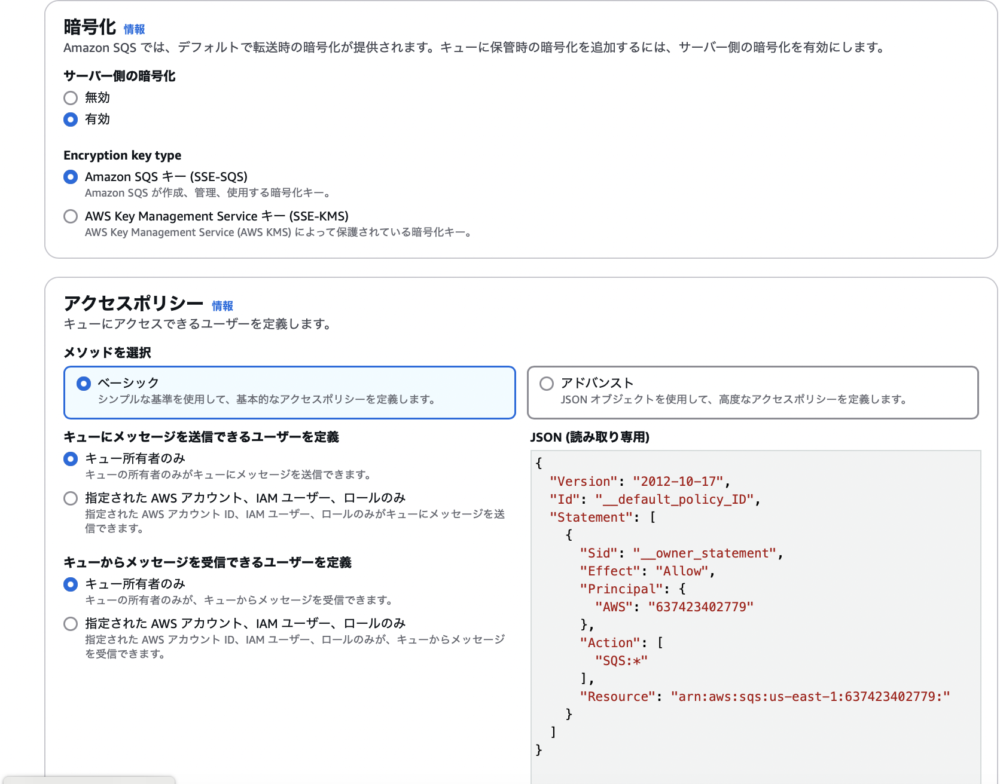
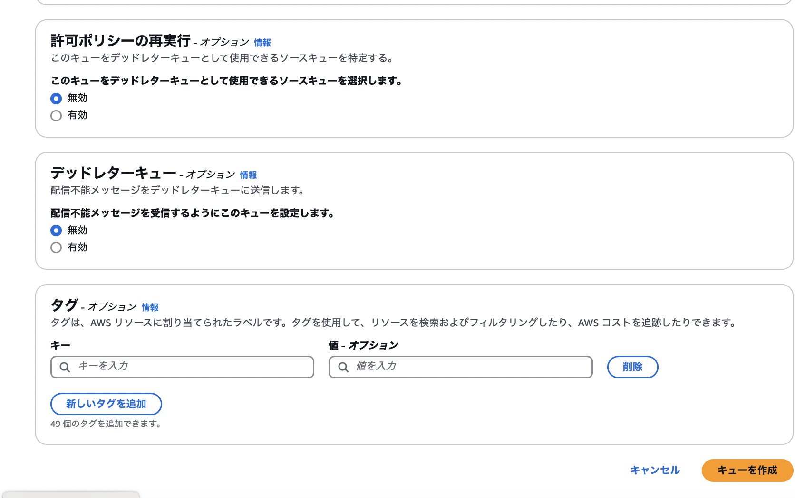
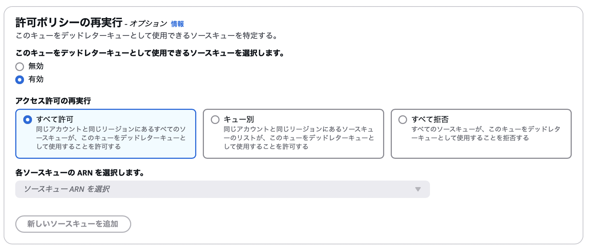
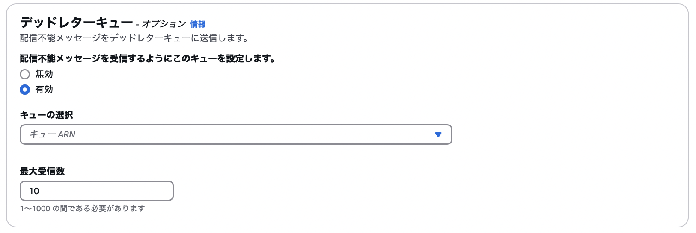

### SQS キューの作成方法

1. AWS マネージドコンソール画面より `キューを作成` をクリック

    

 

2. 各設項目を設定する

    
    

     

    - `詳細`: 作成するキューの種類と名前を設定

        - タイプ: 作成するキューを[スタンダードキュー FIFO キュー](./AmazonSQS.md#キューの種類)から選択する

        - 名前: 作成する SQS キューの名前

     

    - `設定`: キューの挙動に関する設定

        - [可視性タイムアウト](./AmazonSQS.md#キュー)

        - [メッセージ保持期間](./AmazonSQS.md#キュー)

        - [配信遅延](./AmazonSQS.md#遅延キュー-delay-seconds)

        - [最大メッセージサイズ](./AmazonSQS.md#メッセージ)

        - [メッセージ受信待機時間](./AmazonSQS.md#コンシューマー-consumer): 0秒の場合はショートポーリング、 1秒以上の場合はロングポーリングとなる

         

        ★ キューの種類を FIFO キューにすると、以下の項目が増える

        - `FIFO キュー設定`

            - [コンテンツに基づく重複排除](./AmazonSQS.md#fifo-キュー): ON にすると、メッセージに自動で重複排除 ID が付与される。 OFF にすると、プロデューサー側での重複排除 ID の指定が必須になる

            - 高スループットの FIFO キュー: FIFO キューを[高スループットモード](./AmazonSQS.md#fifo-キュー-1)にする
                
                ★高スループットモードを ON にすると、後述の重複排除のスコープはグループ単位になり、 FIFO スループット制限はメッセージグループに設定される
                
                
             

            - 重複排除スコープ: 重複排除がキュー全体、またはメッセージグループ単位で行われるかを指定する

            - FIFO スループット制限: [FIFOキュー内のメッセージに対するスループットの制限](./AmazonSQS.md#fifo-キュー-1) (1秒間に 300 リクエスト) がキュー全体、またはメッセージグループ単位で設定するかを指定する

     

    

    - `暗号化`: キューでの保管時のメッセージ暗号についての設定

        - サーバー側の暗号化: 
        [キュー内のメッセージを暗号化](./AmazonSQS.md#キュー)するかどうか

        - Encryption key type: サーバー側 (キュー内) でのメッセージの暗号化に使用する暗号キーのタイプ

     

    - `アクセスポリシー`: キューにアクセス(送信、受信)できるプロデューサー、コンシューマーの設定
    
     

    

     

    - `許可ポリシーの再実行`: 
        - このキューをデッドレターキューとして使用できるソースキューを選択します: 当 SQS キューをデッドレターキューとして運用する際、[リドライブ](./AmazonSQS.md)した際のメッセージの転送先となる他の SQS を指定する項目

            

             

            - 全て許可: 全ての SQS キューが 当デッドレターキューにアクセスできるよう設定する

            - キュー別: 特定の SQS キューのみ (最大10個まで) 当デッドレターキューにアクセスできるよう設定する

            - 全て拒否: 全ての SQS は当デッドレターキュにアクセスできないよう設定する

            TODO: ↑要確認

     

    - `デッドレターキュー`:
        - 配信不能メッセージを受信するようにこのキューを設定します: 

        

    - `タグ`: 作成する SQS キューに付与するタグ

 

3. 各設定項目を埋めたら `キューを作成` をクリック

 
 

参考サイト

「許可ポリシーの再実行」の項目について
- [Amazon SQS でデッドレターキューを使用します](https://docs.aws.amazon.com/ja_jp/AWSSimpleQueueService/latest/SQSDeveloperGuide/sqs-dead-letter-queues.html#policies-for-dead-letter-queues)

---

### SQS キューの確認

#### SNS サブスクリプション

- SNS と連携し、SNS からメッセージを受け取ることができる

 

#### Lambda トリガー

- コンシューマーに Lambda 関数を設定することができる

 

#### EventBridge Pipes

- EventBridge Pipes と連携し、SQS からメッセージを EventBridge Pipes に送ることができる

 

#### デッドレターキュー

- 当 SQS キューにて配信不能なメッセージがあった場合に、そのメッセージの転送先のデッドレターキューを設定することができる

 

#### モニタリング

- 当 SQS キューの使用状況に関するメトリクスを確認することができる

 

#### タグ付け

- 当 SQS キューにタグを付与することができる

 

#### アクセスポリシー

- 

 

#### 暗号化

- 

 

#### デッドレターキューの再処理タスク

- 

 

#### 