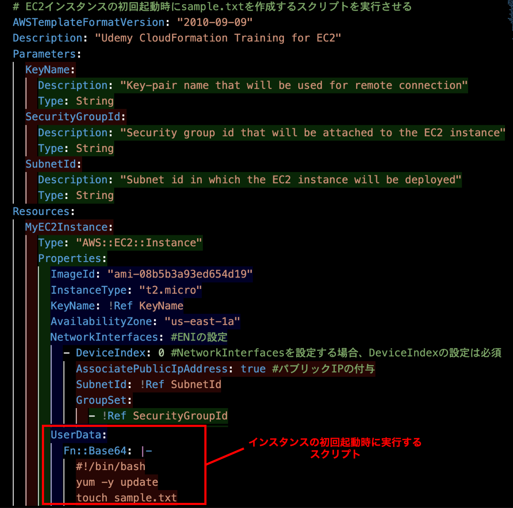
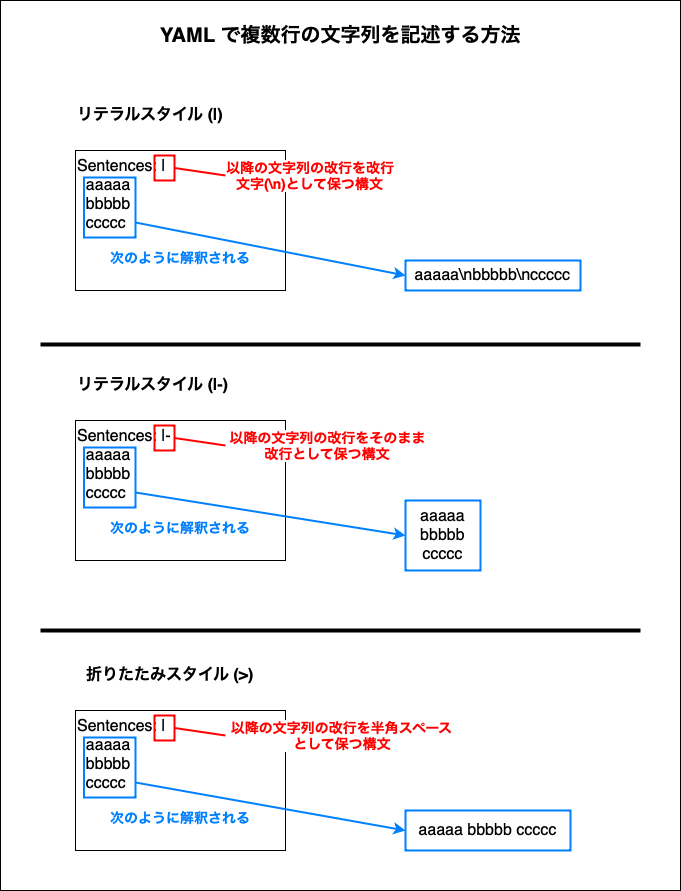

### EC2 ユーザーデータとは

- ユーザーデータとは、EC2 インスタンスの**初回**起動時にタスクを実行できるようにするためのもの

    - シェルスクリプトか cloud-init ディレクティブでユーザーデータを記述する必要がある

    - 再起動のたびにユーザーデータに記述したスクリプトを実行する方法もあるが、今回の内容の範囲外のため省略

 
 

参考サイト

[ユーザーデータ入力を使用して EC2 インスタンスを起動するときにコマンドを実行する](https://docs.aws.amazon.com/ja_jp/AWSEC2/latest/UserGuide/user-data.html)

---

### CloudFormation での EC2 ユーザーデータの書き方

- EC2 リソースの UserData キーに対してスクリプトを定義する

    

 
 

- ★**ユーザーデータの内容は Base64 にエンコードされている必要がある**ため、Fn:Base64 組み込み関数を利用する

    

     

    - また、以下のように Fn::Sub 関数と組み合わせることで

 
 

- ★★Base64 に渡す文字列の先頭の `|-` は YAML のリテラルスタイルと呼ばれる構文で、**|- 以降の文字列の改行を保つ**

    
    
 
 

- ★★`#!/bin/bash` が意味するのは、**シェルスクリプトを実行するシェルの種類を指定している**

    - `#!/bin/bash` だったら Bash でスクリプトを実行するよう意味する

    - `#!/bin/csh` だったら Cシェル でスクリプトを実行するよう意味する

 
 

- UserData に渡せるスクリプトには 16KB のサイズ上限があることに注意

    - 上記の制限を超えた UserData で EC2 インスタンスを起動しようとすると 'User data is limited to 16384 bytes' が出るっぽい

 
 

参考サイト

UserData を Fn::Base64 でエンコードする理由
- [CloudFormationの中のEC2のユーザーデータでシェル変数を使用する](https://dev.classmethod.jp/articles/using-variables-in-ec2-user-data-in-cloudformation/)
- [ユーザーデータスクリプトを実行して EC2 Windows インスタンスを設定する場合の問題をトラブルシューティングする方法を教えてください。](https://repost.aws/ja/knowledge-center/ec2-windows-troubleshoot-user-data)

 

`|-` について
- [YAMLのリテラルスタイルと折りたたみスタイル (Literal Style, Folded Style)](https://devlights.hatenablog.com/entry/2021/11/04/073000#リテラルスタイル)
- [【速習】YAML1.2の概要と基本構文【練習問題付き】](https://hiramatsuu.com/archives/1797#toc14)

 

`#!/bin/bash` について
- [シェル先頭の#!/bin/bashとは何なのか](https://note.com/milkcoff_e/n/nb645f1dc3f2d)
- [個人的な備忘録：シェルスクリプト実行時に記述する『#!/bin/bash』について自分なりに深掘りしてみた](https://qiita.com/free-honda/items/4bfa241ac489590cde8d)
- [CloudFormationのFn::Base64について簡単にまとめ。](https://zenn.dev/mjxo/articles/891510a4076ed1)

ユーザーデータの制限について
- [CloudFormation で「User data is limited to 16384 bytes」になったときの対処方法](https://dev.classmethod.jp/articles/tsnote-cloudformation-user-data-is-limited-to-16384-bytes/)