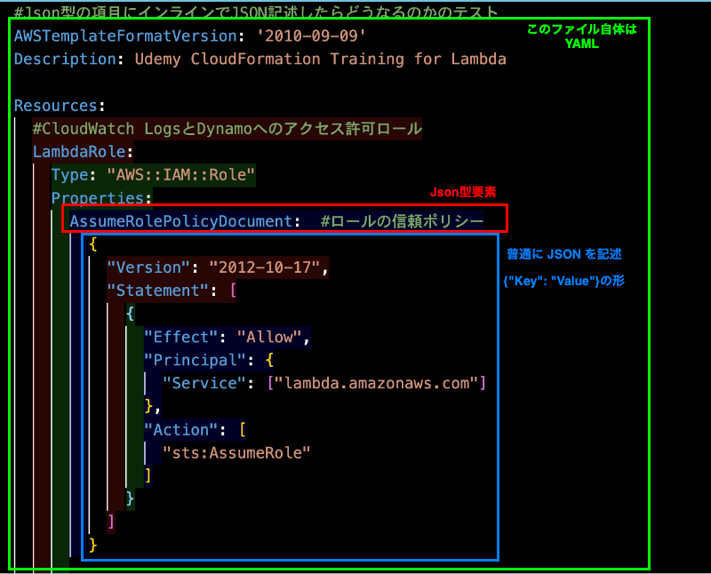

### CloudFormation での IAM ロールの作成方法

 

#### ポイント

- `AssumeRolePolicyDocument` 要素は必須項目

    - `AssumeRolePolicyDocument` はロールの[信頼ポリシー](./IAM_Policy.md#信頼ポリシー)

 

- `AssumeRolePolicyDocument` や PolicyDocument の値は Json 型

 

- IAM ロールリソースに定義する `Policies` 要素にはインラインポリシーが設定可能

    - `Policies` 要素は作成する IAM ロールの[許可ポリシー](./IAM_Policy.md#許可ポリシー)

---

### Json 型

- (AWS の) YAML の Json 型は以下の値を受け付ける

    - 通常の `JSON (= {"key": "vaue"} )`

    - JSON と同等の YAML

 

#### YAML に JSON を埋め込む

 

#### JSON と同等の YAML とは

 
 

参考サイト

[【AWS】CloudFormationでIAM RoleのPolicy定義に変数を用いる【小ネタ】](https://qiita.com/tmiki/items/5ffcc09a20fb49478835)

[小ネタ】AWS CloundFormationのYAMLテンプレート内のJSONで変数を使う](https://dev.classmethod.jp/articles/cfn_json_value_in_yaml)

---

### IAM ロールの許可ポリシー

#### インラインポリシー

- `Policies` 要素に [Policy 型](https://docs.aws.amazon.com/ja_jp/AWSCloudFormation/latest/UserGuide/aws-properties-iam-role-policy.html)の配列で定義する

    

 
 

#### 管理ポリシー

- `ManagedPolicyArns` 要素に管理ポリシーのarnを渡す

    

 
 

参考サイト

[【AWS】CloudFormationテンプレートでIAM Roleを作成したときの学び](https://km-tech.hateblo.jp/entry/2019/12/06/095227)