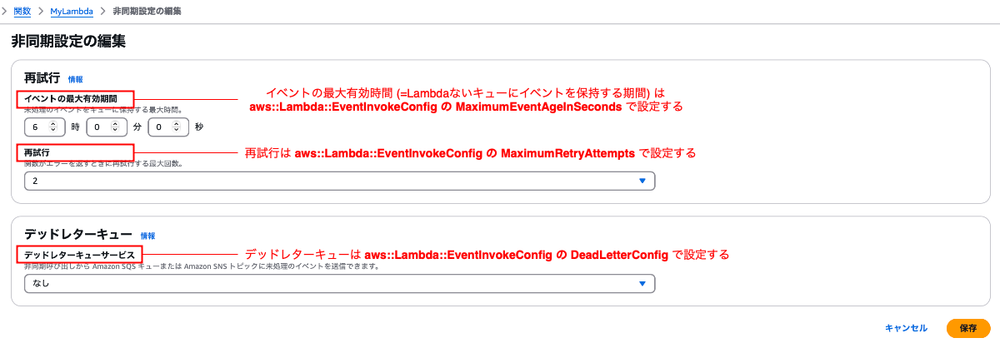

### CloudFormation で Lambda　リソースの作り方

 

#### ポイント

- 必須要素は `Code` と `Role` のみ

    - Code 要素の値は [AWS::Lambda::Function Code](https://docs.aws.amazon.com/ja_jp/AWSCloudFormation/latest/UserGuide/aws-properties-lambda-function-code.html) 型

     

    - Role 要素には Lambda 関数に付与したい **IAM ロールの ARN** を設定する

        - CloudFormation で IAM ロールも作成する場合は、 !Ref ではなく Fn::GetAtt 関数で ARN 取得すること

            - `!Ref IAM ロールのリソース` は IAM ロールの ARN ではなく **IAM ロール名を返却する**ため

---

### マネージドコンソールでの設定項目と CloudFormation での設定項目の対応

 

#### 新規作成時

 

#### 作成後の`コード`タブ

 

#### 作成後の`設定`タブの各項目

- 一般設定

    

 

- 環境変数

    

 

- 同時実行と再帰の検出

    

     

    - ★★★プロビジョニングされた同時実行数は Lambda 関数のバージョンかエイリアスに対して指定するもの

 

- 非同期呼び出し

    

 
 

参考サイト

CloudFormation での Lambda 関数リソースの要素について
- [AWS::Lambda::Functionのプロパティ](https://qiita.com/da-sugi/items/f643a4418cde920daf6f)

プロビジョニンされた同時実行について
- [Provisioned Concurrency を設定した Lambda 関数を ALB にぶら下げるときの注意点](https://blog.serverworks.co.jp/provisioned-concurrency-lambda-alb)

レイヤーについて
- [AWS CloudFormation を使用したレイヤー](https://docs.aws.amazon.com/ja_jp/lambda/latest/dg/layers-cfn.html)

---

### Lambda 関数のコード

- CloudFormation にて Lambda 関数を作成するには、主に以下の方法がある

    - [テンプレートにコードをベタ書き](#テンプレート内にコードをベタ書き)

    - [S3 にコード (zip) をアップロードし、それを元に Lambda 関数作成](#zip-ファイルから-lambda-関数を作成)

    - [コンテナイメージから Lambda 関数を作成](#コンテナイメージから-lambda-関数を作成)

 
 

#### テンプレート内にコードをベタ書き

 

- テンプレート内の Lambda 関数リソース (`AWS::Lambda::Function`) の Code 要素内の **ZipFile 要素にベタ書きする**

- ★CloudFormation でインライン (=テンプレートにコードをベタ書き) で Lambda 関数を作成する場合、`AWS::Lambda::Function` の **Runtime と Handler 要素は必須要素になる**ことに注意

- ★CloudFormation でインライン (=テンプレートにコードをベタ書き) で Lambda 関数を作成する場合、`AWS::Lambda::Function` の **Handler に指定するエントリーポイントとなるファイル名は index になる**ことに注意

- Code の値の頭の `|-` の意味については[こちら](./CloudFormation_EC2_ユーザーデータ.md#cloudformation-での-ec2-ユーザーデータの書き方)を参照

 
 

#### zip ファイルから Lambda 関数を作成

 

- ★テンプレート内の Lambda 関数リソース (`AWS::Lambda::Function`) の Code 要素内の **S3Bucket に zip ファイルをアップロードしたバケット名**、**S3Key にzipファイル名(拡張子込み)** を定義する

- ★CloudFormation で zip ファイルから Lambda 関数を作成する場合、`AWS::Lambda::Function` の **Runtime と Handler 要素は必須要素になる**ことに注意

- ★`AWS::Lambda::Function Code` の S3Bucket 要素に指定するバケットは、**作成する Lambda 関数と同じリージョンになければならない**ことに注意

 
 

#### コンテナイメージから Lambda 関数を作成

- Docker イメージを [ECR](./AWS_ECR.md)に事前にプッシュしておく必要がある

    

 

- 以下が(たぶん)最小のテンプレート

    

     

    - ★`AWS::Lambda::Function` リソースの **PackageType 要素に Image** を指定する

    - ★`AWS::Lambda::Function` リソースの Code 要素内の **ImageUri 要素に イメージ URI** を指定する

        

 

- AWS が用意しているベースメージ以外のベースイメージをもとに Lambda 関数を作成する場合は、少し手順がややこしくなる ([こちら](https://qiita.com/eiji-noguchi/items/e226ed7b8da2cd85a06a)を参照)

 
 

参考サイト

[CloudFormationでLambdaを作成する3パータン(S3/インライン/コンテナ)](https://awstut.com/2022/02/02/3-patterns-for-creating-lambda-with-cloudformation/)

[CloudFormationのテンプレートファイルでLambdaコードベタ書きから脱却したい](https://qiita.com/bd8z/items/91a1ed66e35e7253804d)

[CloudFormationでLambda関数デプロイ(超初歩)](https://qiita.com/da-sugi/items/d2ba119a0e35ad1b352e)

[Node.js Lambda 関数をコンテナイメージとともにデプロイする](https://docs.aws.amazon.com/ja_jp/lambda/latest/dg/nodejs-image.html#nodejs-image-base)

[Lambdaでコンテナイメージから関数を作成する](https://qiita.com/eiji-noguchi/items/e226ed7b8da2cd85a06a)

[AWS Lambda handler はどのように呼ばれるのか](https://zenn.dev/hkdord/articles/lambda-handler-deep-dive)

---

### CloudFormation で関数 URL の利用

- Lambda の関数 URL については[こちら](./Lambda.md#関数url)を参照

- 通常の Lambda 関数を作成するテンプレートに `AWS::Lambda::Url` リソースを定義する必要がある

    

     

- ★`AWS::Lambda::Permission` リソースも定義する必要がある (特に `AWS::Lambda::Url.AuthType=NONE` の場合)

    - `AWS::Lambda::Url` リソースを定義すれば関数 URL は作成されるが、それだけでは[アクセスできない](./issues/CloudFormationで作成した関数URLが呼び出せない.md)ため、`lambda:InvokeFuntionUrl` を許可する `AWS::Lambda::Permission` を定義し、関数 URL にアクセスできるようにする

        

 
 

### 認証タイプ IAM

- `AWS::Lambda::Url` の AuthType を IAM にした場合、かつ認証条件が IAM ユーザーかどうかの基本的な認証だけの場合は **AWS::Lambda::Permission** は定義 & 作成しなくてもよい

- IAM 認証の上で、任意の条件を設定したい場合は `AWS::Lambda::Permission` で定義する必要がある

 
 

参考サイト

[Lambda Function URLsをCloudFormationとCDKでデプロイする](https://zenn.dev/shimo_s3/articles/de3f1e7bc6828c)

[AWS::Lambda::Url](https://docs.aws.amazon.com/AWSCloudFormation/latest/TemplateReference/aws-resource-lambda-url.html)

[AWS::Lambda::Permission](https://docs.aws.amazon.com/AWSCloudFormation/latest/TemplateReference/aws-resource-lambda-permission.html)

[Lambda 関数 URL へのアクセスの制御](https://docs.aws.amazon.com/ja_jp/lambda/latest/dg/urls-auth.html#urls-auth-none)