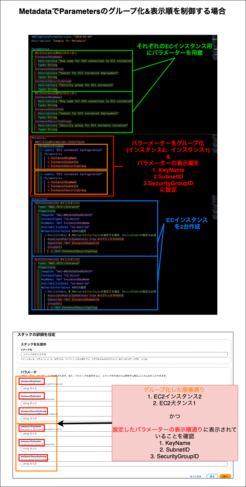

### Parameter と Metadata の組み合わせでできること

- Parameter と Metadata を組み合わせることで以下のようなことができる

    - マネージドコンソールでスタックを作成する際に表示されるパラメーターの順番を制御できる (Metadata セクションに `AWS::CloudFormation::Interface:` を定義)

    - その他にもいくつかあるが、だいたいパラメーターの順番を変えるのに利用される

    

    引用: [[CloudFormation] Metadata セクションで入力パラメータを見やすく設定する](https://zenn.dev/ano/articles/c5eedcc31b30e2)

 

---

### 利用例

- Metadata を使わない場合

    

 
 

- Metadata を使って Parameters の表示順の制御をした場合

    

 
 

- Metadata を使って Parameters のグループ化 & 表示順の制御をした場合

    

 
 

参考サイト

[AWS::CloudFormation::Interface](https://docs.aws.amazon.com/ja_jp/AWSCloudFormation/latest/UserGuide/aws-resource-cloudformation-interface.html)