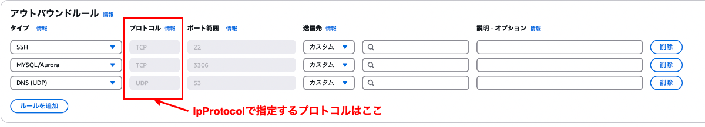

### CloudFormation で作成する Security Group

#### ポイント

- GroupDescription は必須項目

- SecurityGroupIngress は [Ingress (ハッシュ)](https://docs.aws.amazon.com/ja_jp/AWSCloudFormation/latest/UserGuide/aws-properties-ec2-securitygroup-ingress.html)の配列

- SecurityGroupEgress は [Egress (ハッシュ)](https://docs.aws.amazon.com/ja_jp/AWSCloudFormation/latest/UserGuide/aws-properties-ec2-securitygroup-egress.html)の配列

 
 

参考サイト

[AWS::EC2::SecurityGroup](https://docs.aws.amazon.com/ja_jp/AWSCloudFormation/latest/UserGuide/aws-resource-ec2-securitygroup.html)

---

### FromPort と ToPort の違い

- SecurityGroupIngress / SecurityGroupEgress には FromPort と ToPort というキーがある

 

- ★FromPortは**許可するポート範囲の開始ポート**を指定する

 

- ★ToPortは**許可するポート範囲の終了ポート**を指定する

 

- 1つのポートのみ許可したい場合は、**FromPort と ToPort を同じポート番号で指定する**

    - ★★FromPort と ToPort に-1を指定すると、全てのポートの許可を意味する

 

 
 

参考サイト

[CloudFormation セキュリティーグループ fromport toport](https://qiita.com/yuushin_kunda/items/44aed4da70c5e01253d3)

---

### IpProtocol とは

- SecurityGroupIngress / SecurityGroupEgress には IpProtocol というキーがある

- IpProtocol には許可したいプロトコルを指定する (文字列)

    - tcp

    - udp

    - [icmp](#icpm-とは)

        - ping などを許可したい場合は icmp プロトコルを許可する必要がある

    - [icmpv6](https://it-biz.online/it-skills/icmpv6/)

    - -1

        - ★ -1を指定すると上記全てのプロトコルの許可を意味する

- ★★★ここではアプリケーション層のプロトコルではなく、**トランスポート層のプロトコルを指定する**★★★

 

---

### ICPM とは

- ping や traceroute が利用しているプロトコル

- ノード (サーバー・PC など) 間で、通信状態を確認するためのプロトコル

    - パケットが送信対象ノードに到達しなかった場合、送信元に到達不能メッセージを返す

 
 

参考サイト

ICMP について
- [Protocol Number](https://www.infraexpert.com/study/tea11.htm)
- [その12「IP/TCP/UDP/ICMPとは」](https://bb.watch.impress.co.jp/cda/bbword/7074.html)
- [小ネタ】VPCセキュリティグループに「プロトコル=ここ」のルールを設定する方法](https://dev.classmethod.jp/articles/securitygroup-custom-icmp/#toc-icmp)

ICMP と TCP/UDP の違いについて
- [ICMPとは？ネットワーク通信の基本についてわかりやすく解説](https://study-sec.com/icmp)
