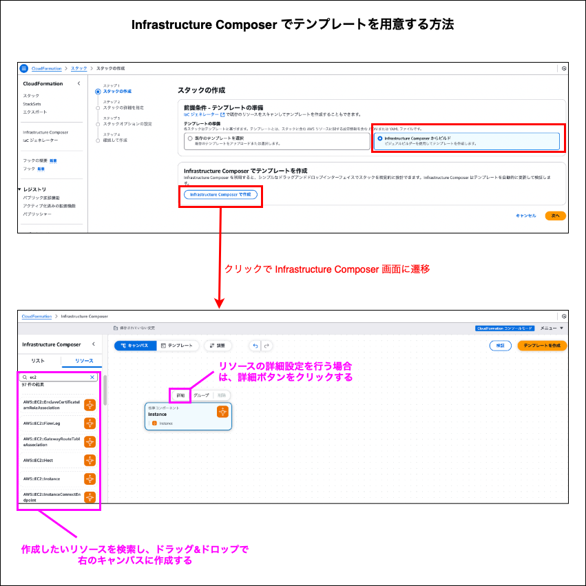
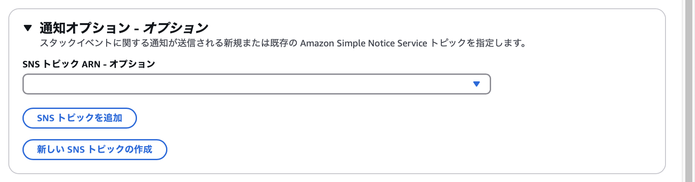

### スタックの作成 ~ 大まかな流れ ~

1. AWS マネージドコンソールにて、CloudFormation の `スタック` 画面にある `スタックの作成` をクリックする

    

 

2. [テンプレートの用意](#スタックの作成--テンプレートの用意-)

 

3. [スタックに関する詳細設定を行う](#スタックの作成--詳細設定-)

 

4. [スタックのオプションを設定する](#スタックの作成--オプションの設定-)

 

5. 設定内容を確認し、`作成` をクリックする

---

### スタックの作成 ~ テンプレートの用意 ~

- スタックはテンプレートファイルを元に作成する

- テンプレートファイルを用意する方法は以下のものがある

    1. すでに S3 にアップロード済みのテンプレートファイルを利用する

    

     

    2. 自分のマシンにあるテンプレートファイルを利用する

        - スタックの作成時に、ローカルのファイルを S3 にアップロードする

    

     

    3. Git にコミット済みのテンプレートファイルを S3 にアップロードし、そのテンプレートファイルを利用する

        - スタックの作成時に、Git にあるテンプレートファイルを S3 にアップロードする
    
    

     

    4. AWS が提供する GUI (Infrastructure Composer) でテンプレートを作成する

    

---

### スタックの作成 ~ 詳細設定 ~

- `スタック名`
    - 作成するスタックの名前

 

- パラメータ
    - テンプレートに設定した [Parameters](./CloudFormation_Template.md#parameters) で設定したパラメーターはここで表示される

---

### スタックの作成 ~ オプションの設定 ~

 
 

#### タグ、アクセス許可

- `タグ`
    - 作成するスタックに付与するタグ

 

- `アクセス許可`
    - スタックを実行する際に CloudFormation に許可する権限を設定することができる

    - ★嬉しいポイント
        - CloudFormation を実行するユーザーには CloudFormation に関する権限のみ付与するだけで済む

        - 以前は、CloudFormation を実行するユーザーに作成するリソースに関する権限も付与しなければならなかった

 

#### スタックの失敗オプション

- `プロビジョニング失敗時の動作`

    - スタックの作成/更新に失敗した時の挙動を設定する

    - ロールバック = 全てのリソースを前回の状態に戻す

    - リソースの保持 = 正常に作成/更新ができたリソースは削除せずにそのままにしておく

 

- `ロールバック中に新しく作成されたリソースを削除する`

    - スタックの作成中に失敗が発生した場合に、新しく作成されたリソースをロールバックの一環として削除するかどうかを決定する設定

    - 削除ポリシーを使用する = 各リソースは自身に設定された削除ポリシーに従う

    - 全て削除する = 各リソースに設定されている削除ポリシーに関係なくそのリソースは削除される

 

#### スタックポリシー

- スタックポリシーとは、CloudFormationのスタック更新でアップデートを許可/禁止するリソースを定義するためのポリシーのこと

- スタックポリシーを定義し、対象のスタックに設定することで、そのスタックの中の特定のリソースの更新を禁止することができる

 

#### ロールバック設定

- スタックの作成/更新後に指定した時間スタックをモニタリングし、CloudWatch アラームが ALARM になったらロールバックする

 

#### 通知オプション

- スタックの作成,更新,削除時に通知を受けることができる

 

#### スタックの作成オプション

- `タイムアウト`

    - 指定した時間内にスタックの作成が完了しない場合、ロールバックする

 

- `削除保護`

    - スタック自体への削除保護

        - 削除保護を無効にしないとスタックは削除不可になる

 
 

参考サイト

IAM ロールについて
- [CloudFormationを扱う際のIAMの考え方](https://qiita.com/sakuraya/items/920b9d0b549c8c412416)
- [いつの間にかCloudFormationがIAM Roleに対応していました](https://dev.classmethod.jp/articles/cloudformation-service-role/)

スタックポリシーについて
- [CloudFormationの超詳細解説 3/4 実行編](https://qiita.com/tech4anyone/items/1e9a3021efc9050166f3#stack-policy)

ロールバックについて
- [CloudFormationスタック作成時の設定について](https://qiita.com/kazunobu2211/items/261232f9af3bdc096dfd)

通知オプションについて
- [CloudFormationスタックイベントをSNSでメール通知する](https://oreout.hatenablog.com/entry/aws/cloudformation/9)

タイムアウトについて
- [CloudFormation コンソールからスタックを作成する](https://docs.aws.amazon.com/ja_jp/AWSCloudFormation/latest/UserGuide/cfn-console-create-stack.html#create-stack)

削除保護とは
- [[新機能] CloudFormationのStackに削除保護が設定可能になりました](https://dev.classmethod.jp/articles/cloudformation-stack-termination-protection/)