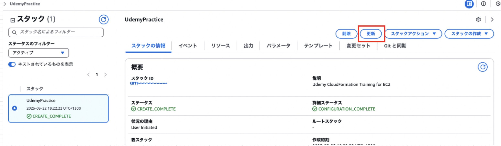
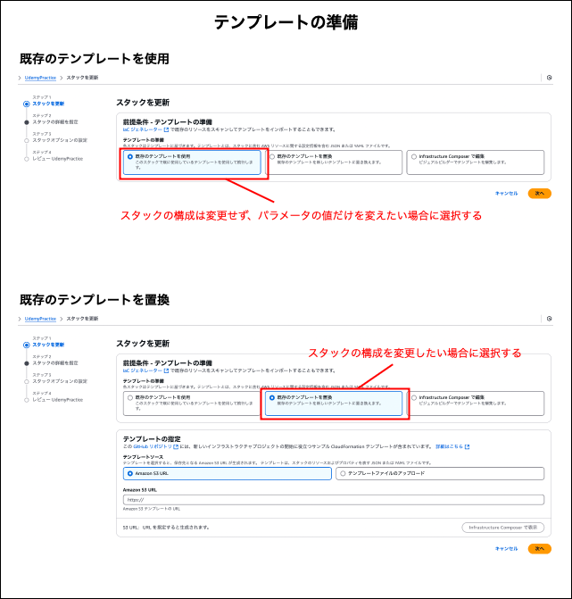
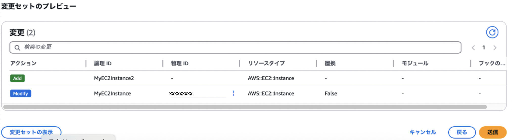
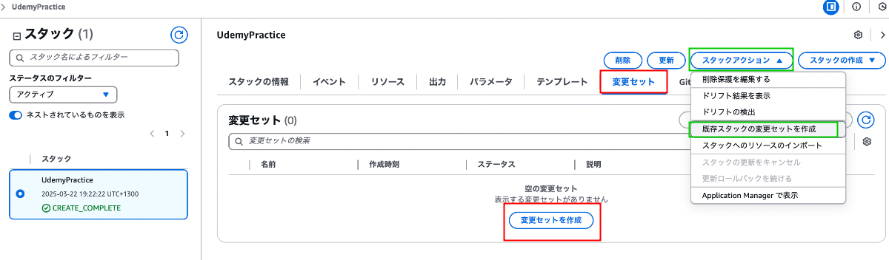
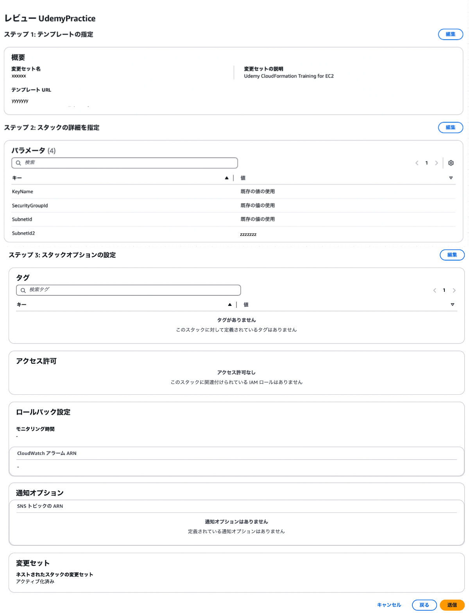
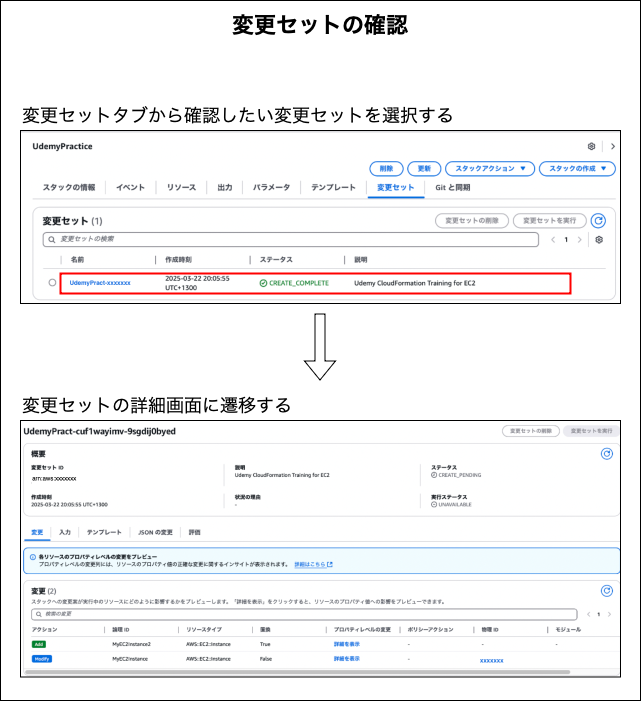
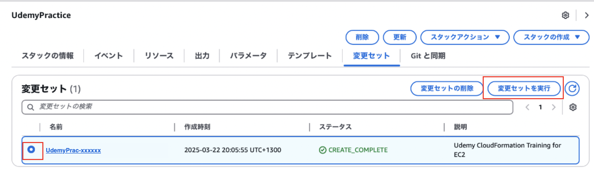
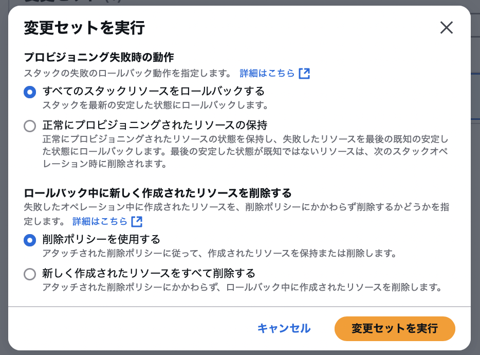

### スタックの更新には2つの方法がある

1. 普通に更新

2. 変更セットを利用する

    - 事前にスタックの変更箇所を確認できる機能

        - ★イメージ的には更新内容をステージング環境にアップし、更新前と更新後の差分を確認できる感じに近い
 

#### ポイント

- 変更セットは作成しても、**変更セットの実行をしない限り**更新内容が反映されることはない

---

### 普通に更新する

1. 更新したいスタックの詳細画面にて `更新` をクリック

    

 
 

2. テンプレートの準備

    

 
 

3. スタックの詳細設定

    - パラメーターがあればそれらの入力

    - 詳しくは[こちら](./CloudFormation_スタックの作成.md#スタックの作成--詳細設定-)を参照

 
 

4. スタックのオプション設定

    - スタックの更新が失敗した時の挙動などを設定

    - 詳しくは[こちら](./CloudFormation_スタックの作成.md)を参照

 
 

5. 内容確認

    - 内容確認画面の一番最後に現在のスタックと更新後の差分が表示される

    

 
 

6. スタックの更新

    - `送信` をクリックする

---

### 変更セットを利用して更新する

#### 変更セットの作成

1. スタックの詳細画面の `変更セット` タブから `変更セットの作成` をクリック

    - もしくは `スタックアクション` にある `既存スタックの変更スタックを作成` をクリック

    

 
 

2. テンプレートの準備、スタックの詳細設定、スタックのオプションの設定

    - 普通の更新と同じようにテンプレートの準備からスタックのオプションの設定までを行う

    

 

3. 設定内容を確認し、変更セットの作成

    - ★普通の更新とは異なり、現在のスタックと更新後の差分は表示されない

    - 内容を確認し、問題がなければ `送信` をクリック

    

 
 

#### 変更セットの確認

 
 

#### 変更セットの実行 = スタックの更新

- 変更セットの内容を確認し、問題がなければ変更セットの実行を行いスタックを更新する

 

- `変更セット` タブにて反映したい変更セットを選択し、`変更セットを実行` をクリック

    

 

- 更新失敗時の挙動を指定し、`変更セットを実行` をクリック

    

 
 

参考サイト

[CloudFormationをゼロから勉強する。（その７：変更セットとドリフト検出）](https://qiita.com/sakai00kou/items/5a7ebb0898ea3eab7239)