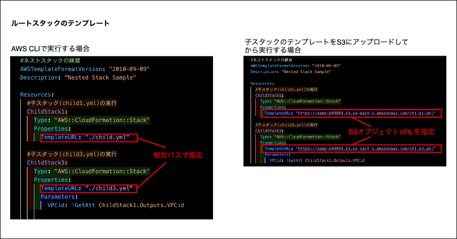

### テンプレートの分割

- スタックを構成するリソースが増えれば増えるだけテンプレートファイルのサイズが大きくなり管理しにくくなる

 

- CloudFormation ではテンプレート分割して管理するための機能がいくつかある

    1. [スタックのネスト機能](#スタックのネスト)

    2. [クロススタック参照](#クロススタック参照)

    3. [Transform Incude](#transform-include)

 

- ★AWS 公式が推奨しているのはクロススタック参照。しかし、参照関係が複雑になるとスタックの削除や更新ができなくなったりするので注意すること

---

### スタックのネスト

- あるスタックから別のスタックを作成する仕組みのこと

    

    引用: [CloudFormationを使用してネストされたスタックを作成し、JSONファイルでパラメータを設定してAWS CLIで実行する方法](https://blog.serverworks.co.jp/2023/11/27/111752)

 

- ルートスタック (=メインスタック) が各子スタックを実行し、各こスタックはリソースを作成する

    

    引用: [CloudFormationを使用してネストされたスタックを作成し、JSONファイルでパラメータを設定してAWS CLIで実行する方法](https://blog.serverworks.co.jp/2023/11/27/111752)

 

- ★(AWS マネージドコンソールから利用する場合) **子スタックとなるテンプレートは事前に S3 にアップロード**しておき、ルートスタックのテンプレートのみスタックの作成の時にアップロードする

 

- ★ネストスタックで構成される環境は複数スタックからなる

    - 考えなしにネストスタックを利用すると、スタック最大作成数 (2,000 スタック) に達してしまう恐れがあることに注意
    
    - `Transform` という機能は複数テンプレートから1つのスタックを構成する

 
 

#### ネストスタックのサンプル

 
 

#### ポイント

1. ★子スタックの実行は `AWS::CloudFormation::Stack` リソースに定義する

 

2. ★`AWS::CloudFormation::Stack` リソースの `Template` 要素には実行する子スタックテンプレートの URL を定義する必要がある

    - ★★子スタックのテンプレートを S3 にアップロードする場合、**S3 オプジェクト URL** を Stack リソースの Template 要素に記述する

        

     

    - ★★AWS CLI からテンプレートの実行をする場合は**各テンプレートファイルからの相対パス**を Stack リソースの Template 要素に記述する

        

 

3. ★★親 → 子 へ変数を渡す場合

    - (渡す側) 親スタック側では Stack リソースの `Parameters 要素` にて子スタックに渡したい変数とその値を定義する

    - (取得する側) 子スタック側では `Parameters セクション` で渡ってくる変数名とそのデータ型を定義する

 

4. ★★子 → 親 へ変数を渡す場合

    - (渡す側) 子スタック側では `Outputs セクション` で渡したい変数名とその値を定義する

    - (取得する側) 親スタック側では `Fn::GetAtt` に*子スタック(論理)名.Outputs.子スタックのOutputsセクションで定義した変数名* を引数にして GetAtt 関数を呼び出す

 

引用: [CloudFormationをゼロから勉強する。（その８：スタックのネスト）](https://qiita.com/sakai00kou/items/553aba6cc924aff3c9b8)

 
 

参考サイト

[CloudFormationを使用してネストされたスタックを作成し、JSONファイルでパラメータを設定してAWS CLIで実行する方法](https://blog.serverworks.co.jp/2023/11/27/111752#ネストされたスタックとは)

[CloudFormationネストスタックの作成について様々な疑問の答えを調べてみました。](https://zenn.dev/mjxo/articles/fbc3d487fdfbec)

[CloudFormationをゼロから勉強する。（その８：スタックのネスト）](https://qiita.com/sakai00kou/items/553aba6cc924aff3c9b8)

[CloudFormationのクロススタック参照とスタックのネスト化の違いについて](https://qiita.com/fukuchan_milk/items/6d7fe1f13cb18de151c0)

---

### クロススタック参照

- 他のスタックで Outputs 出力した情報を別のスタックで取得させることができる機能

- ネストスタックと同様に、結果は複数スタックで構成される

 

 
 

#### ポイント

1. 参照される側は Outputs に参照される値を定義する必要がある

    - Export の Name 要素で参照する側から利用できる変数名を定義する

 

2. 参照する側は Fn::ImportValue 関数を使って参照したい値を取得する

 

3. クロススタック参照を利用している場合、**参照しているスタックを削除しない限り、参照されているスタックを削除 & 更新することはできない**

    

 
 

#### 循環参照

- クロススタック参照で循環参照が検出されると `Error: Circular dependency`が発生し 、そのリソースの作成/更新は失敗する

    

 
 

参考サイト

[【AWS】CloudFormationでクロススタックしてみた](https://qiita.com/hiyanger/items/0881229b233f13b0914f)

[CDKにおけるクロススタック参照の落とし穴：importValueと循環参照の問題](https://iret.media/145081)

[CloudFormationのクロススタック参照とスタックのネスト化の違いについて](https://qiita.com/fukuchan_milk/items/6d7fe1f13cb18de151c0)

---

### クロススタックとネストスタックの大きな違い

#### ネストスタック

- ネスト関係にあるスタック内のみで値を共有したい場合に向いている

#### クロススタック

- ネスト関係にあるスタック以外でも値を共有したい場合に向いている

 
 

参考サイト

[AWS CloudFormation # 2 基礎編](https://pages.awscloud.com/rs/112-TZM-766/images/AWS-Black-Belt_2023_CloudFormation-2_1231_v1.pdf)

---

### Transform Include

- テンプレートの [Transform セクション](./CloudFormation_Template.md#transform) や Fn:Transform 関数に Include マクロを指定して他のテンプレートファイルを取り込む方法

    - Include マクロ (`AWS::Include`) とは、テンプレートの実行前に他のテンプレートを取り込むことのできる処理 (≒ライブラリみたいみたいなもの)

 

- ★★ネストスタックやクロススタック参照と異なり、実行結果は1つのスタックになる

 
 

#### AWS Include のサンプル

 
 

#### ポイント

1. Include する側のテンプレートで Transform セクション or Fn:Transform 関数に AWS::Include を指定し、取り込みたい他のテンプレートを指定する

    

 

2. ★★★Include される側のテンプレートの形式に注意

    - Include する側に取り込まれた結果、正しく実行される形式で定義する必要がある

        

 

3. ★★`AWS:Include` の `Location` にはオブジェクト URL ではなく **S3 URI** を指定する必要がある

    

 

4. ★★Include される側では !Ref や !GetAtt の様に関数を省略形で記述してはいけない

    - 関数の省略形で記述した場合、エラーが発生しスタックが正しく作成されない → [こちら](https://dev.classmethod.jp/articles/aws-include-transform-failed/)を参照

        

 
 

参考サイト

[CloudFormationをゼロから勉強する。（その６：Transformによるインクルード）](https://qiita.com/sakai00kou/items/57019ef4b3b6b7d61251)

[Include Transformを使ってCFnテンプレートをモジュール化できそう](https://cloud5.jp/aws-include-transform-basic/)

[CloudFormation で AWS::Include Transform 利用時にハマってしまった件について](https://dev.classmethod.jp/articles/aws-include-transform-failed/)