### CouldTrail とは

AWS においてリソースなどの操作ログの記録し、追跡できるようにするサービス

以下の操作(イベント)が記録される

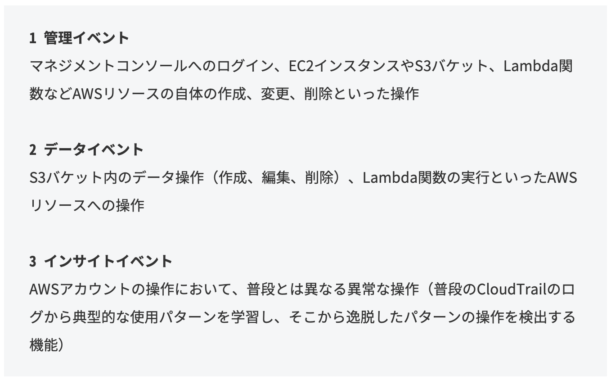

引用: [AWS CloudTrailを基礎からわかりやすく図解する](https://www.sbbit.jp/article/cont1/81207)

 

CloudWatch Logs と連携することで、怪しい操作がないか監視することができる

- 例：コンソールログインの失敗が起きたらアラームを送信するなど

 
 

参考サイト

[AWS CloudTrailを基礎からわかりやすく図解する](https://www.sbbit.jp/article/cont1/81207)

---

### イベント記録を見てみる

1. AWS コンソールから CloudTrail ダッシュボードに移動する

    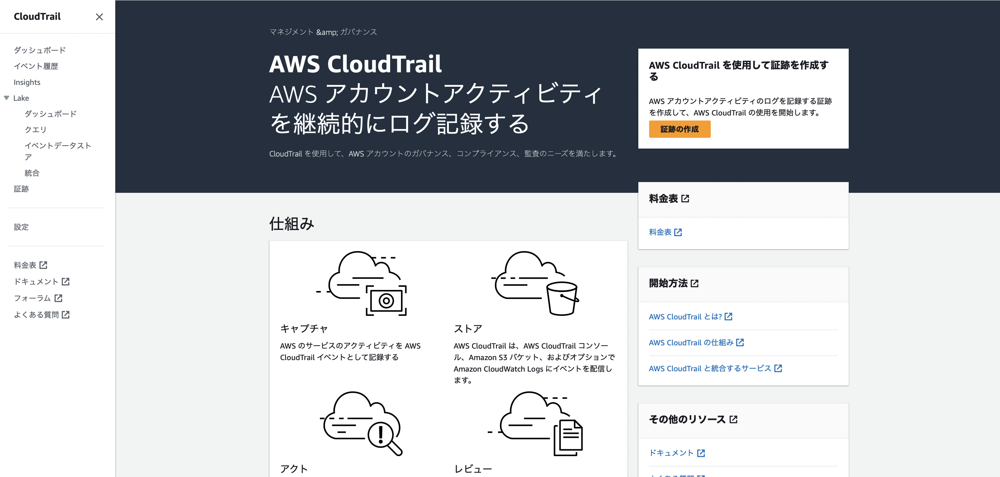

     

2. サイドメニューの `イベント履歴` をクリックする

    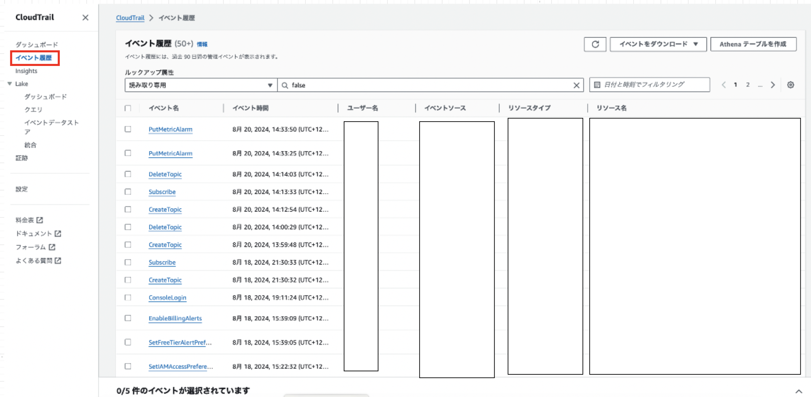

     

*イベントの記録は90日間 CloudTrail に記録される

*90日以上記録を保存したい場合は、 S3 にログを転送する必要がある → S3 の利用料金が発生するので注意

 
 

参考サイト

CloudTrail について
- [AWS CloudTrailとは？ AWS上の証跡を残す方法を解説](https://baresupport.jp/blog/2024/03/01/495/)

- [【初心者向け】AWS CloudTrail 入門！完全ガイド](https://zenn.dev/issy/articles/zenn-cloudtrail-overview)

CloudTrail のログを S3 に保存する際の料金
- [AWS CloudTrailとは？基本や特徴、メリットをわかりやすく解説](https://dx.nid.co.jp/column/what-is-aws-cloudtrail#6510eed367b38c02e3a0c387-1695702620319)

---

### 証跡を作成する

S3 にイベント記録(操作ログ)を転送して、90日以上記録を保存すること

1. CloudTrail ダッシュボード画面のサイドメニューより `証跡` をクリック

    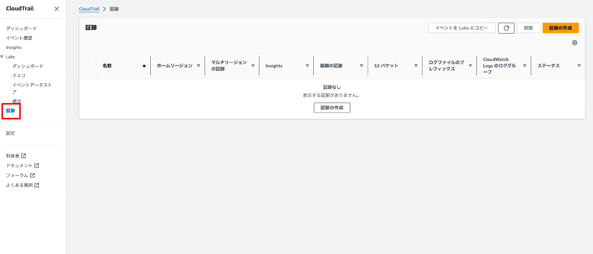

 

2. `証跡の作成` をクリック

    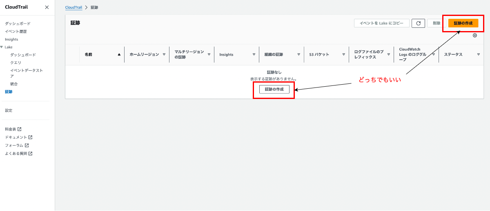

 

3. 証跡の作成に必要な各項目を設定する

    - 証跡名: CloudTrail で管理する証跡名

    - ストレージの場所: 操作ログの保存場所

    - ログファイルの SSE-KMS 暗号化: KMS (カスタマーマネージドキー) を使ってログを暗号化して保存するかどうか

    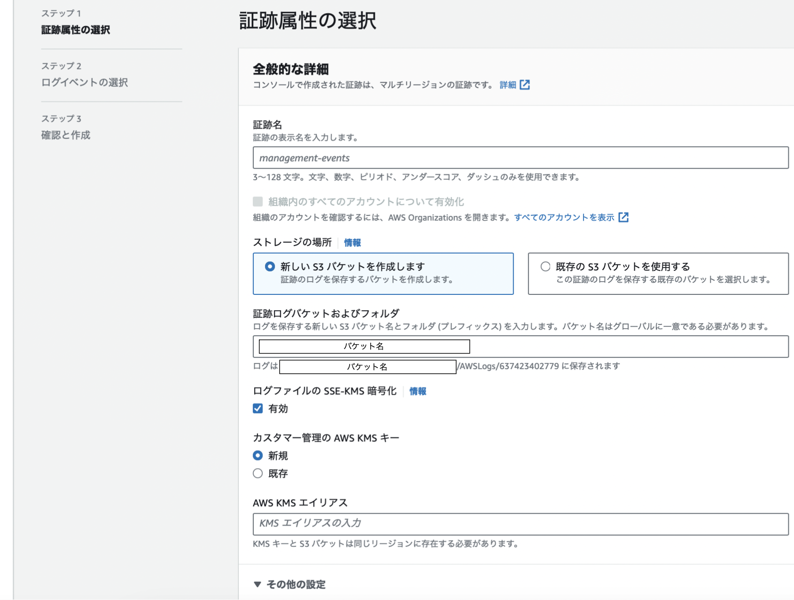

     

    - ログファイルの検証: ログの改ざんがされていないか検証する機能

    - SNS通知の配信: バケットにログが記録される度に Amazon SNS で通知を送るかどうか

    - CloudWatch Logs: CloudWatch Logs にログを送信するかどうか

    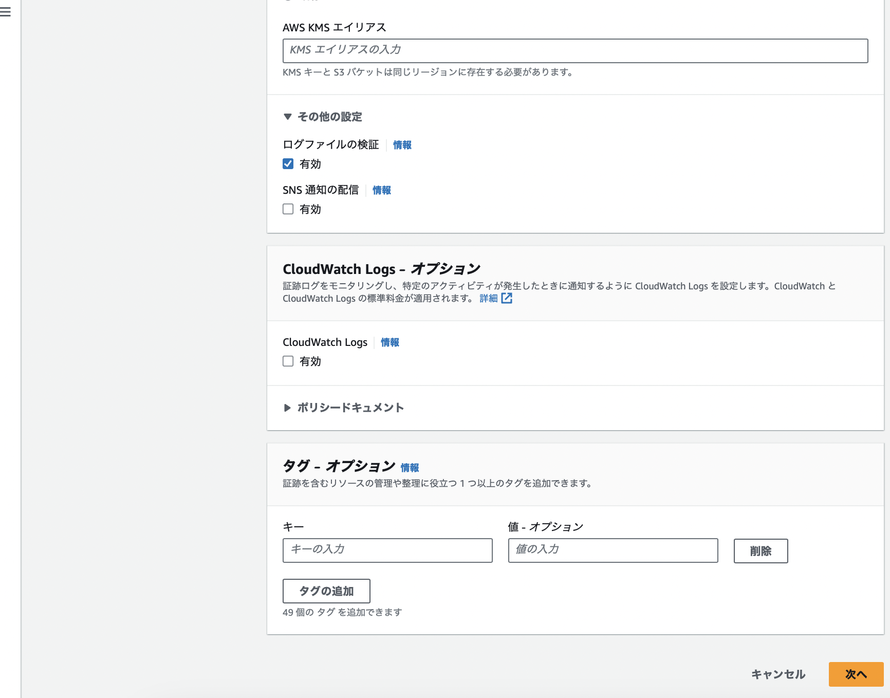

     

    - イベントタイプ: S3 に保存する操作ログ(イベント)の種類

    - 管理イベント: 記録する管理イベントに関する設定 (上記イベントタイプで管理イベントを選択しない場合は設定不要)

        - API アクティビティ: AWS リソースの読み取りログのみを記録する or 書き込み(作成や変更)ログのみを記録する or 両方記録する

        - AWS KMS イベントの除外: KMS 系のログを記録から除外するかどうか
            *一見 KMS に関係ない操作でも裏で KMS が利用されていることも多いため、除外してもいいかも

        - RDS のデータ API イベントを除外: RDS に対する操作ログを記録から除外するかどうか

    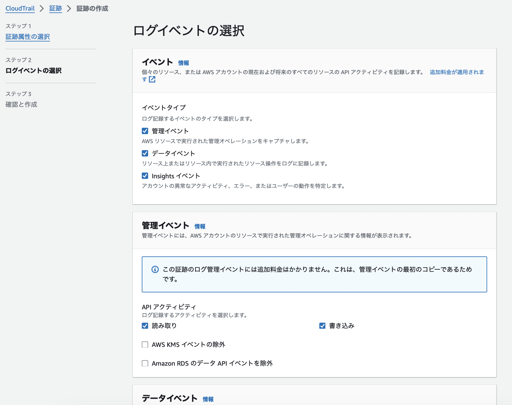

     

    - データイベント: 記録するデータイベントに関する設定 (上記イベントタイプでデータイベントを選択しない場合は設定不要)

        - どのリソースに対するデータイベントを記録するか指定

    - Insight イベント: 記録する insight イベントに関する設定 (上記イベントタイプで insight イベントを選択しない場合は設定不要)

        -  API コールレート: APIの呼び出し回数(の割合)を記録するかどうか
        
        - API エラー率: API の呼び出し失敗(の割合)を記録するかどうか

    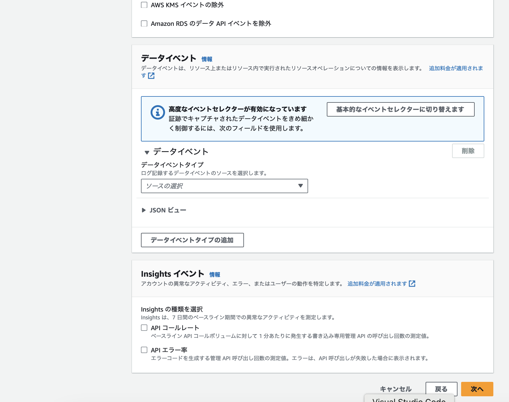

 

4. 設定内容を確認し、大丈夫だったら `証跡の作成` をクリック

    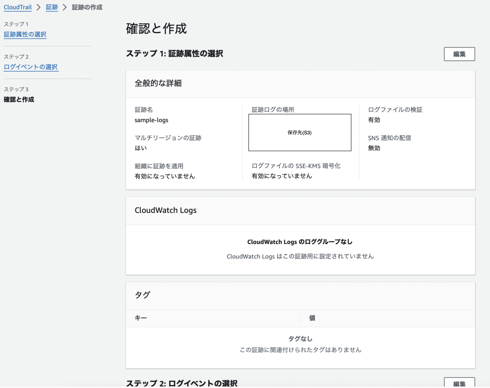
    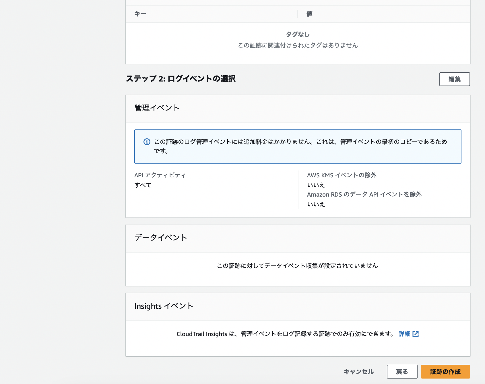

 
 

参考サイト

証跡の作成
- [AWS CloudTrailとは？証跡を作成してみた](https://accumulateengineer.com/aws-cloudtrail/)

`ログファイルの検証` 項目についての説明
- [CloudTrail ログファイルの整合性の検証機能は有効化しておきましょう](https://dev.classmethod.jp/articles/validating-cloudtrail-log-file-integrity/)

管理イベントの記録に関する設定項目についての説明
- [AWS CloudTrail 証跡を取得してみた](https://zenn.dev/devcamp/articles/5fdc895633aaed#5.-管理イベントの選択)

Insight イベントの記録に関する説明
- [CloudTrailはじめました](https://zenn.dev/fdnsy/articles/fbda303f6fffdf#insightsイベント)

---

### 証跡の削除

- CloudTrail から対象の証跡を削除する

- S3 から保存先のバケットを削除する
    - バケットを削除するには、バケットを空にしなければならない

 

ポイント
- 証跡だけ削除しても S3 バケットは残るので、そのままにすると継続して S3 利用料金が発生することに注意

---

### CloudWatch Logs との連携

ざっくりとした流れだけ

1. CloudTrail にて証跡を作成する
    - [ロググループ](#cloudwatch-logs-のロググループとは)を指定する

 

2. CloudWatch にて監視したいログのパターンをフィルターするメトリクスを作成

 

3. CloudWatch にて上記メトリクスに対してしきい値と条件を設定したアラームを作成する

 

#### CloudWatch Logs のロググループとは

複数の**ログストリーム**を論理的にまとめたグループ

*ログストリームとは、同じソース(インスタンス)から送信される一連のログです

 
 

参考サイト

CloudTrail と CloudWatch の連携について
- [【AWS】CloudTrailとCloudWatch Logsを連携しCloudWatchにてAWS管理イベントを監視する方法](https://qiita.com/tireidev/items/3308deb2ac9229e84bb4)

- [CloudWatch Logsでの特定文字列の検知時の通知をメトリクスフィルターで実装してみた](https://dev.classmethod.jp/articles/notify-when-a-specific-character-string-was-detected-in-cloudwatch-logs-metric-filtercloudwatch-alarm/)

監視したほうがいいログ
- [【初心者向け】AWS CloudTrail 入門！完全ガイド](https://zenn.dev/issy/articles/zenn-cloudtrail-overview#監視する主要なログ)

ロググループの説明
- [Amazon CloudWatch Logsの超詳細解説](https://qiita.com/tech4anyone/items/3ed5c9702e1db6d4c489#ロググループとログストリーム)

- [【初心者向け】Amazon CloudWatch Logsについてまとめてみた](https://blog.serverworks.co.jp/2022/12/19/095621#ログストリーム)