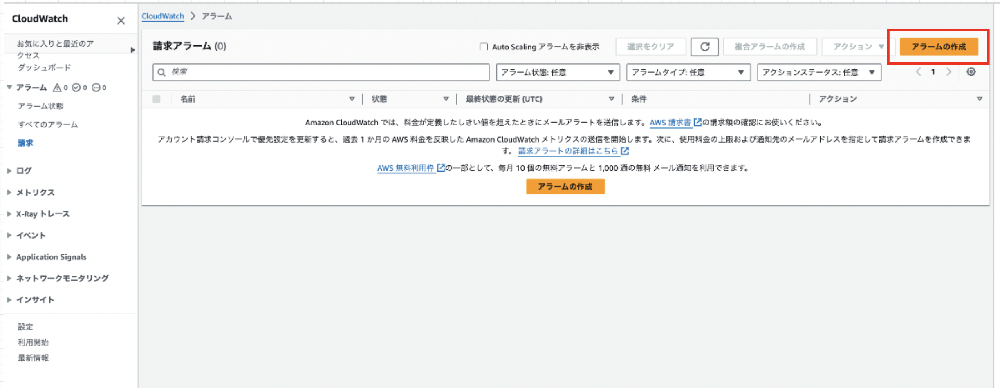

### CloudWatch とは

AWS サービスリソースを監視するサービスのこと

サービスリソースを監視する上でいくつかの機能がある
- アラート通知を行うCloudWatch Alarm

- ログの収集を行うCloudWatch Logs

- サービスのイベント（状態）をトリガーにアクションを実行するCloudWatch Events
    - 例: EC2が停止したらSlackにメッセージを飛ばす

 
 

参考サイト

[CloudWatchで出来ること、AWS監視のお作法とは クラウド運用管理](https://www.fujitsu.com/jp/products/software/resources/feature-stories/cloud-operation/aws-monitoring/)

[AWS CloudWatchとは？初心者でもわかる解説](https://www.future.ad.jp/futuremedia/keyword_cloudwatch/)

---

### 請求アラームの設定 ~ CloudWatch Alarm

請求アラートを作成するにはリージョンを $\color{red}米国東部 (バージニア北部)$ に設定する必要がある

\[手順\]

1. CloudWatchの管理画面に遷移する

    

 

2. サイドメニューから`アラーム` → `請求`をクリック

    *リージョンが米国東部 (バージニア北部)でないと表示されない

    

 

3. `アラームの作成`をクリックする

    

 

4. アラームの作成を行う

    - `メトリクスの選択`をクリック

        *メトリクスとは → AWSリソースやアプリケーションのパフォーマンス、使用状況に関する数値データのこと

    

     

    - 請求に関するアラームを作成するため、`請求`を選択する

    

     

    - 今回は合計利用料金に関するアラームを作成するため`概算合計請求額`を選択する

    

     

    - 通貨を選択して`メトリクスの選択`をクリック

    

     

    - メトリクスの統計方法や計算間隔を設定する

        - 統計: `最大`を選択し、計算間隔ごとに最大利用額を算出する

        - メトリクスの計算間隔: 6時間ごとにメトリクスを計算する

    

     

    - アラートの条件を設定する

        - `しきい値の種類`
            - 静的: 一定のしきい値と条件を設定する
            - 異常検出: [異常検出の項目](#メトリクスの条件--異常検出とは)を参照

        - `EstimatedCharges が次の時...`: メトリクス(算出された値)がしきい値よりも $\color{red}どうなる$ とアラームを送るのか

        - `... よりも`: しきい値

    

 
 

参考サイト

請求アラートの作成方法
- [【AWSを無料で使おう！】請求アラートの設定方法](https://note.alhinc.jp/n/ncb72772312e8)

- [CloudWatchで請求アラームを作成する](https://zenn.dev/mn87/articles/ec5a57228c491c)

- [初めてのAmazon CloudWatch設定｜AWS請求アラームの作成（2024年版）](https://qiita.com/FuruFuroof/items/7b4cf7b0e8c8244a36d8)

CloudWatch Alarm の各項目の詳しい説明
- [AWS CloudWatchアラームを設定してみた](https://zenn.dev/myatti/articles/a4d6333ea9edf9)

メトリクスの`統計`の意味
- [CloudWatch 統計定義](https://docs.aws.amazon.com/ja_jp/AmazonCloudWatch/latest/monitoring/Statistics-definitions.html)

---

### 請求アラーム?アラート?

[請求アラート](./請求アラートの設定.md)

- AWS Billing and Cost Management から有効にする設定

- 請求アラートを有効にすると、請求アラームを作成できるようになる

 

[請求アラーム](#請求アラームの設定--cloudwatch-alarm)

- CloudWatch から作成するアラーム

 
 

参考サイト

[AWS】請求アラートと請求アラームの違い](https://zenn.dev/okaki_se/articles/5b5b69a3b215e5)

---

### メトリクスの条件 ~ 異常検出とは