### セカンダリインデックスとは

- DynamoDB のデータ検索は[こちらの通り](./DynamoDB_Table.md#基本的なデータの取得)限られた検索方法しか使えない

    - パーティションキーは完全一致の条件指定が必須

    - ソートキーは部分一致や以上/以下での条件指定が可能

    - キーでない属性に対して検索条件の指定はできない

 

- セカンダリインデックスとは

    - **キー以外の属性を検索条件にしてデータを取得できるようにする仕組み**

    - イメージ的にはテーブル内のデータを元に、他の属性をキーとして新しいーブルを作成する感じ

    - RDB のインデックスとは別物

    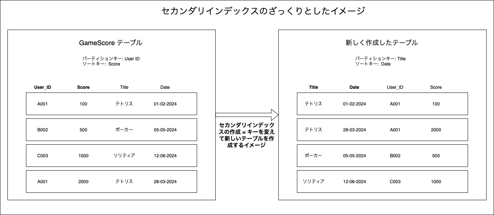

 

- 2種類のセカンダリインデックスを作成できる

    - [グローバルセカンダリインデックス](#グローバルセカンダリインデック-gsi)

    - [ローカルセカンダリインデックス](#ローカルセカンダリインデックス-lsi)

 

- 注意点

    - セカンダリインデックスを利用 (作成) すると、テーブルの使用容量が増えるので注意

 
 

参考サイト

[テクニカルインストラクターと学ぶ Amazon DynamoDB のセカンダリインデックス](https://aws.amazon.com/jp/builders-flash/202407/dynamodb-secondary-index/)

---

### グローバルセカンダリインデック (GSI)

#### ざっくりとしたイメージ

- 対象テーブルの全パーティションをまたいで、テーブルを新しく作るイメージ

- 元のテーブルをベーステーブルと呼ぶ

- ベーステーブルでキーじゃない属性は GSI にコピーしなくてもいい

    - ベーステーブルでキーである属性は GSI に自動でコピーされる

 

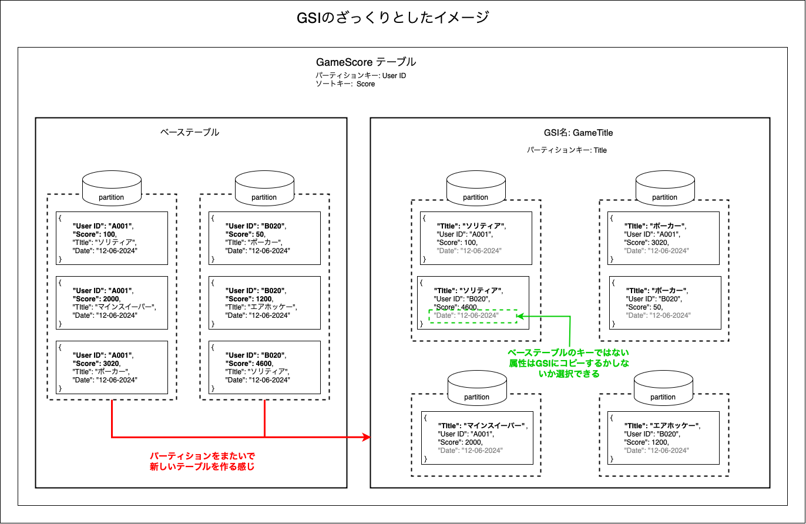
 
 

#### 特徴

- ★GSI は1つのテーブルに**20個**まで作成可能
    - サービスクォータの引き上げでもっと作成可能

- パーティションキーもソートキーも別の属性を指定することができる
    - このときソートキーは指定しなくても良い

- ベーステーブルとは別に GSI 用にパーティションが作成される
    - GSI のパーティションは GSI のパーティションキーによって決まる

- GetItem での一意にデータを指定しての取得はできない
    - ソートキーに対して条件を指定する Query や データ全てを取得する Scan でデータの取得をする

- ★GSIへの読み取りは **結果整合性のある読み取りのみ利用可能**

- GSI はいつでも作成可能 & 削除も可能

 

- GSI への読み取りは、射影された属性のみ取得
    
    → ベーステーブルのキー & GSI 作成時に選択したコピーする属性のみ取得可能

 

- ★GSI への読み取り/書き込みは GSI 用のキャパシティを消費する

    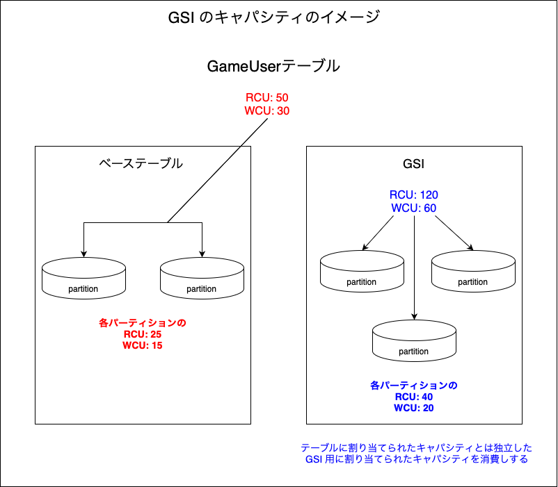

 
 

参考サイト

[テクニカルインストラクターと学ぶ Amazon DynamoDB のセカンダリインデックス](https://aws.amazon.com/jp/builders-flash/202407/dynamodb-secondary-index/)

[DynamoDBを語ってみる](https://tech.nri-net.com/entry/talk_about_dynamodb)

---

### ローカルセカンダリインデックス (LSI)

#### ざっくりとしたイメージ

- 同一パーティション内で**別のキーをソートキー**として新しくコピーしてデータ群を作成するイメージ

- GLI と同様に
    - 元のテーブルをベーステーブルと呼ぶ

    - ベーステーブルでキーじゃない属性は LSI にコピーしなくてもいい

    - ベーステーブルでキーである属性は LSI に自動でコピーされる

 

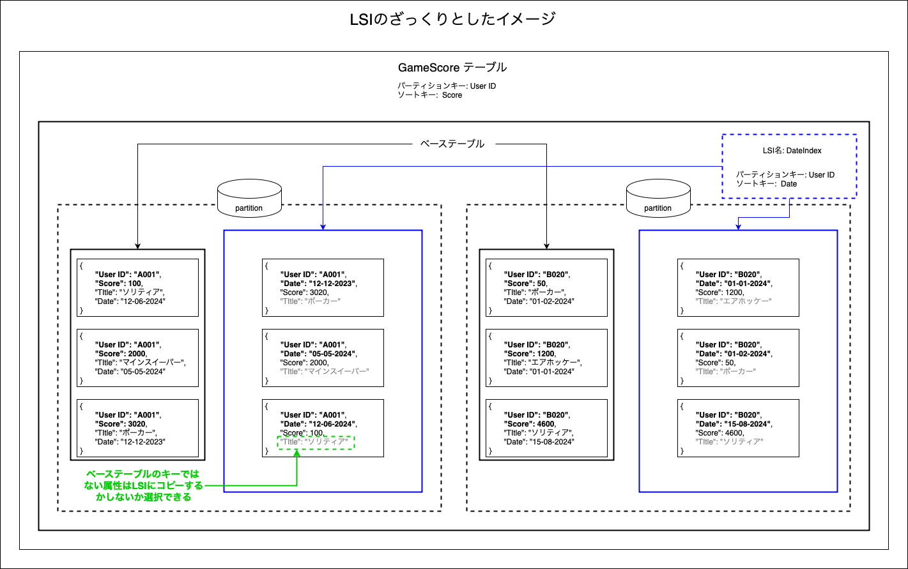

 

#### 特徴

- ★LSI は1つのテーブルに**5個まで**作成可能

- パーティションキーはベーステーブルと同じで、ソートキーを別の属性に指定することができる

- GetItem での一意にデータを指定しての取得はできない
    - ソートキーに対して条件を指定する Query や データ全てを取得する Scan でデータの取得をする

- ★GSI とは異なり、LSI は**テーブルの作成時にしか作成できない**
    - また、LSI は作成したら**削除はできない**

- ★LSI は強い整合性のある読み取り/結果整合性のある読み取りの両方使える

- ★LSI への読み取り/書き込みは、ベーステーブル(その LSI のあるパーティション)のキャパシティを消費する

    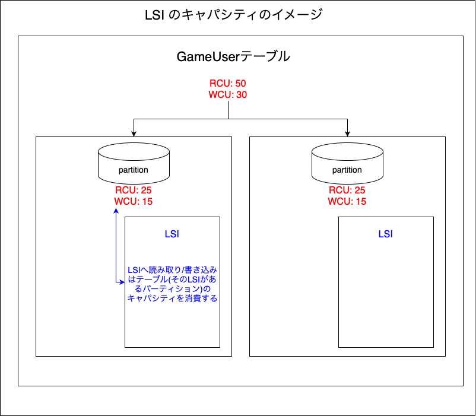

 

- ★LSI がある場合、[同アイテムコレクション](#アイテムコレクションとは)のパーティションが 10 GB 以上を超える場合、パーティションの分割は起きず、アイテムの追加などが出来なくなる

    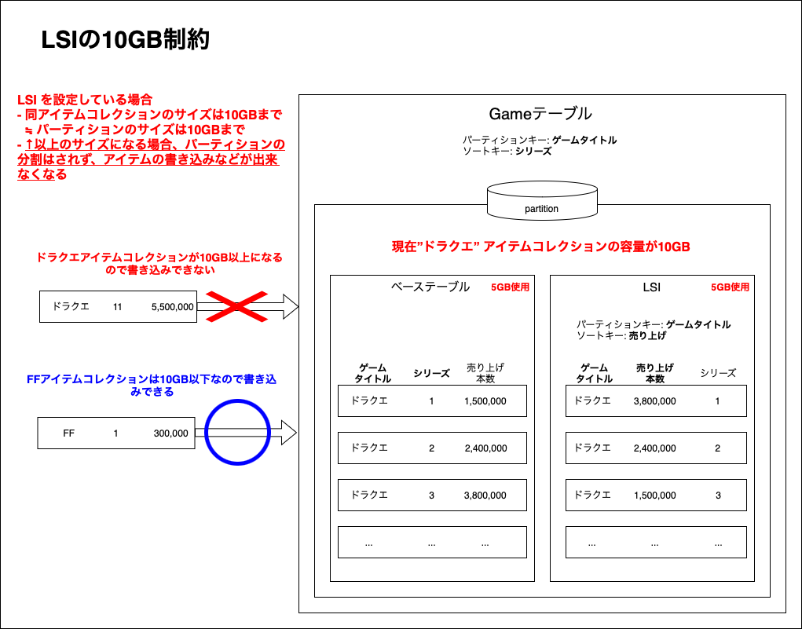

 

- LSI への読み取りは、指定すれば射影されてない属性も取得はできる (fetch)

    → ベーステーブルのキー & LSI 作成時に選択したコピーした属性以外でもベーステーブルにある属性は取得可能

    ただし、パフォーマンスの低下やキャパシティをさらに消費するのでやめたほうがいい

    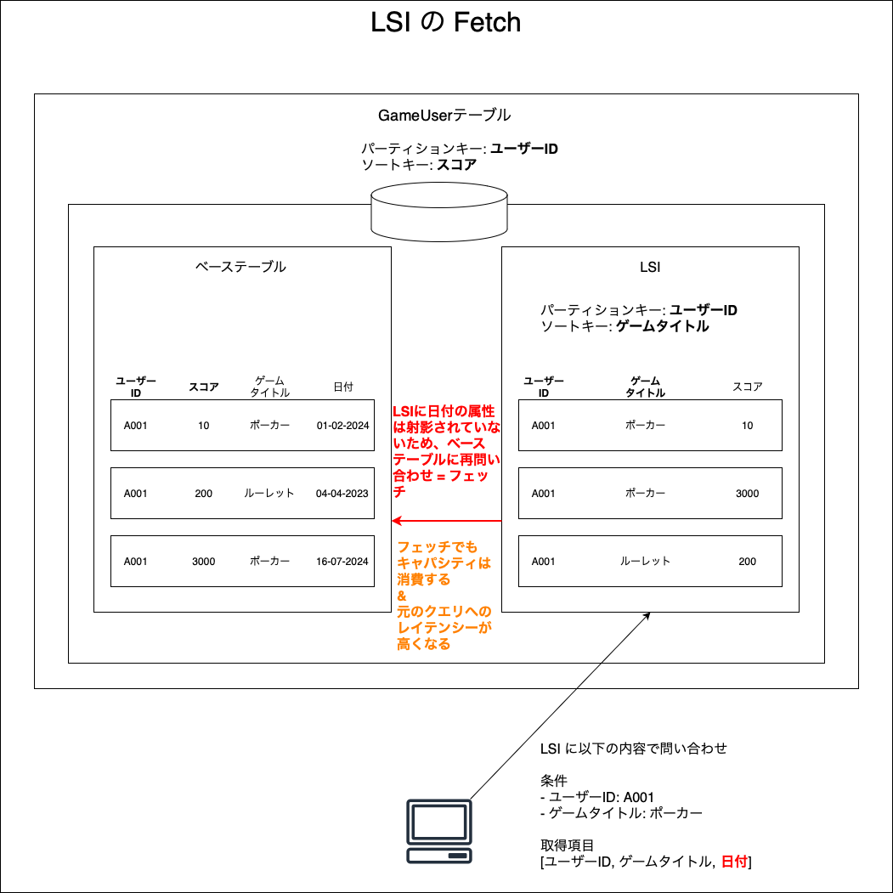

 
 

参考サイト

LSI 全般
- [テクニカルインストラクターと学ぶ Amazon DynamoDB のセカンダリインデックス](https://aws.amazon.com/jp/builders-flash/202407/dynamodb-secondary-index/)

- [DynamoDBを語ってみる](https://tech.nri-net.com/entry/talk_about_dynamodb)

LSI の 10GB の制約について

- [【レポート】Amazon DynamoDB Deep Dive #AWSSummit](https://dev.classmethod.jp/articles/dynamodb-deep-dive-awssummit2019/)

- [What happens when a partition in a DynamoDB table with a local secondary index exceeds capacity?](https://stackoverflow.com/questions/73804725/what-happens-when-a-partition-in-a-dynamodb-table-with-a-local-secondary-index-e)

- [In DynamoDB, what's partition size limitation of a table without LSI](https://repost.aws/questions/QUx0mIILjaR5GjwYllYNpbKA/in-dynamodb-what-s-partition-size-limitation-of-a-table-without-lsi)

---

### GSI や LSI のキー

- GSI や LSI のパーティションキーやソートキーはアイテムを一意に特定する役割はない

    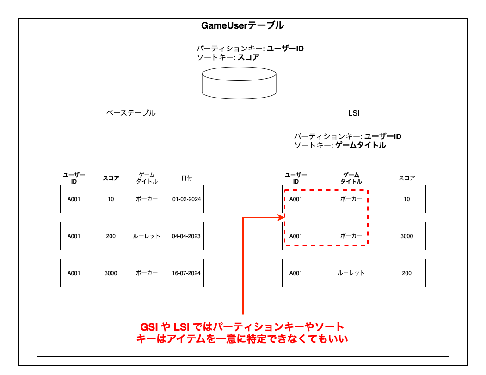

 

- GSI や LSI に指定するキーが存在しないベーステーブルのアイテムは、**GSI / LSI に登録されない**

    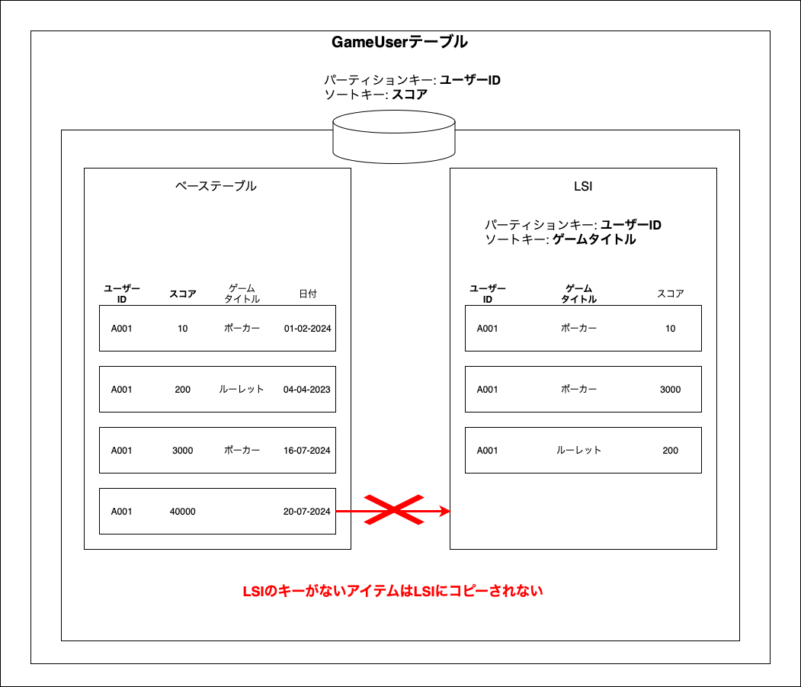
    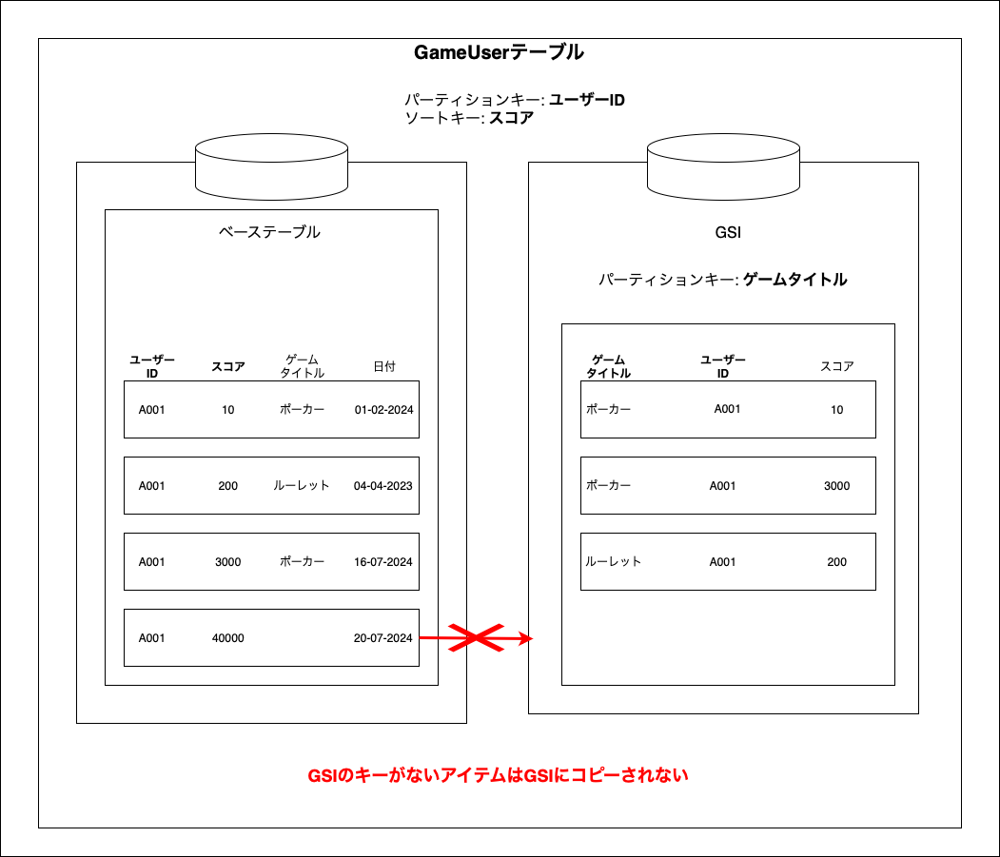

 
 

参考サイト

[Amazon DynamoDB で GSI や LSI のキーは重複や値なしが許容されるのか確認してみた](https://dev.classmethod.jp/articles/confirm_if_gsi_and_lsi_keys_allow_duplication_and_null_values_in_amazon_dynamodb/)

---

### アイテムコレクションとは

- テーブル内のベーステーブルおよび LSI 全体で同じパーティションキーを持つデータの集合

    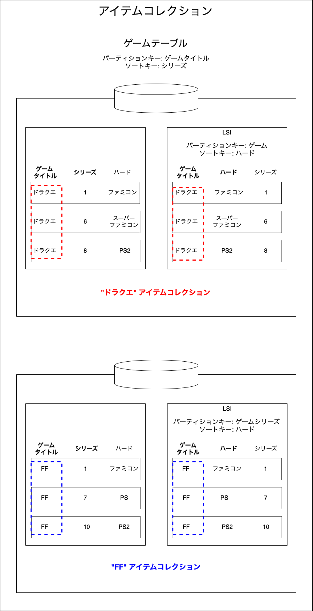

 
 

参考サイト

[DynamoDBのキー・インデックスについてまとめてみた](https://qiita.com/shibataka000/items/e3f3792201d6fcc397fd#項目コレクションのサイズ制限)