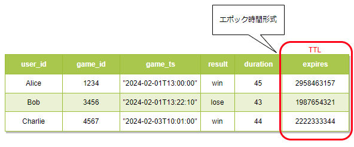

### Dynamo DB とは

- フルマネージドな NoSQL サービス

- DynamoDB はリージョンサービス

 
 

参考サイト

[AWS サービスがどこにあるのかまとめ](https://qiita.com/saitotak/items/d2ede050e7a2224da46d)

---

### 特徴&機能

- 高拡張性 (Scalability)
    - 大量の読み書きリクエストに耐えうる
    - [パーティション](./DynamoDB_Partition.md)の分割が自動で実行されることで、高速な読み書きを保つ

 

- 高可用性
    - DynamoDBを作成したリージョンの中の3つの AZ で自動複製が作成される
    - 実態は[パーティション](./DynamoDB_Partition.md)と呼ばれるデータの格納先を複製するっぽい

 

- 高い可用性と拡張性を実現するために、データを冗長化し、分散して持つのがDynamoDBだが、そのために一貫性を犠牲にしている
    - 3つのパーティションのうち、最新ではないパーティションに読み取りにいく可能性がある
        - 常に最新のデータを返すようにするには[データの整合性](./DynamoDB_整合性.md)を変更する必要がある

 

- KVS と ドキュメント型の2つをサポート
    - KVS: キーとバリュー形式でデータを保存
    - ドキュメント型: キーと JSON や XML などの構造化されたドキュメントでデータを保存

    

    引用:[【AWS】DynamoDBとは？？基本を解説します！！](https://cantabile.alhinc.jp/technology/7543/)

 

- 無制限にデータを保存できる
    - 容量は無制限だが、アップロードできる1件のデータの最大サイズは 400KB
 

- 暗号化
    - KMS で DynamoDB に保存するデータを暗号化
    - デフォルトで暗号化は ON

 

- バックアップを取得できる
    - 様々な方法のバックアップを利用できる
    - 詳しくは[こちら](./DynamoDB_Backup.md)

 

- データの保存期間を決めることができる

    - **TTL (Time to Live)属性**をアイテム(≒ レコード) に定義することでTTL属性に指定した期限になったら Dynamo 側で自動で削除してくれる

     

    - *TTLで指定した期限が来たら**即座にアイテムが削除されるわけではない**。
        - 48 時間以内に削除される

        - 削除される際に RCU (書き込みキャパシティ) は消費されない

        - データを読み込む際にアプリケーション側でデータ(アイテム)の有効期限をチェックしないと、有効期限を過ぎたデータを取得してしまう可能性がある

     

    - TTL 属性は Number型で定義して、Unixtimeで値を格納する必要がある

    

    引用: [初心者向け】Amazon DynamoDB 入門！完全ガイド](https://zenn.dev/issy/articles/zenn-dynamodb-overview#ttl（time-to-live）)

 
 

参考サイト

容量無制限について
- [DynamoDBを使いこなして精神的安定を手に入れた](https://qiita.com/walkers/items/9b39d752cc5b8df7b4b5)

TTLについて
- [初心者向け】Amazon DynamoDB 入門！完全ガイド](https://zenn.dev/issy/articles/zenn-dynamodb-overview#ttl（time-to-live）)

バックアップについて
- [DynamoDB のバックアップとリストアについて](https://zenn.dev/htnk128/articles/092cbfc7a886fd#ポイントインタイムリカバリ(pitr))

---

### セカンダリインデックス

- あまり柔軟性のない Dynamo 検索を改善する仕組み
    - 詳しくは[こちら](./DynamoDB-GSI-LSI.md)を参照

- インデックスを保持するストレージ料金が発生する

---

### DAX (DynamoDB Accelerator)

- 読み取りのパフォーマンスを向上させるためのDynamo用のインメモリキャッシュサービス

- 詳しくは[こちら](./Daynamo_DAX.md)を参照

---

### DynamoDB Streams

- DynamoDBテーブルのアイテムに対する変更(作成、更新、削除)をイベントとして検出できる機能

- 詳しくは[こちら](./DynamoDB_Stream.md)を参照

---

### グローバルテーブル

- マルチリージョンで DynamoDB のテーブルを運用できる機能

- 詳しくは[こちら](./DynamoDB_GlobalTables.md)

---

### トランザクション

- DynamoDBでもトランザクション制御が可能
    - トランザクション利用の際の制約が結構ある...

- 詳しくは[こちら](./DynamoDB_Transaction.md)を参照

---

### キャパシティユニット

★DynamoDB ではデータの書き込み/読み取りに[キャパシティユニット](./DynamoDB_CapacityUnit.md)と言うものを消費し、それがテーブルの性能やコストに関係してくる

詳しくは[こちら](DynamoDB_CapacityUnit.md)を参照

---

### 利用料金

- 書き込み&読み取りに料金が発生する

- 保存されているデータ容量に応じて課金が発生

- RI (リザーブドインスタンス)

