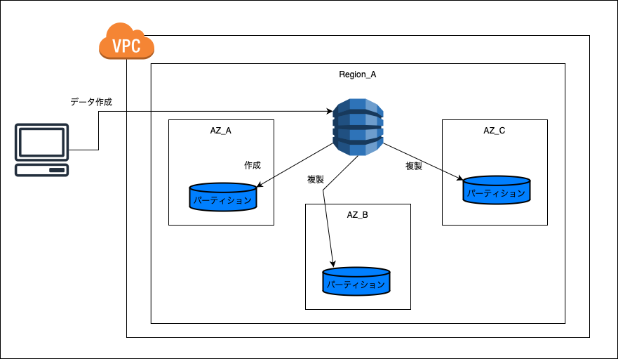
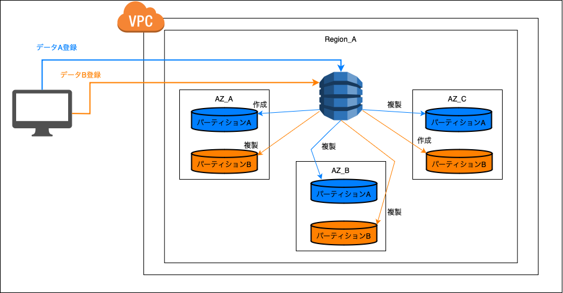

### Dynamo DB とは

- フルマネージドな NoSQL サービス

- DynamoDB はリージョンサービス

 
 

参考サイト

[AWS サービスがどこにあるのかまとめ](https://qiita.com/saitotak/items/d2ede050e7a2224da46d)

---

### 特徴&機能

- 高拡張性 (Scalability)
    - 大量の読み書きリクエストに耐えうる
    - [パーティション](#パーティション)の分割が自動で実行されることで、高速な読み書きを保つ

 

- 高可用性
    - DynamoDBを作成したリージョンの中の3つの AZ で自動複製が作成される

    - 実態は[パーティション](#パーティション)と呼ばれるデータの格納先を複製するっぽい

 

- KVS と ドキュメント型の2つをサポート
    - KVS: キーとバリュー形式でデータを保存
    - ドキュメント型: キーと JSON や XML などの構造化されたドキュメントでデータを保存

    

    引用:[【AWS】DynamoDBとは？？基本を解説します！！](https://cantabile.alhinc.jp/technology/7543/)

 

- 無制限にデータを保存できる
    - 容量は無制限だが、アップロードできる1件のデータの最大サイズは 400KB
 

- 暗号化
    - KMS で DynamoDB に保存するデータを暗号化
    - デフォルトで暗号化は ON

 

- バックアップを取得できる

 
 

参考サイト

容量無制限について
- [DynamoDBを使いこなして精神的安定を手に入れた]()

---

### テーブルクラス

- 標準テーブル
    - 通常利用

- 標準 IA
    - アクセス頻度の低いデータ向け

---

### パーティション

- データの保存先

- 実態は SSD (内の割り当てられた領域) = マシン

- DynamoDB の可用性に関しては、このパーティションがリージョン内の3つの AZ に自動で複製される

    

     

    - (たぶん)イメージ的にはデータが作成されるごとに、AZ 内のマシンにパーティションが作成される

    - 以下の画像で言うと、同一マシンに2つのパーティション(パーティションA、B)ではなく、AZ 内の異なるマシンにパーティションA、Bが作成される (たぶん)

    

- パーティションは[パーティションキー]()ごとに作成される

- パーティションが大きくなると DynamoDB 側で自動でパーティションの分割が実行される → データが増えても読み書きの速度を保つ高スケーラビリティを実現

    

    - なぜ高スケーラビリティなのか?

        → 対象のデータを大量のデータの中から取得するよりも時間やコンピューティングリソースが少なくて済むのは明白

 
 

参考サイト

[【初心者向け】Amazon DynamoDBのテーブル基礎を理解できるハンズオンを作ってみた](https://blog.serverworks.co.jp/2023/08/17/160708#データの保存について)

---

### キャパシティモード

- プロビジョンド

- オンデマンド

---

### プライマリーキー

- Dynamo DB では [パーティションキー]() と [ソートキー]() でデータを一意識別する

---

### セカンダリインデックス

- RDB で言うインデックスと同じ

- インデックスを保持するストレージ料金が発生する

---

### DAX

---

### DynamoDB Streams

---

### 読み取りユニットと書き込みユニット

---

### 利用料金

- 書き込み&読み取りに料金が発生する

- 保存されているデータ容量に応じて課金が発生

