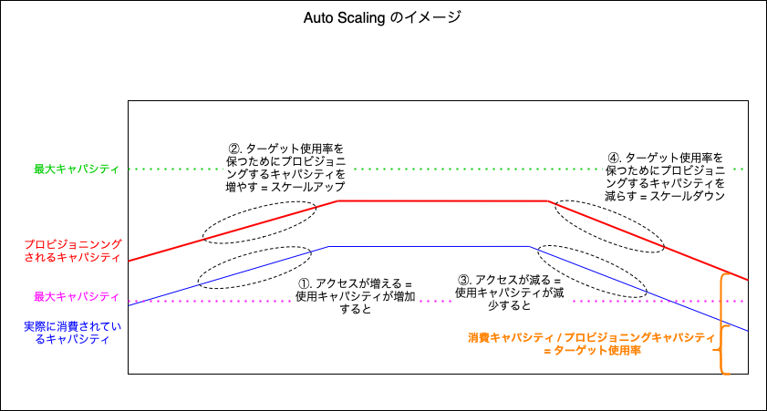

### Auto Scaling とは

- プロビジョニングするキャパシティの上限と下限を設定し、アクセス量によってうまくキャパシティを調節する機能

    - アクセスが少ない時でも、もしもの時に備えて多めのキャパシティを確保しておくことは大切だが料金がかかる

    - ↑の要望は叶えつつ、アクセスが少ない時には、キャパシティを減らし、アクセスが多い時にはキャパシティを増やし、キャパシティを効率を良く確保する機能が Auto Scaling

- プロビジョニングモードのテーブルでしか有効にできないことに注意

---

### Auto Scaling の仕組み

#### ざっくりとしたイメージ



<br>

#### Auto Scaling に必要な設定項目


- 最大キャパシティ & 最小キャパシティ
    - アクセスが増加し、スケールアップするプロビジョンキャパシテの最大値
    - アクセスが低下し、スケールダウンするプロビジョンキャパシティの最小値

- ターゲット使用率
    - 対象テーブルの使用キャパシティに対するプロビジョニンされたキャパシティの割合

        - プロビジョニングされたキャパシティに対して、消費されている量をこの割合 (ターゲット使用率) に保つようにキャパシティのスケールアップ&ダウンを試みる

        - 例: ターゲット使用率を 70% に指定。 現在 100 RCU が確保されており、使用されているキャパシティは 80 RCU。

            ```
            80 / 100 = 80% なので、現在のキャパシティ使用率は80%
            
            これを 70% にするにはより多くのキャパシティを確保する必要がある = スケールアップ

            80 / x = 70% より x = 80 ÷ 0.7 = 114.28...

            よって、Auto Scaling により 115 RCU 確保するようにスケールアップされる
            ```

        <br>

        - 例: ターゲット使用率を 50% に指定。 現在 100 RCU が確保されており、使用されているキャパシティは 20 RCU

            ```
            20 / 100 = 20% より、現在のキャパシティ使用率は20%

            これを 50% にするには確保するキャパシティを減らす必要がある = スケールダウン

            20 / x = 50% より x = 20 ÷ 0.5 = 40

            よって、 Auto Scalingに より 40 RCU 確保するようにスケールダウンされる
            ```

<br>

#### スケールアップ / スケールダウンのタイミング

- スケールアップ
    - 消費されるキャパシティが連続して **2分** 以上ターゲット使用率を超える場合にプロビジョニングキャパシティのスケールアップが始まる

<br>

- スケールダウン
    - 消費されるキャパシティが連続して **15分** 以上**設定したターゲット使用率を20%以上下回る場合**にプロビジョニングキャパシティのスケールダウンが始まる

    - 例: ターゲット使用率を 50% に指定。 現在 100 RCU が確保されており、使用されているキャパシティは 40 RCU
        - この時のキャパシティの使用率は40%だが、ターゲット使用率50%の20%範囲内なのでスケールダウンは起きない

    - 例: ターゲット使用率を 50% に指定。 現在 100 RCU が確保されており、使用されているキャパシティは 20 RCU
        - この時のキャパシティの使用率は20%で、ターゲット使用率50%よりも20%以上低いのでスケールダウンが起きる (この状態が15分以上連続した場合)

<br>

#### 注意点

- Auto Scaling はだんだん増加/低下していくアクセスに対して無駄なくキャパシティをプロビジョニングする機能であり、**急なアクセスの増加に対応するための機能ではない**

- Auto Scaling を有効にすると 消費されるテーブルのキャパシティを観測するための [CloudWatch アラーム](./CloudWatch.md) が自動で作成される。このアラームを削除したら Auto Scaling がうまく機能しないことがあるので削除しないこと
    - 間違って Auto Scaling 用のアラームを削除してしまった場合、Auto Scaling を一度無効にし、再度有効化するとアラームが再作成される


<br>
<br>

参考サイト

[Amazon DynamoDB のプロビジョンドキャパシティを使用した突発的なトラフィック増加への対処](https://aws.amazon.com/jp/blogs/news/handle-traffic-spikes-with-amazon-dynamodb-provisioned-capacity)

[Amazon DynamoDB Auto Scaling に関する問題を解決する方法を教えてください。](https://repost.aws/ja/knowledge-center/dynamodb-auto-scaling)

[DynamoDB料金理解のはじめの一歩](https://qiita.com/nisim/items/e177204cff65bdfcc828#auto-scalingの仕組み)

---

### Auto Scaling を有効にする

1. 
