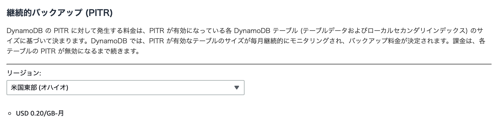

### Dynamo DB でのバックアップ

- ポイントインタイムリカバリ (PITR)

    - 過去35日間のデータバックアップを取得する機能

    - 過去35日間のあいだならば 1 秒単位の精度で復元可能 
        - \~~日前の\~~時\~~分\~~秒時点でのテーブルを復元できるイメージ

 

- オンデマンドバックアップ

    - いわゆる普通のバックアップ (必要なときにバックアップを作成する)

    - バックアップの保存先を以下の2つから選べる
        - 
        - 
    
    - [AWS Backup](./AWS_Backup.md) を利用してのオンデマンドバックアップも可能

 
 

参考サイト

バックアップ全般について
- [Amazon DynamoDBにおけるバックアップ戦略](https://aws.amazon.com/jp/blogs/news/backup-strategies-for-amazon-dynamodb/)

バックアップストレージの種類について
- [【AWS入門】Amazon EC2やS3、EBSなどのデータ保護ができるAWS Backupとは](https://cloudnavi.nhn-techorus.com/archives/4188#:~:text=バックアップを行うストレージに,ストレージ）のものがあります%E3%80%82)

---

### ポイントインタイムリカバリ (PITR)

#### 概要

- PITR を有効にすると、過去 35 日間の任意の時点にテーブルを 1 秒単位の精度で復元できる

- 現時点から35日以上前のデータは保持されない

- PITRはテーブルの運用途中からでも ON/OFF ができる
    - 途中からONにした場合、

- 復元する際は、元テーブルとは別のリージョンに復元することもできる

- PITR が有効なテーブルを削除すると、システムバックアップと呼ばれる削除したテーブルのバックアップが自動的に作成される
    - 保存期間は35日間

    - 復元する時は、削除直前の状態にしか戻せない (PITRのように過去35日間の任意の時点は指定できない)

 

#### コスト

- PITR が有効なテーブルに保存されているデータの量によって決まる

- オハイオだと 1GBにつき 0.20UDS の料金が PITR に発生する 

    

- PITR を OFF にすると課金は発生しなくなる

- バックアップの保持にかかる費用意外に、**バックアップからリストアした場合にも料金が発生する**

    - PITRは必ずウォームバックアップストレージからリストアされる

 

#### リカバリ方法

 
 

参考サイト

[PITR が有効になっているテーブルを削除する](https://docs.aws.amazon.com/ja_jp/amazondynamodb/latest/developerguide/PointInTimeRecovery_Howitworks.html#howitworks-pitr-deleting-table)

[ポイントインタイムリカバリ｜DynamoDB・MySQL・Azure・Windows](https://jp.minitool.com/backup-tips/point-in-time-recovery.html)

[新機能 – Amazon DynamoDBに継続的バックアップとPoint-In-Time-Recovery(PITR)機能が追加されました](https://aws.amazon.com/jp/blogs/news/new-amazon-dynamodb-continuous-backups-and-point-in-time-recovery-pitr/)

---

###　オンデマンドバックアップ

#### 概要

- いわゆる普通のバックアップ

-

#### コスト

#### リカバリ方法

---

### AWS Back Up

#### 概要

#### リカバリ方法

---

### AWS S3 へのエクスポート

#### 概要

#### リカバリ方法