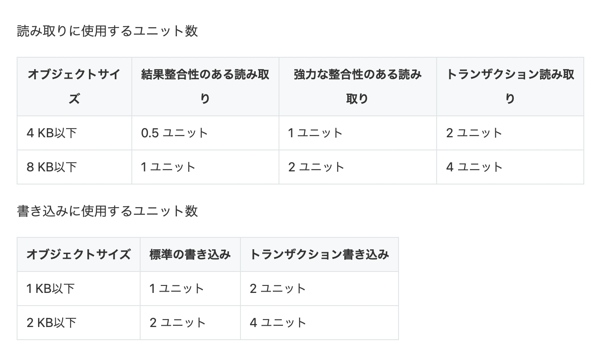
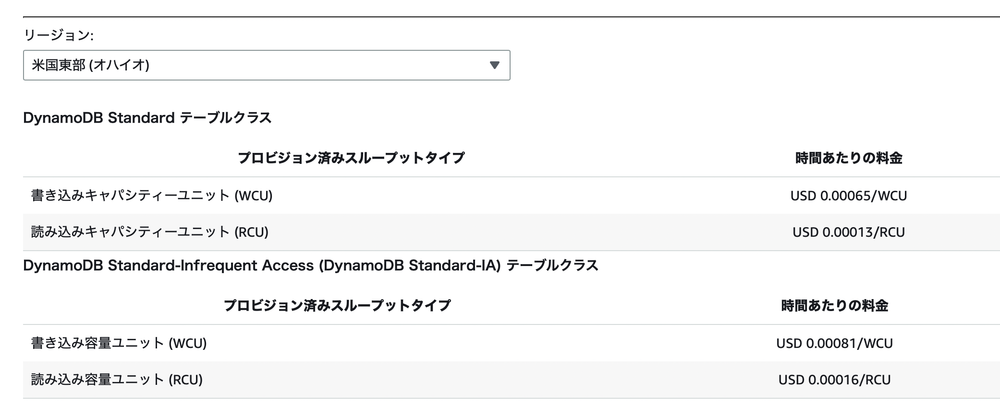
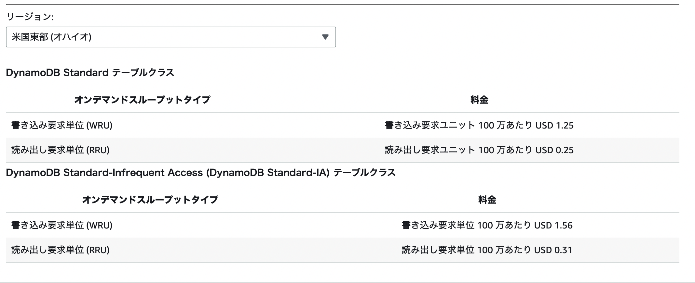

### キャパシティユニットとは

- DynamoDB テーブルではデータの書き込みと読み取りにキャパシティユニットという指標が使われる

 

- キャパシティユニット
    - 1秒間の読み/書きのスループット (読み/書きできるデータの量)

    - 利用料金もキャパシティユニット単位で計算される

 
 

参考サイト

[【DynamoDB】キャパシティユニットとは何か](https://qiita.com/Yona_Sou/items/c79d2bf5ffe1da454a6e)

[【DynamoDB】キャパシティユニットとキャパシティモード](https://dennie.tokyo/it/?p=1619)

---

### スループットとしてのキャパシティユニット

#### ざっくりと

- WCU (ライトキャパシティユニット)
    - 1秒間に消費する書き込みの処理量

    - 1 WCU は**1KB以下**のデータ読み取りリクエスト1回で消費するユニット

        - *0.5 KB のデータをテーブルに書き込んだ場合でも 1 WCU を消費する (0.5 WCU ではないことに注意)

    - 1 KB 毎に 1 WCU 増える
        - 1.5 KB のデータをテーブルに書き込んだ場合、 2 WCU を消費する (1.5 WCU ではない)

 

- RCU (リードキャパシティユニット)
    - 1秒間に消費する読み取りの処理量

    - 1 RCU は**4KB以下**のデータの読み取りリクエスト1回で消費するユニット **(結果整合性と強力な整合性での読み取りで消費するユニットは異なる)**

        - *2 KB のデータをテーブルから読み込んだ場合でも 1 RCU を消費する (0.5 RCU ではないことに注意)

    - 4 KB 毎に 1 RCU 増える

        - 6 KB のデータをテーブルから読み込んだ場合、 2 RCU を消費する (1.5 RCU ではない)

 

#### 厳密に言うと

- RCU (リードキャパシティユニット)
    - 強力な整合性での読み取りの場合
        - **4KB以下**のデータ読み取りリクエスト1回で 1 RCU 消費する

    - 結果整合性での読み取りの場合
        - **4KB以下**のデータ読み取りリクエスト**2回**で 1 RCU 消費する

            = 4KB 以下の結果整合性でのデータ読み取りは1回で 0.5 RCU 消費する

    - 結果整合性での読み取りは強力な整合性での読み取りの半分の RCU を消費する

引用: [DynamoDB のキャパシティモードについて調べてみた](https://blog.serverworks.co.jp/DynamoDB-Capacity_Mode)

 

#### 練習問題

ポイント: テーブルに設定する(割り当てる) RCU と WCU は 1秒間あたりの処理量で考える

1. DynamoDBに保存する項目の最大サイズは6KBで、1秒間に平均5個の読み込みが行われるアプリケーションがある。アプリケーションには強力な整合性を持った読み込みが期待される。必要なRCUはいくらか

    - 強力な整合性で 6KB のデータを読み込むには 2RCU 必要
    - 定期んで1秒間に5つのデータが読み取られるので、 2RCU × 5 = 10 RCU必要

    A. 10 RCU

 

2. 以下の要件を満たすためにはテーブルに行くつの RCUとWCU をあてがうべきか
    -  要件
        - 1秒間に30回の書き込み
        - 1秒間に20回の結果整合性のある読取処理
        - 両方の操作ですべてのアイテムのサイズが1KB

     

    - RCUの算出
        - 1秒間に 1KB のデータを結果整合性で読み取りを行うと 0.5 RCU 消費する

        - 1秒間に 1KB のデータを 20回結果整合性での読み取りを行う

            - 0.5RCU × 20 = 10 RCU 必要

    - WCUの算出
        - 1秒間に 4KB 以下のデータを1回書き込むのに 1WCU 消費する

        - 1秒間に 30回 4KB 以下のデータを書き込む

            - 1WCU × 30 = 30 WCU 必要

    A. 10 RCU と 30 WCU

 

3. 5,000,000回/日の書き込み、5,000,000回/日の強い結果整合性の読み取り、1項目のサイズは5.5KBの場合

    - RCUの算出
        - データのサイズは　5.5 KB なので、1つのデータを強い結果整合性での読み取りに 2 RCU 消費する

        - 5,000,000回/日 のデータの読み取りがある
            - 1秒間に何回のデータ読み込みが期待されるのか
                - 5,000,000÷(60×60×24) = 57.87

            - よって、58回書き込めるスループットを用意すれば良さそう
                - 2RCU × 58 = 116 RCU

    - WCUの算出
        - 1件の 5.5 KB のデータを書き込むのに 6WCU 消費する

        - 5,000,000回/日 のデータの書き込みがある
            - 1秒間に何回のデータ書き込みが期待されるのか

                - 5,000,000÷(60×60×24) = 57.87

            - よって、58回書き込めるスループットを用意すれば良さそう

                - 6WCU × 58 = 348 RCU

    A. 116 RCU と 348 WCU

 
 

参考サイト

キャパシティユニットについて

- [【DynamoDB】キャパシティユニットとは何か](https://qiita.com/Yona_Sou/items/c79d2bf5ffe1da454a6e)

- [Amazon DynamoDBの設計の前に知っておきたかった基礎知識](https://zenn.dev/ohke/articles/dynamodb-how-to-design-2024#ユニット)

- [DyanamoDB入門](https://blog.pepese.com/aws-dynamodb-basics/#キャパシティユニット)

練習問題の引用元

- 1問目: [DynamoDBのRCU/WCU計算は実務で起きるのか…？](https://zenn.dev/takamin55/articles/43fa3ff18a5f4f)

- 2問目: [今日は、DynamoDBテーブルで読み込みキャパシティと書き込みキャパシティの計算の日。](https://updraft.hatenadiary.com/entry/2021/11/27/185137)

- 3問目: [DynamoDBのプロビジョニングモードでのRCUとWCUの算出](https://qiita.com/tatsutatsugo/items/63b0406fae1a7e61a9c2)

---

### テーブルに設定するキャパシティユニット

**テーブルがプロビジョニングモードの時**

- `1秒間に読み込む/書き込むデータの回数が~~で、データの最大サイズが**KB` みたいな計算をして、キャパシティをテーブルに設定する必要がある
    -  1秒間に消費するであろう RCU と WCU をテーブルに割り当てる

 

- 設定されたキャパシティを超え、データの書き込み/読み込みを行った場合、スロットリングエラーが発生して読み/書きは実行できない
    - 1秒間に消費できる RCU/WCU を上回った時のエラーなので、1秒後に再試行すれば書き込み/読み込みできる

 

**テーブルがオンデマンドモードの場合**

- テーブルに設定する**キャパシティを計算する必要がない**
    - 1秒間に大量の書き込み/読み込みが発生しても対応可能

---

### コスト計算の際のキャパシティユニット

**プロビジョニングモードのテーブルの場合**

- 確保(プロビジョン)したキャパシティを使い切らなくても、確保した分のキャパシティに料金が発生する

- *以下の画像は1時間あたりの料金を示している

    

 

- DynamoDB Standard テーブルクラスを使用する場合は 25 WCU および 25 RCU が無料枠として提供される (無期限で毎月)

 

**オンデマンドモードのテーブルの場合**

- その月あたりの料金

    

 

- 書き込みに対する課金
    - その月に消費した　WCU × 1.25 (オハイオ)

- 読み込みに対する課金
    - その月に消費した　RCU × 0.25 (オハイオ)

 

#### 練習問題

1. プロビジョニングモードのテーブルを作成し、 100RCU/50WCU を割り当てて1ヶ月運用した書き込み&読み取りに発生する料金は?

 

2. 

 
 

参考サイト

[プロビジョンドキャパシティの料金](https://aws.amazon.com/jp/dynamodb/pricing/provisioned/?nc1=h_ls)

[オンデマンドキャパシティの料金](https://aws.amazon.com/jp/dynamodb/pricing/on-demand/)
